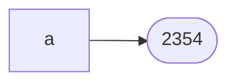

# 1장 들어가기
### 기술 용어 사용
- **자바 언어 명세(JLS, The Java Language Specification)**: 이 책에서는 자바8용 명세 따름
	- 지원 자료형
		- 인터페이스
			- Annotation
		- 클래스
			- Enum
		- 배열
		- 기본 타입(primitive): 유일하게 참조형이 아님(객체가 아님)
	- 클래스의 멤버
		- 필드
		- 메서드
			- 메서드 시그니처: 메서드 이름 + 입력 매개변수의 타입들 (!반환값의 타입)
		- 멤버 클래스
		- 멤버 인터페이스
- 자바 언어 명세와 다른 부분
	- 상속(inheritance) = 서브클래싱(subclassing)
	- 인터페이스 상속 -> 클래스가 인터페이스를 구현(implement), 인터페이스가 다른 인터페이스를 확장(extend)
	- 명시하지 않은(default) 접근 수준(access level)
		- 패키지 접근(package access) -> 패키지-프라이빗(package-private)
- 자바 언어 명세에 정의되지 않은 것들
	- 공개(exported) API(Application Programming Interface)
		- 프로그래머가 클래스, 인터페이스, 패키지를 통해 접근할 수 있는 모든 클래스, 인터페이스, 생성자, 멤버, 직렬화된 형태(serialized form)
			- API 요소(element): 클래스, 인터페이스, 생성자, 멤버, 직렬화된 형태
		- 자바 지원 자료형인 인터페이스와 구별하기 위해 사용한 용어
		- API를 사용하는 프로그램 작성자(사람): API의 사용자
		- API를 사용하는 클래스(코드): API 클라이언트
		- 공개 API는 API 정의 패키지의 밖에서 접근 가능한 요소로 구성 -> 모든 클라이언트가 접근할 수 있고, API작성자가 지원하기로 약속한 요소
			- javadoc을 기본 실행시 API요소들만 담은 문서 생성
		- 패키지의 공개 API는 패키지의 모든 public 클래스, 인터페이스의 public, protected 멤버와 생성자로 구성
			- 자바 9의 모듈 시스템을 통해 공개할 패키지 선택 가능


# 2장 객체 생성과 파괴

## 아이템1: 생성자 대신 정적 팩터리 메서드를 고려하라
```java
public static Boolean valueOf(boolean b) {
    return b ? Boolean.TRUE : Boolean.FALSE;
}
```
- 디자인 패턴의 팩터리 메서드(Factory Method)와는 다름!

- 해당 클래스의 인스턴스를 반환하는 단순한 정적 메서드

  - 생성자의 wrapper 메서드이면서
  - `static`키워드가 붙었음

  


### 정적 팩터리 메서드가 생성자보다 좋은 점
1. **이름을 가질 수 있다**
- 생성자: `BigInteger(int, int, Random)`에 비해
정적 팩터리 메서드 `BigInteger.probablePrime`이 더 직관적이다.
- 생성자 오버로딩을 이용하는 데에도 한계가 있다.
	- 하나의 (메서드) 시그니처로는 생성자를 하나만 가질 수 있다.
		- 매개변수의 순서를 다르게 하는 방식
			- `Constructor(int i, String s)`와
			- `Constructor(String s, int i)`는 서로 다르다는 점을 이용하는 방식
			- 하지만 이 경우 직관성이 떨어지고, 혼란만 가중시킨다.
		- 반면, 정적 팩터리 메서드는 하나의 시그니처로 하나의 생성자만 가질 수 있는 제약을 받지 않는다.
2. **호출될 때마다 인스턴스를 새로 생성하지는 않아도 된다.**
- 인스턴스 통제(instance-controlled) 클래스
	- 인스턴스 미리 만들기, 캐싱 등으로 불필요한 객체 생성 회피 -> 성능 향상
	- 인스턴스 통제를 통해 객체를
		- 싱글턴(singleton)
		- 인스턴스화 불가(noninstantiable)
		- 불변 값 인스턴스에서 동치인 인스턴스가 하나임을 보장(Leibniz's law)
		- 플라이웨이트 패턴
		- 열거형(인스턴스가 하나임을 보장)
		  만들 수 있다.
3. **반환 타입의 하위 타입 객체를 반환할 수 있는 능력이 있다.**
- 반환 객체의 클래스를 선택 가능한 유연성
	- API를 작게 유지
	- 인터페이스 기반 프레임워크: 인터페이스를 정적 팩터리 메서드의 반환 타입으로 사용
		- 구현 객체를 인터페이스로 다룬다는 점에서 API 학습 난이도를 낮추며, 다형성을 활용하기 좋다.
	
- Java8이전의 경우 인터페이스에서 정적 메서드 반환 불가
	
	- 동반 클래스 사용해야:
	
	```java
	public interface Type {
	    ...
	}
	```
	이를 반환하는 정적 메서드`typeFactory()` Type 내에 생성이 불가능하기에
	```java
	public class Types {
	    static Type typeFactory() {
	    ...
	    }
	}
	```
	위와 같은 방식으로 동반 클래스(companion class)를 만들어야 했다.
	- 예시) java.util.Collections
	
- 자바8 이후로는 인터페이스가 정적 메서드를 가질 수 있다.
  - 즉 동반 클래스를 가질 필요가 적다.
  - 하지만 인터페이스는 public 정적 멤버만 허용하며
  - 자바9에서 private 정적 메서드까지 허용하지만, 어쨌든 정적 필드와 정적 멤버 클래스는 여진히 public만 가능하다.
  - 이런 이유로 package-private 클래스에 정적 메서드 구현 코드 일부를 둬야 하는 경우도 있다. (public 하게 공개하고 싶진 않을 테니까)
4. **입력 매개변수에 따라 매번 다른 클래스의 객체를 반환할 수 있다.**
  - 유연하게 반환 하위 클래스를 선택, 변경할 수 있다.
  - 위와 마찬가지로, 다형성을 활용하는 데 용이하다. 클라이언트는 실제 어느 하위 클래스의 인스턴스인지를 알 필요가 없다.
  - 예시: `java.util.EnumSet.java`의 경우

  ```java
  /**
   * Creates an empty enum set with the specified element type.
   *
   * @param <E> The class of the elements in the set
   * @param elementType the class object of the element type for this enum
   *     set
   * @return An empty enum set of the specified type.
   * @throws NullPointerException if {@code elementType} is null
   */
  public static <E extends Enum<E>> EnumSet<E> noneOf(Class<E> elementType) {
      Enum<?>[] universe = getUniverse(elementType);
      if (universe == null)
          throw new ClassCastException(elementType + " not an enum");
  
      if (universe.length <= 64)
          return new RegularEnumSet<>(elementType, universe);
      else
          return new JumboEnumSet<>(elementType, universe);
  }
  ```

  원소의 수에 따라 `RegularEnumSet`이나 `JumboEnumSet`을 반환한다.

- `java.util.Calendar` 클래스의 `getInstance()` 메서드도 좋은 예다.
- 하위 클래스이기만 한다면
  
  - 클라이언트가 하위 클래스의 존재를 모르며,
    - 필요 없는 하위 클래스는 삭제해도 문제가 없으며
  - 필요한 다른 클래스를 추가해도 된다는 점에 주목하라.


5. **정적 팩터리 메서드를 작성하는 시점에는 반환할 객체의 클래스가 존재하지 않아도 된다.**

  - 서비스 제공자 프레임워크(service provider framework)
   - 대표적인 예로 JDBC(Java Database Connectivity)
        - TODO: 이슈화

   - 제공자(provider)인 서비스 구현체들을 클라이언트에 제공하는 역할을 프레임워크가 담당 -> 클라이언트를 구현체로부터 분리!
   - 구성: 3개의 핵심 컴포넌트(경우에 따라 +1)
        서비스 인터페이스(service inteface): 구현체의 동작을 정의
   - 제공자 등록 API(provider registration API): 제공자가 구현체를 등록할 때 사용
   - 서비스 접근 API(service access API): 클라이언트가 서비스의 인스턴스를 얻을 때 사용
        클라이언트가 원하는 구현체의 조건을 명시하여 반환받음, 명시하지 않으면 기본 구현체 혹은 지원 구현체 중 하나를 반환
            		- 유연한 정적 팩터리

~~~java
		```java
		    @CallerSensitive
		    public static Connection getConnection(String url,
		        java.util.Properties info) throws SQLException {
		
		        return (getConnection(url, info, Reflection.getCallerClass()));
		    }
		...
		    @CallerSensitive
		    public static Connection getConnection(String url,
		        String user, String password) throws SQLException {
		        java.util.Properties info = new java.util.Properties();
		
		        if (user != null) {
		            info.put("user", user);
		        }
		        if (password != null) {
		            info.put("password", password);
		        }
		
		        return (getConnection(url, info, Reflection.getCallerClass()));
		    }
		...
		    @CallerSensitive
		    public static Connection getConnection(String url)
		        throws SQLException {
		
		        java.util.Properties info = new java.util.Properties();
		        return (getConnection(url, info, Reflection.getCallerClass()));
		    }
		...
		        //  Worker method called by the public getConnection() methods.
		    private static Connection getConnection(
		        String url, java.util.Properties info, Class<?> caller) throws SQLException {
		        /*
		         * When callerCl is null, we should check the application's
		         * (which is invoking this class indirectly)
		         * classloader, so that the JDBC driver class outside rt.jar
		         * can be loaded from here.
		         */
		        ClassLoader callerCL = caller != null ? caller.getClassLoader() : null;
		        if (callerCL == null || callerCL == ClassLoader.getPlatformClassLoader()) {
		            callerCL = Thread.currentThread().getContextClassLoader();
		        }
		
		        if (url == null) {
		            throw new SQLException("The url cannot be null", "08001");
		        }
		
		        println("DriverManager.getConnection(\"" + url + "\")");
		
		        ensureDriversInitialized();
		
		        // Walk through the loaded registeredDrivers attempting to make a connection.
		        // Remember the first exception that gets raised so we can reraise it.
		        SQLException reason = null;
		
		        for (DriverInfo aDriver : registeredDrivers) {
		            // If the caller does not have permission to load the driver then
		            // skip it.
		            if (isDriverAllowed(aDriver.driver, callerCL)) {
		                try {
		                    println("    trying " + aDriver.driver.getClass().getName());
		                    Connection con = aDriver.driver.connect(url, info);
		                    if (con != null) {
		                        // Success!
		                        println("getConnection returning " + aDriver.driver.getClass().getName());
		                        return (con);
		                    }
		                } catch (SQLException ex) {
		                    if (reason == null) {
		                        reason = ex;
		                    }
		                }
		
		            } else {
		                println("    skipping: " + aDriver.driver.getClass().getName());
		            }
		
		        }
		
		        // if we got here nobody could connect.
		        if (reason != null)    {
		            println("getConnection failed: " + reason);
		            throw reason;
		        }
		
		        println("getConnection: no suitable driver found for "+ url);
		        throw new SQLException("No suitable driver found for "+ url, "08001");
		    }
~~~

​	제공된 파라미터에 따라서 실제로 getConnection() 작업을 하는 메서드에 형식을 맞춰 파라미터를 넘기고, 인터페이스로서 Driver를 받고 있다.
​	

 - 그런데 왜 리플렉션을 사용할까?

- 서비스 제공자 인터페이스(service provider interface): 서비스 인터페이스의 인스턴스를 생성하는 팩터리 객체를 설명

  - 리플렉션?
  		- 서비스 제공자 프레임워크 패턴의 변형
		
		- 브리지 패턴: 서비스 접근 API가 공급자가 제공하는 것보다 더 풍부한 서비스 인터페이스를 클라이언트에 반환
		- DI 프레임워크
			- `java,util.ServiceLoader`: 자바6부터 제공되는 범용 서비스 제공자 프레임워크
			- JDBC의 경우 자바6 이전에 등장했기에 위를 사용 안 함.


### 단점
1. **상속을 하려면 public이나 protected 생성자가 필요하니 정적 팩터리 메서드만 제공하면 하위 클래스를 만들 수 없다.**
	- 상속보다 컴포지션을 사용하도록 유도하고
	- 불변 타입으로 만들기 위한 제약이 된다는 점에서 장점이 되기도 한다.
2. **정적 팩터리 메서드는 프로그래머가 찾기 어렵다.**
	- 생성자처럼 API 설명에 명확히 들어나지 않기 때문(JavaDocs)
	- API 문서를 잘 작성하고 메서드명을 규약에 따라 짓는 것으로 문제를 완화해야:
	- 정적 팩터리 메서드에 흔한 명명 방식
		- from: 매개변수를 받아서 해당 타입의 인스턴스를 반환하는 형변환 메서드
			- `Date d = Date.from(instant);`
		- of: 여러 매개변수를 받아 적합한 타입의 인스턴스를 반환하는 집계 메서드
			- `Set<Rank> faceCards = EnumSet.of(JACK, QUEEN, KING)`
		- valueOf: from과 of의 더 자세한 버전
			- `BigInteger prime = BigInteger.valueOf(Integer.MAX_VALUE);`
		- instance 혹은 getInstance: (매개변수를 받는다면) 매개변수로 명시한 인스턴스를 반환하지만, 같은 인스턴스임을 보장하지는 않는다.
			- `StackWalker luke = StackWalker.getInstance(options);`
		- create 혹은 newInstance: instance 혹은 getInstance와 같지만, 매번 새로운 인스턴스를 생성해 반환함을 보장한다.
			- `Object newArray = Array.newInstance(classObject, arrayLen);`
		- getType: getInstance와 같으나, 생성할 클래스가 아닌 다른 클래스에 팩터리 매서드를 정의할 때 쓴다. "Type"은 팩터리 메서드가 반환할 객체의 타입이다.
			- `FileStore fs = Files.getFileStore(path);`
		- newType: getType과 같으나, 매번 새로운 인스턴스를 생성해 반환함을 보장한다.
			- `BufferedReader br = Files.newBufferedReader(path);`
		- type: getType과 newType의 간결한 버전
			- `List<Complaint> litany = Collections.list(legacyLitany);`
> 핵심 정리
> 정적 팩터리 메서드와 public 생성자는 각자의 쓰임새가 있으니 상대적인 장단점을 이해하고 사용하는 것이 좋다. 그렇다고 하더라도 정적 팩터리를 사용하는 게 유리한 경우가 많으므로 무작정 public 생성자를 제공하던 습관이 있다면 고치자.


## 아이템 2: 생성자에 매개변수가 많다면 빌더를 고려하라.
- 정적 팩터리와 생성자의 공통 제약사항: 선택적 매개변수가 많을 경우 대응이 어렵다.


### 선택 매개변수가 많을 때 대응법
1. **점층적 생성자 패턴(telescoping constructor pattern)**
```java
public class NutritionFacts {
    private final sevingSize;
    private final servings;
    private final int calories;
    private final int fat;
    private final int sodium;
    
    public NutritionFacts(int servingSize, int servings) {
    this(servingSize, servings, 0);
    }
    
    public NutritionFacts(int servingSize, int servings, int calories) {
    this(servingSize, servings, calories, 0);
    }

    public NutritionFacts(int servingSize, int servings, int calories, int fat) {
    this.servingSize = servingSize;
    this.servings = servings;
    this.calories = calories;
    this.fat = fat;
    }
}
```
- 설정하길 원하지 않는 매개변수에도 값을 지정해줘야 함
- 코드 가독성이 낮고 수정 및 사용이 어려움

2. **자바빈즈 패턴(JavaBeans pattern)**
- 기본 생성자로 객체 생성 후 Setter로 값 설정
- 단점
	- 객체 하나를 생성하기 위해 Setter를 여러 번 호출해야 한다.
	- 객체가 완전히 생성되기 전까지는 일관성(consistency)이 무너진 상태에 놓인다.
		- 때문에 클래스를 불변으로 만들 수 없으며
		- 스레드 안전성을 얻기 위해 추가 작업이 필요하다.
	- freeze 메서드
		- 생성이 끝난 객체를 얼리며(freeze) 얼리기 전에는 사용하지 못 하게 만들어 위의 단점을 완화하려는 기법
		- 하지만 freeze 메서드를 객체 사용 전에 호출하였는지를 컴파일 단계에서 검증 불가하기에 런타임 오류에 취약하다.
3. 빌더 패턴
- 점층적 생성자 패턴의 안전성과 자바빈즈 패턴의 가독성을 갖춤
- [TODO]직렬화?
- 4개면 생각해 보자.

###  빌더 패턴(Builder Pattern)
- 작동방식
	- 필수 매개변수만으로 생성자 / 정적 팩터리를 호출하여 빌더 객체를 얻는다.
	- 빌더 객체의 설정 메서드(Setter와 유사)로 선택 매개변수를 설정한다.
	- 매개변수가 없는 build 메서드를 호출해 필요한 (일반적으로는 불변) 객체를 얻는다.
	
- 빌더는 생성할 클래스 안에 정적 멤버 클래스로 만들어두는 것이 보통이다.

- Builder의 Setter 메서드
	- 자기 자신을 반환하므로 메서드 연쇄 가능
		- 메서드 연쇄(method chaining) = 플루언트 API(fluent API)
	- 메서드명을 속성명으로 하면 가독성이 좋은 코드를 짤 수 있다:
	- `NutritionFacts cocacola = NutritionFacts.Builder(240, 8).calories(100).sodium(35).carbohydrate(27).build();`
	- 빌더 패턴은 파이썬/스칼라의 명명된 선택적 매개변수(named optional parameters)를 흉내낸 것이다.
	
- 유효성 검사 코드
	- 빌더의 생성자와 메서드에서 입력 매개변수를 검사
	
	- build 메서드가 호출하는 생성자 = NutritionFacts(Builder builder)에서 여러 매개변수에 걸친 불변식(invariant)을 검사
		- 빌더로부터 매개변수를 복사한 후 해당 객체 필드도 검사한다.
		- 문제 발견시 IllegalArgumentException
		
		

#### 불변과 불변식
- 불변(immutable or immutability)
	- 변경을 허용하지 않는다. <-> 가변(mutable) 객체
		- Ex) String
- 불변식(invariant)
	- 프로그램이 실행되는 동안 or 정해진 기간 동안 반드시 만족해야 하는 조건
	- 변경 허용이 가능하지만 조건 내에서만 가능
		- Ex) List의 크기는 0 이상, Period의 start필드 값은 end 필드 값보다 앞서야 함
- 가변 객체에도 불변식은 존재할 수 있으며 불변은 불변식의 극단적인 예라고 할 수 있다.


### 빌더와 계층적 클래스
- 각 계층의 클래스에 관련 빌더를 멤버로 정의
	- 추상 클래스는 추상 빌더를, 구체 클래스(concrete class)는 구체 빌더를 갖게 함
	
	- 시뮬레이트한 셀프 타입(simulated self-type) 관용구: self 타입이 없는 자바에서 self메서드 정의하여 사용
		- 이를 통해 형변환 없이 메서드 연쇄 지원
		
	- 공변 반환 타이핑(covariant return typing): 하위 클래스의 메서드가 상위 클래스의 메서드가 정의한 반환 타입이 아닌, 그 하위 타입을 반환하는 기능
		- 이를 통해 형변환 없이 빌더 사용 가능
		
		- TODO 재귀

### 그 외

- 컬렉션이 멤버 필드

- 빌더를 사용하면 가변인수(varargs) 매개변수를 여러 개 사용할 수 있다.
	- 각각을 적절한 메서드로 나눠 선언하거나
	- 메서드를 여러 번 호출하도록 하고 각 호출 때 남겨진 매개변수들을 하나의 필드로 모음
	
- 빌더는 매우 유연함

- 단점
	- 객체 생성 이전에 빌더를 만들어야 함
		- 경우에 따라 성능에 부정적 영향
		
	- 매개변수가 많을 때에나 빛을 발함
		- 하지만 매개변수는 점차 늘어나는 법이기에 빌더로 애초에 만드는 것이 좋을 때가 많다.
		
		  

## 아이템3. private 생성자나 열거 타입으로 싱글톤임을 보증하라.
### 싱글톤
- 단일 인스턴스
- 예시
	- 함수와 같은 무상태(stateless) 객체
	- 설계상 유일해야 하는 시스템 컴포넌트
- 싱글톤 클래스는 이를 사용하는 클라이언트를 테스트하기 어렵게 만들 수 있음 - mock 구현으로 대체가 어렵기 때문


### 싱글톤의 생성 방식
- 1, 2 모두 생성자는 private로 감추고, 인스턴스 접근 수단으로 public static 멤버를 남겨둠
#### 1.  private static final 필드 방식
```java
public class Elvis {
    public static final Evlis INSTANCE = new Elvis();
    private Elvis() {...}
	    
    public void leaveTheBuilding() {...}
}
```
- private 생성자는 private final인 싱글턴 인스턴스를 초기화할 때 단 한번만 호출된다.
- **코드가 싱글턴임이 API에 명백하게 드러난다는 장점**
- 이 인스턴스가 싱글턴임이 보장되지만 유일하게 예외가 있는데, 리필렉션 API인 `AccessibleObject.setAccessible`을 사용해 private 생성자를 호출하는 공격이 있을 수 있다.
  - Accessible -> 
    - 영속성 등 테스트
  - 이를 예방하려면 생성자 차원에서 2번째 객체가 생성되려 할 때 예외를 던지도록 한다.
    - 플래그 변수를 이용
#### 2. 정적 팩터리 방식의 싱글턴
```java
public class Elvis {
    private static final Elvis INSTANCE = new Elvis();  
    private Elvis() {...}
    public static Elvis getInstance() {return INSTANCE;}
    
    public void leaveTheBuilding() {...}
}
```
- 동일 객체의 참조를 반환하기에 싱글턴 보장(단, 이 경우에도 리플렉션을 통한 예외는 동일)

- **장점**
	
	- API를 변경하지 않고도 싱글턴이 아니게 할 수 있다.
	
	  - 정확히 무슨 뜻?
	
	- 정적 팩터리를 제네릭 싱글턴 팩터리로 만들 수 있다.
	
	- 정적 팩터리의 메서드 참조를 공급자(supplier)로 사용할 수 있다.
	  - `Elvis::getInstance`를 `Supplier<Elvis>`로 사용하는 방식
	
	    - LAZY return(`@Functional Interface`) : [링크](https://dev.to/ishant14/lazy-initialization-in-java8-25da)
	    - 함수형 인터페이스의 `LAZY_LOADING` 기능? -> 정리해두기
	    - Member class (FK: order)
	
	  - ```java
	    public static class Test {
	    	private static final Supplier<Test> INSTANCE = Test::new;
	    	
	    	private Test() {
	    	}
	    
	    	public static Supplier<Test> getInstance() {
	    		return INSTANCE;
	    	}
	    
	    	// Deserialization 막기!
	    	private Object readResolve() {
	    		// 진짜 Test를 반환하고 가짜 Test는 GC에 맡긴다.
	    		return INSTANCE;
	    	}
	    }
	    ```
	
	    

#### 3. 열거 타입 방식
```java
public enum Elvis {
    INSTANCE;
    
    public void leaveTheBuilding() {...}
}
```
- 원소가 하나인 열거 타입을 선언하는 것
- public 필드 방식과 비슷하지만 추가적인 노력 없이 직렬화가 가능
- 복잡한 직렬화 상황이나 리플렉션 공격에서도 제2의 인스턴스 생성을 완전히 막음


### 직렬화
- 1과 2의 방식으로 만든 싱글턴 클래스를 직렬화하려면 단순히 `implements Serializable`로는 부족함
- 모든 인스턴스 필드를 일시적(transient)이라 선언하고 readResolve 메서드를 제공해야 함
	- 이렇게 하지 않을 경우 역직렬화할 때 마다 새로운 인스턴스가 만들어진다.
```java
private Object readResolve() {
    // '진짜' Elvis를 반환하고, 가짜 Elvis는 가비지 컬렉터에 맡긴다.
    return INSTANCE;
}
```

### 정리
- 직렬화에 관해서 가장 용이한것은 3
	- 대부분 상황에서는 3의 방식: 원소가 하나뿐인 열거 타입이 싱글턴을 만드는 가장 좋은 방법
	- 단 Enum 외의 클래스를 상속해야 할 경우 3은 사용 불가
		- 열거 타입이 다른 extends하는 것은 불가하기 때문
	
- 2의 장점: 변경 용이성 / 정적 팩터리의 메서드 참조를 공급자로 사용이 필요하지 않다면 1이 나음


## 아이템4. 인스턴스화를 막으려거든 private 생성자를 사용하라

- 정적 메서드와 정적 필드만을 담은 클래스
	- 예시
		- `java.lang.Math`와 `java.util.Arrays`: 기본 타입 값이나 배열 관련 메서드를 모아놓음
		- `java.util.Collections`: 특정 인터페이스를 구현하는 객체를 생성해주는 정적 메서드(혹은 팩터리) 모음(자바 8부터는 인터페이스에 넣을 수 있다)
		- final 클래스와 관련한 메서드를 모을 경우: final클래스를 상속해서 하위 클래스에 메서드를 넣는 건 불가능하기 때문
	- 인스턴스 없이 사용하려고 설계한 유틸리티 클래스
		- 생성자를 명시하지 않으면 public 기본 생성자가 만들어지기에, 의도치 않게 인스턴스화 가능해짐
- 인스턴스화를 막기 위해서
	- 추상 클래스로 만드는 것으로는 부족
		- 하위 클래스를 만들어서 인스턴스화할 수 있기 때문
		- 상속해서 사용하라는 의미로 오독될 수도 있다.
	- **private 생성자를 추가하여 클래스의 인스턴스화를 막아라!**
```java
public class UtilityClass() {
    // 기본 생성자가 만들어지는 것을 막는다(인스턴스화 방지용).
    private UtilityClass() {
        throw new AssertionError();
    }
    ...
}
```
- AssertionError는 클래스 내부에서 생성자를 호출하는 경우를 대비
- 호출 불가능한 생성자는 직관성이 낮기 때문에 주석을 달아주는 편이 좋음
- 상속을 불가능하게 만든다.
	- 모든 생성자는 명시적/묵시적으로 상위 클래스의 생성자를 호출하게 된다. private 생성자는 하위 클래스가 상위 클래스 생성자에 접근할 수 없게 하기에 상속이 불가하게 만든다.
	- 생성자 체이닝
	- GrandFather(인터페이스) -> Father(추상클래스) -> Son(구현클래스) -> GrandSon(구현의 extends)
	- GrandSon()-> Son()-> Father()

`mermaid` velog(x), notion(o), github page(o)




## 아이템5. 자원을 직접 명시하지 말고 의존 객체 주입을 사용하라
### 자원에 의존하는 클래스 구현: 사전에 의존하는 맞춤법 검사기 사례
#### 부정적 예시
1.  정적 유틸리티 클래스
```java
public class SpellChecker {
    private static final Lexicon dictionary =...;
    
    private SpellChecker() {} // 객체 생성 방지
    
    public static boolean isValid(String word) { ... }
    public static List<String> suggestions(String typo) { ... }
}
```

2. 싱글톤
```java
public class SpellChecker {
    private final Lexicon dictionary = ...;
    
    private Spellchecker(...) {}
    public static SpellChecker INSTANCE = new pellChecker(...);
    
    public boolean isValid(String word) { ... }
    public List<String> suggestions(String typo) { ... }
}
```
- 1과 2는 모두 자원(사전)을 단 하나만 사용한다고 가정한다는 점이 단점이다.
	- 실제로는 다양한 자원을 사용할 수 있어야 한다.
	- 대안: dictionary 필드를 final하지 않게 만드는 방법
		- 오류를 내기 쉬우며 멀티스레드 환경에서 사용 불가
	- 사용하는 자원에 따라 동작이 달라지는 클래스에는 정적 유틸리티 클래스나 싱글톤 방식은 부적합하다.

#### 대안: 의존 객체 주입 패턴
```java
public class SpellChecker {
    private final Lexicon dictionary;
    
    public SpellChecker(Lexicon dictionary) {
    
}
```

- 인스턴스를 생성할 때 생성자에 필요한 자원을 넘겨주는 방식

- 자원의 수나 의존관계와 무관하게 작동

- 불변을 보장, 동일 자원 공유를 안전하게 할 수 있음

- 생성자, 정적 팩터리, 빌더 모두에 적용 가능한 방법

- 변형: 생성자에 자원 팩터리를 넘겨주는 방식
	- 한정적 와일드카드 타입(bounded wildcard type)을 이용해 팩터리 타입 매개변수를 제한해야
		- 예시
	```java
	Mosaic create(Supplier<? extends Tile> tileFactory) {...}
	```
	
	```java
	public class VoucherService{
	    private final VoucherRepository;
	    
	    public VoucherService(VoucherRepo vr) {
	        create()
	    }
	    
	    create<Suplier<? extends VoucherRepository>() {
	        
	    }
	}
	```
	
	
	
- 단, 의존성이 많은 프로젝트에서는 코드를 어지럽힐 수 있다: 의존 객체 주입 프레임워크를 사용하여 해결하라

- 의문사항: 왜 싱글톤을 사용해서 안 되나? 싱글톤에 DI 사용하면 되지 않나(스프링의 경우)?


## 아이템6. 불필요한 객체 생성을 피하라
- 생성보다는 재사용이 더 낫다.

- 불변 객체는 재사용이 언제나 가능하다.

- 정적 팩터리 메서드를 사용하여 불필요한 객체 생성을 피할 수 있다.
	- `Boolean(String)` 대신 `Boolean.valueOf(String)`을 사용하는 것이 좋다.
	- 가변 객체의 경우 사용중 변경이 없을 것임을 안다면 재사용 가능하다.
	
- 생성 비용이 비싼 객체가 자주 필요할 경우 캐싱하여 재사용하라.
	- 정적 멤버로 자주 불변 인스턴스를 캐싱해둔다.
	- //TODO만일 클래스 호출: 인스턴스 초기화 이후 메서드를 호출하지 않는다면 성능상 낭비가 된다.
		- 이를 막기 위해 지연 초기화를 사용할 수 있으나 성능상의 이점이 미미한 반면 코드를 복잡하게 만들기에 사용을 권하지 않는다.
	
- //TODO재사용 직관성: 보충
	- 어댑터 패턴
	
	  - 
	
	- 오토박싱
	  - 기본형과 박싱된 클래스의 구별을 흐리지만 성능 상으로 차이가 있음에 유의
	
	  - long이 아니라 Long으로 선언한 것 만으로 불필요한 인스턴스를 매우 많이 만들게 될 수도 있다.
	
	    ```java
	    Long sum =0L:
	    for(int i = 0; i< Integer.MAX_VALUE; i++) {
	        sum += i;
	    }
	    ```
	
	    ```java
	        @Test
	        @DisplayName("Long 주석 바뀌는지")
	        void testLong() {
	            Long sum =0L;
	            Long sum2 =0L;
	            Long sum3 =1L;
	    
	            log.info("sum = {}", System.identityHashCode(sum));
	            ;
	            for(int i = 0; i< 2; i++) {
	                sum += i;
	            }
	            log.info("sum after calc = {}", System.identityHashCode(sum));
	            log.info("sum2 = {}", System.identityHashCode(sum2));
	            log.info("sum3 = {}", System.identityHashCode(sum3));
	        }
	    ```
	
	    ```java
	    sum = 836220863
	    sum after calc = 875016237
	    sum2 = 836220863
	    sum3 = 875016237
	    ```
	
	    
	
	    - 형변환
	      - 명시적 형변환
	      - 암시적 형변환
	
	  - 박싱된 기본 타입보다는 기본 타입을 사용하고, 의도치 않은 오토박싱이 숨어들지 않게 주의해야
	
- 그러나 기본적으로는 객체 생성을 피하기 보다는, 명확성, 간결성, 기능을 위한 것일 경우 추가하는 것이 더 좋은 선택이다. 
	- 요즘 JVM은 작은 객체를 생성, 회수하는 것에 부담이 적기 때문
	
- 객체 풀을 직접 설정하는 것은 피하라
	- DB연결 풀처럼 생성 비용이 비싼 경우는 물론 예외
	- 하지만 기본적으로 객체 풀은 코드를 혼잡하게 하며 성능상 이점이 낮다. -> GC가 발달해서 가벼운 객체의 경우 GC가 더 빠름
	
- 방어적 복사가 필요한 상황에서 객체를 재사용했을 때의 피해가, 불필요한 객체를 반복 생성했을 때의 피해보다 훨씬 크다는 점에 유의하라.

```java
class SomeClass {
    private Fireld field;
    
    getField() {
    	//return field// 하 지 마!
        return new Field(field);
	}
}
```

- Pattern.maches(): Pattern을 계속 새로 생성하게 되서 성능적으로 문제가 있음
- 유한 상태 기계 - turing machine도 명령어 표가 유한하면 


## 아이템7. 다 쓴 객체 참조를 해제하라
- 자바에는 GC가 있지만 메모리 관리는 여전히 필요하다.
- Stack의 사례
	```java
	public class Stack {
	    private Object[] elements;
	    private int size;
	    
	    ...
	    
	    public Object pop() {
	        if (size == 0)
	            throw new EmptyStackException();
	        return elements[--size];
	    }
	    
	    ...
	}
	```
	- pop으로 인해 활성 영역 밖으로 밀려난 elements[size]에 대한 참조를 Stack이 가지고 있기 때문에 이는 GC가 회수하지 않는다.
	- 참조가 남아 있을 경우 그 참조가 참조하는 것들도 GC가 회수하지 못하므로 누수는 더 커진다.
### null 처리(참조 해제)
```java
public Object pop() {
    if (size ==0)
        throw new mptyStackException();
    Object result = elements[--size];
    elements[size] = null; // 다 쓴 참조 해제
    return result;
}
```
- 활성 영역 밖의 원소를 접근하려고 하면 NPE가 발생한다. 오류 발견에 도움이 된다.
#### null 처리는 언제 사용해야 하나?
- 예외적인 경우에만 사용하는 것이 기본이다.
	- 참조를 담은 변수를 유효 범위(scope) 밖으로 밀어내는 것이 낫다.
	
- Stack의 예시처럼 자기 메모리를 직접 관리하는 경우, 쓸모 없는 객체를 GC는 인지할 수 없기에 직접 null처리 해주는 것이다.

- 자기 메모리를 직접 관리하는 클래스는 메모리 누수를 주의해야 한다.

- 캐시는 메모리 누수의 주범이다. 객체 참조를 캐시에 넣고, 객체의 다 쓴 참조(obsolete reference)를 그대로 가지고 있는 경우가 있다.
	- 해법: WeakHashMap
	  - key를 참조할 때만 엔티티가 살아 있게 할 수 있음
	  - 다만 이런 상황일때만 쓸모 있음
	- 가장 가치가 낮은 엔트리를 정리하는 방식
	  - LinkedHashMap
	    - removeEldestEntry
	
- listener, callback
	- weak reference로 지정해주자:
	  - 예시) WeakHashMap에 키로 저장
	
	
	

## 아이템8. finalizer와 cleaner 사용을 피하라

```java
public class Object {
    ...
	@Deprecated(since="9")
	protected void finalize() throws Throwable
    ...
}
```

>Deprecated.
>The finalization mechanism is inherently problematic. Finalization can lead to performance issues, deadlocks, and hangs. Errors in finalizers can lead to resource leaks; there is no way to cancel finalization if it is no longer necessary; and no ordering is specified among calls to finalize methods of different objects. Furthermore, there are no guarantees regarding the timing of finalization. The finalize method might be called on a finalizable object only after an indefinite delay, if at all. Classes whose instances hold non-heap resources should provide a method to enable explicit release of those resources, and they should also implement AutoCloseable if appropriate. The Cleaner and PhantomReference provide more flexible and efficient ways to release resources when an object becomes unreachable.

### 자바의 두 가지 객체 소멸자
- finalizer: 기본적으로 사용하지 마라. 예측 힘들고 위험하다.
- cleaner: finalizer보다는 덜 위험하지만 여전히 예측하기 힘들고 느리며 불필요하다.
- C++의 파괴자(destructor)와는 다른 개념이다!
	1.  C++의 파괴자는 객체와 관련된 자원을 회수하는 보편적인 방법이다. 
		- 반면 자바에서는 접근할 수 없게 된 객체를 회수하는 역할을 GC가 담당하고 있다.
	2. C++의 파괴자는 비메모리 자원을 회수하는 용도로도 쓰인다.
		- 반면 자바에서는 try-with-resources와 try-finally를 사용해 해결한다.
### 난점
1.  finalizer와 cleaner는 즉시 수행된다는 보장이 없다 -> 제 때 수행해야 하는 작업은 절대 할 수 없다.
	- 이 수행 속도는 GC 구현과 수행 시점에 의존하는 프로그램의 동작에 달려있다.
	- finalizer 스레드의 우선 순위 문제로 인해서 오히려 자원 회수가 지연되는 문제가 발생할 수 있다.
		- cleaner의 경우 수행 스레드를 제어할 수는 있지만, 백그라운드에서 GC의 통제하에 수행되기에 여전히 문제 있다.
2. 자바 언어 명세는 finalizer와 cleaner의 수행 시점뿐만 아니라 수행 여부도 보장하지 않는다.
	- 따라서 상태를 영구 수정하는 작업에서는 절대 사용해서는 안 된다.
		- ex) DB 공유자원의 영구 lock 해제
	- `System.gc`, `System.runFinalization` 메서드는 finalizer와 cleaner의 실행 가능성을 높일 수 있으나, 보장하지는 못한다.
	- `System.runFinalizersOnExit`와 `Runtime.runFinalizersOnExit`메서드는 보장은 해주지만 심각한 결함으로 사용해서는 안 된다.
3. finalizer동작 중 예외 발생시 예외 무시되며, 작업이 그 순간 종료 되어 버린다.
	- 다른 스레드가 이 훼손된 객체를 접근할 때의 동작을 예측할 수 없다.
		- cleaner 사용하는 라이브러리의 경우 스레드를 통제하기 때문에 이 문제는 발생하지 않음
4. 성능 문제
	- GC의 효율을 떨어뜨린다.
	- 안전망 방식을 사용할 경우에는 훨씬 빨라진다. (단 여전히 성능이 낮긴 하다)
5. 보안 문제: finalizer 공격
	- 생성자/직렬화 과정에서 예외 발생시, 생성되다 만 객체에서 악의적인 하위 클래스의 finalizer가 수행될 수 있음
	- 정적 필드에 자기의 참조를 할당하여 GC의 수집대상이 되지 않을 수 있다.
	- 해결
		- 일반적인 객체의 생성을 막는 것은 생성자에서 예외를 던지는 것으로 가능하지만, finalizer의 경우 부족
		- final 클래스들은 하위 클래스를 만들 수 없기에 이 문제에서 안전
		- final이 아닌 클래스들은 아무 일도 하지 않는 finalize 메서드를 만들고 final로 선언하면 된다.
### 대안: AutoCloseable
- 파일, 스레드 등 종료해야 할 자원을 담고 있는 객체 클래스는 AutoCloseable을 구현하게 하라.
- 사용 후 `close()`메서드를 호출하여 관리한다.
- 단, try-with-resources를 사용하여 예외 발생 시에도 정상적인 종료를 보장해야 한다.
- close 여부를 추적하게끔 하라
	- close메서드에서 객체가 더 이상 유효하지 않음을 필드에 기록하라
	- 다른 메서드에서 이 필드를 사용할 때는 검사를 통해, close 이후일 경우 IllegalStateException을 던지게 하라
### 사용해도 될 때
1. 자원의 소유자가 close 메서드를 호출하지 않는 것에 대비하는 안전망 역할
	- `FileInputStream`, `FileOutputStream`, `ThreadPoolExecutor`가 그 대표적 예
2. 네이티브 피어(native peer)와 연결된 객체
	- 네이티브 피어: 일반 자바 객체가 네이티브 메서드를 통해 기능을 위임한 네이티브 객체
	- 자바객체가 아니기에 GC가 인지못함
	- 단, 성능 저하를 감당할 수 있으며, 네이티브 피어의 자원이 중요한 것이 아닐 때에만 사용
		- 이에 해당하지 않을 때는 그냥 close 메서드를 사용하라.
	- finalizer와 달리 cleaner는 클래스 public API에 나타나지 않음
	- cleaner의 사용은 내부 구현 문제

## 아이템9. try-finally보다는 try-with-resources를 사용하라
- `try-finally`
	
	```java
	static String firstLineOfFile(String path) throws IOException {
	    BufferedReader br = new BufferedReader(new FileReader(path));
	    try {
	        return br.readLine();
	    } finally {
	        br.close();
	    }
	}
	```
	- 자원을 하나 더 사용하게 될 경우
		```java
		static void copy(String src, String dst) throws IOException {
		    InputStream in = new FileInputStream(src);
		    try {
		        OutputStream out = new FileOutputStream(dst);
		        try {
		            byte[] buf = new byte[BUFFER_SIZE];
		            int n;
		            while ((n = in.read(buf)) >= 0)
		                out.write(buf, 0, n);
		        } finally {
		            out.close();
		        }
	    	} finally {
		        in.close();
		    }
		}
		```
		- 자원이 추가되면 난잡해진다.
		- try 블록과 finally 블록 모두에 예외가 발생할 경우 후자의 예외가 전자의 예외를 집어삼켜, 스택 추적 내역에서 전자의 예외에 대한 정보는 남지 않게 된다. -> 디버깅이 어려워 진다.
	
- try-with-resources: 위의 문제들을 해결
	
	- `AutoClosable` 인터페이스를 구현한 자원일 경우 사용 가능.
	  - `void close()`메서드만 규정되어 있는 단순한 인터페이스
	  - 닫아야 할 자원 클래스를 작성 시 반드시 `AutoClosable`을 구현할 것
	```java
	static String firstLineOfFile(String path) throws IOException {
	    try (BufferedReader br = new BufferedReader(new FileReader(path))) {
	        return br.readLine();
	    }
	}
	```
	- 자원을 하나 더 사용하게 될 경우
	```java
	static void copy(String src, String dst) throws IOException {
		    try (InputStream in = new FileInputStream(src);
		    OutputStream out = new FileOutputStream(dst)) {
  	        byte[] buf = new byte[BUFFER_SIZE];
		        int n;
		        while ((n = in.read(buf)) >=0)
		            out.write(buf, o, n);
	      }
	}
	```
	- 가독성이 향상되었다.
	- `readLine()`과 `close()` 양 쪽 모두에서 예외 발생시 `readLine()`에서 발생한 예외가 기록된다.
		- `close()` 쪽 예외는 숨겨지지만 스택 추적 내역에 suppressed 꼬리표를 달고 출력된다.
		- `Throwable`의 `getSuppressed` 메서드를 이용해서 프로그램 코드에서 가져올 수도 있다.
	- `catch` 절도 사용 가능하다: `try`문 중첩 없이 다수 예외를 처리 가능하다.
	
	
	
# 3장 모든 객체의 공통 메서드
- `final`이 아닌 `Object` 메서드(`equals`, `hashCode`, `toString`, `clone`, `finalize`)는 일반 규약에 맞게 재정의해야 한다.
-`Comparable.compareTo`는 `Object `메서드는 아니지만 유사한 성격을 갖기에 여기서 다룬다.


## 아이템10. equals는 일반 규약을 지켜 재정의하라
### equals를 재정의하지 않는 경우
equals 메서드를 재정의하는 것은 위험부담이 있기 때문에 다음 상황 중 하나에 해당하면 재정의하지 않아도 된다.
- 각 인스턴스가 본질적으로 고유한 경우
	- 값을 표현하는 것이 아니라 동작하는 객체를 표현하는 클래스
	- `Thread`가 대표적인 예
- 인스턴스의 논리적 동치성(logical equality)을 검사할 일이 없는 경우
	- 검사할 필요가 있는 경우: `java.util.regex.Pattern`의 경우 재정의했음
- 상위 클래스에서 재정의한 `equals`가 하위 클래스에도 들어맞는 경우
	- `AbstractSet`, `AbstractList`, `AbstractMap`의 `equals`를 상속해서 사용하는 것의 그 예
- 클래스가 `private`이거나 `package-private`이고 `equals` 메서드를 호출할 일이 없는 경우
	- 실수로라도 호출을 막고 싶을 경우 다음과 같이 구현하면 된다:
	```java
	@Override
	public boolean equals(Object o) {
	    throws new AssertionError(); //호출 금지!
	}
	```
	
### equals 재정의해야하는 경우
- 객체 식별성(object identity)가 아니라 논리적 동치성을 확인해야 하는데, 상위 클래스의 equals가 재정의되지 않았을 경우
	- 주로 값 클래스들이 해당
	- equals를 논리적 동치성을 확인하도록 재정의할 경우 Map의 키나 Set의 원소로 사용 가능하다.
	- 값 클래스라도 동일 값을 갖는 인스턴스가 둘 이상 생성되지 않음을 보장하는 경우라면 재정의할 필요 없다.
		- Enum도 여기에 해당
		- 이 경우 논리적 동치성과 객체 식별성이 동치가 되어버림

### equals 일반규약

`equals` 메서드는 null이 아닌 객체 참조들의 동등성 관계를 구현한다:

- 이는 *재귀적(reflexive)*이다: null이 아닌 모든 참조값 `x`에 대해서, `x.equals(x)`는 `true`를 반환해야 한다.
- 이는 *대칭적(symmetric)*이다: null이 아닌 모든 참조값 `x`와 `y`에 대해서, `x.equals(y)`는 `true`를 반환하는 것과 `y.equals(x)`가 `true`를 반환하는 것은 필요충분 관계이다.
- 이는 *추이적(transitive)*이다: null이 아닌 모든 참조값 `x`와 `y`, 그리고 `z`에 대해서, 만약 `x.equals(y)`가 `true`를 반환하고, `y.equals(z)`가 `true`를 반환한다면, `x.equals(z)`는 `true`를 반환해야 한다.
- 이는 *일관적(consistent)*이다: null이 아닌 모든 참조값 `x`와 `y`에 대해서, 만약 `equals`비교에 사용되는 객체들의 정보들이 변경되지 않는 한에서, `x.equals(y)`를 여러 번 호출하는 것(multiple invocations)은 일관성 있게 `true`를 반환하거나, 일관성 있게 `false`를 반환해야 한다.
- null이 아닌 참조값 `x`에 대하여 `x.equals(null)`은 `false`를 반환해야 한다.

`Object` 클래스의 `equals` 메서드는 객체 사이에서 가능한 한 구별적인 동등성 관계를 구현했다. 그것은, null이 아닌 모든 참조값 `x`와 `y`에 대해서, 이 메서드가 `true`를 반환하는 것은 `x`와 `y`가 동일한(same) 객체를 참조하는 것(`x == y`가 `true` 값을 가질 때)와 필요충분관계이다. 

일반적으로 이 메서드를 오버라이드 했을 때마다 `hashCode`를 오버라이드 하는 것이 일반적으로 필수적임을 주의하라. 동등한(equal) 객체들이 동등한 해시코드를 가져야 한다는 `hashCode` 메서드의 일반규약을 지키기 위함이다.

#### 추이성
- `Point`와 `ColoredPoint`의 예시
	- `ColorPoint`가 `Point`와 `equals` 비교할 때는 `color` 필드를 무시하게 구현할 경우, 대칭성은 지켜지지만 추이성이 무너짐
		- 가령, `ColoredPoint`의 `equals(Object o)`가 `Point`의 인스턴스이면서 `ColoredPoint`의 인스턴스가 아닌 경우에 `o.equals(this)`의 형태로 구현 된 경우
		- 같은 방식으로 `equals`를 구현한 `Point`의 다른 구체 클래스와 비교를 시도할 경우 무한 재귀의 위험성이 있다. 이 경우 각 구체 클래스의 `equals`를 무한히 서로 호출하게 될 것이다,
	- 이 문제는 모든 객체 지향 언어의 동치관계에서 나타나는 근본적인 문제다. 구체 클래스를 확장해 새로운 필드를 추가하면서 `equals` 규약을 만족시킬 방법은 존재하지 않는다.
		- 동일 구현 클래스 객체와 비교할 때만 `true`이게 구현한다고 해도
		- 이 경우에는 `Point`의 하위 클래스를 `Point`로 활용할 수 없게 된다.
		- 리스코프 치환 원칙을 위반한다!
- 대안: 상속 대신 컴포지션을 사용하는 방법
	- 상속 대신 `Point`를 `ColorPoint`의 `private` 필드로 두고, `ColorPoint`와 같은 위치의 일반 `Point`를 반환하는 `public` 뷰 메서드를 사용하는 방식
	- 자바 라이브러리의 예시: `java.sql.Timestamp`의 `nanoseconds` 필드는 `java.util.Date`의 확장
		- 이로 인해 `Timetamp`의 `equals`는 대칭성 위배, `Date`와 한 컬렉션에 넣거나 섞어 사용시 문제 발생

#### 일관성
- 불변 객체들의 경우 `equals`의 결과가 변화해선 안 된다.
- `equals` 판단에 신뢰할 수 없는 자원이 끼어들게 해서는 안 된다.
	- `java.net.URL`의 예

#### null-아님
- 명시적 `null` 검사는 불필요하다.
- 어차피 형변환을 통한 값 비교를 위해 `instanceof` 연산자로 매개변수가 올바른 타입인지 미리 살펴야 하기 때문이다.
- InteliJ IDEA-> 왜 비교

### 정리
#### equals 구현 방법 - 단계별 정리
1. ==연산자를 사용해 입력이 자기 자신의 참조인지 확인한다.
	- 성능 최적화용이다.
2. instanceof 연산자로 입력이 올바른 타입인지 확인한다.
	- 경우에 따라 equals 구현된 클래스가 아니라 그것이 구현한 인터페이스인지 검사할 때도 있다.
	- Set, List, Map, Map.Entry가 그 예다.
3. 입력을 올바른 타입으로 형변환한다.
	- 2로 인해서 무조건 성공
4. 입력 객체와 자기 자신의 대응되는 '핵심' 필드들이 모두 일치하는지 하나씩 검사한다.
	- 인터페이스로 타입 검사를 했을 경우에는 인터페이스 메서드를 사용해야 한다.

#### 필드 값 비교
- 기본 타입 필드는 ==연산자로 비교하라.
	- 단 **float, double의 경우는 예외다! `Float.compare(float, float)`과 `Double.compare(double, double)`을 사용하라!**  
		- `Float.NaN`, `-0.0f` 등 특별한 부동소수값을 다뤄야 하기 때문이다.
		- `Float.equals`나 `Double.equals` 사용가능하지만, 성능 문제(오토박싱 유발)
- 참조 타입은 각각의 equals 메서드 이용한다.
	- null을 정상 값으로 취급하는 참조 타입 필드의 경우
		- `Object.equals(Object, Object)` 사용하여 NPE 방지
- 배열의 모든 원소가 핵심 필드라면 `Arrays.equals` 메서드 중 하나를 사용하라.
- 비교하기 복잡한 필드를 가지고 있는 경우 필드 표준형(canonical form)을 저장, 표준형끼리 비교하라.
	- 불변 클래스에 맞는 방식임
	- 가변일 경우 값이 바뀔 때마다 표준형을 갱신해줘야 함.
- 다를 가능성이 크거나 비용이 싼 필드부터 비교하라 -> 성능 최적화
	- 파생 필드를 비교할 필요는 없으나 경우에 따라 파생 필드 비교가 더 빠를 수도 있음(파생 필드가 객체 전체의 상황 반영할 때)
#### 그 외 주의사항
- equals를 정의할 땐 hashCode도 반드시 재정의하라
- 필드들의 동치성 검사 차원을 넘어서는 경우 문제 발생할 가능성 있다. 단순하게 해결하라.
- equals 메서드의 매개변수는 Object로 선언하라.
	- Object 외의 클래스로 정의할 경우 `Object.equals`의 재정의가 아니라 오버로딩한 것이다.
	- 하위 클래스에서의 @Override 에너테이션이 false positive를 내게 하고 보안 상으로도 잘못된 정보 전달
- 구글의 AutoValue 프레임워크는 equals/hashCode 작성/테스트를 도와준다.

## 아이템11. equals를 재정의하려거든 hashCode도 재정의하라

- equals 오버라이드 이후에 hashCode 오버라이드 하지 않는다면 hashCode 일반규약을 어기게 된다.
> - equals 비교에 사용되는 정보가 변경되지 않았다면, 애플리케이션이 실행되는 동안 그 객체의 hashCode 메서드는 몇 번을 호출해도 일관되게 항상 같은 값을 반환해야 한다. 단 애플리케이션을 다시 실행한다면 이 값이 달라져도 상관없다.
> - equals(Obejct)가 두 객체를 같다고 판단했다면 , 두 객체의 hashCode는 똑같은 값을 반환해야 한다.
> - equals(Object)가 두 객체를 다르다고 판단했더라도, 두 객체의 hashCode가 서로 다른 값을 반환할 필요는 없다. 단, 다른 객체에 대해서는 다른 값을 반환해야 해시테이블의 성능이 좋아진다.
- 논리적 동치(equals)인 두 객체에 대해 동일 해시코드를 반환해야 한다는 점이 중요하다. (위에서 두 번째 규약)
	- 이를 위반하면
	 `hashMap.put(new Foo(100), "이름");`일 때 `hashMap.get(new Foo(100))`은 "이름"을 반환하지 않는다.
	 - 논리적으로는 동치임에도 두 Foo의 hashCode 값이 다르기 때문이다.
	 - get 메서드가 엉뚱한 해시 버킷에서 객체를 찾게 되며, 만일 같은 버킷에 담겼다고 해도 해시코드가 다르기 때문에 동치성 비교를 하지도 않는다.
- 잘못된 해시코드 구현
	```java
	@Override
	public int hashCode() { return 42; }
	```
	- 위는 동치인 객체에 대해서 동일한 해시코드를 반환한다. -> 해시코드의 규정에 맞다.
	- 하지만 성능 면에서는 최악이다.
		- 모든 객체가 해시 테이블의 버킷 하나에 담겨, LinkedList처럼 동작한다. 
		- O(1) -> O(n) 으로 수행시간이 느려진다.
		
### 올바른 해시코드를 구현하기 위한 요령
1. int 변수 result를 값 c로 초기화(c는 첫 핵심 필드: equals 비교에 사용되는 필드를 2-1방식으로 계산한 것)
2. 핵심 필드 f 각각에 대해 다음을 수행
	1. 해당 필드의 해시코드 c를 계산
		1. 기본 타입의 경우 Type.hashCode(f)
		2. 이 클래스의 equals가 필드 f의 equals를 재귀적 호출할 경우 필드의 hashCode를 재귀적으로 호출한다. 
			- 복잡한 경우에는 필드의 표준형을 만들고 그것의 hashCode를 호출한다.
			- 필드의 값이 null이면 전통적으로 0을 사용한다.
		3. 필드가 배열일 경우 핵심 원소 각각을 별도 필드처럼 다룬다.
			- 핵심원소의 해시코드를 계산한 후 2.2 방식으로 갱신한다.
			- 모든 원소가 핵심 원소일 경우 Arrays.hashCode 사용한다.
	2. 2.1에서 계산한 c로 result를 갱신한다.
		- result = 31 * result + c;
3. result를 반환한다.

#### 추가 사항
- 단위 테스트를 통해 검증한다. (동치인 인스턴스는 서로 같은 해시코드를 반환해야 한다.)
- 파생 필드는 해시코드 계산에서 제외해도 된다.
- equals 비교에 사용되지 않은 필드는 반드시 제외하라.
- 단계 2.2.2 추가정보
	- 31 * result는 필드를 곱하는 순서가 result 값에 영향을 주게 한다.
		- 비슷한 필드가 여럿일 때 해시 효과를 높임
			- 가령 String의 경우 곱셈을 통해 아나그램의 해시코드를 같게 하지 않는다.
		- 곱한 숫자가 31인 이유
			- 31이 홀수이면서 소수이기 때문
			- 수가 짝수이고 오버플로가 발생할 경우 정보를 잃게 됨: 시프트 연산과 같은 효과를 내기 때문
			- 소수를 곱하는 이유는 전통적
			- 31을 이용할 경우 시프트 연산과 뺄셈으로 최적화 가능
- 이를 바탕으로 한 구현 예
	```java
	@Override
	public int hashCode() {
	    int result = Short.hashCode(areaCode);
	    result = 31 * result + Short.hashCode(prefix);
	    result = 31 * result + Short.hashCode(lineNum);
	    return result;
	}
	```
- 참고: Guava의 com.google.common.hash.Hashing은 해시 충돌이 더 적은 방법을 제공

#### 성능 최적화
- `Object.hash()`
	```java
	@Override
	public int hashCode() {
	    return Object.hash(lineNum, prefix, areaCode);
	}
	```
	- 위의 방식에 비해 코드 길이를 줄일 수 있음
	- 성능은 더 부족함
		- 입력 인수를 위한 배열이 생성됨
		- 입력 인수 중 기본타입이 있을 경우 박싱, 언박싱을 거침
	
- 캐싱
	- 클래스가 불변이고 해시코드 계산 비용이 클 경우 사용을 고려
	- 해키 키로 이 타입의 객체가 사용될 것 같을 경우 인스턴스 생성 시 해시코드를 계산해둘 것
	- 해시의 키로 사용되지 않을 경우, hashCode가 처음 호출 될 때로 지연 초기화할 수도 있다.
		- 이 경우 이 클래스를 thread safe 하게 만들어야 한다.
		- result값을 객체의 해시코드와는 다른 값으로 초기화하고, result값이 그 값이 아닐 때만 해시코드를 생성하게끔 만들면 된다.
	
- 성능최적화를 위해 핵심 코드를 생략하여 해시코드를 계산해선 안 된다!
	- 생성 속도는 빨라져도, 해시테이블의 성능을 심각하게 떨어뜨릴 수 있다.
	- 자바2이전의 String이 그 예다.
	
- 해시코드 생성 규칙을 API 사용자에게 자세히 공표해선 안 된다.
	- 클라이언트가 특정 방식에 의존하지 않아야 추후 변경이 용이하기 때문이다.
	- String, Integer 등 자바 라이브러리의 많은 클래스가 이러한 실수를 저질렀다.
	


## 아이템12. toString을 항상 재정의하라

- `Object.toString()`은 `클래스명@16진수해시코드`를 반환한다. 의미 있는 정보를 전달하기 위해 오버라이드 해야한다. (toString 규약은 모든 하위 클래스에서 오버라이드를 권장한다.)
- toString 오버라이드는 사용성을 높이고 디버그에 용이하다. 
- toString은 객체를 println, printf, +연산자(문자열), assert 구문에 인자로 넘길 때 / 디버거가 객체를 출력할 때 자동으로 호출된다.
- toString은 객체가 가진 주요 정보 모두를 반환하는 것이 좋다.
	- 이상적으로는 모두를 반환하는 것이 좋지만, 객체가 거대하거나 객체의 상태가 문자열로 표현하기에 부적합할 경우에는 요약 정보를 담는다.
	- 반환값의 포맷을 문서화할지 정하라, 이 경우
	  - 값 그대로 I/O 이용하거나 CSV 파일처럼 사람이 읽을 수 있는 데이터 객체로 저장 가능
	  - 명시한 포맷에 맞는 문자열과 객체를 상호 전환할 수 있는 정적 팩터리/생성자를 함께 제공하면 더 좋음
	  	- BigInteger, BigDecimal과 같은 대부분의 기본 타입 클래스가 이 방식을 따른다.
	  - 한 번 명시한 포맷에서 벗어나기는 힘들다는 단점이 있다.
- toString 반환값에 대한 의도를 명시해야 한다. 포맷을 명시할 경우 더 그렇다.
- toString 반환값에 포함된 정보를 가져올 수 있는 API를 제공하라.
  - 제공하지 않을 경우 파싱이 추가적으로 필요한데, 성능을 악화시키며 불필요하다.
  - 접근자를 제공하지 않으면 포맷이 준-표준 API나 다름 없어지며, 포맷이 바뀌면 시스템이 망가지게 된다.
- 정적 유틸리티 클래스, 대부분의 열거 타입은 따로 toString을 재정의하지 않아도 된다.
  - 단 하위 클래스들이 공유해야 할 문자열 표현이 있는 추상 클래스의 경우 재정의가 필요
  	- 대다수의 컬렉션 구현체는 추상 컬렉션 클래스들의 toString을 상속해 사용
- AutoValue 프레임워크 등은 toString을 생성해주지만 그 클래스의 의미에 대해서는 파악하지 못함에 유의


## 아이템13. `clone` 재정의는 주의해서 진행하라

### `Clonable`

- 여러 문제점들을 가지고 있음에도 널리 사용되고 있다.
- 복제해도 되는 클래스임을 명시하는 용도의 믹스인 인터페이스(`mixin interface`)
  - 원래 타입에 더해 선택적 행위를 제공하는 인터페이스

- `clone` 메서드는 정작 `Cloneable`이 아니라 `Object`에 선언되어 있고, `protected`이다.
  - 즉, `Clonable`을 구현하는 것 만으로는 외부 객체에서 `clone()`을 호출할 수 없다.
  - 리플렉션을 이용하면 가능은 하지만, 꼭 성공한다는 보장이 없다:
    - 해당 객체가:
      - 접근이 허용된
      - `clone()`메서드를 제공한다는 보장이 없기 때문
- 기능
  - `Object`의 `clone` 메서드 동작 방식을 결정함
  	- `Cloneable` 인터페이스를 구현한 클래스에서 `clone`이 호출되면 객체의 필드들을 모두 복사한 객체를 반환,
  	- 그렇지 않은 경우 `CloneNotSupportedException` 던짐
  	- 위는 모범적이지 않은 인터페이스 용례임
  		- 인터페이스의 구현은 인터페이스가 정의한 기능을 사용한다는 의미인데,
  		- **여기서는 상위 클래스의 메서드 동작 방식을 변경한 것**
- **실제 사용시 `Cloneable`을 구현한 클래스는 `clone()`을 `public` 메서드로 제공하며, 그 복제가 제대로 이루어지게 해야 한다.**
  - **이는 명세에는 없는 내용이다!**
  - 이를 구현하다 보면 생성자를 호출하지 않고 객체를 생성할 수 있게 되는 문제점이 발생한다.


### `clone()`

```java
    @IntrinsicCandidate
    protected native Object clone() throws CloneNotSupportedException;
```

- `native`(JLS 18에서 가져옴)

  > A method that is `native` is implemented in platform-dependent code, typically written in another programming language such as C. The body of a `native` method is given as a semicolon only, indicating that the implementation is omitted, instead of a block ([§8.4.7](https://docs.oracle.com/javase/specs/jls/se18/html/jls-8.html#jls-8.4.7)).
  >
  > `native` 메서드는 플랫폼-의존적인 코드로 구현된 것으로, 일반적으로는 C와 같은 다른 프로그래밍 언어로 작성된 코드로 구현된 것이다. `native` 메서드의 body는 세미콜론`;`만으로 주어진다: 이는 이 구현이 블록으로 표현되는 것이 아니라, 생략된 것임을 보여준다.

- `@IntrinsicCandidate`

  > The @IntrinsicCandidate annotation is specific to the HotSpot Virtual Machine. It indicates that an annotated method may be (but is not guaranteed to be) intrinsified by the HotSpot VM. A method is intrinsified if the HotSpot VM replaces the annotated method with hand-written assembly and/or hand-written compiler IR -- a compiler intrinsic -- to improve performance. The @IntrinsicCandidate annotation is internal to the Java libraries and is therefore not supposed to have any relevance for application code. Maintainers of the Java libraries must consider the following when modifying methods annotated with @IntrinsicCandidate.
  >
  > `@IntrinsicCandidate`는 HotSpot VM에 고유한 애노테이션이다. 이 애노테이션이 달린 메서드는 
  >
  > When modifying a method annotated with @IntrinsicCandidate, the corresponding intrinsic code in the HotSpot VM implementation must be updated to match the semantics of the annotated method.
  > For some annotated methods, the corresponding intrinsic may omit some low-level checks that would be performed as a matter of course if the intrinsic is implemented using Java bytecodes. This is because individual Java bytecodes implicitly check for exceptions like NullPointerException and ArrayStoreException. If such a method is replaced by an intrinsic coded in assembly language, any checks performed as a matter of normal bytecode operation must be performed before entry into the assembly code. These checks must be performed, as appropriate, on all arguments to the intrinsic, and on other values (if any) obtained by the intrinsic through those arguments. The checks may be deduced by inspecting the non-intrinsic Java code for the method, and determining exactly which exceptions may be thrown by the code, including undeclared implicit RuntimeExceptions. Therefore, depending on the data accesses performed by the intrinsic, the checks may include:
  > null checks on references
  > range checks on primitive values used as array indexes
  > other validity checks on primitive values (e.g., for divide-by-zero conditions)
  > store checks on reference values stored into arrays
  > array length checks on arrays indexed from within the intrinsic
  > reference casts (when formal parameters are Object or some other weak type)
  > Note that the receiver value (this) is passed as a extra argument to all non-static methods. If a non-static method is an intrinsic, the receiver value does not need a null check, but (as stated above) any values loaded by the intrinsic from object fields must also be checked. As a matter of clarity, it is better to make intrinisics be static methods, to make the dependency on this clear. Also, it is better to explicitly load all required values from object fields before entering the intrinsic code, and pass those values as explicit arguments. First, this may be necessary for null checks (or other checks). Second, if the intrinsic reloads the values from fields and operates on those without checks, race conditions may be able to introduce unchecked invalid values into the intrinsic. If the intrinsic needs to store a value back to an object field, that value should be returned explicitly from the intrinsic; if there are multiple return values, coders should consider buffering them in an array. Removing field access from intrinsics not only clarifies the interface with between the JVM and JDK; it also helps decouple the HotSpot and JDK implementations, since if JDK code before and after the intrinsic manages all field accesses, then intrinsics can be coded to be agnostic of object layouts.
  > Maintainers of the HotSpot VM must consider the following when modifying intrinsics.
  > When adding a new intrinsic, make sure that the corresponding method in the Java libraries is annotated with @IntrinsicCandidate and that all possible call sequences that result in calling the intrinsic contain the checks omitted by the intrinsic (if any).
  > When modifying an existing intrinsic, the Java libraries must be updated to match the semantics of the intrinsic and to execute all checks omitted by the intrinsic (if any).
  > Persons not directly involved with maintaining the Java libraries or the HotSpot VM can safely ignore the fact that a method is annotated with @IntrinsicCandidate. The HotSpot VM defines (internally) a list of intrinsics. Not all intrinsic are available on all platforms supported by the HotSpot VM. Furthermore, the availability of an intrinsic on a given platform depends on the configuration of the HotSpot VM (e.g., the set of VM flags enabled). Therefore, annotating a method with @IntrinsicCandidate does not guarantee that the marked method is intrinsified by the HotSpot VM. If the CheckIntrinsics VM flag is enabled, the HotSpot VM checks (when loading a class) that (1) all methods of that class that are also on the VM's list of intrinsics are annotated with @IntrinsicCandidate and that (2) for all methods of that class annotated with @IntrinsicCandidate there is an intrinsic in the list.
  > Since:
  > 16

#### clone 메서드 규약(Object 명세에 있음)
- 다음은 일반적으로 참이지만 필수는 아님: "의도(intent)" 수준임
	
	> The general intent is that, for any object `x`, the expression: ...
	
	- `x.clone() != x`
	- `x.clone().getClass() == x.getClass()`
	- `x.clone().equals(x)`
- 관례상 반환된 객체는 `super.clone()`을 호출하여 얻은 것이어야 함. 이 클래스와 모든 상위 클래스가 이를 따른다면
  - `x.clone().getClass() == x.getClass()`는 참이다.
- 관례상, 반환된 객체와 원본 객체는 독립적이어야 함
  - 이를 위해서 `super.clone()`으로 얻은 객체의 필드 일부를 반환 전에 수정해야 할 수도 있음

#### 해설
- 상당히 느슨한 규약임
- 강제성이 없다는 점을 제외하면 생성자 연쇄와 유사한 메커니즘
	- 단, `super.clone()`이 아니라 생성자를 호출, 반환할 경우 하위 클래스가 `super.clone()` 호출 시에 clone 메서드가 잘못 작동하게 된다.
	  - 상위 클래스의 생성자에 의해 객체가 생성되기 때문에, 상위 클래스의 인스턴스가 생성되어 버림
	- `final` 클래스에서는 하위 클래스가 없기 때문에 이 사항을 신경 쓰지 않아도 된다.
	  - 하지만, `final` 클래스가 `super.clone`을 호출하지 않는다면 `Cloneable`을 구현할 필요도 없기에 이는 무의미하다.
#### 불변 클래스의 clone() 구현 사례
- 코드
	```java
	@Override
	public PhoneNumber clone() {
	    try {
	        return (PhoneNumber) super.clone();
	    } catch (CloneNotSupportedException e) {
	        throw new AssertionError(); // 일어날 수 없는 일이다.
	    }
	}
	```
	
- 불변 클래스는 굳이 clone 메서드를 제공하지 않는 게 낫다. 불필요한 복사는 지양해야 하기 때문이다.

- 재정의한 메서드의 반환 타입은 상위 클래스의 메서드가 반환하는 타입의 하위 타입일 수 있다.
	- 공변 변환 타이핑(covariant return typing)을 자바가 지원하기에 가능
	- 이를 위해서 반환 전에 `Object`로 반환되는 `super.clone()`을 하위 타입으로 형변환한다.
	- 위의 `CloneNotSupportedException`을 검사하는 try~catch 블록은, `PhoneNumber`가 `Clonable`을 구현한다는 것을 알기에 불필요하다.
	- `CloneNotSupportedException`이 검사 예외이기에 불필요한 코드가 생겼다: 비검사 예외(uncheckd exception) 이어야 했다.

#### 클래스가 가변 객체를 참조하는 경우
##### 재귀적 호출
- `Stack` 클래스에 `Object[] elements` 필드가 있다면, `clone`으로  복제된 `elements` 필드도 원본과 동일한 배열을 참조하게 된다. 원본<->복제품 변화가 서로 영향을 끼친다.
- 코드
	```java
	@Override
	public Stack clone() {
	    try {
	        Stack result = (Stack) super.clone();
	        result.elements = elements.clone();
	        return result;
	    } catch (CloneNotSupportedException e) {
	        throw new AssertionError();
	    }
	}
	```
	- elements배열의 clone을 재귀적으로 호출해서 문제를 해결했다.
	- 배열의 clone()은 원본 배열과 똑같은 배열을 반환하기에 형변환이 필요 없다.
		- 이 이유로 배열을 복제할 경우 배열의 clone 메서드를 사용하는 것이 권장된다.
		- elements 필드가 final일 경우 새 값 할당이 불가하기에 위 해법은 작동하지 않는다.
			- **가변 객체를 참조하는 필드는 final로 선언하라는 일반 용법과 Cloneable 아키텍처(+직렬화)는 충돌한다.**
				- 단, 해당 가변 객체가 공유되도 된다면 괜찮다.

##### 재귀적 호출을 통한 해결이 불가한 경우
###### 방법1
- 코드
	```java
	public class HashTable implements Cloneable {
	    private Entry[] buckets = ...;
	
        private static class Entry {
            final Object key;
            Object value;
            Entry next;
	
            Entry(Object key, Object value, Entry next) {
                this.key = key;
                this.value = value;
                this.next = next;
            }
        }
        ... // 나머지 코드는 생략
	}
	```
	위 해시 테이블의 사례에서, clone을 재귀적으로 호출한다면,
	```java
	@Override
	public HashTable clone() {
	    try {
	        HashTable result = (HashTable) super.clone();
	        result.buckets = buckets.clone();
	        return result;
	    } catch (CloneNotSupportedException e) {
	        throw new AssertionError();
	    }
	}
	```
	복제본이 원본과 다른 버킷 배열을 갖지만, 그것이 참조하는 연결 리스트(next)를 참조하기 때문에 문제가 해결되지 않는다. 다음은 각 버킷을 구성하는 연결 리스트를 복사하는 해법이다:
	```java
	Entry deepCopy() {
	    return new Entry(key, value,
	        next ==null ? null: next.deepCopy());
	}
	
	@Override
	public HashTable clone() {
	    try {
	        HashTable result = (HashTable) super.clone();
	        result.buckets = new Entry[buckets.length];
	        for (int i = 0; i < buckets.length; i++)
	            if (buckets[i] != null)
	                result.buckets[i] = buckets[i].deepCopy();
	        return result;
	    } catch (CloneNotSupportedException e) {
	        throw new AssertionError();
	    }
	}
	```
	단순한 방법으로 연결 리스트를 복제하지만, 재귀호출로 인해 리스트의 원소 수만큼 스택 프레임을 소비하여, StackOverFlow의 위험이 있다. 대안으로 재귀 호출 대신 반복자를 이용하는 방법이 있다:
	```java
	Entry deepCopy() {
        Entry result = new Entry(key, value, next);
        for (Entry p = result; p.next != null; p = p.next)
            p.next = new Entry(p.next.key, p.next.value, p.next.next);
        return result;
	}
	```

###### 방법2
- `super.clone()`을 통해 얻은 객체의 모든 필드를 초기 상태로 설정하고, 고수준 API를 통해 원본과 같이 세팅한다. (`put(key, value)`)
	- 코드가 깔끔해지지만
	- 상대적으로 성능이 저하된다.
	- Cloneable 아키텍처는 필드 단위 객체 복사에 기반하는데, 이를 우회하기에 Cloneable과는 어울리지 않다.

 #### 주의사항
- (생성자와 마찬가지로) 재정의될 수 있는 메서드를 호출해선 안 된다.
- `Object`의 `clone()`메서드는 `CloneNotSupportedException` 던지지만, 오버라이드한 메서드의 경우는 그렇게 선언하지 말자: 사용 편의성을 위함
- 상속용 클래스는 `Cloneable`을 구현해서는 안 된다.
    - `Object`처럼 `protected`메서드를 구현하여 하위 클래스에게 구현 여부를 맡기는 방식이 가능하다.
    - 혹은 `clone()`을 동작하지 않게 만들 수 있다.

- `clone()`도 동기화가 필요하다.


### 정리

- 구현 방식

  - `Cloneable` 구현하는 클래스는 `clone()` 오버라이드 해야 함
  - 접근 제한자는 `public`, 반환 타입은 자기 자신
  - `super.clone()`호출 후, 추가적인 변경이 필요한 필드를 전부 수정
    - 객체 내부에 숨어 있는 모든 가변 객체의 복사, 참조를 복사된 것을 가리키게 함
    - 기본형 필드, 불변 객체 참조만 갖는다면 수정할 필요 없음: 다만 일련번호나 고유 ID의 경우 수정 필요

- `Cloneable`을 이미 구현한 클래스를 확장한다면 어쩔 수 없이 `clone`을 잘 구현해야 함

- 이 외의 경우, 더 나은 방법: **복사 생성자와 복사 팩터리** 제공

  - 복사 생성자: 자기 자신과 같은 클래스 인스턴스를 인수로 받는 생성자

  - 복사 팩터리: 위의 팩터리 메서드 버전

  - `clone()` 방식보다 나음

    - `clone()`의 복잡한 객체 생성 매커니즘을 사용하지 않으며

    - 느슨한 규약에 의존하지도 않음

    - 정상적인 `final` 필드 요법과 충돌하지 않음: 가변 필드의 경우

    - 불필요한 CheckedException 던지지 않음

    - 형변환 불필요

    - 해당 클래스가 구현한 클래스 인스턴스를 인수로 받을 수 있음

      - 이 경우 **변환 생성자(conversion constructor)**, **변환 팩터리(conversion factory)**

      - 예시: `ArrayList`의 생성자

        ```java
            public ArrayList(Collection<? extends E> c) {
                Object[] a = c.toArray();
                if ((size = a.length) != 0) {
                    if (c.getClass() == ArrayList.class) {
                        elementData = a;
                    } else {
                        elementData = Arrays.copyOf(a, size, Object[].class);
                    }
                } else {
                    // replace with empty array.
                    elementData = EMPTY_ELEMENTDATA;
                }
            }
        ```

        - 보너스: `ArrayList`의 `clone()` 자바독

          ```java
              /**
               * Returns a shallow copy of this {@code ArrayList} instance.  (The
               * elements themselves are not copied.)
               *
               * @return a clone of this {@code ArrayList} instance
               */
          ```

> 가능하면 쓰지 말고, 복제 기능은 생성자, 팩터리를 이용하는 것이 낫다. 단 배열에 한해서는 유용하다.


## 아이템 14. `Comparable`을 구현할지 고려하라

- `Comparable` 인터페이스에는 유일한 메서드로 `compareTo()`가 있다.
- `Object`의 `equals`와의 비교
  - 차이점
    - `Object`의 메서드가 아님
    - 단순 동치성 비교 + 순서 비교
    - 제네릭
  - 이 외의 점들은 동일
- **`Comparable`을 구현했다는 것은 그 클래스의 인스턴스에 자연적인 순서(natural order)가 있음을 함의**
  - `Comparable`을 구현한 객체는 손쉽게 정렬 가능
    - ex) `Arrays.sort(a)`
  - 사실상 자바 플랫폼 라이브러리의 모든 값 클래스, 열거 타입이 `Comparable`을 구현함
  - 순서가 명확한 값 클래스를 작성할 경우 반드시 `Comparable`을 구현할 것


### `CompareTo` 일반 규약

- 규약

  - `equals` 규약과 비슷
  - 이 객체가 주어진 객체보다 작으면 음의 정수(-1), 같으면 0, 크면 양의 정수(1)를 반환
  - 이 객체와 비교할 수 없는 타입 객체가 주어지면 `ClassCastException`을 던짐
  - 대칭성
  - 추이성
  - `x.compareTo(y) == 0`이면 `sgn(x.compareTo(z)) == sgn(y.compareTo(z))`이다. (`sgn`: 부호 출력 함수)
  - 필수는 아니지만 꼭 지키면 좋음: (`x.compareTo(y) ==0) == (x.eqauls(y))`
    - 이 권고를 지키지 않는다면 "주의: 이 클래스의 순서는 `equals` 메서드와 일관되지 않다" 식으로 꼭 그 사실을 명시해야 함

- 분석

  - `equals`와 달리 타입이 다른 객체를 신경쓰지 않아도 됨

    - 타입이 다를 경우 `ClassCastException`을 던져도 됨
    - 타입이 다른 객체와 비교할 경우 공통 인터페이스를 기반으로 비교가 이루어짐

  - `compareTo` 규약을 지켜야 비교를 활용하는 클래스와 어울릴 수 있다:

    - 비교를 사용하는 클래스: `TreeSet`, `TreeMap`  등
    - 검색과 정렬 알고리즘을 사용하는 유틸리티 클래스: `Collections`, `Arrays` 등

  - `equals`와 마찬가지로 반사성, 대칭성, 추이성을 충족해야 한다: 동일한 주의사항

    - `Comparable` 구현한 클래스를 확장해 값 컴포넌트를 추가하고 싶다면,
    - 확장 대신 독립된 클래스를 만들고, 클래스에 대해 원래 클래스의 인스턴스를 가리키는 필드를 두자.
    - 내부 인스턴스를 반환하는 뷰 메서드를 제공하자.
      - 이렇게 하면 바깥 클래스에 `compareTo` 메서드를 구현할 수 있으며
      - 클라이언트는 필요에 따라 바깥 클래스의 인스턴스를 필드 안에 담긴 원래 클래스의 인스턴스로 다룰 수도 있다.

  - `compareTo`와 `equals`의 동치성 테스트의 결과가 같아야 한다는 규약은 지키자

    - 이 규약을 지키지 않아도 동작은 하지만, 정렬된 컬렉션에 이 클래스의 객체를 넣을 경우 오동작한다.
    - `equals` 규약을 지키지만, 정렬된 컬렉션들은 동치성 비교에 `compareTo`를 사용하기 때문
    - ex) `BigDecimal`

  - 구현 방식

    - `equals`와 유사

    - 차이점

      - 제네릭으로 인해 인수 타입이 컴파일 시점에 정해짐 -> 타입체크 / 형변환이 불필요

        - 인수 타입이 잘못되었다면 컴파일 자체가 안 됨

      - 각 필드가 동치인지가 아니라 그 순서를 비교함

        - 객체 참조 필드를 비교할 경우 재귀적으로 호출

        - `Comparable`  구현 안한 대상과 비교는 `Comparator`를 대신 사용

          ```java
          public final class CaeInsensitiveString implements Comparable<CaseInsensitiveString> {
              public int compareTo(CaseInsensitiveString cis) {
                  return String.CASE_INSENSITIVE_ORDER.compare(s, cis.s)
              }
          }
          ```

  - 2판과의 차이점

    - 2판에서는
      - 정수 기본형 `<`, `>`를 사용
      - 실수 기본형의 경우 `Double.compare`와 `Float.compare`를 사용하라고 권했음
    - 자바 7부터는
      - **`<`, `>` 사용하지 마라!**
      - **래퍼 클래스의 정적 메서드인 `compare`를 이용하라!**

  - 클래스의 핵심 필드가 여러개일 경우 무엇을 먼저 비교하느냐가 문제

    - 핵심적인 필드부터 비교
    - 비교 결과가 0이 아닐 경우, 바로 끝(반환)
    - 핵심 필드가 동일할 경우 동일하지 않은 필드를 찾을 때까지 그 다음으로 중요한 필드를 비교 반복

  - 자바 8의 `Comparator` 인터페이스

    - 일련의 비교자 생성 메서드(comparator construction method)와 함께 메서드 연쇄 방식으로 비교자를 생성할 수 있음

    - 이렇게 생성한 비교자들을 이용, `compareTo` 인터페이스 구현하는 데 활용 가능

    - 예제 코드

      ```java
      private static final Comparator<PhoneNumber> COMPARATOR =
          comparingInt((PhoneNumber pn) -> pn.areaCode)
          	.thenComparingInt(pn -> pn.prefix)
          	.thenComparingInt(pn -> pn.lineNum);
      
      public int compareTo(PhoneNumber pn) {
          return COMPARATOR.compare(this, pn);
      }
      ```

    - 간결하지만 성능 저하의 문제

    - `Comparator`의 다양한 보조 생성 메서드들을 이용하여

      - 기본형들에 대한 간편한 비교 가능
      - 참조형에 대해서는
        - `comparing`  정적 메서드 이용

  - **`값의 차`를 기준으로, 음수, 0, 양수 반환하는 방식: 사용하지말자**

    - 정수 오버플로우나 IEEE754 부동소수점 계산방식에 따른 오류 발생 가능
    - 성능상 이점이 큰 것도 아님
    - 대안
      - 정적 `compare`메서드 이용
      - `Comparator` 생성 메서드를 이용


# 4장 클래스와 인터페이스

## 아이템 15. 클래스와 멤버의 접근 권한을 최소화하라

- 잘 설계된 컴포넌트는 캡슐화에 달려 있다.
  - 내부 데이터 / 구현의 은닉
  - 구현과 API의 분리

- 정보 은닉의 장점

  - 개발 속도 상승: 컴포넌트 병렬 개발 가능하기 때문

  - 관리 비용 낮춤: 컴포넌트 디버깅이 빠르며 교체하기 쉽기 때문

  - 성능 최적화에 용이: 완성된 시스템에서 최적화된 시스템을 찾고, 그 컴포넌트만 최적화하면 됨

  - 재사용성 높음

  - 대형 시스템 개발 난이도를 낮춤: 개별 컴포넌트만의 검증이 가능

- 자바의 접근 제어 메커니즘(JLS, 6.6)
  - 각 요소의 접근성은 다음에 의해 정해짐:
    - 선언된 위치
    - 접근 제한자

- **모든 클래스와 멤버의 접근성을 가능한 한 좁혀야 한다!!!**


#### 톱 레벨 클래스/인터페이스의 경우

- package-private, public을 사용

- **패키지 외부에서 사용할 이유가 없다면 package-private로 바꾸자!!**

  - package-private는 내부 구현이기에 언제든 수정 가능:
    - 클라이언트에 영향 없이 수정, 교체, 제거 가능
  - public 선언시 API가 되므로 하위 호환을 위해 영원히 관리해야 함

- 한 클래스에서만 사용하는 package-private 톱레벨 클래스/인터페이스는 

  - 사용되는 클래스 내에 private static으로 중첩: 이렇게 되면 바깥 클래스에서만 접근 가능

  

#### 멤버의 경우

-  필드, 메서드, 중첩 클래스, 중첩 인터페이스 등 있음
-  접근 방식 종류

  - private: 선언한 톱 클래스에서만 접근 가능

  - package-private: 패키지 내 모든 클래스에서 접근 가능

  - protected: 위에 더해, 선언한 클래스의 하위 클래스에서도 접근 가능
    - 제약사항: JLS, 6.6.2

  - public
-  기본적인 설계 방식
  - 공개 API를 설계
  - 나머지 멤버는 모두 private
  - 이 중에서 동일 패키지의 다른 클래스가 접근해야 하는 경우만 package-private로 풀어줌


#### 주의사항

- 권한을 풀어주는 일이 많을 경우 컴포넌트 분해가 필요한 지 살펴보자.

- private, package-private는 구현에 해당하기에 보통 API에 영향을 주지 않음
  - 단, `Serializable`을 구현한 클래스의 경우 필드들이 공개 API가 될 수 있음에 유의

- public 클래스의 멤버가 package-private -> protected 변경시 접근 가능 대상이 매우 넓어진다.
  - public 클래스의 protected 멤버는 공개 API로 영원히 지원되어야 한다.
    - 경우에 따라 내부 동작 방식을 API에 명시, 공개해야 할 수도 있다.
  - 따라서, **protected는 적을 수록 좋다!**

- 제약사항: 상위 클래스의 메서드를, 그 접근 수준을 더 좁혀서 오버라이드 할 수는 없음(JLS, 8.4.8.3)
  - 이를 어길 경우 하위 클래스 컴파일 중에 컴파일 오류 발생
  - 이는 리스코프 치환 원칙을 지키기 위함임
  - 클래스가 인터페이스를 구현하는 것은 예외적인 경우임
    - 이 경우 클래스는 인터페이스가 정의한 모든 메서드를 public으로 선언해야 함

- 코드 테스트를 위해 접근 범위를 넓히는 것: 적당한 수준에서만 허용
  - public 클래스의 private 멤버를 package-private까지 넓히는 것은 괜찮지만,
  - 그 이상으로 테스트만을 위해 공개 API로 만들어서는 안 된다.
  - 테스트코드를 테스트 대상과 같은 패키지 하에 둬서 package-private 요소에 접근시킬 수 있음

- `public` 클래스의 인스턴스 필드는 되도록 `public`이 아니어야 한다.

  -  필드가 가변 객체를 참조하거나, `final`이 아닌 인스턴스 필드를 `public`으로 선언 시 필드의 값을 제한할 수 없게 됨
     = **그 필드와 관련된 모든 값은 불변식을 보장할 수 없음**
  -  `public` 가변 필드를 갖는 클래스는 일반적으로 **스레드 안전하지 않음**
     -  필드가 수정될 때 다른 작업이 불가하므로(락)

  -  필드가 `final`이면서 불변 객체를 참조하더라도, 내부 구현을 바꾸고 싶어도, **해당 필드를 없애는 방식으로 리팩토링 불가**

- **정적 필드의 경우**에도 마찬가지임

  -  **단, 해당 클래스가 표현하는 추상 개념을 완성하는 데 꼭 필요한 구성요소인 경우**
     -  `public static final`로 공개해도 괜찮음
     -  단, 기본 타입 값이나 불변 객체를 참조해야 함

- 길이가 0이 아닌 배열은 모두 변경 가능하니 주의

  -  **클래스에 `public static final` 배열 필드를 두거나, 이 필드에 대한 mutator 메서드 제공하면 안 됨!**

  -  해결법

     -  `public`을 `private`으로 만들고 `public` 불변 리스트를 추가하는 방식

        ```java
        private static final Thing[] PRIVATE_VALUES = {...};
        public static final List<Thing> VALUES = Collections.unmodifiableList(Arrays.asList(PRIVATE_VALUES));
        ```

     -  배열을 `private`로 만들고 그 복사본을 반환하는 `public` 메서드를 추가하는 방식(방어적 복사)

        ```java
        private static final Thing[] PRIVATE_VALUES = {...};
        public static final List<Thing> values() {
            return PRIVATE_VALUES.clone();
        }
        ```

- 자바9: 모듈 시스템 개념 도입 이후 모듈 접근 수준 추가됨

  - 모듈
    - 클래스 ∈ 패키지, 패키지 ∈ 모듈
    - 모듈은 공개(`export`)할 패키지를 선언함: 일반적으로 `module-info.java`에 선언
    - 해당 패키지를 공개하지 않았을 경우 접근 제어자와 무관하게, 모듈 외부에서 접근 불가
  - 모듈로 인해 추가된 접근 수준
    - 모듈 내에서는 `public` / `protected`이지만 외부 패키지에는 공개되지 않음
    - 위와 같은 형태로 공유하는 경우는 드묾
    - 보통 패키지 내에서 클래스를 재배열하여 해결 가능
  - 주의 사항
    - **모듈의 `JAR`파일을 자신의 모듈 경로가 아닌 애플리케이션 클래스패스에 두면 위의 접근 수준을 무시하고, 그 모듈 밖에서도 접근할 수 있게 됨**
    - JDK의 경우 위의 접근방식을 이용하여, 공개하지 않은 패키지들은 모듈 밖에서 절대로 접근이 불가하게 만들어짐
  - 모듈을 제대로 사용하기 위해선
    - 패키지를 모듈로 묶음, 모듈 선언에 패키지들의 모든 의존성을 명시함
    - 소스트리를 재배치, 모듈 안으로부터 일반 패키지로의 모든 접근에 특수 조치를 취해야 함
    - 모듈 개념이 널리 받아들여질지에 대해서는 아직 이르기에 필요한 경우가 아니라면 쓰지 말자


## 아이템 16. public 클래스에서는 public 필드가 아닌 접근자 메서드를 사용하라

- `public`클래스의 경우 접근자를 제공함으로써 클래스 내부 표현 방식을 얼마든지 바꿀 수 있는 유연성을 얻을 수 있다.
- `package-private` 클래스, `private` 중첩 클래스의 경우 필드를 노출한다고 해도 문제 없다.
  - 이 경우 해당 클래스가 표현하려는 추상 개념만 잘 표현해주면 된다.
  - 이 경우에는 클래스 선언 측면에도, 클라이언트 코드 면에서도 접근자 방식보다 깔끔하다.
- 안 좋은 예시: `java.awt.package`의 `Point`, `Dimension`
- 불변 클래스의 경우 (불변식 보장으로) 문제가 줄어들기는 하지만 여전히 부적합하다.
  - API를 변경하지 않고서는 표현 방식을 바꿀 수 없으며
  - 필드를 읽을 때 부수 작업을 수행할 수 없다.


## 아이템17. 변경 가능성을 최소화하라

- 불변 클래스: 인스턴스 내부 값을 수정할 수 없는 클래스
  - `String`, 래퍼 클래스, `BigInteger`, `BigDecimal` 등
- 불변으로 만들었어야 했던 클래스들
  - `java.util.Date`, `java.awt.Point`


### 불변 클래스를 만드는 방법 

- **mutator 메서드 제공하지 않음**
- **클래스를 상속 불가능하게 만듦**
  - 가장 대표적인 방법은 `final class`
  - 하위 클래스에서 부주의하게 / 악의로 객체의 상태로 바꾸는 것을 방지함
- **모든 필드를 `final`로 선언 **
  - 설계자의 의도가 명확히 전해짐
  - 새 인스턴스를 동기화 없이 다른 스레드로 건낼 때 문제가 없다는 장점도 있음
- **모든 필드를 `private`로 선언**
  - 필드가 참조하는 가변 객체를 클라이언트에서 직접 접근해 수정하는 것을 막음
  - 기본 타입 / 불변 객체 참조 필드를 `public final`로 선언해도 변경은 막을 수 있지만, `public` 공개시 나중 변경에 제약이 생김
- **자신 외에는 내부의 가변 컴포넌트에 접근할 수 없도록 함**
  - 가변 객체를 참조하는 필드가 하나라도 있다면 클라이언트가 그 객체의 참조를 얻을 수 없게 함
  - accessor가 그 필드를 그대로 반환해서도 안 됨: 일급 컬렉션 사용을 고려
  - 생성자, 접근자, `readObject()` 모두에서 방어적 복사를 수행해야
    - `readObject()`
      - 직렬화 메서드임
      - **역직렬화하면서 참조의 주소를 얻는 일을 방지하기 위해 방어적 복사가 필요**
      - 같은 문제의 해결을 위해 다음도 가능:
        - `readObject()`, `readResolve()`를 반드시 제공하거나
        - `ObjectOutputStream.writeUnshared`와 `ObjectInputStream.readUnshared`메서드를 사용


#### 클래스의 상속 불가능

- 상속 불가능한 클래스를 만드는 방법

  - `final`로 선언하기
  - **`private` 생성자와 `public` 정적 팩터리 메서드 이용하기(추천)**
    - `public`이나 `protected` 생성자가 없기에 상속이 불가
    - 정적 팩터리 메서드 사용으로 인한 이점까지

- `BigInteger`와 `BigDecimal`의 경우 상속 가능함

  - 때문에 신뢰할 수 없는 클라이언트의 `BigInteger`, `BigDecimal` 인스턴스를 인수로 받을 경우 주의해야 함

  - 방어적 복사를 이용해서 안전을 챙김

    ```java
    public static BigInteger safeInstance(BigInteger val) {
        return val.getClass() == BigInteger.class ? val : new BigInteger(val.toByteArray());
    }
    ```


### 예시: 특히 함수형 프로그래밍 방식을 이용

- 불변 복소수 클래스 `Complex`

  ```java
  public final class Complex {
      private final double re;
      private final double im;
      
      public Complex(double re, double im) {
          this.re = re;
          this.im = im;
      }
      
      public double realPart() {
          return re;
      }
      
      public Complex plus(Complex c) {
          return new Complex(re + c.re, im + c.im);
      }
      
      ...
  }
  ```

  - **함수형 프로그래밍 적용: `plus()`**
    - 피연산자에 함수 적용하여 결과를 반환하지만, 피연산자는 그대로임
    - `add`대신 `plus`를 사용함으로써 해당 메서드가 객체의 값을 변경하지 않음을 강조
    - `BigInteger`나 `BigDecimal`은 이 명명규칙을 따르지 않아 혼란이 종종 있음
    - 불변 영역을 증가시키는 방식


### 불변 객체의 특징

- **불변 객체는 단순**

  - 생성된 시점의 상태를 파괴될 때까지 간직
  - 모든 생성자가 클래스 불변식(class invariant)을 보장한다면 별다른 노력 없이 영원히 불변으로 남음 -> 안전한 사용 가능

- **불변 객체는 근본적으로 스레드 안전, 동기화 불필요**

  - 클래스를 스레드 안전하게 만드는 가장 간단한 방법

- **안전한 공유가 가능**

  - 스레드 안전하기에 나오는 귀결
  - 자주 사용되는 인스턴스는 캐싱
    - 정적 팩터리 메서드를 이용
    - 메모리 사용량과 GC 비용이 줄어듬
    - 생성자 대신 정적 팩터리 방식으로 객체를 만들게 하면, 나중에 캐싱을 추가할 수 있음

- **방어적 복사가 불필요**

  - 안전한 공유가 가능하기에 나오는 귀결

  - 따라서 불변 클래스는 `clone()`이나 복사 생성자를 제공하지 않는 것이 좋음

    - `String`의 경우 불변임에도 다음과 같은 복사 생성자를 만드는 잘못을 저질렀음

      ```java
          /**
           * Initializes a newly created {@code String} object so that it represents
           * the same sequence of characters as the argument; in other words, the
           * newly created string is a copy of the argument string. Unless an
           * explicit copy of {@code original} is needed, use of this constructor is
           * unnecessary since Strings are immutable.
           *
           * @param  original
           *         A {@code String}
           */
          @IntrinsicCandidate
          public String(String original) {
              this.value = original.value;
              this.coder = original.coder;
              this.hash = original.hash;
          }
      ```

- **불변 객체끼리는 내부 데이터를 공유할 수 있음**

  - 어차피 내부 데이터가 변경될 일이 없기 때문
  - `BigInteger`의 경우 `int` 값 `sign`과 배열 `int[]`인 `magnitude`를 따로 표현, 부호가 반대인 인스턴스를 생성하는 `negate`메서드는 동일 `magnitude`를 공유하여 생성
    - 해당 클래스가 불변이기에, `magnitude`는 배열이기에 가변임에도 복사할 필요가 없음

- **객체의 구성 요소로 불변 객체를 사용할 때의 이점**

  - 불변식을 유지하기 편함
    - `Map`의 키, `Set`의 원소로 사용하기 좋음
    - `Map`이나 `Set`은 내부 원소의 값이 변하면 불변식이 깨지기 때문임

- **불변 객체는 그 자체로 실패 원자성을 제공**

  - 실패 원자성(failure atomicity)
    - 메서드에서 예외가 발생한 후에도 그 객체가 여전히 메서드 호출 전과 동일한 상태임(트랜잭션의 롤백을 생각)
    - 불변 객체의 메서드는 내부 상태를 바꾸지 않기 때문에 당연히 충족

- **불변 클래스의 단점: 값이 다르면 반드시 독립된 객체로 만들어야 함**

  - 매우 큰 크기의 데이터의 아주 작은 부분을 변경한다고 해도 새 인스턴스를 생성해야 함
    - 이런 경우 불변인 `BigInteger`는 새 인스턴스를 생성해야 하지만, `BitSet`클래스는 원하는 비트 하나만 바꿔 주는 메서드를 제공
  - 이 성능 문제는 **객체 생성 단계가 크고, 중단 단계에서 만들어진 객체들이 버려질 경우 더욱 심각**

- **불변 클래스의 성능 문제 해결법**

  - 다단계 연산(multistep operation)을 예측하여 기본 기능으로 제공하는 방법
    - 각 단계마다 객체 생성할 필요를 줄임
    - `BigInteger`의 경우 모듈러 지수 등 다단계 연산 속도를 높이는 가변 동반 클래스들을 가지고 있음(`package-private`) 
    - 클라이언트의 복잡한 연산을 예상할 수 있을 경우 `package-private`로 은닉하고, 아닐 경우 `public`으로 제공하자.
      - `String`의 경우 가변 동반 클래스로 `StringBuilder`, `StringBuffer`를 `public`하게 제공
  - **타협하기: 외부에 비치는 상태값만 변경 불가로 만들기**
    - 계산 비용이 큰 계산 결과를 가변 필드에 캐싱하여 성능 향상을 꾀함
    - 불변 객체의 경우 멱등하게 계산 결과를 반환하기에 가능한 기법


### 정리

- `Setter` 가급적 만들지 말자
- 클래스는 특별한 경우가 아니면 불변이어야 함
  - 단순한 값 객체는 항상 불변으로 만들 것
  - 무거운 값 객체(`String`, `BigDecimal` 같은) 도 불변으로 만들 수 있는지 고심
- 유일한 단점은 성능
  - 성능 문제가 우려되면 가변 동반 클래스를 `public` 클래스로 제공
- 불변으로 만들 수 없는 클래스는 변경 지점을 최소화하자
  - 특별한 이유가 없다면 `private final`
  - 객체가 예측하기 쉽고, 오류 가능성은 낮게 만듦
- 생성자는 불변식 설정이 모두 완료된, 초기화가 완벽히 끝난 상태의 객체를 생성해야 함
  - 확실한 이유가 없다면 생성자, 정적 팩터리 외의 초기화 메서드는 `public`으로 제공해선 안 됨
- 불변 클래스의 좋은 사례: `java.util.concurrent.CountDownLatch`

​	

## 아이템 18. 상속보다는 컴포지션을 사용하라

- 상속(인터페이스 구현이 아님!)은 코드를 재사용하는 강력한 수단이지만, 잘못 사용한다면 오류를 발생시키기 쉽다.
  - 상위 클래스와 하위 클래스 모두를 같은 프로그래머가 통제하는 패키지 하에서는 안전하며,
  - 확장 목적으로 설계되었으며 문서화도 잘 되었다면 안전하다.
  - **일반적인 경우 다른 패키지의 구체 클래스를 상속하는 일은 위험하다.**


### 상속을 사용할 때의 문제

- **메서드 호출과 달리 상속은 캡슐화를 깨트린다.**

  - 상위 클래스의 구현 변경에 따라 하위 클래스가 망가질 수 있다.

- 상위 클래스의 구현 방식에 따라 하위 클래스가 깨질 수 있다.

  - 예시: `HashSet`을 상속한 `InstrumentedHashSet`

  ```java
  public class InstrumentedHashSet<E> extends HashSet<E> {
      //추가된 원소의 수
      private int addCount = 0;
      
      ...
      
      @Override
      public boolean add(E e) {
          addCount++;
          return super.add(e);
      }
      
      @Override
      public boolean addAll(Collection<? extends E> c) {
          addCount += c.size();
          return super.addAll(c);
      }
      
      public int getAddCount() {
          return addCount;
      }
  }
  ```

  - `addAll()`이 제대로 작동하지 않는다.
    - 상위 클래스인 `HashSet`이 `addAll()`을 `add()`를 여러 번 호출하는 방식으로 구현되어 있기 때문
    - 클래스의 내부 구현 문제이기에 `HashSet`의 위 같은 구현방식이 다음 릴리즈에서도 유지될 지 모른다. 즉 구현 방식에 맞게 상속 클래스의 구현 방식을 바꾸는 방식은 불안정하다.
    - 대안: 상위 클래스의 메서드를 호출(`super.method`)하지 않는 방식으로 구현하기
      - 구현에 시간적 소모
      - 오류 발생, 성능 저하도 가능
      - 상위 클래스의 구현 방식에 `private` 필드 사용이 있다면, 하위 클래스는 거기에 접근할 수 없기에 이 방식으로 구현 자체가 불가능 

- 상위 클래스에 새로운 메서드가 추가된다면?

  - 원소 접근, 추가에 보안 기능을 추가한 하위 메서드는, 상위 메서드에 원소 접근, 추가 메서드가 새로 생긴 것 만으로 보안 기능이 깨지게 된다.
  - `Hashtable`과 `Vertor`가 컬렉션에 추가되면서 위와 같은 보안 구멍들이 생겨, 수정했어야 했음

- 메서드 오버라이드를 사용하지 않더라도 문제는 여전함

  - 오버라이딩 하는 대신 새로운 메서드를 추가하는 방식
  - 상위 클래스의 다음 릴리즈에서 추가된 메서드명과, 하위 클래스의 새 메서드명이 겹치게 된다면?
    - 시그니처가 동일하고 리턴 타입이 다를 경우 컴파일 실패(JLS 8.4.8.3)

  - 리턴 타입까지 겹치는 경우, 메서드 오버라이드를 사용한 것과 같은 문제 발생
    - 하위 클래스의 메서드의 경우 상위 클래스의 메서드 규약을 만족하지 못할 확률이 높음
      (상위 클래스의 해당 메서드가 생기기도 전에 만들어졌으니)


### 대안: 컴포지션

- 컴포지션(composition)

  - 새 클래스의 `private` 필드로 기존 클래스의 인스턴스를 참조하게 함

  - 기존 클래스가 새 클래스의 구성 요소로 사용된다는 점에서 컴포지션이라 함
  - 전달(fowarding)
    - 새 클래스의 메서드들이 기존 클래스 인스턴스의 메서드를 호출하는 방식
    - 전달 메서드(fowarding method): 새 클래스의 호출 메서드를 칭함
  - 강점
    - 기존 클래스의 내부 구현 방식의 영향에서 벗어남
    - 기존 클래스에 새 메서드가 추가되어도 영향받지 않음

- 컴포지션 방식으로 구현한 클래스

  ```java
  public class InstumentedSet<E> extends FowardingSet<E> {
      
      private int addCount = 0;
      
      public InstrumentedSet(Set<E> s) {
          super(s);
      }
      
      @Override
      public boolean add(E e) {
          addCount++;
          return super.add(e);
      }
      
      @Override
      public boolean addAll(Collection<? extends E> c) {
          addCount += c.size();
          return super.addAll(c);
      }
      
      public int getAddCount() {
          return addCount;
      }
  }
  ```

- 재사용 가능한 전달 클래스

  ```java
  public class FowardingSet<E> implements Set<E> {
      
      private final Set<E> s;
      
      public FowardingSet(Set<E> s) {
          this.s = s;
      }
      
      public void clear() {
          s.clear();
      }
      
      public boolean contains(Object o) {
          return s.contains(o);
      }
      
      ...
          
      public boolean add(E e) {
          return s.add(e);
      }
      
      public boolean addAll(Collection<? extends E> c) {
          return s.addAll(c);
      }
      
      ...
  
      @Override
      public boolean equals(Object o) {
          return s.equals(o);
      }
      
      @Override
      public int hashCode() {
          return s.hashCode();
      }
      
      ...
  }
  ```

- `Set` 인스턴스를 감싸고 있다는 점에서 `InstrumentedSet`은 래퍼 클래스

  - 감싼 클래스에 추가적인 기능을 부여한다는 점에서 **데코레이터 패턴**에 해당

- 위와 같은 컴포지션과 전달의 조합은 광의의 위임(delegation)에 해당

  - 엄격히 따지자면 위임은 **래퍼 객체가 내부 객체에 자기 자신의 참조를 넘기는 경우**만 해당

- **SELF 문제**

- 전달 메서드, 래퍼 클래스가 성능에 미치는 영향은 실제로 거의 없음

- Guava의 경우 모든 컬렉션 인터페이스용 전달 클래스를 구현해두었음


### 정리

- 클래스 B가 A를 상속해야 하는 상황이라면, "is-a" 관계가 존재함
  - 모든 B는 A인가?를 충족하지 않으면 상속하지 않아야 함
  - 상속하지 않을 경우, A를 `private` 인스턴스로 두고 A와 다른 API를 제공해야 하는 경우가 대다수
    - 이 경우 A는 B의 필수 요소가 아니라 구현 방법 중 하나일 뿐
  - 자바의 규정 위반 사례
    - `Stack`이 `Vector`를 확장하고 있음(하지만, Stack은 Vector가 아님)
    - `Properties`가 `HashTable`을 확장하고 있음(속성 목록은 HashTable이 아님)
- 컴포지션을 써야 할 경우에 상속을 사용하면 내부 구현을 불필요하게 노출하는 것
  - API가 기존(original) 구현에 묶이게 되며
  - 해당 클래스의 성능을 영원히 한계지우게 됨
  - 상위 클래스를 직접 수정하여 하위 클래스의 불변식을 깨트릴 수 있음


## 아이템19. 상속을 고려해 설계하고 문서화하라. 그러지 않았다면 상속을 금지하라

- 상속을 고려한 설계와 문서화


###  상속을 고려한 문서화

- 메서드 오버라이드 시 어떤 일이 발생가는지 정리하여 문서화

- 상속용 클래스는 오버라이드 가능한 메서드들을 내부적으로 어떻게 이용하는지(자기 사용) 문서로 남겨야 함

- `java.util.AbstractCollection.remove()`

  ```java
  	/**
       * {@inheritDoc}
       *
       * @implSpec
       * This implementation iterates over the collection looking for the
       * specified element.  If it finds the element, it removes the element
       * from the collection using the iterator's remove method.
       *
       * <p>Note that this implementation throws an
       * {@code UnsupportedOperationException} if the iterator returned by this
       * collection's iterator method does not implement the {@code remove}
       * method and this collection contains the specified object.
  	 */
  ```
  
  - `@implSpec`
    - 자바 8에서 도입, 자바 9 부터 본격적 사용
      - 단 자바독 선택사항으로 남겨져 있기 때문에
        `-tag "impSpec:a:Implementation Requirements:"` 명령줄 매개변수로 활성
    - 해당 메서드의 동작방식을 설명
    - 하지만 구현 방식에 대해 설명하는 API 문서라는 문제점
      - 상속이 캡슐화를 해치기 때문에 나타나는 문제
    - `@ImplSpec`말고 다른 방식으로 명시할 수도 있지만, 자바 개발팀 규약이기에 참고하면 좋을듯


### 훅(hook)

- 내부 동작 중간의 훅(hook)을 `protected` 메서드로 공개하는 방식
- `List.removeRange`메서드의 예
  - `List` 구현체의 최종 사용자는 이 메서드를 사용할 일이 없지만
    하위 클래스의 `clear` 메서드의 최적화를 위해 `protected`로 제공되는 것
- 상속용 클래스에서 어떤 메서드를 `protected`로 노출해야 할까?
  - `protected` 메서드 자체가 내부 구현이기에 그 수가 최소화되어야 함
  - 단,  너무 적게 노출할 경우 상속으로 인한 이득이 없어짐
  - **직접 하위 클래스를 만들어보는 방법이 유일한 시험법**
    - 만들다 보면 `protected` 메서드 이었어야 할 부분이 느껴짐
    - 반면, 하위 클래스를 여럿 만들 동안 쓰이지 않는 `protected`는 `private`인 것이 더 나음
    - 3개 정도 만들어보고, 3개 중 1개는 다른 사람이 작성해봐야 함


### 상속 허용 클래스의 주의사항

- 한 번 상속용으로 공개했다면 다음에 대해 영원히 책임져야 한다:
  - 문서화한 내부 사용 패턴
  - `protected` 메서드, 필드를 구현하면서 내린 결정
  - **그러니, 반드시 하위 클래스를 만들어 검증해보자!**

- **상속용 클래스의 생성자는 오버라이드 가능한 메서드를 호출해선 안 된다!**

  - 생성자 체이닝 순서상, *상위 클래스의 생성자 -> 하위 클래스의 생성자* 순서 호출인데

  - 하위 클래스 오버라이드 메서드가 해당 클래스 생성자보다 늦게 호출되게 됨!

  - 예시

    ```java
    public class Super {
        public Super() {
            overrideMe();
        }
        
        public void overrideMe(){
        }
    }
    ```

    ```java
    public class Sub extends Super {
        private final Instant instant;
        
        public Sub() {
            instant = Instant.noew;
        }
        
        @Override
        public void overrideMe() {
            System.out.println(instant);
        }
    }
    ```

    - 이 경우 다음과 같이 코드를 실행한다면,

      ```java
      Sub sub = new Sub();
      sub.overrideMe();
      ```

      - 첫 번째로는 `null`을 출력하게 된다. `final` 필드가 초기화되기도 전에, 상위 클래스 생성자에서 메서드 호출이 발생하기 때문이다.

  - **단, `private`, `final`, `static` 메서드의 경우 오버라이드 불가능하니 생성자 호출이 문제되지 않는다.**


#### Cloneable과 Serializable 사용시 주의사항

- 일반적으로 상속용 클래스에 `Cloneable`이나 `Serializable`을 구현하게 하는 것은 좋지 않음

  >  It is generally not a good idea for a class designed for inheritance to implement either of these interfaces because they place a substantial burden on programmers who extend the class. 

  - 클래스 상속을 이용하려는 프로그래머에게 부담이 되기 때문
  - 선택적으로 해당 인터페이스를 구현하게 하는 방법도 물론 가능(`protected` 기본 구현)

- `clone()`과 `readObject()`는 생성자와 비슷한 효과: **새 객체를 만듦**

  - 생성자와 마찬가지로, 오버라이드 가능한 메서드를 (간접적으로도) 호출해서는 안 됨!
  - `readObject()`는 역직렬화가 완료되기 전에 메서드를 호출할 위험이
  - `clone()`은 추가적으로 원본 객체에 손상을 입힐 수도 있음
    - `clone()`이 호출하는 내부 메서드가, `something[]` 가변 필드를 변동시킬 때
    - `clone()`이 완료되지 않은 상태라, `something[]` 필드가 아직 원본 데이터를 참고하고 있다면, 원본 객체의 해당 필드도 변동됨

- `readResolve()`, `writeReplace()`를 갖는 `Serializable` 구현 클래스의 경우

  - 상속용일 경우 위 두 메서드는 `protected`로 선언되어야 함
  - 역직렬화 시 특정 새 객체 생성이 아닌, 기존 인스턴스 사용하게 하는 메서드 / 직렬화 시 다른 인스턴스 대상으로 직렬화시키는 메서드임


### 정리

- 클래스를 상속용으로 설계하면
  - 필요한 노력이 크며
  - 클래스 자체에 대한 제약도 큼
- 특수 케이스
  - 불변 클래스: 당연히 상속 불가
  - 추상 클래스, 골격 구현 클래스: 상속용

- 일반적인 경우
  - 특수 케이스처럼 상속용임이거나, 아님이 따로 명시되지 않은 경우
  - **상속을 금지하자**
    - `final` 클래스 혹은 `public` 정적 팩터리 메서드 이용
  - 상속의 대안
    - 핵심 기능을 정의한 인터페이스를 공유하는 방식
      - `Set`, `List`, `Map`
    - 래퍼 클래스 패턴
  - 인터페이스를 구현하지 않은 클래스의 경우
    - 상속 금지로 인한 불편이 큼
    - 이 경우 클래스 내부에서는 오버라이드 가능한 메서드를 호출하지 않게 하고, 문서화하자.
      - 상속의 위험성을 줄이는 방식
      - 오버라이드 가능 메서드의 내용을 `private` 메서드로 옮기고, 해당 메서드를 호출하도록 만드는 방식으로 간단한 수정 가능


## 아이템 20. 추상 클래스보다는 인터페이스를 우선하라

- 자바가 구현하는 다중 구현 메카니즘
  - 인터페이스
  - 추상 클래스
- 자바8부터 인터페이스도 `default` 메서드 제공이 가능해졌다. 
- 차이점
  - 추상클래스가 정의한 타입을 구현하는 클래스는 반드시 추상 클래스의 하위 클래스가 되어야 한다.
  - 자바는 단일 상속만 가능하기에 제약점
- 기존 클래스에 끼워넣기
  - 인터페이스의 경우 간단하지만
  - 추상 클래스는 어려움
    - 특히 추상 클래스를 상속한 클래스의 자손도 추상 클래스를 상속하게 됨
- 인터페이스는 믹스인(mixin) 정의에 맞음
  - 믹스인: 클래스가 구현 가능한 타입
  - 원래 타입 + 특정 선택적 행위를 제공
  - 예시: `Comparable`
  - 대상 타입의 주 기능에 선택 기능을 혼합
  - 반면, 추상 클래스는 불가: 단일 상속
- 인터페이스는 계층구조가 없는 타입 프레임워크를 만들 수 있다
  - 계층을 구별하기 어려운 경우가 많음
    - 가수, 작곡가를 인터페이스로 만든다면, 가수면서 작곡가인 경우 가능, 또한 싱어송라이터를 새로 정의하여, extends 가수, 작곡가 형태로 구현할수도 있음
  - 클래스로 위를 시도하게 되면..
    - 조합 각각을 클래스로 정의 -> 2의n승으로 지수적 증가
      -> 조합 폭발 (combinatorial explosion)
    - 공통기능 정의한 타입이 없음 -> 오버로딩 메서드만 많은 거대 클래스가 나올수도
- 래퍼 클래스 관용구와 함께 사용시 인터페이스는 기능을 향상시키는 안전하고 강력한 수단이 된다.
  - 상속을 통한 확장은 활용도가 더 낮고 깨지기 더 쉽다.
- `default ` 메서드
  - 상속하려는 사람을 위한 설명을 `@implspec` 태그를 붙여서 문서화
  - 인터페이스의 필드 제약도 한계(인스턴스 필드 없음, `private/public static`만 가능)
  - 직접 만든 인터페이스가 아닌 이상 `default` 메서드 만들 수 없음
  - 단 `equals`나 `hashCode` 등은 디폴트로 제공해서는 안 됨


### 왜 `Object` 공통 메서드들은 `default` 메서드로 제공될 수 없는가?

- 기본 상속 구조 상으로 `Object`의 기본 구현 메서드가 먼저 호출됨
  - 클래스의 구현 > 인터페이스니까

- 상속 모델의 단순함을 깨트림
  - 현재: 클래스 > 인터페이스, 하위 인터페이스 > 상위 인터페이스, 이 외의 경우 구현 클래스가 우선
  - 공통 메서드를 `default`로 재정의하는 것은 이점에 비해 잃는 것이 많음
- `equals`, `hashCode`, `toString`은 객체 상태와 관련됨
  - 상태를 갖는 클래스가 이를 결정하기에 알맞음
- 단일 상속의 경우에는 유용할 수 있지만(`AbstractList` -> `List`) 인터페이스는 다중 상속에 관련
  - 하나의 클래스가 구현하는 여러 인터페이스 중 2개 이상이 기본 메서드를 구현하는 시점에서 문제가 발생
  - 의미상의 변화가 발생하기 때문에 이를 `default` , 즉 기본값 설정이라고 보기는 어려움


### 인터페이스 + 추상 골격 구현(skeletal implementation) 클래스를 함께 제공하는 방식

- 인터페이스는 타입을 정의, 필요에 따라 `default`메서드 제공

- 골격 구현 클래스는 나머지 메서드를 구현

- 골격 구현 클래스의 확장만으로 인터페이스 구현에 필요한 일은 대부분 완료된다.
  -> **템플릿 메서드 패턴**

- 네이밍 관례

  - 인터페이스명이 `Interface`일 경우, 골격 구현 클래스는 `AbstractInterface`
  - 예시) `AbstractCollection`, `AbstractSet` 등

- 추상 클래스처럼 구현을 돕고, 추상 클래스의 제약에서는 자유로움

- 구조상 골격 구현을 확장하지 못하는 경우 인터페이스를 구현해야함

  - 이 경우는 `default` 메서드가 어느 정도 구현을 용이하게 도움
  - 골격 구현 클래스를 `extends` 한 클래스를 `private` 멤버로 갖는 클래스를 이용하는 방식
    - wrapper 이용하는 방식(컴포지션 참고)
    - 시뮬레이트한 다중 상속(simulated multiple inheritance)
    - 다중 상속의 장점만 챙기고, 단점은 피할 수 있다.

- 골격 구현 클래스의 구현 방식

  - 우선 인터페이스에서
    - 기반 메서드들을 선정
      - 골격 구현 메서드에서는 `abstract`될 메서드들 .
      - 다른 메서드들의 구현에 사용되는 핵심 클래스다.
    - 기반 메서드를 이용해 구현할 수 있는 것은 `default` 메서드로 구현해 제공한다.
      - 단, 여전히 `equals`와 `hashCode` 등 `Object` 메서드는 안 된다.
  - 인터페이스의 메서드 전체가 기반 메서드 + `default` 만으로 해결된다면 골격 구현 클래스를 만들 필요는 없음.
  - 인터페이스가 위의 방식으로 만들지 못한 메서드가 있는 경우
    - 골격 구현 클래스에 남은 메서드들을 작성해 넣는다.
      - `public`이 아닌 필드와 메서드 추가 가능
      - `Object`관련 메서드들도 추가

  - 상속해서 사용하는 것이 전제되었기에 설계 및 문서화에 대한 지침을 철저히 따라야 한다.

- 단순 구현(simple iplementation)

  - 골격 구현의 소형 변종
  - 예시) `AbstractMap.SimpleEntry`
    - 추상 클래스 내에 `static` 클래스로 구현된 케이스
    - 단일 key - value 구조
  - 동작하는 가장 단순한 구현

> **핵심 정리**
>
> - 일반적인 경우 다중 구현용 타입으로는 인터페이스가 가장 적합하다.
>
> - 복잡한 인터페이스는 골격 구현을 함께 제공하는 것을 고려하자.
>   - 가능한 한 인터페이스로 최대한의 골격 구현을 제공하되
>   - 그 이상이 필요할 때는 추상 클래스를 골격 구현 클래스로 제공하라.


## 아이템21. 인터페이스는 구현하는 쪽을 생각해 설계하라

- 인터페이스에 메서드를 추가하면
  - 기존 구현체가 깨짐: 컴파일 오류
    - 해당 메서드가 이미 구현되어 있을 확률이 낮기에
  - 자바8이후: 디폴트 메서드로 인해 위험이 감소했지만, 여전히 위험
    - 디폴트 구현이 기존 구현체와 정합적이라는 보장 없음
    - 자바8 이전의 구현체들의 경우 디폴트 메서드에 대한 고려가 전혀 없었을 것이기에 위험은 더 큼
- **생각할 수 있는 모든 상황에서 불변식을 해치지 않는 디폴트 메서드**를 작성하긴 어려움

  - `Collection.removeIf()`의 예시

    ```java
        default boolean removeIf(Predicate<? super E> filter) {
            Objects.requireNonNull(filter);
            boolean removed = false;
            final Iterator<E> each = iterator();
            while (each.hasNext()) {
                if (filter.test(each.next())) {
                    each.remove();
                    removed = true;
                }
            }
            return removed;
        }
    ```

    - 위의 경우 꽤 범용적으로 설계되었지만, 현존하는 모든 구현체와 어우러지지는 않음

    - `SynchronizedCollection`

      ```java
      /**
       * Decorates another {@link Collection} to synchronize its behaviour
       * for a multi-threaded environment.
       */
         ...
          /**
           * @since 4.4
           */
          @Override
          public boolean removeIf(final Predicate<? super E> filter) {
              synchronized (lock) {
                  return decorated().removeIf(filter);
              }
          }
      ```
      
      - `removeIf()` 추가한 것은
        - 4.4버전( 2019.07.06)
      - 그 이전에는 구현되지 않았기에 무심코 `SynchronizedCollection`에서 `removeIf()` 호출 시 `synchronized` 효과를 누리지 못함!
      - 데코레이터 패턴, 컴포지트 사용하는 것도 주목
      
    - 자바 플랫폼 라이브러리의 대응
    
      ```java
          static class SynchronizedCollection<E> implements Collection<E>, Serializable {
              ...
              @Override
              public boolean removeIf(Predicate<? super E> filter) {
                  synchronized (mutex) {return c.removeIf(filter);}
      }
      ```

      - 하지만 자바 플랫폼에 속하지 않은 기존 컬렉션 구현체들은 위와 같이 수정될 기회가 없었음
  
- **기존 인터페이스에 디폴트 메서드로 새 메서드를 추가하는 것은 꼭 필요하지 않다면 피하라!**

  - **인터페이스를 설계할 때는 세심한 주의가 필요!**
  - 구현체를 3개는 만들어보고, 클라이언트 코드도 짜보는 등 노력이 많이 필요
  - 릴리즈 이후 결함 수정이 가능한 경우도 있지만 **절대로 거기에 기대지 말라.**


## 아이템22. 인터페이스는 타입을 정의하는 용도로만 사용하라

- **인터페이스를 구현한다는 것은
  자신의 인스턴스로 무엇을 할 수 있는가를 클라이언트에게 얘기해주는 것**
  - **인터페이스는 이 용도로만 쓰자!**

- **상수 인터페이스 패턴: 안티 패턴**
  - 클래스 내부에서 사용하는 상수는 내부 구현, 이를 노출하는 것은 구현을 API로 노출하는 것
  - 이후에도 상수 인터페이스에 의존적이 되며
  - 해당 인터페이스를 구현하는 클래스도 해당 상수들로 오염
  - `java.io.ObjectStreamConstrants`가 이런 잘못을 범한 케이스
- 대안: 상수를 공개할 목적이라면
  - 특정 클래스/인터페이스와 연관 깊은 상수는 그 클래스/인터페이스 자체에 추가
    - 기본값 래퍼 클래스들의 `MIN_VALUE`, `MAX_VALUE`가 그 예
  - `enum`으로 만들 수 있다면 `enum`으로 공개
  - 혹은 인스턴스화 불가 유틸리티 클래스에 담아 공개
    - 이 경우 해당 상수값 사용 시에 정적 임포트 활용하자.


## 아이템23. 태그 달린 클래스보다는 클래스 계층구조를 활용하라

### 태그 달린 클래스의 단점

```java
class Figure {
    enum Shape {RECTANGLE, CIRCLE};
    
    final Shape shape;
    
    ...
        
    double area() {
        switch (shape) {
            case RECTANGLE:
                ...
        }
    }
    
    ...
}
```

- **쓸데 없는 코드가 많아짐**
  - `enum` 선언, 태그 필드, `switch` 문 ...
- **여러 구현이 한 클래스에 혼합되기에 가독성도 떨어짐**
- **다른 의미를 위한 코드도 함께 있어서, 메모리 낭비**
- **`final` 필드를 위해서, 해당 의미에서 사용되지 않은 필드들까지 초기화해야 함**
  - 쓰지 않는 코드를 초기화하는 불필요한 코드
  - **엉뚱한 필드를 초기화한다고 해도, 컴파일 단계가 아닌 런타임 단계에서야 확인이 됨**
- **또 다른 의미를 추가하려면 코드를 수정해야 함**
- **인스턴스 타입만으로 현재 나타내는 의미를 파악할 수 없음**

**태그 달린 클래스는 쓰지 마라!**


### 태그 달린 클래스를 클래스 계층 구조로 바꾸기

- **클래스 계층 구조를 활용하는 서브타이핑(subtyping)**
  - 태그 달린 클래스보다 훨씬 나은 대안
- **태그 달린 클래스를 클래스 계층 구조로 바꾸는 과정**
  - 계층 구조의 **루트가 될 추상 클래스를 정의**
    - 루트 클래스에 메서드 추가
      - 태그 값에 따라 **동작이 달라지는 메서드들을 추상 메서드로 설정**
      - 태그 값과 무관하게 **동작이 공통된 메서드들을 일반 메서드로 추가**
    - 하위 클래스에 **공통된 데이터 필드들을 루트 클래스로 옮김**
  - **구체 클래스들을 의미별로 정의**
    - 각 의미에 해당하는 데이터 필드를 넣음
    - 추상 메서드를 각각의 의미에 따라 구현


## 아이템24. 멤버 클래스는 되도록 static으로 만들라

- **중첩 클래스(nested class)**
  - 다른 클래스 안에 정의된 클래스
  - **자신을 정의한 바깥 클래스에서만 사용되어야 하며, 그 외의 경우 톱레벨 클래스로 변경해야 함**
  - 종류: **정적 멤버 클래스를 제외하면 모두 내부 클래스(inner class)에 해당**
    - 정적 멤버 클래스
    - (비정적) 멤버 클래스
    - 익명 클래스
    - 지역 클래스


### 정적 멤버 클래스

- **일반 클래스와 거의 같지만, 다음과 같은 차이점 있음**
  - 다른  클래스 안에 선언됨
  - (선언한) 바깥 클래스의 `private` 멤버에도 접근할 수 있음
- 다른 `static` 들과 같은 접근 규칙이 적용


### 비정적 멤버 클래스

- `static`이 붙지 않은 멤버 클래스
- **비정적 멤버 클래스 인스턴스는 바깥 클래스 인스턴스와 암묵적으로 연결됨**
- 인스턴스 메서드에서 정규화된 `this`를 사용해
  - 바깥 인스턴스의 메서드를 호출하거나
  - 바깥 인스턴스의 참조를 가져올 수 있음
  - 정규화된 `this`
    - `RootClassName.this` 형태로 바깥 클래스의 이름을 명시하는 용법(JLS 15.8.4)
- **바깥 인스턴스 없이 존재할 수 없음**
  - 정적 멤버 클래스와의 큰 차이점
  - 정적 멤버 클래스의 경우 바깥 인스턴스와 독립적으로 존재 가능
- **비정적 멤버 클래스 인스턴스와 바깥 인스턴스 관계 설정**
  - 멤버 클래스가 인스턴스화될 때 확립됨
    - 이후 변경 불가
  - **바깥 클래스의 인스턴스 메서드에서 멤버 클래스 생성자를 호출할 때 관계 설정되는 것이 보통**
  - 드물게, 직접 바깥 인스턴스를 통해 생성자 호출을 하여 수동 설정하는 경우도 있음
    - `RootClassName.new MemberClass()` 형태의 호출
    - 이 경우 관계 정보는 멤버 클래스 인스턴스 내에 생성, 메모리 차지, 성능도 떨어짐
- **어댑터 정의와 비정적 멤버 클래스**
  - 특정 클래스의 인스턴스를 감싸 다른 클래스의 인스턴스처럼 보이게 하는 뷰로 이용
  - `Set`, `List` 등이 자신이 사용할 `Iterator` 구현 시에 위 방식을 종종 사용


### 멤버 클래스는 되도록 `static`으로 선언해야 할 이유

- **멤버 클래스 -> 바깥 인스턴스 접근이 필요하지 않다면 무조건 정적 멤버 클래스로 만들자!**
- 비정적 멤버 클래스의 경우 **바깥 인스턴스로의 숨은 외부 참조를 갖게 됨**
  - 참조 설정, 저장에 성능 낭비
  - **GC가 바깥 클래스 인스턴스를 수거하지 못할 수 있음! -> 메모리 누수!**
- 특히 멤버 클래스가 `public`이나 `protected`일 경우 공개 API가 되기 때문에 더 주의해야!
  - 이후 `static`을 붙일 수도 없게 된다.


### `private` 정적 멤버 클래스

- 바깥 클래스가 표현하는 객체의 구성 요소를 나타낼 때 사용
- 이 경우에도 같은 이유로 `static` 붙이는 게 나음


### 익명 클래스

- **바깥 클래스의 멤버가 아님!**
- **사용 시점에 선언과 동시에 인스턴스가 생성됨**
  - 다른 멤버 클래스와의 차이점!
- 코드의 어디에서든 만들 수 있음
- 비정적인 문맥에서 사용될 때만 바깥 인스턴스를 참조 가능
  - 정적 문맥에서도 상수 이외의 정적 멤버 가질 수 없음
    - 상수 표현(JLS, 4.12.4)을 위해 초기화된 `final` 기본 타입과 문자열 필드만 가능!
- 표현식 중간에 등장하기에 짧지 않으면 가독성을 해침
- 주 용도
  - 람다 지원 전에는 함수 객체나 처리 객체 용도로 이용되었었음
  - 현재는 정적 팩터리 메서드를 구현할 때 주로 사용됨
- 제약사항
  - 선언 지점에서만 인스턴스를 만들 수 있음
  - `instanceof`나 클래스명이 필요한 작업 수행 불가
  - 인터페이스 다중 구현 불가
  - 인터페이스 구현 + 클래스 상속도 불가
  - 상위 타입에서 상속한 멤버 외에는 호출 불가


### 지역 클래스

- 멤버 클래스 중 가장 드물게 사용되는 편
- 지역변수를 선언할 수 있는 곳이면 어디든 선언 가능
- 유효 범위도 지역변수와 동일
- 비교
  - 멤버 클래스처럼 이름이 있으며 반복 사용 가능
  - 익명 클래스처럼
    - 비정적 문맥에서 사용될 때만 바깥 인스턴스를 참조할 수 있음
    - 정적 멤버는 가질 수 없음
    - 가독성을 고려하여 짧게 작성해야


## 아이템 70. 복구할 수 있는 상황에는 검사 예외를, 프로그래밍 오류에는 런타임 예외를 사용하라

- throwable: 문제 상황을 알리는 타입
	- 검사 예외
	- 런타임 예외
	- 에러
- 언제 어떤 throwable을 사용해야 하는가?
1. 호출 측에서 복구할 것으로 여겨질 경우 검사 예외 사용
	- 호출자는 검사 예외를
		1. catch로 잡아 처리하거나
		2. 더 바깥으로 전파한다.
	- 검사 예외는 그 상황에서 호출자에게 복구할 것을 요구하는 것이다.
	
2. 프로그래밍 오류를 나타낼 때는 런타임 예외를 사용
	- 비검사 throwable에는 런타임 예외와 에러가 있음
		- 둘 다 공통적으로 프로그램이 잡아선 안 되는 종류
			- 잡지 않으면, 오류 메시지와 함께 종료됨
		- 복구가 불가능한 상황이거나, 더 이상 실행하는 것이 좋지 않은 상황임을 의미하기 때문
	- 런타임 예외의 대부분은 전제조건을 만족하지 못할 때 발생
		- API 명세 규약을 지키지 못했을 때
	- 복구 가능한 상황인지, 프로그래밍 오류인지를 구별하기 모호함
		- 자원 고갈의 예) 감당 불가능한 크기의 배열을 잘못한 문제인지(프로그래밍 오류 -> 런타임 예외), 일시적 자원 부족인지(복구 가능 -> 검사 예외) 
		- 모호한 경우에는 비검사 예외를 선택하는 것이 나음
	
3. 에러의 경우
	- JVM 자원부족, 불변식 깨짐 등 수행 불가능한 상황을 나타냄
	- 널리 사용되는 규약: Error를 상속해 하위 클래스를 만들지 말아라.
	- 또한 Error는 직접 throw 해서도 안 된다.
	
	

## 아이템 71. 필요 없는 검사 예외 사용은 피하라
- 검사 예외는 발생한 문제를 프로그래머가 처리하여 안정성을 높인다.

- 하지만, 검사 예외를 남용할 경우 API 사용을 불편하게 한다.
	- 특히 검사 예외를 던지는 메서드는 스트림 내에서 직접 사요할 수 없다.
	
- 검사 예외의 필요성 여부
	- API를 제대로 사용해도 발생 가능한 예외이거나
	- 프로그래머가 의미 있는 조치를 취할 수 있는 경우 검사 예외를 사용해도 괜찮지만
	- 위에 해당하지 않을 경우 비검사 예외를 사용하라.
	
- 단 하나의 검사 예외만 던지게 될 경우 충분히 고민해 볼 필요가 있다.
	- 여러 개를 사용할 때는 catch 문을 하나 추가하는 것으로 끝나지만, 위의 경우에는 try 블록과 스트림 사용 불가라는 큰 차이가 발생하기 때문이다.
	
- 대안
	- 적절한 결과 타입을 담은 빈 옵셔널을 반환
		- 예외 발생에 대한 부가 정보를 담을 수 없다는 단점
	- 검사 예외를 던지는 메서드를 2개로 쪼개는 방식
	
	

## 아이템 72. 표준 예외를 사용하라

- 쉽게 사용할 수 있는 API
- 코드 가독성 상승
- 클래스 수 감소로 인한 메모리 및 성능 이득
- 주요 목록
	- IllegalArgumentException: 잘못된 인수(null의 경우 NPE)
	- IllegalStateException: 객체가 메서드를 수행하기에 부적절한 상태
	- NullPointerException: null을 허용하지 않는 메서드에 null을 넘김
	- IndexOutOfBoundsException: 인덱스 범위 넘어섬
	- ConcurrentModificationException: 허용하지 않는 동시 수정이 발견됨
		- 단 동시 수정 검출하는 안정적 방법이 없기에 이는 완전히 잡아내는 것이 아니라 경고에 가까움
	- UnsupportedOperationException: 호출된 메서드를 지원하지 않음
		- 일반적인 경우 정의한 메서드를 모두 지원하기 사용 적음
		- 인터페이스의 메서드 일부를 구현 못 할 때 사용
- 표준 예외를 사용시 API문서를 참조하여 그 예외가 어떤 상황에 던져지는지 확인하고 사용해야 한다.
- 추가적인 정보 전달을 위해 표준 예외를 확장할 수도 있다.
	- 단, 예외는 직렬화할 수 있으며 직렬화에는 많은 부담이 따르기에 새로운 예외를 규정하는 데에는 신중해야 한다.
- 모호한 경우
	- 인수 값이 무엇이었든 어차피 실패했을 경우에는 IllegalStateException, 그렇지 않으면 IllegalArgumentException을 사용하라.


## 아이템 73. 추상화 수준에 맞는 예외를 던져라
- 저수준 예외를 처리하지 않고 바깥으로 전파시키지 않으면
	- 작업과 무관한 예외가 나타남 -> 원인 파악을 혼란하게 함
	
	- 내부 구현을 드러내서 윗 레벨 API를 오염시키기 때문에
	
	  

### 예외 번역(exception translation)
- 상위 계층에서 저수준 예외를 잡아 추상화 수준에 맞는 예외로 바꿔 던짐
- 예외 연쇄(exception chaining)
	- 문제의 근본 원인(cause)인 저수준 예외를 고수준 예외에 실어 보내는 것
	- 저수준 예외가 디버깅에 도움이 될 경우 사용
	- Throwable의 getCause 메서드를 이용해서 저수준 예외를 꺼내 볼 수 있음
	- 예외 연쇄용 생성자
	```java
	NewException(Throwable cause) {
        super(cause);
	}
	```
	위와 같은 형태의 생성자는 Throwable(Throwable)까지 연쇄적으로 원인을 건내게 한다.
		- 대부분의 표준 예외에는 예외 연쇄용 생성자가 있으며,
		- 그렇지 않은 경우 initCause 메서드를 이용해 원인을 표시할 수 있다.
		- 단 예외 번역도 남용하지 않음이 좋다.
			- 최선의 방식은 저수준 메서드가 항상 성공하게 하는 것이다.
			- 상위 계층 메서드의 매개변수를 하위 계층에 건내기 전에 확인하는 방식 등의 방법이 있다.
			- 하위 계층의 예외를 피할 수 없는 경우 상위 계층에서 처리하여 API호출자에게까지 전파하지 않는 방법도 가능하다.
				- 이 경우 로깅 기능을 이용하여 기록하라.