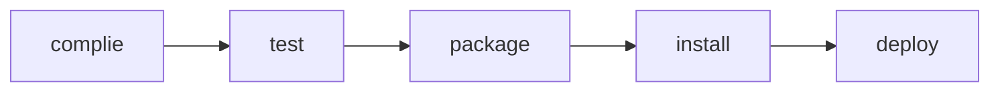

# 메이븐

- 프로젝트를 빌드하고
- 라이브러리를 관리해주는 친구

### 라이브러리 관리

- 라이브러리가 많으면 개발 환경을 일치시키기가 어렵다

  -> 협업이 어렵다

  - But 메이븐을 쓰면?

    -> POM만 공유하면 끝!

- 라이브러리가 요구하는 라이브러리 버전에 맞게 설치해줌

### 라이프사이클

- 빌드와 관련!

- 각 사이클 내에는 phase 존재(e.g. compile, test)
- 플러그인과 goal, 풀버전 phase에 대해서도 알아보자

#### default

- Compile
  - 명령어: `mvn compile`
  - 소스코드를 컴파일
  - target/classes 폴더 생성, 컴파일된 class 파일 생성

- Test
  - 명령어: `mvn test`
  - 테스트 코드 실행
  - 컴파일된 class 생성(컴파일 단계와 뭐가 다른가?)
  - target/surefire-reports에 테스트 결과 기록
- Package
  - 명령어: `mvn package`
  - 프로젝트를 묶어줌
  - 확장자에 맞춰 묶음
    - 확장자 타입은 pom에 packaging 태그로 묶임
  - `artifactId-version.packaging` 파일을 target에 생성

- Install(로컬배포)
  - 명령어: `mvn install`
  - Maven이 설치된 PC(로컬 repo)에 배포

- deploy(원격 배포)
  - 명령어: `mvn deploy`
  - 원격 레포 있다면 배포

#### Clean

- 명령어: `mvn clean`
- target 폴더 삭제

#### Site

- site(사이트 생성) -> site-deploy(서버 배포)

- 문서 사이트 생성을 지원

## 참고자료

- [메이븐 라이프사이클](https://myjamong.tistory.com/153)