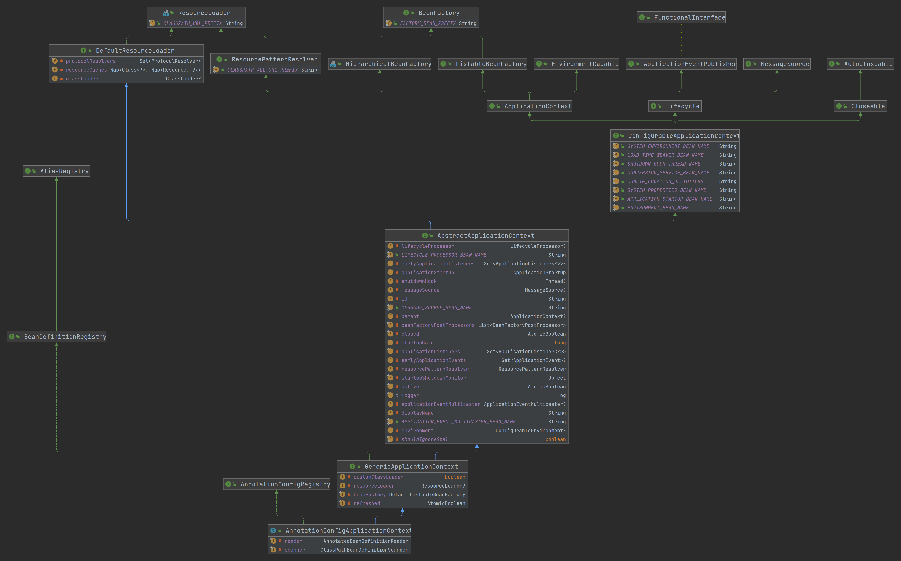

# 객체지향프로그래밍 이야기

- **OOP; Object-Oriented-Programming**


## 객체지향 프로그래밍

- 자바는 객체지향 프로그래밍이지만,

  자바로 프로그래밍 한다고 해서 객체지향적으로 프로그래밍한 것은 아니다.

- 객체지향 프로그래밍: 프로그램을 객체로 구성하는 것.

- **[소프트웨어 위기](https://ko.wikipedia.org/wiki/%EC%86%8C%ED%94%84%ED%8A%B8%EC%9B%A8%EC%96%B4_%EC%9C%84%EA%B8%B0)(software crisis)**

  - 프로젝트가 거대화되니
  - 유지보수도, 비용도 감당이 안 된다.

- 문제: 어떻게 큰 프로그램을 만들 것인가?

  - 해결: 작게 나눠서 만들고 합친다.

  - 프로그램의 동작을 객체들에게 나눠 수행했다.

  - [TODO]모듈 단위 개발과 객체지향의 차이를 생각해보자

    - 

    -> 객체지향 프로그래밍의 등장


- 용어

  - 객체(object): 개념적인 용어

    - 논란의 여지가 있다고 생각함

      - swift의 인스턴스나 객체와 같은 용어에 대한 apple의 이야기: [링크](https://stackoverflow.com/questions/2885385/what-is-the-difference-between-an-instance-and-an-object)의 첫 답변에서 인용.

        > An instance of a class is traditionally known as an object. However, Swift classes and structures are much closer in functionality than in other languages, and much of this chapter describes functionality that can apply to instances of either a class or a structure type. Because of this, the more general term instance is used.

      - [영문 위키피디아](https://en.wikipedia.org/wiki/Object-oriented_programming)의 경우 object를 인스턴스로 보고 있다.

      - 내 생각: 

  - class, instance: 기술적인 용어

- 객체지향 프로그래밍을 잘 하는 방법

  - 객체는 작은 기능을 수행

  - 객체와 객체는 서로 협력

  - 일을 잘게 쪼개서 객체에게 위임하고 서로 협력하게 만들자.

- 형(Type)

  - 객체들을 서로 구별할 필요가 있기 때문
  - class로 타입 정의
  - 필드 영역과 메서드 영역


## 객체지향의 특성

### 1. 캡슐화(encapsulation)

캡슐화는 두 측면에서 이해해 볼 수 있다:

#### 1.1 완성된 단위

- 기능을 수행하는 단위로써 완전함을 갖는다.
- 외부에 의존하는 요소가 없다는 것


#### 1.2 정보의 은닉

- 객체의 속성을 외부로 노출시켜서도,

  객체의 속성을 외부에서 접근하지 못하게 하라.

- 접근 지정자

  - `private`

  - `protected`: 상속시 접근 가능

  - `friendly`: 패키지 가시성

    - 이펙티브 자바에서는:

      - 명시하지 않은(default) 접근 수준(access level)

      - 패키지 접근(package access) -> 패키지-프라이빗(package-private)

  - `public`


### 2. 상속(inheritance)

#### 여러 용어들

- 상위, 하위 객체

- 부모, 자식 객체

- super(부모)

- **추상, 구체** 객체


#### 상속에 대한 오해

- 상속은 공통된 기능을 여러 객체에게 전달하고 싶을 때
- 상속이란 추상에서 구체로

- **아리스토텔레스 형이상학을 생각하면 간단!**


### 3. 추상화(abstraction)

- 추상화된 객체는 추상체, 구체적인 객체는 구상체
  - 이는 상대적 개념
- **보편자-개별자를 생각하면 매우 간단!**

#### 추상체의 종류

- 의미적 추상체

  ```java
  class Login {		// 상위 개념, 의미적 추상체
      void login();
  }
  
  class KakaoLogin extends Login{
      void login();
  }
  ```

- 추상 기능을 가진 객체: 추상 클래스

  ```java
  abstract class Login {		// 추상기능을 가진 객체
      abstract void login();
  }
  
  class KakaoLogin extends Login{
      @Override void login();
  }
  ```

- 객체 자체가 추상적: 인터페이스

  ```java
  public interface Login {	// 개념으로만 존재
      void login();
  }
  
  class KakaoLogin implements Login{
      @Override void login();
  }
  ```


### 4. 다형성(polymorphism)

- 자료형은 여러가지로 표현할 수 있다.
- 형변환 가능
- 구체는 추상으로 표현될 수 있다: `Login k = new KakaoLogin()`

- 구체일수록 추상보다 많은 것이 규정되어 있다.

- DIP를 지켜야 캡슐화를 지킬 수 있다!


## UML

- 객체에게 역할과 책임을 분산시키는 것이 객체지향의 설계이기에

  객체의 구분, 객체의 연관관계를 살펴보는 것이 의미 있다.

  → UML; Unified Modeling Language: 이를 설명하기 위한 도구

- **UML**

  - 종류

    - Usecase Diagram

    - Sequence Diagram

    - Package Diagram

    - **Class Diagram**

  - 도구
    - draw.io
    - starumil.io
    - PowerPoint / Visio ...
    - **InteliJ로도 Diagram 볼 수 있음!**
    - `mermaid` 이용하여 쉽게 다이어그램 그릴 수 있음

  - 아래는 스프링의 `AnnotationConfigApplicationContext`의 관계도를 InteliJ로 확인한 것임
    - 공간 문제로 클래스명, 필드명만 표시함



구체적 표기법에 대해서는 다른 글로 정리 예정


## 어떻게 좋은 객체지향 설계를 할 수 있을까?

- 객체지향 설계의 핵심은 결국
  - **나누고**
  - **연관짓는 것**

- **SOLID 원칙**: 객체지향을 위한 핵심 5원칙
  - 별도의 글로 정리 예정

- **디자인 패턴**: 객체지향 원칙을 지키다 보면 나타나는 패턴
  - GoF의 디자인 패턴 23종
  - 별도의 시리즈로 정리 예정