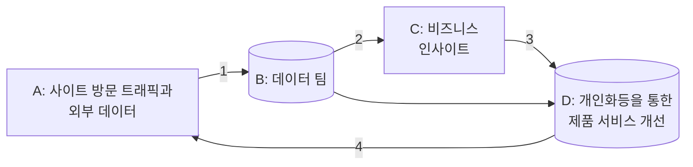

# 실리콘밸리에서 날아온 데이터베이스

# 데이터베이스 시스템 소개

## 데이터베이스의 종류

- 모든 서비스는 데이터를 만들어내며, 이는 저장되어야 한다.

- 어디에 데이터를 저장해야 할까? -> 데이터베이스

- **프로덕션 관계형 데이터베이스(RDBMS)**
  - 어떤 서비스의 운영에 필요한 데이터를 저장하는 곳 (MySQL, PostgreSQL, Oracle)
  - 데이터를 구조화된 테이블들의 집합으로 구성하여 저장하고 관리
  - 관계형 데이터베이스를 다루는 언어가 **SQL(Structured Query Language)**


### 두 종류의 RDBMS

#### 프로덕션 관계형 데이터베이스

- **프로덕션 관계형 데이터베이스**는 RDBMS 중에서도, 웹서비스나 앱에 필요한 정보를 저장하는 역할을 담당하는 것을 지칭한다. 

- **빠른 처리속도가 중요함**: 슬로우 쿼리같은 백단의 데이터베이스 관련 문제들이 보통 서비스 속도를 낮추는 주 원인이니까.

- 서비스에 필요한 정보 저장

- SQL은 당연히 잘 알아야 한다.
- OLTP(OnLine Transaction Processing)


#### 데이터 웨어하우스 관계형 데이터베이스

- 속도보다도 얼마나 **큰 정보**를 취급하느냐가 더 중요한 데이터베이스
- 회사 관련 데이터를 저장하고 분석함으로써 의사결정과 서비스 최적화에 사용
- 데이터 분석/모델 빌딩 등을 위한 데이터 저장
  - 보통 프로덕션 데이터베이스를 복사해서 데이터 웨어하우스에 저장
- OLAP(OnLine Analytical Processing)
- 데이터 분석가들도 RDBMS를 사용하지만,
  그들이 사용하는 DB는 **초점이 빠른 처리 속도보다도 구조화된 큰 데이터를 처리할 수 있느냐**에 집중되어 있다.

- 예시) **구글 클라우드의 [Big Query](https://cloud.google.com/bigquery/?hl=ko&utm_source=google&utm_medium=cpc&utm_campaign=japac-KR-all-ko-dr-bkws-all-super-trial-b-dr-1009882&utm_content=text-ad-none-none-DEV_c-CRE_521901818549-ADGP_Hybrid%20%7C%20BKWS%20-%20PHR%20%7C%20Txt%20~%20Data%20Analytics%20~%20BigQuery_BigQuery-google%20big%20query-KWID_43700065776847425-kwd-1408826138068&userloc_1009871-network_g&utm_term=KW_%EA%B5%AC%EA%B8%80%20%EB%B9%85%20%EC%BF%BC%EB%A6%AC&gclid=CjwKCAjwloCSBhAeEiwA3hVo_fF5YSnS31KGp9kFb2ncIfQ3U6Z_TCnHmtAyjUAoJWrxJS88niVflhoCPIcQAvD_BwE&gclsrc=aw.ds)**, **Snowflake사의 [Snowflake](https://www.snowflake.com/?lang=ko&utm_source=google&utm_medium=paidsearch&utm_campaign=ap-kr-ko-brand-core-exact&utm_content=go-eta-evg-ss-free-trial&utm_term=c-g-snowflake-e&_bt=579103397659&_bk=snowflake&_bm=e&_bn=g&_bg=128328467463&&gclsrc=aw.ds&gclid=CjwKCAjwloCSBhAeEiwA3hVo_dXXWG6lsXwkFsH6mTeWBUSKJKGwTgVge7DTjo9byladkB7WBHlUvRoCaj0QAvD_BwE&gclsrc=aw.ds)**, **아마존 클라우드의 [Redshift](https://aws.amazon.com/ko/redshift/)**, **Apache사의 [Apache Spark](https://spark.apache.org/) (오픈 소스)**, HIVE 등
  - 단, 회사가 작아서 데이터 양도 적은 경우 MySQL같은 프로덕션 관계형 RDBMS 사용하기도 한다.
    물론, MySQL은 이런 형태의 데이터 처리에는 부적합하기에 회사가 커지면서 쓸모 없어질 것이다.

- 데이터 직군이라면 반드시 알아야함 (SQL)
  - 데이터 엔지니어, 데이터 분석가, 데이터 과학자
  - 데이터 엔지니어
    - 데이터 웨어하우스를 관리하는 사람
    - 데이터를 추출해 오는 코드를 작성하는 사람: 개발은 몰라도 됨, SQL 아는 정도로 충분
    - 데이터 웨어하우스의 정보를 기본으로 비즈니스 인사이트를 얻음
  - 데이터 과학자: 데이터를 바탕으로 머신러닝, 인공지능 등을 개발 -> 사람들의 삶을 향상(역시나 SQL 필요)


#### 데이터 순환 구조: 프로덕션 데이터베이스와 데이터 웨어하우스



- A: 프로덕션용 데이터베이스, 처리 속도가 중요
- B: 데이터 웨어하우스: 얻은 모든 데이터를 추출하여 저장, 지표 설정, 시각화하여 전체 조망


### 관계형 데이터베이스와 비관계형 데이터베이스

- **관계형 데이터베이스: 구조화된 데이터**

  - **프로덕션용 관계형 데이터베이스** (속도가 중요한 MySQL, PostgreSQL...)

  - 데이터 웨어하우스용 관계형 데이터베이스 (데이터 크기가 중요)

- 비관계형 데이터베이스: 비구조화 데이터도 다룸
  - 흔히 NoSQL 데이터베이스라 부르기도 함
    - 데이터 구조가 깔끔하게 구조화되어있지 않다는 어감
  - 보통 프로덕션용 관계형 데이터베이스를 보완하기 위한 용도로 사용
  - 종류
    - Key/Value Storage: Redis, Memcache...
    - Document Store: MongoDB
    - Wide Column Storage: Cassandra, HBase, DynamoDB
    - Search Engine: ElasticSearch

- 기본적으로는 프로덕션용 관계형 데이터베이스를 사용하지만,
  제약사항을 보완하기 위해 NoSQL 데이터베이스를 사용하기도


## 백엔드 시스템 구성도 예제

- (특히 백엔드) 시스템에서 프로덕션 데이터베이스의 위치를 살펴 본다.
- 개발자 직군에 대해 알아보자.


### 개발자 직군

#### 프론트엔드와 백엔드

- 웹/앱 서비스를 크게 나누면 프론트엔드/백엔드로 구성

  - 프론트엔드: 사용자와 인터렉션, 사용자에게 노출
  - 백엔드: 사용자에게 보이지 않지만 실제 데이터를 처리하고 업무를 수행하는 부분, 다양한 데이터베이스가 사용되는 부분

  - 과거에는 크게 위의 두 직군이 존재했음


#### 다른 직군의 등장

- 데브옵스(DevOps)
  - 주로 백엔드에 집중을 두고 서비스의 운영을 책임지는 팀
  - 회사가 작은 경우 백엔드 팀이 데브옵스 업무를 담당

- 풀스텍(FullStack)
  - 프론트엔드/백엔드를 겸하는 개발자
  - 작은 회사에서 선호
  - 개발 선호를 위함
- 데이터 직군: 데이터의 중요성이 증대되면서 등장
  - 데이터 엔지니어
    - 사실상 소프트웨어 개발자
    - 데이터 웨어하우스와 관련 업무를 담당하는 MLOps 직군이 등장하기 시작
  - 데이터 분석가: 데이터 웨어하우스를 기반으로 지표설정과 분석 수행
  - 데이터 과학자
    - 수집된 데이터를 기반으로 미래를 예측하는 모델링
    - 개인화 작업으로 서비스 만족도를 높이고 프로세스 최적화 수행


### 시스템 구성

#### 과거: 2 tier

- 일반적인 데스크탑 애플리케이션에서 사용되는 아키텍처
- 클라이언트 - 서버로 구성 (2 티어)
  - 클라이언트는 사용자가 쓰는 UI(프론트엔드)
    - 비즈니스 로직은 보통 클라이언트에 있음
  - 서버단이 데이터베이스(백엔드)


#### 3 tier

- 웹 서비스에서 많이 사용되는 아키텍처
  - 프레젠테이션 티어(Presentation Tier): 프론트엔드
  - 애플리케이션 티어(Application Tier): 백엔드, 비즈니스 로직
  - 데이터 티어(Data Tier): 백엔드


#### 시스템 구성 예: Spring Boot

- 기본적으로 3 tier 구조로 볼 수 있다.
- 프레젠테이션 티어
  - 리엑트
  - Authentication / JSON Translation

- 애플리케이션 티어

  - 비즈니스 레이어
    - Business Logic
    - Validation
    - Authorisation
    - Spring

- 데이터 티어

  - Persistence Layer
    - Storage Logic
    - Spring

  - 데이터베이스 레이어
    - 실제 데이터베이스
    - MySQL, PostgreSQL


### 관계형 데이터베이스의 중요성

- 어떤 구조건 데이터베이스는 꼭 필요한 컴포넌트
- 좋은 개발자가 되려면 DB에 대한 이해가 필요: **핵심은 SQL**
- 백엔드 개발자에게 중요 포인트
  - 데이터 모델을 잘 만들고 프론트 개발자와 공유/협업
  - 속도 개선을 위한 쿼리 성능 모니터링, 필요에 따라 성능 개선
    - 이를 전담하는 사람(DBA; DataBaseAdministrator)이 존재 하기도


## 관계형 데이터베이스 소개

- 구조화된 데이터를 저장하고 질의할 수 있게 해주는 스토리지
- 테이블, 컬럼(열), 레코드(행)

- 관계형 데이터베이스를 조작하는 언어가 SQL
  - 테이블 정의를 위한 DDL(Data Definition Language)
    - 테이블의 포맷(스키마)을 정의해줌
  - 테이블 데이터 조작/질의용 DML(Data Manipulation Language)
    - DDL로 정의된 테이블에 레코드를 추가, 수정, 삭제, 읽어들여줌

- 내부 데이터 분석을 위한 쿼리는 프로덕션 데이터베이스로 보내지 않고 웨어하우스로 보낸다. 서비스 속도를 위해서다.


### 기본 구조

- 관계형 데이터베이스의 2단 구조
  - 가장 밑단의 테이블
  - 테이블들은 데이터베이스 혹은 스키마라는 폴더 밑으로 구성

- 테이블의 구조
  - 레코드들로 구성(행)
  - 레코드는 하나 이상의 필드(컬럼)로 구성(열)
  - 필드는 이름과 타입과 속성(Primary Key)으로 구성됨
  - PK는 하나의 레코드 identity를 지칭할 수 있어야 한다.


## SQL 소개

- **SQL; Structured Query Language**
- 1970년대 초 IBM에서 개발한 구조화된 데이터 징의 언어
- DDL / DML으로 구성


- SQL은 빅데이터 세상에도 여전히 중요!
  - 구조화된 데이터를 다루는 한 SQL은 데이터 규모와 무관하게 계속 사용됨
  - 데이터 웨어하우스는 SQL 기반
    - Reshift, Snowflake, BigQuery, Hive 등...
    - Spark, Hadoop도 마찬가지(SQL 언어가 지원됨, 방언 수준의 차이일 뿐)
  - 어떤 분야를 다루건 필수 기술


### 단점

- 구조화된 데이터를 다루는 데 최적화됨
  - 정규표현식으로 비구조화된 데이터를 다룰 수는 있지만 제약 많음
  - 많은 RDBMS가 플랫한 구조만 지원 (no nested like JSON)
    - 구글 빅쿼리는 **nested structure** 지원
      - 필드 자체가 하나의 오브젝트, 그 안에 또 필드가 있음
  - 비구조화된 데이터를 다루는데 Spark, Hadoop 같은 분산 컴퓨팅 기술이 중요해짐
    - SQL만으로는 비구조화된 데이터를 다루는 데 한계 있음
- RDBMS마다 SQL 방언


### Star schema


- 데이터 모델: 데이터를 어떤 테이블로 나누어 저장할 것인지?
- Production DB용 관계형 DB에서는 일반적으로 스타 스키마 사용
- 데이터를 논리적 단위로 나눔, 필요시 조인
- 장점
  - 정보의 중복을 막아서 스토리지 낭비가 적고
  - 업데이트 용이

- 단점: 조인이 많아질 수 있음


### Denormalized Schema

- NoSQL이나 데이터 웨어하우스에서 사용하는 방식
  - 단위 테이블로 나눠 저장하지 않기에 별도의 조인이 불필요
  - 스토리지 사용량은 증가하지만, 조인이 필요 없기에 빠른 계산이 가능

| Denomalize된 매출 테이블 |
| :----------------------: |
|         년 월 일         |
|          매장명          |
|          지역명          |
|          직원명          |
|           성별           |
|         매출단가         |
|         매출수량         |
|         총매출액         |
|          제품명          |
|           ...            |

- 프로덕션 DB는 기본적으로 PC 한대에 들어가는 DB
- 반면 데이터 웨어하우스는 사이즈에 제약이 적기 때문에 반정규화 스키마를 감당할 수 있다.
  - 다수의 컴퓨터를 사용한 클러스터 구조
- NoSQL은 조인이 힘들기에 저런 구조를 사용


### SQL 기본

- 다수의 SQL문은 세미콜론(;)으로 분리해야 한다.
- 주석
  - `--` : 인라인 한 줄짜리 주석
  - /* --*/`: 여러 줄 주석
- SQL 키워드는 일관성 있는 포맷팅이 필요하다.
  - 테이블 등 명명 규칙을 만드는 것도 중요
    - 단수형 vs 복수형
    - `_ `vs 카멜케이스


### DDL

#### CREATE TABLE

- PK 지정가능

  - Primary key uniqueness: 유일키 보장(중복값 없음)

- 성능 향상을 위한 인덱스 지정 가능

  ```sql
  CREATE TABLE raW_data.user_session_channel (
  	userid int,
  	sessionid varchar(32) primary key,
  	channel varchar(32)
  );
  ```


#### DROP TABLE

- 테이블 삭제

- FK의 경우 옵션으로 CASCADE(참조하는 테이블 연쇄 삭제)와 RESTRICT(삭제할 테이블이 참조되고 있으면 제거 안 함) 중 선택 가능
- `DELETE FROM`과의 비교
  - `DELETE FROM`은 **조건에 맞는 레코드**들을 지움(**테이블은 존재**)

```SQL
DROP TABLE 사원;

DROP TABLE IF EXISTS table_name;
```


#### ALTER TABLE

 테이블 수정

- 컬럼 추가: CREATE TABLE의 제약조건 사용 가능

  ```SQL
  ALTER TABLE 사원 ADD 전화번호 VARCHAR(11) UNIQUE;
  ```

- 컬럼 수정

  ```SQL
  ALTER TABLE 사원 MODIFY 이름 VARCHAR(30) NOT NULL;
  ```

- 컬럼 삭제

  ```SQL
  ALTER TABLE 사원 DROP 생년월일;
  ```

- 이름변경

  ```sql
  ALTER TABLE 사원 RENAME 현재필드명 TO 새필드명
  ```


### DML

#### SELECT

- 레코드 질의 언어

  ```sql
  SELECT [ALL / DISTINCT] 속성명1, 속성명2, ...
  FROM 테이블명1, ...
  [WHERE 조건]
  [GROUP BY 속성명1, ...]
  [HAVING 그룹조건]
  ORDER BY 속성 [ASC / DESC] ];
  ```

- 다수 테이블에 조인하여 사용하기도 한다.
- DAU, WAU, MAU 계산은 GROUP BY를 필요로 함


#### 레코드 추가/삭제/수정

- INSERT INTO: 테이블에 레코드 추가
- UPDATE FROM: 테이블 레코드의 필드 값 수정
- DELETE FROM: 테이블에서 레코드 삭제
  - TRUNCATE: 모든 레코드 삭제
  - 둘 다 테이블은 남겨놓음


## 질문

4강에서, 데이터 웨어하우스는

보통 프로덕션 데이터베이스를 복사해서 데이터 웨어하우스에 저장한다고 했는데

프로덕션 측의 관심사는 데이터 웨어하우스 측의 관심사와 다를 수 밖에 없고,

그런 프로덕션 측에서 한 번 가공된 데이터를 사용한다는 점에서 한계가 있지 않을까 합니다.

데이터 웨어하우스를 다루는 데이터 분석가 등이 제대로 역할을 하려면 프로덕션 데이터베이스 처럼

고객과 1차적으로 접하면서 어떤 데이터를 수집할지 결정하고, 또 직접 데이터를 수집할 수 있어야 하지 않을까요?

-----
그리고 denomalized schema는 반정규화의 일종이라고 봐도 될까요? 반정규화의 방식이 많은데, 그 중에서 테이블 통합만 적용된 방식으로 보여서 궁금했습니다.
