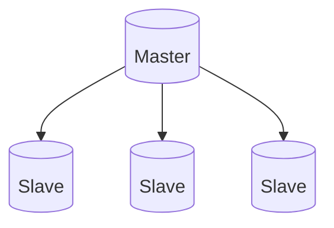

# MySQL 소개/설치와 예제 데이터 소개

## 1. MySQL 소개

### MySQL의 역사

- 1995: MySQL AB(스웨덴 회사)에 의해 개발
  - 오픈소스로 시작

- 2008: 썬 마이크로시스템이 MySQL AB를 1$B에 인수
- 2009: 오라클이 썬을 인수, MySQL 유료화가 쟁점화
  - 인기 감소의 원인
  - 아직은 유료/무료버전이 구별
- 2010: MySQL 최초 개발자 Monty가 MariaDB 개발(MySQL 호환 가능)


### 종류와 버전

- MariaDB
  - 오픈소스, 무료
  - MySQL 5.5 기반 개발
  - MySQL과 인터페이스는 동일, 성능은 더 좋음
- MySQL
  - MySQL Community Server: 무료 오픈소스
  - MySQL Enterprise Server: 유료 버전, 다양한 플러그인 제공
  - 최신 버전은 8.0


### 특징

- 한 때 웹 개발 표준 기술 스택 중 하나였음

  - LAMP: Linux, Apache, MySQL, PHP
  - 지금도 PostgreSQL와 함께 가장 널리 쓰이는 프로덕션용 관계형 DB

- 용량 증대(Scaling) 방식

  - Scale-Up: 서버에 CPU와 메모리 추가

    - 하지만 한계가 있는데,
      - 기본적으로 MySQL은 서버 한 대에 대한 솔루션이라 더 그렇다!

    - 주의사항
      - 정말로 서버에 필요한 정보만 있는지 생각해보자.

  - Scale-Out: Master-Slave 구성

    - 일반적으로는 클러스터 구성을 이야기하나 MySQL은 이를 지원하지 못 한다.



- 위의 방식이 일반적으로 말하는 Scale-Out은 아니지만,
  - Master의 정보를 Slave에 똑같이 저장한다.
  - Master 한 대의 읽기 속도에는 한계가 있지만, 3대에 같은 정보가 분산되어 있다면
    읽는 속도는 3배까지 가능하다.
  - 한계
    - MySQL 자체가 handle 할 수 있는 데이터 양은 여전히 Master 한 대에 있는 수준으로 제약되어 있다.
    - 쓰기 용량은 증가되지 않는다.

- 일반적인 Scale-Out은
  - [서버] + [서버] + [서버] + [서버] + ...
  - 서버 숫자를 늘리는 방식이다.


## 2. 클라우드/AWS 소개

### 클라우드 컴퓨팅 소개

#### 클라우드의 정의

- 컴퓨팅 자원(하드웨어/소프트웨어 등)을 네트워크를 통해 서비스 형태로 제공
- No Provisioning: 서버 구입, 소프트웨어 설치 등이 불필요하다.
- Pay as you go
  - 자원(ex. 서버 등)을 필요한만큼 (거의) 실시간 할당하여 사용량만큼 비용 지불
    - 탄력적으로 필요한 만큼의 자원을 유지하는 것이 중요하다.
    - 특정 스케일을 넘어설 경우 클라우드 컴퓨팅이 더 비싸지기는 하다.


#### 클라우드 컴퓨팅이 없다면?

- 서버/네트워크/스토리지 구매, 설정을 모두 직접 수행해야

- 데이터센터 공간을 직접 확보(Co-location): 추후 확장이 필요할수도

- 서버를 구매, 공간에 설치, 네트워크 설정

  - 일반적으로 서버 구매, 설치에만 2~3달은 소요

- peak time 기준으로 capacity planning을 해야함

  - 일 안 하는 잉여 자원의 문제

-  직접 운영비용 vs 클라우드 비용

  - 구축을 위한 시간이 감소했다는 점에서 시간적 기회비용 확보가 가능하다.

  

#### 장점

- 초기 투자 비용 감소
  - CAPEX(Capital Expenditure): 초기 투자 형태(일반적인 재무팀이 익숙, 비용 계산이 쉬움)
  - OPEX(Operating Expense): 지속적 사용 비용 형태(클라우드 방식)
- 리소스 준비를 위한 대기시간 대폭 감소
  - 빠르게 마켓에 배포
- 노는 리소스 제거 -> 비용 감소
- 글로벌 확장 용이
- 소프트웨어 개발 시간 단축
  - Managed Service(SaaS) 이용
    - 종래의 클라우드 컴퓨팅과 달리 하드웨어 뿐만 아니라
      소프트웨어 영역까지 커버해준다.
      (MySQL도 지원)


### AWS 소개

- Amazon Web Service
  - 가장 큰 클라우드 컴퓨팅 서비스 업체
- 역사
  - 2002: 아마존의 상품 데이터를 API로 제공하며 시작
  - 남아공 Amazon의 개발자들이 블랙프라이데이처럼 트래픽이 많을 때를 기준으로 서버를 갖추니
    남게 되는 많은 자원을 효율적으로 이용하기 위해 제시한 아이디어에서 출발
  - 현재 100여개의 서비스를 전세계 15개의 지역에서 제공
  - 대부분의 서비스들이 오픈소스 프로젝트에 기반함
  - 최근 ML/AI 관련 서비스를 내놓기 시작
- 사용 고객
  - 다수의 상장업체와 국내업체들이 사용 시작(서울 리전)
    - 대표적인 성공사례: 넷플릭스
- 다양한 종류의 소프트웨어/플랫폼 서비스를 제공
  - AWS 서비스만으로 쉽게 온라인서비스를 제공

- 점유율
  - 4년 동안 32%정도를 차지
  - 그 뒤로는
    - Microsoft Azure: 13.7에서 출발, 20%주변으로 성장
    - Google Cloud: 7%, Alibaba Cloud, IBM Cloud, ...
    - 기타 항목이 여전히 42%나 된다는 점도 주목할 점

- 2021년 매출액이 $13.1B.으로 아마존 전체 매출의 12%로 주력 사업이자 강한 성장세
- AWS Regions: 정부 클라우드의 경우 별도로 유지(보안성)
- AWS 서비스들


#### EC2 - Elastic Cloud Compute

- AWS의 서버 호스팅 서비스
  - 리눅스 혹은 윈도우 서버를 런치하고 로그인 가능(구글 앱 엔진과의 가장 큰 차이)
  - 가상 서버라 전용 서버에 비해 성능 낮음
  - Bare-metal 서버도 제공하기 시작

- 다양한 종류의 서버 타입 제공: [링크](http://aws.amazon.com/ec2/)
  - incoming network bandwith 무료
  - outgoing 유료
- 구매 옵션
  - On-demand: 시간당 비용을 지불, 가장 일반적인 옵션
  - Reserved: 1년 혹은 3년 사용을 보장하고 33% ~ 40% 할인
  - Spot Instance: 일종의 경매 형식으로 놀고 있는 리소스를 저비용으로 사용할 수 있는 옵션


#### S3 - Simple Storage Service

- 아마존이 제공하는 대용량 클라우드 스토리지 서비스(일종의 웹 하드 디스크)
- 데이터 저장관리를 위해 계층적 구조를 제공

- 글로벌 네임스페이스를 제공하기 때문에 톱레벨 디렉토리 이름 선정에 주의
- 디렉토리를 버킷(Bucket)이라 부름
- 버킷 혹은 파일별로 액세스 컨트롤이 가능

- 1TB/Month 비용
  - Standard storage: $23
    - Infrequent Access storage: $12.5
    - SLA가 다름
  - Glacier storage: $4


#### Database Services

- RDS(Relational Database Service)
  - (무료) MySQL/MariaDB, PostgreSQL, Aurora
  - (상용 서비스) Oracle, MS SQL Server
- DynamoDB
- Redshift
- ElastiCache
- Neptune (Graph database)
- ElasticSearch

- MongoDB


#### AI&ML Services

- SageMaker
- Lex
- Polly
- Rekognition


#### 기타 중요 서비스

- Amazon Alexa
- Amazon Connect
  - Contact Center Solution
  - 콜센터 구현을 쉽게 만듬
- Lambda
  - Event-driven, serverless computing engine
  - 서비스 구현을 위해 EC2를 런치할 필요가 없음
  - MS Azure에는 Azure Function으로 존재
  - Google Cloud에는 Cloud Function으로 존재


## MySQL 설치와 Docker

### Docker

- 프로그램을 설치하는 데에는 다양한 변수가 있음
  - OS, OS 버전 등에 따라 설치 과정이 달라짐
  - 다수 소프트웨어의 설치가 동반되는 것이 일반적
- **Docker는 특정 프로그램과 필요한 기타 소프트웨어를 하나의 패키지로 만듦으로써 해당 프로그램의 개발과 사용을 돕는 오픈소스 플랫폼이다.**
- **Docker Image**
  - 패키지가 파일 시스템 형태로 만들어진 것
  - 공유 가능
    - **Docker Registry(Docker Hub)**: Docker Image 공유소
  - **Docker Container**: Docker Image를 실행시킨 것, 응용프로그램에 해당 (단, Docker가 이미 있어야함)


#### 구조

- 호스트 운영체제 위에 가상의 운영체제가 생김

  - 가상화(Virtualization)와 유사
  - 정확히는 가상화가 아니라 **Containerization**

- 과정

  - Docker Engine 설치
    - Docker Image를 받고 설치

  - 실행 -> Docker Container가 됨

  - 응용 프로그램 실행 -> 컨테이너 내에서 해당 프로그램이 됨
  - 해당 프로그램만 돌리는 가상의 PC가 생기는 것과 유사하다.


## MySQL DDL과 예제 데이터 소개

### 테이블 필드의 중요 속성

- PRIMARY KEY

  - 테이블에서 레코드의 유일성을 정의하는 필드

  - Composite primary key: primary 키가 두 개 이상의 필드로 정의되는 경우
  - Primary key로 지정된 필드가 있는 경우 데이터베이스단에서 중복된 값을 갖는 레코드가 생기는 것을 방지함: primary key uniqueness constraint

- FOREIGN KEY

  - 테이블의 특정 필드가 다른 테이블의 필드에서 오는 값을 갖는 경우

- NOT NULL

  - 필드의 값이 항상 존재해야 하는 경우

- DEFAULT value

  - 필드에 값이 주어지지 않은 경우 기본값을 정의해줌
    - timestamp 타입: CURRENT_TIMESTAMP를 사용하면 현재 시간으로 설정됨

- 예제

  ```SQL
  CREATE TABLE channel (
      id int not null auto_increment primary key,
      channel varchar(32) not null
  );
  ```

  ```sql
  CREATE TABLE channel (
      id int not null auto_increment,
      channel varchar(32) not null,
      primary key(id)
  );
  ```

  primary key는 나중에 규정하는 쪽이 범용적이다.

  ```SQL
  CREATE TABLE session (
  	id int not null auto_increment primary key,
  	user_id int not null,
  	created timestamp not null default current_timestamp,
      channel_id int not null,
      foreign key(channel_id) references chanel(id)
  )
  ```


## SQL 고급 다지기

### MySQL에서 지원하는 컬럼 타입

- Numeric Type
  - INTEGER, INT, SMALLINT, TINYINT, MEDIUMINT, BIGINT
  - DECIMAL, NUMERIC
  - FLOAT, DOUBLE, BIT
- Date and Time Type
  - DATE, DATETIME, TIMESTAMP, TIME, YEAR

- String Type
  - CHAR, VARCHAR, BINARY, VARBINARY, BLOB, TEXT, ENUM, SET
- JSON Type
  - 다양한 JSON 조작함수를 제공함
- Spatial Type
  - 위도와 경도를 중심으로 한 위치 관련 타입


### DELETE

- 조건을 기반으로 테이블에서 레코드 삭제 혹은 모든 레코드 삭제

- 테이블은 계속 존재

- TRUNCATE는 조건 없이 모든 레코드를 삭제함

  - 속도가 빠른 대신 트랜잭션 사용시 롤백 불가

  

### UPDATE

- 조건을 기반으로 테이블에서 특정 레코드(들)의 필드 값 수정 가능


### JOIN

- 조인은 두 개 이상의 테이블들을 공통 필드를 기반으로 통합
  - 스타 스키마로 구성된 테이블들로 분산되어 있던 정보를 통합하는 데 사용
- 조인의 결과로 양쪽의 필드를 모두 가진 새로운 테이블이 만들어짐
- 조인 방식에 따라 다음이 달라짐
  - 어떤 레코드들이 선택되는가
  - 어떤 필드들이 채워지는가


- INNER JOIN: 공통만 리턴, 교집합
- FULL JOIN: 전체, 합집합
  - left right 조인을 union하여 가능
- LEFT: 좌측
- RIGHT: 우측
- SELF: 스스로 연결
- CROSS JOIN: CARTESIAN PRODUCT?


- MySQL: INNER, LEFT, RIGHT, CROSS만 지원(FULL은 지원 안 함)


#### 조인 유의사항

- 중복 레코드가 없으며 PK uniqueness체크
- 조인 테이블 간 관계를 명확히 정의
  - one to one
    - 완전한 one to one
    - 한 쪽이 부분집합이 되는 경우
  - one to many
  - many to one
  - many to many
- 어느 테이블을 베이스로 잡을지(즉 from에 사용할지 결정해야함)