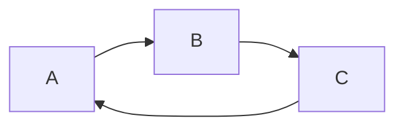

# 3.3 의존관계 주입, 스프링 빈

### Circular Dependency



- 빈 등록이 안 됨


### 컴포넌트 스캔

- 스프링이 Stereotype 애노테이션을 이용하여 빈을 자동적으로 검색, 등록해주는 방식
- 개발자가 직접 빈을 등록해줄 필요가 없다.

- Stereotype
  - `@Component`
  - `@Repository`
  - `@Service`
  - `@Controller`
  - `@Configuration`
- 컴포넌트 스캔의 경우 사용 패키지, 제외 패키지 설정 등으로 스캔 범위를 조정할 수 있음
  - IDE의 도움을 받아야 오타를 피할 수 있음

- `MemoryVoucherRepository` 구현

  ```java
  @Repository
  public class MemoryVoucherRepository implements VoucherRepository {
  
      private final Map<UUID, Voucher> storage = new ConcurrentHashMap<>();
  
      @Override
      public Optional<Voucher> findById(UUID voucherId) {
          return Optional.ofNullable(storage.get(voucherId));
      }
  
      @Override
      public Voucher insert(Voucher voucher) {
          storage.put(voucher.getVoucherId(), voucher);
          return null;
      }
  }
  ```


### AutoWired

```java
@Autowired
private final VoucherRepository voucherRepository;

@Autowired
public void setVoucherRepository(VoucherRepository voucherRepository);
```

- 생성자 주입 대신에 위와 같은 방식을 사용할 수도 있다.
  - 필드 주입
  - 세터 주입
  - 사실 생성자도 `@Autowired` 붙이는 방식이었다
    - 현재는 단일 생성자일 경우 `@Autowired` 안 붙여도 적용된다.
    - 복수 생성자를 소유한 클래스의 경우 `@Autowired`를 명시해줘야 한다.
- 생성자 주입을 사용하라!
  - 초기화시 모든 의존관계가 설정되기에 안전
    - 만일 필드를 나중에 Set해야 할 때는 Optional로 정의하자.
  - 테스트 용이
  - 불변성 확보
    - Thread-safe
- `@Primary` 애노테이션을 이용한 충돌 시에 적용순서 정하기
- `@Qualifier` 이용해 어떤 것을 사용할지 선택하는 방식
- `BeanFactoryAnnotationUtils`특정 `Qualified` 빈을 가져올 수 없음


### BeanScope

- 싱글톤
  - 스프링은 싱글톤 지원
- 프로토타입
- 리퀘스트
- 세션
- 어플리케이션
- 웹소켓


- 세부내용은 과거 스프링 강의 참조
