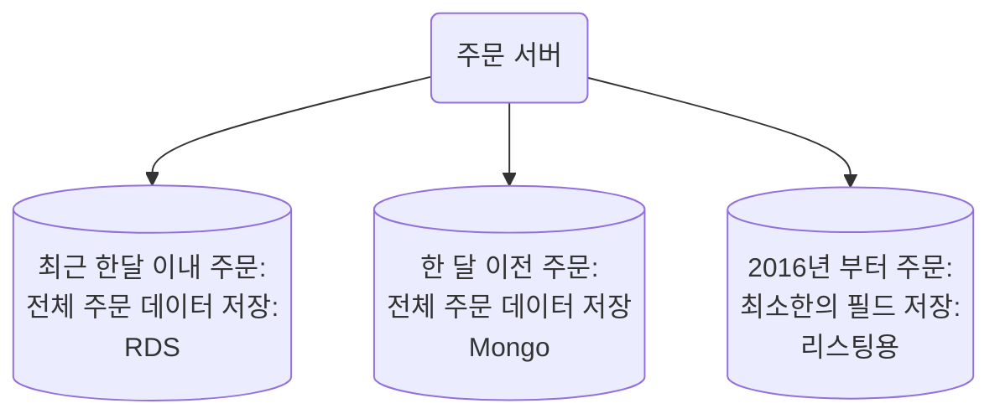

# CQRS 패턴

- 세션(홍구)
- 배달의민족 주문시스템
  - 코로나와 함께 주문량이 폭발적으로 증가
  - DB 하나가 버틸 수 없는 쓰기 양

## CQRS 패턴이란?

- Command and Query Reponsibility Segregation
  - 별도의 인터페이스를 사용해서, 데이터를 업데이트하는 작업(Command)에서 데이터를 읽는 작업(Query)를 분리하는 패턴
- 전통적인 CRUD 방식의 문제점
  - CUD 부하 + 조회 쿼리의 복잡성으로 인해 성능에 악영향
  - 조회 전용 화면 구성을 위해 불필요한 엔티티 조회가 중복으로 발생
- 모델 분리
  - Datastore에 Command와 Query Model을 분리된 계층으로 나누는 방식
  - DB는 분리하지 않고, Model Layer 부분만을 분리
  - 조회와 읽기 모델이 분리되어 있어 상황에 맞게 구현이 가능
  - 그러나 동일 DB 사용하기에 성능 문제는 개선이 어려움
- 읽기 전용 저장소 분리
  - Command용 DB, Query용 DB를 분리, 둘을 동기화 처리
  - Command용 DB는 정규화된 RDB로 트랜잭션을 보장
  - Query용 모델은 NoSQL을 사용하여 조회에 최적화된 설계
    - ElasticSearch, MongoDB 등 많이 사용함
  - 동기화 처리를 위한 처리가 복잡

## 왜 CQRS를 도입했나?

- 일평균 250 ~ 300만건의 주문 발생
- 데이터양이 많아지면서 조인연산 등 복잡한 쿼리에 대해 성능 부하가 심해짐
- 조회에 필요한 데이터를 최대한 펼쳐서 싱글 도큐먼트로 구성

## 구현 방식

- 주문 서비스 -> EventNoti -> OrderMongoSync -> 주문 이벤트 처리기 -> Atlas Mongo -> 주문 BATCH
- 주문 서비스 -> 주문 RDS -> 주문 BATCH: RDS - Mongo 동기화 체크

- BATCH 프로세스
  - 두 물리적으로 분리된 DB 정합성을 맞춰줌
  - 무너질 경우 OrderMongoSync를 통해서 동기화 맞춰줌

## 질의

- Spring batch의 필요성?
  - 많이 사용하고 있다. 학습하면 많이 도움될 것이다.
  - Spring cloud data flow 도입 시도하려고 하지만, batch보다 어려운 상황
    - Spring batch 사용하면 이해 쉬움
- 백엔드 개발자와 DB 관리 책임
  - 아키텍처 설계 부분은 개발자의 몫이었음
  - 개발자는 직접 코드만 짜는 것이 아님, 이런 부분에 대한 고민도 많이 한다.
- batch 작업주기?
  - 계속 실시간으로 돌고 있음, 이전 10분 데이터를 계속 비교
  - 추가적으로 매일 한 번씩 돌면서 확인: 총 금액, 상태값 등
  - 실제로는 두 batch가 돌고 있음
- NoSQL 선택 시 기술 선택 가이드
  - ES
    - 검색에 특화, 잘 설계하면 검색에서 매우 큰 이점을 가질 수 있음
    - 잘만 설계하면 포털 검색 기능 같은것도
  - MongoDB
    - 검색보다는 저장소, 편리한 조회가 주 목적
    - 컬럼 추가, 변경이 자유로운 저장소
    - AWS
  - 무중단 서비스의 어려움
    - 별도의 스테이지 환경에서 테스트
    - 언제 부터는 특정 로직을 사용하게 하게끔 코드를 심어놓는 식으로 시나리오를 미리 설정
    - 문제가 발생했을 경우 대비하여 기존 방식도 사용할 수 있게끔 안전장치를 사용
  - RDB, NoSQL
    - RDB는 무조건 사용
    - NoSQL을 메인으로 쓰는 회사는 보지 못했다.
    - RDB를 중점적으로 학습하는 것을 추천
    - NoSQL은 필요할 때 학습: 학습 곡선이 그렇게 가파르지는 않기 때문
  - 발표한 CQRS같은 큰 작업에는 누가 참여하는지?
    - 구성원들의 의견 + 유동적
  - 양방향 관계를 실무에서 많이 사용하는지?
    - 일단, ROOT 엔티티 기준으로 관계를 설정하자.
    - 한 Aggregate 안에 들어가야 한다는 가정이 있다면 양방향으로 설정했다.
  - JPA Criteria에 대한 의견
    - 첫 회사에서 직접 사용했었음
    - 가독성을 해쳤음
    - 동적 쿼리 사용한다면 QueryDSL 사용하자
  - RDB에 샤딩을 적용하기 어려운데 RDB에 샤딩 적용하는 경우?
    - MongoDB가 샤딩을 내적으로 지원하지만, MongoDB는 트랜재션에 있어서 좀 불안
    - 그래서 RDB 레벨이 아니라 어플리케이션 레벨에서 샤딩을 구현
    - `AbstractRoutingDataSource` 참고
      - `determineCurrentLookUpKey()` 구현
  - DTO 변환은 서비스에서? 컨트롤러에서?
    - 책: 만들면서 배우는 클린 아키텍처에도 비슷한 내용 언급
    - 계층간 경계에서는 거기에 맞는 타입으로 변환하는 것이 낫다고 생각한다.
      - 영향을 최소화한다.
  - 코틀린 학습
    - 코틀린 인 액션
      - 인덱싱 하듯이 읽어야
    - 코틀린 공식 문서(InteliJ)
  - ModelMapper는 문제가 많이 생겨서, 번거롭더라도 일일히 컨버터 작성