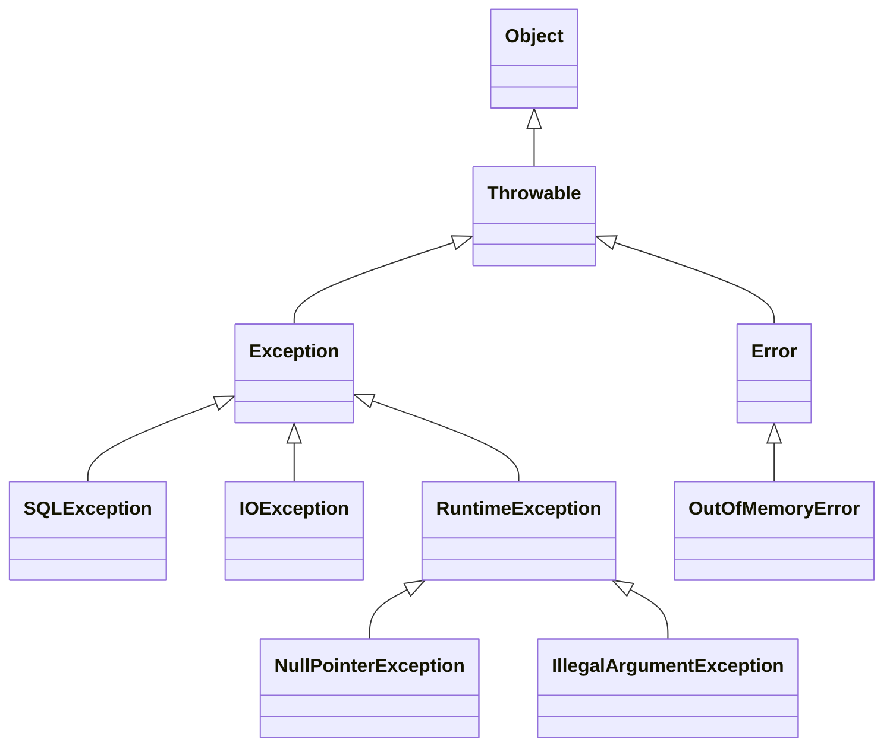

# 스프링 DB 1편 - 데이터 접근 핵심 원리

# JDBC

## JDBC 이해

### JDBC 등장 이유

- 애플리케이션을 개발할 때 중요한 데이터는 대부분 DB에 저장
- 애플리케이션 서버의 일반적인 사용법
  1. DB와 커넥션 연결
  2. 애플리케이션이 DB로 SQL 전달
  3. DB에서 응답


#### 과거의 경우

- 과거 DB는 아래와 같은 것들이 각각 상이했다.
  - 커넥션 연결
  - SQL 전달
  - 결과 응답 받는 방법
- 문제점
  - DB를 교체할 때마다 서버에 개발된 DB 사용 코드도 함께 변경해야 함
  - 각각의 DB마다 상이한 방식을 학습해야 함


### JDBC 표준 인터페이스

- **JDBC; Java DataBase Connectivity**
  - 위와 같은 문제를 해결하기 위해 등장
  - **DB 기능에 대한 표준 인터페이스**
    - `java.sql.Connection`: 연결
    - `java.sql.Statement`: SQL을 담은 내용
    - `java.sql.ResultSet`: 요청에 대한 응답
  - **JDBC 드라이버**
    - JDBC 인터페이스를 각각의 DB 벤더(회사)에서 각 DB에 알맞게 구현한 라이브러리
    - MySQL JDBC 드라이버, Oracle JDBC 드라이버 , ...
- JDBC의 문제 해결
  - DB 변경 시에 애플리케이션 서버의 DB 코드를 변경할 필요가 없음
  - 개발자는 각 DB의 연결, SQL 전달, 응답 방식을 학습할 필요가 없이, JDBC 인터페이스만 학습해도 된다.
- 한계
  - DB 사이의 자료형, SQL 등이 여전히 상이함.
    - ANSI SQL 표준은 일부만 적용됨
    - ex) 페이징 SQL은 DB마다 상이
    - **DB를 변경할 때 JDBC 코드는 변경할 필요가 없으나, SQL은 DB에 맞춰 변경해야 함!**
  - JPA를 도입할 경우 위의 문제를 일부 해결할 수 있음


## JDBC와 최신 데이터 접근 기술

- JDBC는

  - 오래됨(1997 출시)
  - 사용법이 복잡

- 현재는 JDBC를 직접 사용하지 않고, 편리하게 사용하는 기술들이 제공됨

  - SQL Mapper
  - ORM

- **SQL Mapper**

  - 구조

    ```mermaid
    graph LR
    A[애플리케이션 로직] -->|SQL 전달| B[SQL Mapper<br>-Jdbc Template<br>-MyBatis]-->|SQL 전달| C[JDBC]
    ```

  - 장점

    - SQL 응답 결과를 객체로 변환
    - JDBC의 반복 코드를 제거

  - 단점: 개발자가 SQL을 직접 작성해야 한다.

  - 대표 기술 스프링 Jdbc Template, MyBatis

- **ORM 기술**

  - 구조

    ```mermaid
    graph LR
    A[애플리케이션 로직] -->|객체 전달| B[JPA]
    C[JDBC] --> |구현| B
    C[JPA 구현체<br>-하이버네이트<br>-이클립스 링크] -->|SQL 전달| D[JDBC]
    ```

  - 객체를 RDB와 매핑해주는 기술

  - 반복적 SQL 작성 작업 사라짐

  - DB마다 상이한 SQL을 사용하는 문제 해결

  - 대표 기술: JPA, 하이버네이트, 이클립스 링크

- **최신 DB 접근 기술들도 결국 JDBC를 사용한다.**

  - **따라서 JDBC를 직접 사용하지 않더라도, JDBC의 동작 원리에 대해서 알아야 한다.**
  - **JDBC는 자바 개발자의 필수 기술이다.**


## 데이터베이스 연결

- 커넥션 상수 정의

  ```java
      public static final String URL = "jdbc:h2:tcp://localhost/~/test";
      public static final String USERNAME = "sa";
      public static final String PASSWORD = "";
  ```

- 커넥션 받아오기

  ```java
  @Slf4j
  public class DBConnectionUtil {
  
      public static Connection getConnection() {
          try {
              var connection = DriverManager.getConnection(URL, USERNAME, PASSWORD);
              log.info("get Connection={}, class={}", connection, connection.getClass());
              return connection;
          } catch (SQLException e) {
              throw new IllegalStateException(e);
          }
      }
  }
  ```

- `Connection`은 인터페이스임
  - `getConnection()`으로 리턴한 `Connection` 구현체는 `org.h2.jdbc.JdbcConnection`이다. (H2 드라이버를 사용하여 테스트하였기 때문)
  - 인터페이스를 사용하기에 DB가 변경되어도 JDBC 코드를 바꾸지 않아도 되는 유연성을 제공


### JDBC DriverManager

- 라이브러리에 등록된 DB 드라이버들을 관리, `Connection`을 획득하는 기능 제공
- 과정
  - `DriverManager.getConnection()`으로 `Connection` 요청
  - `DriverManager`는 라이브러리에 등록된 드라이버 목록을 자동 인식
    - `URL`, `이름`, `비밀번호` 등 정보를 바탕으로
    - 개별 드라이버들이 커넥션을 획득할 수 있는가를 확인
  - 지원되는 드라이버는 관련된 `Connection` 구현체를 클라이언트에 반환


###  JDBC - Create

```java
@Slf4j
public class MemberRepositoryV0 {

    public Member save(Member member) throws SQLException {
        String sql = "insert into member(member_id, money) values (?, ?)";

        Connection con = null;
        PreparedStatement pstmt = null;

        try {
            con = getConnection();
            pstmt = con.prepareStatement(sql);
            pstmt.setString(1, member.getMemberId());
            pstmt.setInt(2, member.getMoney());
            pstmt.executeUpdate();
            return member;
        } catch (SQLException e) {
            log.error("DB error", e);
            throw e;
        } finally {
            close(con, pstmt, null);
        }
    }
```

- `con.prepareStatement(sql);`: DB에 전달할 SQL과 파라미터로 전달할 데이터들을 준비
  - `Statement`와 달리 `PreparedStatement`는 파라미터 바인딩이 추가됨
    - `PreparedStatement`는 `Statement` 하위 타입
    - **SQL Injection 공격을 예방하기 위해 `PreparedStatement` 사용해야 한다.**
  - 파라미터 바인딩 기능:`setString()`, `setInt()` 등, 전달할 순서와 함께 전달
- `pstmt.executeUpdate()`: `Statement`를 통해 준비된 SQL을 커넥션을 통해 실제 DB로 전달
  - 반환하는 `int`값은 영향 받은 DB row 수임

```java
    private void close(Connection con, Statement stmt, ResultSet rs) {
        if (rs != null) {
            try {
                rs.close();
            } catch (SQLException e) {
                log.info("error" , e);
            }
        }

        if (stmt != null) {
            try {
                stmt.close();
            } catch (SQLException e) {
                log.info("error" , e);
            }
        }

        if (con != null) {
            try {
                con.close();
            } catch (SQLException e) {
                log.info("error" , e);
            }
        }
    }
}
```

- **리소스 정리**
  - 닫아야 하는 리소스의 수가 여럿인데,
    앞 자원을 닫을 때 예외가 터진다면 뒤 자원을 닫지 못한다.
  - 때문에 위와 같이 일일히 설정해 줘야 한다.
  - 반환 순서는 획득 순서의 역순이다.
  - 리소스가 제대로 정리되지 않는다면
     **커넥션이 끊어지지 않고 계속 유지되는 리소스 누수가 발생한다. 이로 인해 커넥션 부족으로 장애가 발생할 수 있다.**


### JDBC - Read

```java
    public Member findById(String memberId) throws SQLException {
        String sql = "select * from member where member_id = ?";

        Connection con = null;
        PreparedStatement pstmt =null;
        ResultSet rs = null;

        try {
            con = getConnection();
            pstmt = con.prepareStatement(sql);
            pstmt.setString(1, memberId);

            rs = pstmt.executeQuery();
            if (rs.next()) {
                var member = new Member();
                member.setMemberId(rs.getString("member_id"));
                member.setMoney(rs.getInt("money"));
                return member;
            } else {
                throw new NoSuchElementException("member not found memberId=" + memberId);
            }
        } catch (SQLException e) {
            log.error("DB error", e);
            throw e;
        } finally {
            close(con, pstmt, rs);
        }
    }
```

- 데이터를 조회할 때는 `executeUpdate()`가 아니라 **`executeQuery()`**

- `executeQuery()`는 `ResultSet`을 반환

  

#### ResultSet

- 다음과 같은 구조로 이해하자.

  | 위치 | member_id | money |
  | ---- | --------- | ----- |
  | 1    | member1   | 10000 |
  | 2    | member2   | 20000 |

- 커서가 위의 표의 **`위치`**를 지정한다고 생각하자.

  - 최초의 커서는 데이터를 가지고 있지 않기에 `rs.next()`를 최소 1회는 호출해야 데이터를 조회할 수 있다.
  - `rs.next()`를 호출할 때마다 커서는 다음 위치로 이동한다.
  - `rs.next()`의 반환값은 커서의 이동으로 도달한 위치의 데이터 유무를 나타낸다.
  - `rs.getInt()`: 현재 커서가 가리키고 있는 위치를 `int`타입으로 변환한다.

- 단건 데이터를 조회할 경우에는 `if`문을 사용해도 충분하지만, 여러 건의 데이터를 조회할 때는 `while`문을 사용하자.


### JDBC - Update, Delete

- 등록과 유사하게 `executeUpdate()` 사용한다.


# Connection Pool과 DataSource의 이해

## Connection Pool의 이해

- DB 커넥션 획득 과정
  - 고객의 요청
  - 애플리케이션 로직 실행
  - DB 드라이버에 커넥션 조회
  - DB와 TCP/IP 커넥션 연결(3 way handshake 등)
  - 커넥션이 연결되면, ID, PW 등 정보를 DB에 전달
  - DB에서 ID, PW 등으로 내부 인증 완료, DB 세션 형성
  - DB가 커넥션 생성 완료 응답 전송
  - DB 드라이버가 커넥션 객체를 생성, 반환
- 커넥션 획득 과정은 복잡한 과정을 거치며, 시간을 많이 소요한다.
  - DB와 애플리케이션 서버 모두 커넥션 생성을 위한 리소스를 매 호출마다 사용해야 한다.
  - 고객이 애플리케이션을 사용할 때 **SQL 실행 시간 + 커넥션 생성 시간이 소모**
    -> **응답 속도에 영향, 부정적인 UX!**


### 커넥션 풀

- 커넥션을 미리 생성해두고 관리, 위와 같은 문제를 해결함
- 애플리케이션 시작 시점에 커넥션 풀이 커넥션을 미리 확보하여 보관
  - 보관 기본값은 일반적으로 10개
- 커넥션 풀의 커넥션은 이미 DB와 TCP/IP 연결되어 있기에 SQL을 즉각적으로 DB에 전달 가능
- 애플리케이션 로직은 DB 드라이버를 통해 커넥션을 획득하지 않고, **커넥션 풀에 이미 생성된 커넥션을 객체 참조로 사용한다.**
  - 커넥션을 다 사용한 후, **커넥션을 종료하지 않고 커넥션 풀에 반환한다.**
- **정리**
  - 커넥션 풀의 적절한 커넥션 수는 상황에 따라 다르기에 성능 테스트를 통해 정해야 한다.
  - 커넥션 풀은 최대 커넥션 수를 제한할 수 있기에 **DB에 무한정 연결이 생성되는 것을 막아, DB를 보호하기도 한다.**
  - **실무에서는 커넥션 풀을 항상 기본적으로 사용한다.**
  - 커넥션 풀은 단순하기에 직접 구현할 수도 있지만 유용한 오픈소스를 사용하는 것이 낫다.
    - 대표적인 오픈소스: `commons-dbcp2`, `tomcat-jdbc pool`, **`hikariCP`**
    - **`hirakiCp`**
      - 성능, 사용의 편리함, 안정성 모두에 있어 가장 나음
      - 스프링 부트 2.0부터 기본 커넥션 풀로 사용(스프링 부트에서 기본 제공)


## DataSource 이해

- 커넥션을 얻는 방법은 다양하다.
  - 커넥션 풀 획득에 `DBCP2 커넥션 풀`을 사용하다가 `HikariCP 커넥션 풀`을 사용하는 식으로 바꾸려면?
  - 커넥션을 획득하는 애플리케이션 코드를 변경해야 한다.


### DataSource

- 위와 같은 상황에서 유연성을 갖기 위해서 **커넥션 획득 방법을 추상하는 인터페이스**
- `Connection getConnection()` 메서드가 핵심 기능이다.
- **정리**
  - 대부분의 커넥션 풀은 `DataSource` 인터페이스를 구현
  - 따라서 특정 구현체가 아니라 `DataSource`를 사용하게끔 애플리케이션 로직을 작성하면 됨
  - **`DriverManager`는 `DataSource` 인터페이스를 사용하지 않음!**
    - `DriverManager`에서 `DataSource` 기반 커넥션 풀로 변경 시 코드를 고쳐야 하는 문제 발생
    - 이 문제를 해결하기 위해 **스프링이 `DriverManagerDataSource` 인터페이스를 제공**


### 커넥션을 DriverManager로 얻어오는 방식과 DataSource로  얻어오는 방식의  차이점

```java
Connection con1 = DriverManager.getConnection(URL, USERNAME, PASSWORD);
Connection con2 = DriverManager.getConnection(URL, USERNAME, PASSWORD);		    //드라이버 매니저
```

```java
DataSource dataSource = new DriverManagerDataSource(URL, USERNAME, PASSWORD);	//데이터 소스
Connection con1 = dataSource.getConnection();
Connection con2 = dataSource.getConnection();
```

- 차이
  - `DriverManager`의 경우 커넥션을 획득할 때마다 파라미터를 계속 전달해야 하지만,
  - `DataSource`의 경우 처음 객체 생성 시에만 파라미터를 넘기고, 그 이후 커넥션을 획득하기 위해서는 `getConnection()`을 호출하기만 하면 됨
- **설정과 사용의 분리**
  - 설정: `URL`, `USERNAME`, `PASSWORD` 입력
  - 사용: 설정과 무관하게 `getConnection()`
  - **유연성에 있어서 큰 차이를 만든다.**


### ConnectionPool

```java
        //커넥션 풀링: HikariProxyConnection(Proxy) -> JdbcConnection(Target)
        HikariDataSource dataSource = new HikariDataSource();
        dataSource.setJdbcUrl(URL);
        dataSource.setUsername(USERNAME);
        dataSource.setPassword(PASSWORD);
        dataSource.setMaximumPoolSize(15);
        dataSource.setPoolName("MyConnectionPool");

        useDataSource(dataSource);
        Thread.sleep(1000);
```

- 커넥션 풀 설정: 위와 같은 방식으로 설정해준다.

- 왜 `Thread.sleep()` 사용했는가?

  ```
  16:55:41.827 [MyConnectionPool connection adder] DEBUG com.zaxxer.hikari.pool.HikariPool - MyConnectionPool - Added connection conn2: url=jdbc:h2:tcp://localhost/~/test user=SA
  16:55:41.834 [MyConnectionPool connection adder] DEBUG com.zaxxer.hikari.pool.HikariPool - MyConnectionPool - Added connection conn3: url=jdbc:h2:tcp://localhost/~/test user=SA
  16:55:41.843 [MyConnectionPool connection adder] DEBUG com.zaxxer.hikari.pool.HikariPool - MyConnectionPool - Added connection conn4: url=jdbc:h2:tcp://localhost/~/test user=SA
  ...
  ```

  - **`connection adder` 쓰레드**가 커넥션을 추가하는 데 텀을 줘야 하기 때문이다.
  - 커넥션 풀이 커넥션을 채우는 일은 시간이 오래 걸리기 때문에(외부 접속: TCP/IP) 별도의 쓰레드를 사용하였다.
    - 별도의 쓰레드에서 커넥션 풀을 채우기 때문에 애플리케이션 실행 시간에 영향을 주지 않는다.
  - 만약 커넥션이 생성되기 전에 / 커넥션이 남아 있지 않을 때 커넥션을 요청한다면?
    - **대기한다. (block)**
    - **대기 시간이 일정 이상을 넘어설 경우 예외를 던진다. (구체적인 시간은 설정에 따라 다르다.)**

- 커넥션 획득

  ```
  con1=HikariProxyConnection@917831210 wrapping conn0: url=jdbc:h2:tcp://localhost/~/test user=SA, 
  class=class com.zaxxer.hikari.pool.HikariProxyConnection
  
  con2=HikariProxyConnection@1464555023 wrapping conn1: url=jdbc:h2:tcp://localhost/~/test user=SA, 
  class=class com.zaxxer.hikari.pool.HikariProxyConnection
  ...
  MyConnectionPool - After adding stats (total=15, active=2, idle=13, waiting=0)
  ```

  - 위와 같은 커넥션 이름, 커넥션 클래스를 확인할 수 있다.
  - 두 개의 커넥션을 풀에서 획득했기에 활성 2개임을 확인할 수 있다. (커넥션을 사용 후에 꼭 반환하자!)


### 기존 CRUD를 DataSource 이용하게 변경하기

```java
/**
 * JDBC - DataSource 사용, JdbcUtils 사용
 */
@Slf4j
@RequiredArgsConstructor
public class MemberRepositoryV1 {

    private final DataSource dataSource;		//의존관계 주입받음
    
    ...
    
    private Connection getConnection() throws SQLException {
        Connection con = dataSource.getConnection();
        log.info("get connection={} class={}", con, con.getClass());
        return con;
    }

    private void close(Connection con, Statement stmt, ResultSet rs) {

        JdbcUtils.closeResultSet(rs);
        JdbcUtils.closeStatement(stmt);
        JdbcUtils.closeConnection(con);
    }
```

- 외부에서 `DataSource`를 주입받음
  - 자바 표준 인터페이스이기에 변경할 필요 없음
- **`JdbcUtils` 편의 메서드**
  - 커넥션을 좀 더 편하게 닫을 수 있음
- `closeConnection()`: 커넥션 풀을 사용할 경우 커넥션을 닫는 것이 아니라 반환한다. 


# 트랜잭션 이해

## 트랜잭션의 개념

- 데이터베이스를 사용하는 이유 중 하나
- 하나의 작업 단위를 안전하게 처리하게끔 보장
  - ex) A->B로 계좌 이쳬: A 계좌 금액의 감소, B 계좌 금액의 증가가 함께 성공하거나, 함께 실패해야 한다.
- 커밋(Commit): 모든 작업에 성공해서 DB에 반영하는 것
- 롤백(Rollback): 하나라도 작업이 실패하여, 작업 이전 상태로 돌리는 것


### 트랜잭션 ACID

- **ACID; Atomicity, Consistency, Isolation, Durability**
  - **원자성(Atomicity)**: 트랜잭션 내에서 실행한 작업은 하나의 작업인 것처럼 동시에 성공하거나 실패해야 한다.
  - **일관성(Consitency)**: 모든 트랜잭션은 일관성 있는 DB 상태를 유지해야 한다. ex) DB 무결성 조건을 항상 만족
  - **격리성(Isolation)**: 동시에 실행되는 트랜잭션들이 서로에게 영향을 미치지 않도록 격리해야 한다.
    - 동시성과 관련된 성능 이슈로 인해 트랜잭션 격리 수준(isolation level)을 선택할 수 있다.
  - **지속성(Durability)**: 트랜잭션을 성공적으로 끝내면 그 결과가 항상 기록되어야 한다.
    - 중간에 문제가 발생해도 DB 로그 등을 사용해서 성공한 트랜잭션 내용을 복구해야 한다. 
- **트랜잭션은 원자성, 일관성, 지속성을 보장함**
  - **격리성을 엄격하게 지키려면 병렬 처리가 불가능하다.** 때문에 ANSI 표준에서는 트랜잭션 격리 수준을 4단계로 나누어 정의했다.
- **트랜잭션 격리 수준(Isolation level)**
  - 커밋되지 않은 읽기(READ UNCOMMITED)
  - **커밋된 읽기(READ COMMITED)**
    - 일반적으로 많이 사용
  - 반복 가능한 읽기(REPEATABLE READ)
  - 직렬화 가능(SERIALIZABLE)


## 데이터베이스 연결 구조와 DB 세션

- 연결구조
  - 클라이언트: WAS, DB 접근 툴 등을 이용해서 DB에 접근
  - 클라이언트가 커넥션을 얻고, DB는 내부에 세션을 만듦
    - 해당 커넥션을 통한 모든 요청은 해당 세션을 통해 실행하게 됨
  - 세션은 트랜잭션을 시작하며, 커밋/롤백을 통해 트랜잭션을 종료, 다른 트랜잭션을 시작, ...
  - 사용자가 커넥션을 닫거나, DBA(DB 관리자)가 세션을 강제로 종료하면 세션은 종료됨
- 커넥션 풀과 연결 구조
  - 커넥션 풀에 커넥션이 생성된 만큼, DB 세션도 생성된다.


## 트랜잭션 예시

### 개념

- 이하의 설명은 일반적인 개념으로, 구체적인 구현 방식은 DB마다 다르다.
- **트랜잭션 사용**
  - 변경 반영을 원하면 `commit`, 원하지 않는다면 `rollback`을 호출
  - `commit` 호출 이전은 임시 데이터 저장임.
    - 트랜잭션을 시작한 세션(사용자)에게만 변경 데이터가 보이며, 다른 세션(사용자)에게는 변경 데이터가 보이지 않음.
- **만일 커밋하지 않은 데이터를 다른 세션에서 조회할 수 있다면?**
  - 세션1의 커밋하지 않은 데이터를 조회한 것을 기반으로 세션2가 작업을 진행하는데, 세션1이 롤백했을 경우
    **데이터 정합성이 무너진다.** (READ UNCOMMITED)


### 자동 커밋, 수동 커밋

- 자동 커밋: 각각의 쿼리 실행 직후에 자동적으로 커밋을 호출
  - 커밋/롤백을 직접 호출하지 않아도 되지만, 트랜잭션 기능을 제대로 활용할 수 없음
  - 일반적으로 기본 설정으로 지정되어 있음
- 수동 커밋: `set autocommit false;`
  - 마지막에 꼭 커밋이나 롤백을 호출해야.
  - 만일 둘 중 하나를 호출하지 않으면 설정된 timeout이 경과되었을 때 자동 롤백된다.
- 자동/수동 커밋 모드를 설정하면 해당 세션에서 설정이 계속 유지됨. 중도 변경도 가능.
- 실제 트랜잭션을 실험해보고 싶을 경우 H2 콘솔을 두 개 띄우되, 서로 다른 세션이 뜨게 하자.
- **자동커밋 모드를 수동커밋 모드로 바꾸는 것이 트랜잭션의 시작!**


## DB 락

- 여러 세션이 동일 데이터를 수정하게 되면 트랜잭션의 원자성이 깨진다.
  - 한 세션이 트랜잭션을 시작하고 데이터를 수정하는 동안에는 커밋이나 롤백 전까지 다른 세션에서 해당 데이터를 수정할 수 없게 막아야 한다.
    -> **DB 락**
  - 과정
    - 세션1이 어떤 데이터를 변경하려고 시도할 때는 먼저 해당 데이터의 락을 획득해야 한다.
    - 해당 데이터의 락이 남아 있기에 세션1이 락을 획득한다.
    - 세션2가 동일 데이터를 변경 시도하면, 락이 없으므로 락이 돌아올 때까지 대기한다.
      - 락 대기시간을 넘어갈 경우 락 타임아웃 오류가 발생한다.
      - `set lock_timeout <milliseconds>`: 락 타임아웃 시간 설정
    - 세션1이 커밋을 수행하면, 트랜잭션이 종료되었기에 락을 반납한다.
    - 세션2가 락을 획득하고 작업을 수행한다. 작업이 종료된 후 락을 반납한다.


### 조회

- 변경과 달리, **일반적인 조회는 락을 사용하지 않는다.**

  - DB마다 다르지만, 일반적으로 조회 시에는 락을 획득하지 않아도 된다.

- **조회에도 락을 적용하고 싶다면**

  - **`select for update`** 구문 사용

    ```SQL
    set autocommit false;
    select * from member where member_id='memberA' for update;
    ```

  - 이 경우 조회 시에 락을 가져가버림

  - 트랜잭션 종료 시까지 해당 데이터를 변경하지 못하게 막아야 할 경우

    - 금전과 관련된 중요한 계산일 경우
    - 위 방식으로 락을 획득하고, 중요 작업을 마칠 때까지 트랜잭션을 종료하지 않으면 됨


## 트랜잭션 적용

### 적용 이전 상태

```java
@RequiredArgsConstructor
public class MemberServiceV1 {

    private final MemberRepositoryV1 memberRepository;

    public void accountTransfer(String fromId, String toId, int money) throws SQLException {
        Member fromMember = memberRepository.findById(fromId);
        Member toMember = memberRepository.findById(toId);

        memberRepository.update(fromId, fromMember.getMoney() - money);
        validate(toMember); //의도적으로 예외가 터지는 상황을 만들어보기 위한 학습용 코드
        memberRepository.update(toId, toMember.getMoney() + money);
    }

    private void validate(Member toMember) {
        if (toMember.getMemberId().equals("ex")) {
            throw new IllegalStateException("이체 중 예외 발생");
        }
    }
}
```

- 테스트: 정상 케이스

  ```java
      @Test
      @DisplayName("정상 이체")
      public void accountTransferTest() throws SQLException {
          //Given
          Member memberA = new Member(MEMBER_A, 10000);
          Member memberB = new Member(MEMBER_B, 10000);
          memberRepository.save(memberA);
          memberRepository.save(memberB);
  
          //When
          memberService.accountTransfer(memberA.getMemberId(), memberB.getMemberId(), 2000);
  
          //Then
          Member foundMemberA = memberRepository.findById(memberA.getMemberId());
          Member foundMemberB = memberRepository.findById(memberB.getMemberId());
          assertThat(foundMemberA.getMoney()).isEqualTo(8000);
          assertThat(foundMemberB.getMoney()).isEqualTo(12000);
      }
  ```

- 테스트: 이체 중 예외가 터진 경우

  ```java
      @Test
      @DisplayName("이체 중 예외 발생")
      public void accountTransferExTest() throws SQLException {
          //Given
          Member memberA = new Member(MEMBER_A, 10000);
          Member memberEx = new Member(MEMBER_EX, 10000);
          memberRepository.save(memberA);
          memberRepository.save(memberEx);
  
          //When
          assertThatThrownBy(
                  ()-> memberService.accountTransfer(memberA.getMemberId(), memberEx.getMemberId(), 2000))
                  .isInstanceOf(IllegalStateException.class);
      }
  ```

  - 예외가 터진 경우 돈이 깎이기만 하고 증가하지는 않는다: `memberA`의 돈만 2000 감소하고, `memberEx`의 돈은 증가하지 않았다!


### 적용 이후

- 트랜잭션을 어떤 계층에서 걸어야 하며, 어떤 경우 롤백, 커밋해야 할까?
- **비즈니스 로직과 트랜잭션**
  - 트랜잭션은 비즈니스 로직이 있는 서비스 계층에서 시작해야 한다.
  - 트랜잭션 시작 -> 비즈니스 로직 -> 트랜잭션 종료
  - 트랜잭션을 시작하려면 커넥션이 필요하기에, 서비스 계층에서 커넥션을 만들고, 트랜잭션 커밋 후에 커넥션을 종료해야 한다.
  - **DB 트랜잭션을 사용하려면 트랜잭션을 사용하는 동안 같은 커넥션을 유지해야 한다!**
    - 커넥션을 통해서 세션이 맺어지며, 세션에서 트랜잭션이 시작하니까.
- **같은 커넥션을 유지하려면?**
  - 가장 간단한 방법: 커넥션을 파라미터로 전달

- 커넥션을 파라미터로 전달한 경우 코드

  - `repository`

    ```java
    /**
     * JDBC - ConnectionParam
     */
    @Slf4j
    @RequiredArgsConstructor
    public class MemberRepositoryV2 {
    
        ...
            
        public Member findById(Connection con, String memberId) throws SQLException {
            String sql = "select * from member where member_id = ?";
    
            PreparedStatement pstmt = null;
            ResultSet rs = null;
    
            try {
                pstmt = con.prepareStatement(sql);
                pstmt.setString(1, memberId);
    
                rs = pstmt.executeQuery();
                if (rs.next()) {
                    var member = new Member();
                    member.setMemberId(rs.getString("member_id"));
                    member.setMoney(rs.getInt("money"));
                    return member;
                } else {
                    throw new NoSuchElementException("member not found memberId=" + memberId);
                }
            } catch (SQLException e) {
                log.error("DB error", e);
                throw e;
            } finally {
                JdbcUtils.closeResultSet(rs);
                JdbcUtils.closeStatement(pstmt);
            }
        }
    
            public void update(Connection con, String memberId, int money) throws SQLException {
            String sql = "update member set money=? where member_id=?";
    
            PreparedStatement pstmt = null;
    
            try {
                pstmt = con.prepareStatement(sql);
                pstmt.setInt(1, money);
                pstmt.setString(2, memberId);
                int resultSize = pstmt.executeUpdate();
                log.info("resultSize = {}", resultSize);
            } catch (SQLException e) {
                log.error("DB error", e);
                throw e;
            } finally {
                JdbcUtils.closeStatement(pstmt);
            }
        }
        
        ...
    ```

    - 커넥션을 파라미터로 받아 오고 있다. 기존의 커넥션을 받아오는 코드를 제거해야 한다.

    - **작업이 끝나고 자원을 반환할 때, 커넥션을 반환하지 않도록 주의하자!**
      **이 경우 커넥션을 커넥션 풀로 반환하는 것은 커밋 혹은 롤백이 일어난 후 서비스 계층에서 이루어져야 한다!**

  - `service`

    ```java
    /**
     * 트랜잭션 - 파라미터 연동, 풀을 고려한 종료
     */
    @Slf4j
    @RequiredArgsConstructor
    public class MemberServiceV2 {
    
        private final DataSource dataSource;
        private final MemberRepositoryV2 memberRepository;
    
        public void accountTransfer(String fromId, String toId, int money) throws SQLException {
    
            Connection con = dataSource.getConnection();
            try {
                con.setAutoCommit(false);       //트랜잭션 시작
    
                //비즈니스 로직
                bizLogic(con, fromId, toId, money);
    
                con.commit();       //성공 시 커밋
            } catch (Exception e) {
                con.rollback();     //실패 시 롤백
                throw new IllegalStateException(e);
            } finally {
                release(con);
            }
        }
    
        private void bizLogic(Connection con, String fromId, String toId, int money) throws SQLException {
            Member fromMember = memberRepository.findById(con, fromId);
            Member toMember = memberRepository.findById(con, toId);
    
            memberRepository.update(con, fromId, fromMember.getMoney() - money);
            validate(toMember); //의도적으로 예외가 터지는 상황을 만들어보기 위한 학습용 코드
            memberRepository.update(con, toId, toMember.getMoney() + money);
        }
    
        private void release(Connection con) {
            if (con != null) {
                try {
                    con.setAutoCommit(true);    //반환된 커넥션이 수동 커밋 모드인 경우 다른 곳에서 사용될 때 문제 발생 가능!
                    con.close();
                } catch (Exception e) {
                    log.info("error: ", e);
                }
            }
        }
    
        private void validate(Member toMember) {
            if (toMember.getMemberId().equals("ex")) {
                throw new IllegalStateException("이체 중 예외 발생");
            }
        }
    }
    ```

    - 트랜잭션을 시작하기 위해 자동 커밋 모드를 꺼서, 수동 커밋으로 전환한다.
      - **커넥션 풀을 사용할 경우 커넥션을 커넥션 풀로 반환하기 전에 반드시 자동 커밋으로 다시 전환해 준다!!!**
    - 비즈니스 로직을 분리한다. 트랜잭션 관리 로직과 비즈니스 관리 로직은 서로 다른 관심사를 다루고 있기 때문이다.

- 테스트

  ```java
  /**
   * 트랜잭션 - 커넥션 파라미터 전달 방식 동기화
   */
  class MemberServiceV2Test {
  
      static final String MEMBER_A = "memberA";
      static final String MEMBER_B = "memberB";
      static final String MEMBER_EX = "ex";
  
      private MemberRepositoryV2 memberRepository;
      private MemberServiceV2 memberService;
  
      @BeforeEach
      void beforeEach() {
          DriverManagerDataSource dataSource = new DriverManagerDataSource(URL, USERNAME, PASSWORD);
          memberRepository = new MemberRepositoryV2(dataSource);
          memberService = new MemberServiceV2(dataSource, memberRepository);
      }
  
      @AfterEach
      void afterEach() throws SQLException {
          memberRepository.delete(MEMBER_A);
          memberRepository.delete(MEMBER_B);
          memberRepository.delete(MEMBER_EX);
      }
  
      @Test
      @DisplayName("정상 이체")
      public void accountTransferTest() throws SQLException {
          //Given
          Member memberA = new Member(MEMBER_A, 10000);
          Member memberB = new Member(MEMBER_B, 10000);
          memberRepository.save(memberA);
          memberRepository.save(memberB);
  
          //When
          memberService.accountTransfer(memberA.getMemberId(), memberB.getMemberId(), 2000);
  
          //Then
          Member foundMemberA = memberRepository.findById(memberA.getMemberId());
          Member foundMemberB = memberRepository.findById(memberB.getMemberId());
          assertThat(foundMemberA.getMoney()).isEqualTo(8000);
          assertThat(foundMemberB.getMoney()).isEqualTo(12000);
      }
  
      @Test
      @DisplayName("이체 중 예외 발생")
      public void accountTransferExTest() throws SQLException {
          //Given
          Member memberA = new Member(MEMBER_A, 10000);
          Member memberEx = new Member(MEMBER_EX, 10000);
          memberRepository.save(memberA);
          memberRepository.save(memberEx);
  
          //When
          assertAll(
                  () -> assertThatThrownBy(
                          () -> memberService.accountTransfer(memberA.getMemberId(), memberEx.getMemberId(), 2000))
                          .isInstanceOf(IllegalStateException.class),
                  () -> assertThat(memberA.getMoney()).isEqualTo(10000),
                  () -> assertThat(memberEx.getMoney()).isEqualTo(10000));
      }
  }
  ```

  - 기존과 달리 예외가 발생하였을 경우 트랜잭션이 롤백되어 거래 실패 시 원 상태로 돌아가는 것을 볼 수 있다.

- **남은 문제**

  - 트랜잭션 도입으로 문제 해결하였지만,
  - 애플리케이션에서 DB 트랜잭션을 적용하려고 하면
    - 서비스 계층이 매우 지저분해지고,
    - 코드가 상당히 복잡해지며,
    - 커넥션을 유지하도록 코드를 변경하는 것도 쉽지 않다.
  - 스프링을 사용해서 이런 문제를 해결할 수 있다.


# 스프링과 문제 해결 - 트랜잭션

## 기존 방식의 문제점들

- **설계에 있어서 유의할 점**

  - 일반적인 애플리케이션 3계층
    - 프레젠테이션
      - UI 처리
      - 요청과 응답
      - 요청 검증
    - 서비스
      - 비즈니스 로직
      - 가급적 특정 기술에 의존하지 않고, 순수 자바 코드로 작성
    - 데이터 접근
      - 실제 DB에 접근

  - **순수한 서비스 계층**
    - **서비스 계층이 가장 중요하다! 핵심 비즈니스 로직이 들어 있기 때문이다.**
    - 다른 계층에 변경이 생겨도 변함 없이 유지되어야 함 -> 서비스 계층은 특정 기술에 종속적이지 않아야 한다.
    - 계층 분리의 주 목적은 서비스 계층을 최대한 순수하게 유지하기 위함.

- **문제점**

  - **트랜잭션 문제**
    - 트랜잭션 적용으로 인해 JDBC 구현 기술이 서비스 계층에 누수
      - 트랜잭션, 리소스와 관련된 코드가 서비스 계층을 오염시키고 있다.
      - `Datasource`, `Connection`, `SQLException` 등 JDBC 기술에 의존하고 있다.
    - 트랜잭션 동기화 문제
      - 동일 트랜잭션 유지를 위해 커넥션을 파라미터로 넘기고 있음
    - 반복적 코드가 많음: `try~catch~finally`
  - **예외 누수 문제**
    - 데이터 접근 계층의 JDBC 구현 기술 예외(`SQLException`)이 서비스 계층으로 전파되고 있음
      - JDBC 의존적 예외이기에 이후 데이터 접근 기술을 변경할 경우 서비스까지 변경해야 함
      - `CheckedException`
  - **JDBC 반복 문제**
    - 유사한 코드의 반복이 많음

  -> **스프링이 제공하는 기술들을 사용해서 해결**


## 스프링의 트랜잭션 매니저

- 트랜잭션을 추상화하여 기술을 변경하더라도 트랜잭션을 사용하는 코드를 변경할 필요가 없게 만들자.

  - 사실 시작, 커밋, 롤백만 지원하면 된다.
  - 인터페이스 + DI -> OCP

- **`PlatformTransactionManager`: 스프링이 제공하는 트랜잭션 인터페이스**

  - 트랜잭션 추상화
  - 리소스 동기화

- **리소스 동기화**

  - 파라미터로 커넥션을 전달하지 않아도 되게 만듦
  - **트랜잭션 동기화 매니저**
    - `ThreadLocal`을 사용하여 커넥션을 동기화
      - Thread-safe
      - 각 쓰레드마다 별도의 저장소가 부여: 해당 쓰레드만 해당 데이터에 접근
  - 동작 방식
    - 서비스 계층에서 트랜잭션 매니저에게 트랜잭션 시작을 요청
    - 트랜잭션 매니저는 데이터 소스를 통해 커넥션 생성, 트랜잭션 시작
    - 트랜잭션 매지너는 트랜잭션이 시작된 커넥션을 트랜잭션 동기화 매니저에 보관
    - 데이터 접근 계층은 트랜잭션 동기화 매니저에 보관된 커넥션을 꺼내서 사용
    - 트랜잭션이 종료되면 트랜잭션 메니저는 트랜잭션 동기화 매니저에 보관된 커넥션을 통해 트랜잭션을 종료, 커넥션을 닫음

- `repository`

  ```java
      private Connection getConnection() throws SQLException {
          //주의! 트랜잭션 동기화를 사용하려면 DataSourceUtils 사용해야 한다.
          Connection con = DataSourceUtils.getConnection(dataSource);
          log.info("get connection={} class={}", con, con.getClass());
          return con;
      }
  ```

  - `DataSourceUtils.getConnection(dataSource)`
    - 트랜잭션 동기화 매니저가 관리하는 커넥션이 있을 경우 해당 커넥션을 반환
    - 트랜잭션 동기화 매니저가 관리하는 커넥션이 없을 경우 새로운 커넥션을 생성해서 반환

  ```java
      private void close(Connection con, Statement stmt, ResultSet rs) {
          JdbcUtils.closeResultSet(rs);
          JdbcUtils.closeStatement(stmt);
          //주의! 트랜잭션 동기화를 사용하려면 DataSourceUtils 사용해야 한다.
          DataSourceUtils.releaseConnection(con, dataSource);
      }
  ```

  - `DataSourceUtils.releaseConnection(con, dataSource)`
    - `con.close()`로 커넥션을 직접 닫아버리면 커넥션 유지가 안 됨
    - `DataSourceUtils` 사용 시 커넥션을 바로 닫지 않고,
      - **트랜잭션을 사용하기 위해 동기화된 커넥션은 닫지 않고 유지**
      - 트랜잭션 동기화 매니저가 관리하는 커넥션이 없는 경우 해당 커넥션을 닫음

- `service`

  ```java
  public class MemberServiceV3_1 {
  
      private final PlatformTransactionManager transactionManager;
      ...
      
      public void accountTransfer(String fromId, String toId, int money) throws SQLException {
          //트랜잭션 시작
          TransactionStatus status = transactionManager.getTransaction(new DefaultTransactionDefinition());
  
          try {
              //비즈니스 로직
              bizLogic(fromId, toId, money);
  
              transactionManager.commit(status);       //성공 시 커밋
          } catch (Exception e) {
              transactionManager.rollback(status);     //실패 시 롤백
              throw new IllegalStateException(e);
          }
      }
      ...
  }
  ```

  - `private final PlatformTransactionManager transactionManager`: 트랜잭션 매니저를 주입받음
    - 현재는 Jdbc 구현체가 주입됨, 의존성을 변경하면 변경
  - `transactionManager.getTransaction(new DefaultTransactionDefinition())`: 트랜잭션 시작
    - 리턴 값으로 나온 `status`를 커밋, 롤백 시에도 사용
  - `service`에서 자원을 직접 반환하지 않음

- 테스트

  ```java
  class MemberServiceV3_1Test {
  
      ...
  
      private MemberRepositoryV3 memberRepository;
      private MemberServiceV3_1 memberService;
  
      @BeforeEach
      void beforeEach() {
          DriverManagerDataSource dataSource = new DriverManagerDataSource(URL, USERNAME, PASSWORD);
          memberRepository = new MemberRepositoryV3(dataSource);
          PlatformTransactionManager transactionManager = new DataSourceTransactionManager(dataSource);
          memberService = new MemberServiceV3_1(transactionManager, memberRepository);
      }
      ...
  ```

  - 정상 작동하는 것을 볼 수 있다.

- 정리

  - 트랜잭션 추상화로 인해 트랜잭션을 사용하면서도 특정 기술에 의존하지 않게 되었음
  - 트랜잭션 동기화 매니저로 인해 커넥션을 파라미터로 넘기지 않아도 됨


## 트랜잭션 템플릿

- 트랜잭션 사용 코드에는 유사한 패턴이 반복된다.

  - 템플릿 콜백 패턴을 이용하여 반복 문제를 해결

- **`TransactionTemplate`**

  - 템플릿 콜백 패턴을 위한 템플릿 제공 클래스 
  - `execute()`: 응답 값이 있을 때 사용
  - `executeWithoutResult()`: 응답 값이 없을 때 사용

- 기본 동작

  - 비즈니스 로직이 정상 수행될 경우 커밋
  - 언체크 예외가 발생시 롤백, 그 외의 경우 커밋(체크 예외의 경우 커밋임)
    - **스프링의 규칙임**

- `service`

  ```java
  public class MemberServiceV3_2 {
  
      private final TransactionTemplate txTemplate;
      private final MemberRepositoryV3 memberRepository;
  
      public MemberServiceV3_2(PlatformTransactionManager transactionManager, MemberRepositoryV3 memberRepository) {
          this.txTemplate = new TransactionTemplate(transactionManager);
          this.memberRepository = memberRepository;
      }
  
      public void accountTransfer(String fromId, String toId, int money) throws SQLException {
  
          txTemplate.executeWithoutResult((status) -> {
              try {
                  bizLogic(fromId, toId, money);
              } catch (SQLException e) {
                  throw new IllegalStateException(e);
              }
          });
      }
      ...
  }
  ```

  - `TransactionTemplate` 사용
    - `TransactionManager`를 주입하여 생성
  - 람다 내에서는 체크 예외를 밖으로 던질 수 없어서 `catch` 하여 언체크 예외로 변환, 던짐

- 정리

  - 트랜잭션 템플릿을 이용하여 트랜잭션과 관련된 반복적인 코드를 제거 가능
  - 하지만 여전히 서비스 계층에 트랜잭션 처리 로직이 들어가 있다.
  - 핵심 기능인 비즈니스 로직과 부가 기능인 트랜잭션 로직을 분리할 필요가 있다.


## 트랜잭션 AOP

- 스프링 AOP를 통해 프록시 도입하면 트랜잭션 로직까지 분리할 수 있다.

- 작동 방식

  - 클라이언트는 트랜잭션 프록시를 호출
  - 트랜잭션 프록시는 트랜잭션을 시작하고, 실제 서비스를 호출
  - 서비스는 비즈니스 로직 사용하며 그 과정에서 데이터 접근 계층을 사용

- **스프링이 제공하는 트랜잭션 AOP**

  - AOP 기능을 사용하면 프록시를 편리하게 적용 가능
  - 스프링은 트랜잭션 AOP를 처리하기 위한 기능을 제공하며, 스프링 부트에서는 관련 빈들도 자동으로 등록해 준다.
  - 개발자는 트랜잭션 처리가 필요한 곳에 `@Transactional`을 붙여 주기만 하면 된다.

- 스프링 AOP를 위한 빈

  - 어드바이저: `BeanFactory.TransactionAttributeSourceAdvisor`
  - 포인트컷: `TransactionalAttributeSourcePointcut`
  - 어드바이스: `TransactionalInterceptor`

- `service`에 적용

  ```java
  public class MemberServiceV3_3 {
  
      private final MemberRepositoryV3 memberRepository;
  
      @Transactional
      public void accountTransfer(String fromId, String toId, int money) throws SQLException {
          bizLogic(fromId, toId, money);
      }
      ...
  }
  ```

- 테스트 시에 스프링 부트 컨테이너를 사용하고 있지 않기에 테스트가 실패한다.

  - 스프링 AOP 기능을 적용하기 위해서

  ```java
  @SpringBootTest
  class MemberServiceV3_3Test {
  
      static final String MEMBER_A = "memberA";
      static final String MEMBER_B = "memberB";
      static final String MEMBER_EX = "ex";
  
      @Autowired
      private MemberRepositoryV3 memberRepository;
      @Autowired
      private MemberServiceV3_3 memberService;
  
      @TestConfiguration
      static class TestConfig {
          @Bean
          DataSource dataSource() {
              return new DriverManagerDataSource(URL, USERNAME, PASSWORD);
          }
  
          @Bean
          PlatformTransactionManager transactionManager() {
              return new DataSourceTransactionManager(dataSource());
          }
  
          @Bean
          MemberRepositoryV3 memberRepository() {
              return new MemberRepositoryV3(dataSource());
          }
  
          @Bean
          MemberServiceV3_3 memberService() {
              return new MemberServiceV3_3(memberRepository());
          }
      }
  ```

  -  `@SpringBootTest` 사용
  - `@BeforeEach` 대신 `@TestConfig`이용하여 빈 등록해서 테스트 환경을 설정해 준다.

- AOP 적용 체크

  ```java
      @Test
      @DisplayName("AOP 작동 여부 확인")
      void AopCheck() {
          log.info("memberService class = {}", memberService.getClass());
          log.info("memberRepository class = {}", memberRepository.getClass());
          assertThat(AopUtils.isAopProxy(memberService)).isTrue();
          assertThat(AopUtils.isAopProxy(memberRepository)).isTrue();
      }
  ```

  - `MemberRepository`와 달리 `MemberService`는 프록시 `MemberServiceV3_3$$EnhancerBySpringCGLIB$$cde2280a`를 사용하고 있음을 볼 수 있다.

- 트랜잭션 AOP 전체 흐름

  - 클라이언트가 프록시를 호출
    - 동적으로 주입받은 의존관계는 서비스가 아니라 서비스 프록시임
  - AOP 프록시에서 스프링 컨테이너를 통해 트랜잭션 매니저 획득
  - AOP 프록시에서 트랜잭션 매니저를 통해 커넥션 획득
  - 트랜잭션 메니저가 데이터소스로 커넥션 생성
  - 트랜잭션 매니저가 커넥션의 autocommit을 false로 설정하여 트랜잭션 시작
  - 트랜잭션 매니저가 트랜잭션을 시작한 커넥션을 트랜잭션 동기화 매니저에 보관
  - AOP 프록시는 실제 서비스를 호출
  - 실제 서비스는 비즈니스 로직 실행 중에 데이터 접근 계층을 호출
  - 데이터 접근 계층은 트랜잭션 동기화 매니저에서 트랜잭션 시작한 커넥션 획득

- 트랜잭션 관리 방식

  - **선언적 트랜잭션 관리(Declarative Transaction Management)**
    - `@Transactional` 애노테이션 하나만 선언해서 트랜잭션을 적용
    - 과거에는 xml에 설정하는 식으로 적용하기도 하였음
  - **프로그래밍 방식 트랜잭션 관리(Programmatic Transaction Management)**
    - 트랜잭션 매니저 혹은 트랜잭션 템플릿 등을 사용하여 트랜잭션 관련 코드를 직접 작성하는 방식
  - 실무에서는 선언적 트랜잭션 관리를 이용한다.
  - 프로그래밍 방식 트랜잭셕 관리는 스프링 컨테이너와 AOP를 이용하지 않더라도 사용할 수 있지만, 실무에서 두 기술을 보통 사용하기에 거의 사용되지 않는다.
    - 단 테스트 시에 사용되기도 한다.


## 스프링 부트의 자동 리소스 등록

- 기존 방식: 데이터 소스와 트랜잭션 매니저를 개발자가 직접 빈으로 등록
  - 주로 xml로 등록, 관리

- 스프링 부트: 위와 같은 작업이 불필요

- **데이터 소스**
  - 스프링부트는 `DataSource`를 스프링 빈에 자동으로 등록
  - 자동 등록되는 스프링 빈 이름: `dataSource`
  - 개발자가 수동으로 데이터 소스를 등록한 경우 스프링 부트는 자동적으로 등록하지 않음
  - `application.properties`의 정보를 기반으로 생성
    - ``spring.datasource.url`, `spring.datasource.username`, `spring.datasource.password`
  - 기본 데이터 소스는 `HikariDataSource`(커넥션 풀 제공)
    - 관련 설정은 `application.properties` 통해 지정 가능
  - `spring.datasource.url` 속성이 없는 경우 내장 데이터베이스(메모리 DB)를 생성하려고 시도

- **트랜잭션 매니저**
  - 적절한 트랜잭션 매니저(`PlatformTransactionManager`)를 자동으로 스프링 빈에 등록
  - 자동 등록되는 스프링 빈 이름: `transactionManager`
  - 마찬가지로, 수동적으로 등록할 경우 자동 등록이 이루어지지 않음
  - 트랜잭션 매니저 구현체 선택은 현재 등록된 라이브러리를 기반으로 판단
    - JDBC의 경우 `DataSourceTransactionManager`를, JPA의 경우`JpaTransactionManager`를 등록하는 식
    - 둘 다 사용하는 경우 양 측 모두에 호환되는 `JpaTransactionManager`를 등록

- 수동 등록

  ```java
      @TestConfiguration
      static class TestConfig {
          @Bean
          DataSource dataSource() {
              return new DriverManagerDataSource(URL, USERNAME, PASSWORD);
          }
  
          @Bean
          PlatformTransactionManager transactionManager() {
              return new DataSourceTransactionManager(dataSource());
          }
  
          @Bean
          MemberRepositoryV3 memberRepository() {
              return new MemberRepositoryV3(dataSource());
          }
  
          @Bean
          MemberServiceV3_3 memberService() {
              return new MemberServiceV3_3(memberRepository());
          }
      }
  ```

- 자동 등록

  ```java
      @TestConfiguration
      static class TestConfig {
  
          private final DataSource dataSource;
  
          public TestConfig(DataSource dataSource) {
              this.dataSource = dataSource;
          }
  
          @Bean
          MemberRepositoryV3 memberRepository() {
              return new MemberRepositoryV3(dataSource);
          }
  
          @Bean
          MemberServiceV3_3 memberService() {
              return new MemberServiceV3_3(memberRepository());
          }
      }
  ```

  추가적으로 `application.properties`에 속성 추가한다:

  ```properties
  spring.datasource.url=jdbc:h2:tcp://localhost/~/test
  spring.datasource.username=sa
  spring.datasource.password=
  ```


# 자바 예외 이해

## 예외 계층

- 예외 계층 도표



- `Exception` 중 `RuntimeException` 제외한 부분이 `CheckedException`
- `RuntimeException`이 `UncheckedException`, 또한 `Error`도 `UncheckedException`
- 설명
  - `Object`: 예외도 객체이기에 최상위 부모는 `Object`
  - `Throwable`: 최상위 예외
  - `Error`
    - 애플리케이션에서 복구 불가능한 시스템 예외
    - 개발자가 해결할 영역의 문제가 아니기에, `catch`하지 말자.
      - `catch`는 해당 예외의 하위 예외까지 잡음. 따라서 `Error`를 자손으로 둔 `Throwable`을 잡아선 안 됨
      - `Exception` 부터 `catch`의 영역으로 생각하면 됨
  - `Exception`
    - `RuntimeException`을 제외한 `Exception`은 체크 예외
    - 애플리케이션 로직에서 사용할 수 있는 실질적인 최상위 예외
  - `RuntimeException`
    - `UncheckedException`
      - 컴파일러가 예외를 잡았는지 체크하지 않는 예외임


## 예외 기본 규칙

- 예외를 다루는 방식
  - 잡아서 처리하거나
  - 처리할 수 없어서 밖(호출한 곳)으로 던지거나
- 예외를 잡거나 던지는 것은, 지정한 예외뿐만 아니라 그 예외의 자식들도 함께 처리함
- 예외를 처리하지 못하고 계속 던진다면?
  - 자바 `main()`쓰레드의 경우: 예외 로그를 출력하면서 시스템이 종료됨
  - 웹 애플리케이션의 경우
    - 여러 사용자의 요청을 처리하기에, 예외 하나 때문에 시스템이 종료되어선 안 됨
    - 때문에 WAS가 해당 예외를 받아서 처리함: 주로 사용자에게 개발자가 지정한 오류 페이지를 보여줌


## Checked, Unchecked Exception 기본 이해

### `CheckedException`

- `RuntimeException`을 제외한  `Exception`이 해당

- 잡아서 처리하거나 밖으로 던지도록 선언하지 않으면 컴파일 오류가 발생

  - 예외 처리 했는지를 컴파일러가 체크해주기 때문에 `CheckedException`

- 예시 코드

  ```java
  @Slf4j
  public class CheckedTest {
  
      @Test
      @DisplayName("CheckedException 처리 - catch")
      void catchCheckedException() {
          var service = new Service();
          service.callCatch();
      }
  
      @Test
      @DisplayName("CheckedException 처리하지 못한 경우 - throw만 함")
      void throwCheckedException() {
          var service = new Service();
          assertThatThrownBy(() -> service.callThrow())
                  .isInstanceOf(MyCheckedException.class);
  
      }
  
      /**
       * Exception 상속 받은 예외는 CheckedException 된다.
       */
      static class MyCheckedException extends Exception {
          public MyCheckedException(String message) {
              super(message);
          }
      }
  
      /**
       * CheckedException 경우
       * 예외를 잡아서 처리하거나, 던지거나 둘 중 하나를 필수로 수행해야 함
       */
      static class Service {
          Repository repository = new Repository();
  
          /**
           * 예외를 잡아서 처리하는 코드
           */
          void callCatch() {
              try {
                  repository.call();
              } catch (MyCheckedException e) {
                  //예외 처리 로직
                  log.info("예외 처리, message={}", e.getMessage(), e);
              }
          }
  
          /**
           * CheckedException 밖으로 던지는 코드
           * CheckedException 잡지 않고 밖으로 던지려면 "throws 해당 예외"를 메서드에 필수로 선언해야 한다.
           * @Throws MyCheckedException
           */
          void callThrow() throws MyCheckedException {
              repository.call();
          }
  
      }
  
      static class Repository {
          public void call() throws MyCheckedException {
              throw new MyCheckedException("exception message");
          }
      }
  }
  ```

- `Exception`을 상속받은 예외는 `CheckedException`

- `RuntimeException`을 상속받은 예외는 `UncheckedException`

- **`CheckedException`의 장단점**

  - **개발자가 실수로 예외를 누락하지 않도록 컴파일러를 통해 문제를 잡아주는 안전 장치**
  - 개발자가 모든 `CheckedException`을 처리해야 하기 때문에 지나치게 번거로움
    - 어차피 해결할 방법이 없기에 신경쓰고 싶지 않은 예외까지 모두 챙겨야 함
  - 의존관계에 의한 단점


### `UncheckedException`

- `RuntimeException`과 그 하위 예외 + `Error`

- 컴파일러가 체크하지 않는 예외

- `CheckedException`과의 차이점

  - `throws`를 선언하지 않고, 생략할 수 있음, 생략 시에는 자동으로 예외를 던짐

- 예시 코드

  ```java
  @Slf4j
  public class UncheckedTest {
  
      @Test
      @DisplayName("UncheckedException 처리 - catch")
      void catchUnchecked() {
          var service = new Service();
          service.callCatch();
      }
  
      @Test
      @DisplayName("UncheckedException 처리 - throw")
      void throwUnchecked() {
          var service = new Service();
          assertThatThrownBy(service::callThrow)
                  .isInstanceOf(MyUncheckedException.class);
      }
  
  
      /**
       * RuntimeException 상속 받은 예외는 UncheckedException
       */
  
      static class MyUncheckedException extends RuntimeException {
          public MyUncheckedException(String message) {
              super(message);
          }
      }
  
      /**
       * UncheckedException
       * 예외를 잡거나 던지지 않아도 된다.
       * 예외를 잡지 않으면 자동으로 밖으로 던짐
       */
      static class Service {
          Repository repository = new Repository();
  
          /**
           * 필요한 경우 예외를 잡아서 처리하면 된다.
           */
          void callCatch() {
              try {
                  repository.call();
              } catch (MyUncheckedException e) {
                  //예외 처리 로직
                  log.info("예외 처리, message={}", e.getMessage(), e);
              }
          }
  
          /**
           * 예외를 잡지 않아도 됨, 자연스럽게 상위로 전달됨
           * CheckedException 과는 달리 throws 예외 선언이 불필요
           */
          void callThrow() {
              repository.call();
          }
  
      }
  
      static class Repository {
          void call() {
              throw new MyUncheckedException("UncheckedException message");
          }
      }
  }
  ```

  - `UncheckedException`에도 `throws` 선언을 명시할 수 있음. 생략 가능

    ```java
            void call() throws MyUncheckedException {
                throw new MyUncheckedException("UncheckedException message");
            }
    ```

    - 대부분의 경우에는 생략하지만, 명시한 경우에는 개발자가 IDE를 통해 해당 예외가 발생함을 좀 더 편하게 인지할 수 있음

- **`UncheckedException`의 장단점**

  - 신경쓰고 싶지 않은 `UncheckedException`을 무시할 수 있음
    - 신경쓰고 싶지 않은 예외의 의존관계를 참조하지 않아도 됨
  - 개발자가 실수로 예외 처리를 누락할 수 있음

- **Checked, Unchecked의 차이점**

  - `throws`를 필수적으로 선언해야 하느냐의 차이가 핵심이다.


## 예외 활용

- **기본 원칙**
  - **기본적으로 `UncheckedException`(`RuntimeException`) 사용하자**
  - **반드시 잡아서 처리해야 하는 경우에만 `CheckedException` 사용하자**
    - 예시
      - 계좌 이체 실패 예외
      - 결제시 포인트 부족 예외
      - 로그인 ID, PW 불일치 예외
    - 물론 **무조건** `CheckedException`을 사용해야 하는 것은 아니고, **실수로 예외 처리를 놓쳐선 안 되는 경우에 사용하는 걸 고려해보자.**


### `CheckedException`의 문제점

- `RuntimeException`을 사용해야 하는 것은 `CheckedException`의 문제점 때문

  - `Repository`에서 `SQLException`을, `NetworkClient`가 `ConnectException`을 `Service`로 `throws` 한다고 생각해보자.
    - 이런 심각한 오류를 `Service`에서 처리할 수 없기에 `Controller`로 던지고, 계속 던지는 일이 반복된다.
    - 계속 위로 던진다고 해봐야 해결이 안 된다.
  - 웹 어플리케이션의 경우 서블릿 오류 페이지나 스프링 MVC의 `ControllerAdvice`로 예외를 공통 처리한다.
    - `CheckedException`은 사용자에게 예외의 원인을 설명하기가 어렵다.
      - 어차피 특별한 오류 메시지가 필요한 것이 아니며,
      - 자세히 설명하면 오히려 보안에 문제가 될 수도 있다.
    - HTTP 상태코드 500을 보내서 보통 응답을 보내 준다.
  - 이런 예외들은 별도의 오류 로그를 남기고, 개발자가 오류을 인지할 수 있게 알림(문자, 슬랙 등)을 보내줘야 한다.

- 예시 코드

  ```java
  public class CheckedAppTest {
  
      @Test
      void checkedExceptionApp() {
          var controller = new Controller();
          assertThatThrownBy(controller::request).isInstanceOf(Exception.class);
      }
  
      static class Controller {
          Service service = new Service();
  
          void request() throws SQLException, ConnectException {
              service.businessLogic();
          }
      }
  
      static class Service {
          Repository repository = new Repository();
          NetWorkClient netWorkClient = new NetWorkClient();
  
          void businessLogic() throws ConnectException, SQLException {
              repository.call();
              netWorkClient.call();
          }
      }
  
      static class NetWorkClient {
          void call() throws ConnectException {
              throw new ConnectException("연결 실패");
          }
      }
  
      static class Repository {
          void call() throws SQLException {
              throw new SQLException("SQL 에러");
          }
      }
  }
  ```

- **`CheckedException`의 문제 두 가지**
  - **복구 불가능한 예외**
    - 대부분의 예외는 복구가 불가능함
    - DB 자체의 문제, 네트워크 연결 문제와 같은 것들은 복구할 수 없다.
    - 특히 예외를 넘겨 받는 서비스나 컨트롤러는 문제를 해결할 수 없다.
    - 이런 종류의 문제들은 공통적으로
      - 오류 로그를 남기고
      - 개발자가 빠르게 해당 오류를 인지하게 하며
      - 클라이언트에게는 오류 페이지를 보여준다.
    - 스프링 인터셉터, 스프링 `ControllerAdvice` 사용하면 이런 문제를 공통적으로 해결할 수 있다.
  - **의존 관계에 대한 문제**
    - `CheckedException`이기 때문에 어쨋든 해당 예외를 `throws` 해줘야 한다.
    - `Service`, `Controller` 같은 윗 계층이 `SQLException`과 같은 하위 계층 예외에 의존하게 만든다.
      - 하위 계층의 기술을 변경할 때 마다 위와 같은 코드를 모조리 바꿔야 한다.
    - **본인이 처리할 수도 없는 예외에 의존하게 된다.**
      - OCP, DI에 따라 클라이언트 코드 변경 없이 구현체를 변경할 수 있다는 장점을 발휘할 수 없게 된다.
      - 만일 해당 예외들의 상위 예외인 `Exception`을 던져 버린다면 어떨까?
        - 특정 예외에 의존한다는 문제는 해결되지만
        - `Exception`을 던지는 순간 모든 예외를 밖으로 던지는 문제가 발생한다.
          - **`CheckedException`의 장점 자체가 사라지게 된다.**
          - **안티 패턴**


### `RuntimeException` 사용을 통한 해결

- 위의 상황에서, `RuntimeException`을 사용하게 된다면 별도의 선언이 필요 없기에 문제가 해결된다.

- 예시 코드

  ```java
  public class UnCheckedAppTest {
  
      @Test
      void unCheckedExceptionApp() {
          var controller = new Controller();
          assertThatThrownBy(controller::request).isInstanceOf(Exception.class);
      }
  
      static class Controller {
          Service service = new Service();
  
          void request() {
              service.businessLogic();
          }
      }
  
      static class Service {
          Repository repository = new Repository();
          NetWorkClient netWorkClient = new NetWorkClient();
  
          void businessLogic() {
              repository.call();
              netWorkClient.call();
          }
      }
  
      static class NetWorkClient {
          void call() {
              try {
                  throw new ConnectException("연결 실패");
              } catch (ConnectException e) {
                  throw new RuntimeConnectException(e);
              }
          }
      }
  
      static class Repository {
          void call() {
              try {
                  throw new SQLException("SQL 에러");
              } catch (SQLException e) {
                  throw new RuntimeSQLException(e);
              }
          }
      }
  
      static class RuntimeSQLException extends RuntimeException {
          public RuntimeSQLException(Throwable cause) {
              super(cause);
          }
      }
  
      static class RuntimeConnectException extends RuntimeException {
          public RuntimeConnectException(Throwable cause) {
              super(cause);
          }
      }
  }
  ```

  - `CheckedException`을 `UncheckedException`으로 변환해서 쓸모 없는 throws를 메서드에 선언해줄 필요가 없어졌다.

- **예외 전환을 사용함으로써**

  - 복구 불가능한 예외를 `Controller`나 `Service`가 신경쓰지 않아도 된다.

  - `throws` 선언이 없어짐으로써 특정 예외에 대한 의존성이 사라졌다.

    - 아래 계층의 기술이 변경된다고 해서 `Controller`나 `Service`에서 코드를 변경할 필요가 없다.
    - 대신 예외 공통 처리 부분에서 처리해줘야 한다. (어차피 `CheckedException` 사용해도 필요한 부분)

  - **단, `UnCheckedException`은 놓칠 위험이 있기 때문에 문서화가 중요하다!**

    ```java
    /**
     * @throws ???Exception if ...
     */
    ```

    - 경우에 따라서 `throws ???Exception` 형태로 명시도 해준다. (물론 생략도 가능하다.)


## 예외 포함과 스택 트레이스

- **예외를 전환할 때는 반드시 기존 예외를 포함해야 한다. 안 그러면 스택 트레이스를 찍을 때 문제가 발생한다.**

  - **`new`로 예외를 새로 생성하는 방식으로 예외를 전환할 경우 기존의 스택 트레이스가 사라진다. 이 경우 오류 발생시 원인을 파악할 수 없다!**

- **로그를 출력할 때 마지막 파라미터에 예외를 넣어주면 로그에 스택 트레이스를 출력할 수 있음**

  ```java
              log.error("예외 발생, 메시지: {}, ", e.getMessage(), e);
  ```

  - `e.printStackTrace()`: 스택 트레이스를 출력하지만, 로그를 남기는 것이 낫다.


# 스프링과 문제 해결 - 예외 처리, 반복

## `CheckedException`과 인터페이스

- 인터페이스 도입을 통한 추상화

  - 구현체에 있는 `CheckedException`은 인터페이스의 메서드 시그니처까지 오염시킬 수 있다.

    ```java
    public interface MemberRepositoryEx {
    
        public Member save(Member member) throws SQLException;
    
        public Member findById(String memberId) throws SQLException;
    
        public void update(String memberId, int money) throws SQLException;
    
        public void delete(String memberId) throws SQLException;
    
    }
    ```

    - 인터페이스까지 Jdbc 의존적으로 되었다.
      - 인터페이스의 목적에서 벗어났다.
    - 구현 클래스 메서드에서 던지는 예외는 부모 클래스의 메서드에서 던지는 예외와 같거나 하위 타입이어야 한다.

- 런타임 예외를 사용하여 위의 문제를 해결하자.


## 런타임 예외 적용

- `repository`

  ```java
  public class MemberRepositoryV4 implements MemberRepository {
  ...
      @Override
      public Member save(Member member) {
      ...
              } catch (SQLException e) {
              log.error("DB error", e);
              throw new MyDbException(e);
          } finally {
              close(con, pstmt, null);
          }
  ...
  ```

- `repository`

  ```java
  @Slf4j
  @RequiredArgsConstructor
  public class MemberServiceV4 {
  
      private final MemberRepository memberRepository;
  
      @Transactional
      public void accountTransfer(String fromId, String toId, int money) {
          bizLogic(fromId, toId, money);
      }
  
      private void bizLogic(String fromId, String toId, int money) {
          Member fromMember = memberRepository.findById(fromId);
          Member toMember = memberRepository.findById(toId);
  
          memberRepository.update(fromId, fromMember.getMoney() - money);
          validate(toMember); //의도적으로 예외가 터지는 상황을 만들어보기 위한 학습용 코드
          memberRepository.update(toId, toMember.getMoney() + money);
      }
  
      private void validate(Member toMember) {
          if (toMember.getMemberId().equals("ex")) {
              throw new IllegalStateException("이체 중 예외 발생");
          }
      }
  }
  ```

- 예외 누수 문제를 해결하였다.

- 인터페이스에 의존할 수 있다.


## 데이터 접근 예외 직접 만들기

- DB 오류라도 특정 오류에 한해서는 복구를 시도하고 싶은 경우를 생각해보자.

  - 예시
    - 회원 가입 시 이미 ID가 존재하는 상황일 경우, ID 뒤에 추가적으로 수를 붙여서 새 ID를 만드는 방식
  - 예외 발생 상황
    - 데이터를 DB에 저장할 때 같은 ID가 이미 DB에 저장되어 있음
    - DB는 오류 코드를 반환
    - 오류 코드를 받은 JDBC 드라이버가 `SQLException`을 던짐
    - `SQLException`에는 DB가 제공하는 `errorCode`가 존재

- 오류 코드

  - H2의 예시
    - `23505`: 키 중복 오류
    - `42000`: SQL 문법 오류
  - DB에 따라 오류 코드가 다름, DB 메뉴얼을 참고해야함
  - 서비스 계층에서 에러코드를 통해 키 중복을 인지한다면, 새로운 ID를 생성하여 다시 저장을 시도하여 예외 해결이 가능
    그런데 오류 코드를 이용하기 위해 `SQLException`을 던진다면 서비스 계층을 더럽힌다.
  - `Repository`에서 오류 코드에 따라 적절한 예외로 변환해서 던져줘야 한다.

- `MyDuplicateKeyException`

  ```java
  public class MyDuplicateKeyException extends MyDbException {
      ...
  }
  ```

  - 기존 DB 예외를 상속받은 예외를 만듦
    - DB 관련 예외 계층 형성
  - 데이터 중복의 경우에만 사용하는 특수 예외
  - 직접 정의한 예외이기에 특정 기술 종속적이지 않음

- 예시 코드

  ```java
  @Slf4j
  public class ExTranslatorV1Test {
  
      Repository repository;
      Service service;
  
      @BeforeEach
      void init() {
          var dataSource = new DriverManagerDataSource(URL, USERNAME, PASSWORD);
          repository = new Repository(dataSource);
          service = new Service(repository);
      }
  
      @Test
      void duplicateKeySave() {
          service.create("myId");
          service.create("myId"); //동일 id 접근 시도
      }
  
      @Slf4j
      @RequiredArgsConstructor
      static class Service {
          private final Repository repository;
  
          void create(String memberId) {
              try {
                  repository.save(new Member(memberId, 0));
                  log.info("saveId = {}", memberId);
              } catch (MyDuplicateKeyException e) {
                  log.info("키 중복, 복구 시도");
                  String retryId = generateNewId(memberId);
                  log.info("retryId = {}", retryId);
                  repository.save(new Member(retryId, 0));
              }
          }
  
          private String generateNewId(String memberId) {
              return memberId + new Random().nextInt(10);
          }
  
      }
  
      @RequiredArgsConstructor
      static class Repository {
          private final DataSource dataSource;
  
          public Member save(Member member) {
              String sql = "insert into member(member_id, money) values(?, ?)";
              Connection con = null;
              PreparedStatement pstmt = null;
  
              try {
                  con = dataSource.getConnection();
                  pstmt = con.prepareStatement(sql);
                  pstmt.setString(1, member.getMemberId());
                  pstmt.setInt(2, member.getMoney());
                  pstmt.executeUpdate();
                  return member;
              } catch (SQLException e) {
                  //H2 DB
                  if (e.getErrorCode() == 23505) {
                      throw new MyDuplicateKeyException(e);
                  }
                  else {
                      throw new MyDbException(e);
                  }
              } finally {
                  JdbcUtils.closeStatement(pstmt);
                  JdbcUtils.closeConnection(con);
              }
          }
      }
  }
  ```

  - 에러 코드에 따라 Id값 충돌 에러인지를 인지하고, 그 경우에는 특수하게 정의된 `MyDuplicateKeyException`울 던지고
  - `service` 계층에서 새 아이디 값을 만들어서 복구한다.

- 문제점: DB마다 다른 에러 코드

  - DB 변경할 때마다 에러 코드를 변경 해줘야 한다.
  - 또한 DB 에러코드의 수가 매우 많은데, 그것들을 일일히 잡아주는 것은 너무 손이 많이 가는 일임


## 스프링 예외 추상화

- 스프링은 데이터 접근과 관련된 예외를 추상화하여 제공, 위의 DB 에러코드로 인한 문제 등을 해결할 수 있게 해준다.

- 특정 기술에 종속적이지 않은 예외

  - 종속적이지 않으며, 변환도 해줌
    - JDBC, JPA 등 특정 기술 사용 시 발생하는 예외를 스프링이 제공하는 관련 예외로 변환해줌

- 스프링 데이터 접근 예외 계층

  ```mermaid
  classDiagram
  RuntimeException <|-- DataAccessException
  
  DataAccessException <|-- NonTransientDataAcessException
  DataAccessException <|-- TransientDataAccessException
  
  NonTransientDataAcessException <|-- BadSqlGrammarException
  NonTransientDataAcessException <|-- DataIntegrityViolationException
  
  TransientDataAccessException <|-- QueryTimeoutException
  TransientDataAccessException <|-- OptimisticLockingFailureException
  TransientDataAccessException <|-- PessimisticLookingFailureException
  
  DataIntegrityViolationException <|-- DuplicateKeyException
  ```

  - 분류
    - `DataAccessException`: 스프링 제공 예외의 최상위 예외
    - `TransientException`: 동일 SQL을 다시 시도했을 때 성공할 가능성이 있는 `일시적` 예외
      - 예시: 쿼리 타임아웃, 락
    - `NonTransientException`: 일시적이지 않음, 같은 SQL을 아무리 반복해서 시도해도 실패
      - 예시: SQL 문법 오류, DB 제약조건 위배
    - 스프링 메뉴얼에 모든 예외가 정의되어 있지 않기 때문에 코드를 직접 열어서 확인하는 것이 좋다.

- **`ExceptionTranslator`**

  - 예외를 상황에 걸맞게 일일히 변환하는 것은 현실성이 없다.

  - 스프링은 예외 변환기를 제공한다.

    ```java
        @Test
        void exceptionTranslator() {
            String sql = "select bad grammar";
    
            Connection con = null;
            PreparedStatement pstmt = null;
    
            try {
                con = dataSource.getConnection();
                pstmt = con.prepareStatement(sql);
            } catch (SQLException e) {
                var exceptionTranslator = new SQLErrorCodeSQLExceptionTranslator(dataSource);
                DataAccessException resultException = exceptionTranslator.translate("select query", sql, e);
                log.info("resultException = {}", resultException);
    
                assertThat(resultException.getClass()).isEqualTo(BadSqlGrammarException.class);
            }
        }
    ```

    - `translate()` 메서드
      - 파라미터1: 읽을 수 있는 설명
      - 파라미터2: 실행한 SQL
      - 파라미터3: 발생한 `Exception`
    - 적절한 스프링 데이터 접근 계층 예외로 변환헤서 반환

- 원리

  - 스프링이 각 DB마다 다른 `ErrorCode`를 다루는 방식

  - `org.springframework.jdbc.support.sql-error-codes.xml`

    ```xml
    	<bean id="DB2" name="Db2" class="org.springframework.jdbc.support.SQLErrorCodes">
    		<property name="databaseProductName">
    			<value>DB2*</value>
    		</property>
    		<property name="badSqlGrammarCodes">
    			<value>-007,-029,-097,-104,-109,-115,-128,-199,-204,-206,-301,-408,-441,-491</value>
    		</property>
    		<property name="duplicateKeyCodes">
    			<value>-803</value>
                ...
          <bean id="H2" class="org.springframework.jdbc.support.SQLErrorCodes">
    		<property name="badSqlGrammarCodes">
    			<value>42000,42001,42101,42102,42111,42112,42121,42122,42132</value>
    		</property>
    		<property name="duplicateKeyCodes">
    			<value>23001,23505</value>
                ...
    ```

  - 스프링은 위 목록을 기반으로 `errorCode`가 어떤 스프링 접근 예외에 해당하는지 찾아냄

- 스프링 예외 추상화 + 스프링 예외 변환기를 이용하여

  - 오류 코드가 어떤 스프링 예외에 해당하는지 찾아내고, 해당 예외를 적절히 처리해주면 된다.
  - 단 스프링에 대한 종속성이 생김

- 이 방식을 적용한 `repository`

  ```java
  public class MemberRepositoryV4_2 implements MemberRepository {
  
      private final DataSource dataSource;
      private final SQLExceptionTranslator exceptionTranslator;
  
      public MemberRepositoryV4_2(DataSource dataSource) {
          this.dataSource = dataSource;
          this.exceptionTranslator = new SQLErrorCodeSQLExceptionTranslator(dataSource);
      }
      ...
      } catch (SQLException e) {
          log.error("DB error", e);
          throw exceptionTranslator.translate("save member", sql, e);
      ...
  ```

  - `ErrorCode` 기반 `Translator` 외에 다른 `Translator`도 있다.


## JDBC Template: JDBC 반복 문제 해결

- `Repository`에서 JDBC를 사용함으로 인해 생기는 반복적인 코드를 해결해야 한다.

- 이런 반복을 효과적으로 처리하는 방법: 템플릿 콜백 패턴

- `JdbcTemplate`: 스프링이 JDBC의 반복 문제 해결을 위해 제공

- 적용 `Repository`

  ```java
  /**
   * Jdbc template 사용
   */
  @Slf4j
  public class MemberRepositoryV5 implements MemberRepository {
  
      private final JdbcTemplate template;
  
      public MemberRepositoryV5(DataSource dataSource) {
          this.template = new JdbcTemplate(dataSource);
      }
  
      @Override
      public Member save(Member member) {
          String sql = "insert into member(member_id, money) values (?, ?)";
          template.update(sql, member.getMemberId(), member.getMoney());  //업데이트된 멤버 수를 반환
          return member;
      }
  
      @Override
      public Member findById(String memberId) {
          String sql = "select * from member where member_id = ?";
          return template.queryForObject(sql, memberRowMapper(), memberId);
      }
  
      private RowMapper<Member> memberRowMapper() {
          return (rs, rowNum) -> {
              Member member = new Member();
              member.setMemberId(rs.getString("member_id"));
              member.setMoney(rs.getInt("monet"));
              return member;
          };
      }
  
      @Override
      public void update(String memberId, int money) {
          String sql = "update member set money=? where member_id=?";
          template.update(sql, money, memberId);  //업데이트된 멤버 수를 반환
      }
  
      @Override
      public void delete(String memberId) {
          String sql = "delete member where member_id=?";
          template.update(sql, memberId);  //업데이트된 멤버 수를 반환
      }
  }
  ```

  - 반복이 사라진 단순한 코드 +
    - 트랜잭션을 위한 커넥션 동기화
    - 예외 발생시 스프링 변환기 자동 실행

  
