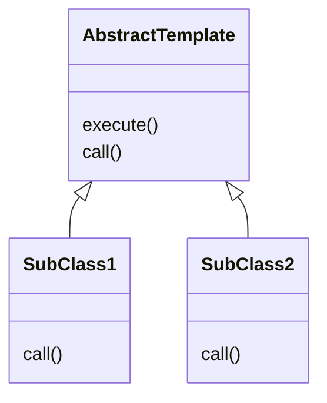
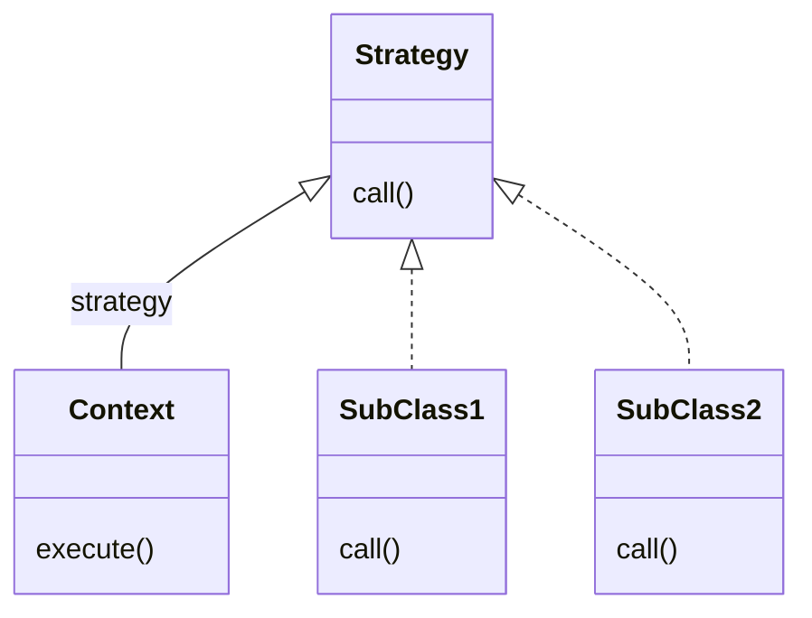

# 스프링 핵심 원리 - 고급편

## 목차

[TOC]

# 예제: 로그 추적기

## 요구사항

- 현재 운영중인 거대 프로젝트에서
- 모든 `public` 메서드의 호출과 응답 정보를 로그로 출력
- 애플리케이션의 흐름을 변경해선 안 됨(비즈니스 로직의 동작은 그대로)
- 메서드 호출에 걸린 시간
- 정상 흐름과 예외 흐름 구분
  - 예외 발생시 예외 정보가 남아야 함
- 메서드 호출의 깊이 표현
- HTTP 요청을 구분
  - HTTP 요청 단위로 ID를 남겨서 어떤 요청에서 시작된 것인지 구별 가능해야
  - 트랜잭션 ID: 여기서는 하나의 HTTP 요청이 발생하여 끝날 때 까지를 하나의 트랜잭션이라 함

- **번외**
  - 실제 상황이라면, 모니터링 툴을 사용하여 다수의 요구사항이 해결 가능
  - 로깅이라서 더 잘 기록되는 정보가 있기도 함


## 프로토타입 구현: V1

- `TraceId`

  ```java
  public class TraceId {
  
  	private String id;
  	private int level;
  
  	public TraceId() {
  		this.id = createId();
  		this.level = 0;
  	}
  
  	public TraceId(String id, int level) {
  		this.id = id;
  		this.level = level;
  	}
  
  	private String createId() {
  		return UUID.randomUUID().toString().substring(0, 8);
  	}
  
  	public TraceId createNextId() {
  		return new TraceId(id, level + 1);
  	}
  
  	public TraceId createPreviousId() {
  		return new TraceId(id, level - 1);
  	}
  
  	public boolean isFirstLevel() {
  		return this.level == 0;
  	}
  
  	... getter
  }
  ```

- `TraceStatus`

  ```java
  public class TraceStatus {
  
  	private TraceId traceId;
  	private Long startTimeMs;
  	private String message;
  
  	public TraceStatus(TraceId traceId, Long startTimeMs, String message) {
  		this.traceId = traceId;
  		this.startTimeMs = startTimeMs;
  		this.message = message;
  	}
      ...getter
  }
  ```

- `HelloTraceV1`

  ```java
  @Slf4j
  @Component
  public class HelloTraceV1 {
  
  	private static final String START_PREFIX = "-->";
  	private static final String COMPLETE_PREFIX = "<--";
  	private static final String EX_PREFIX = "<X-";
  
  	public TraceStatus begin(String message) {
  		TraceId traceId = new TraceId();
  		Long startTimeMs = System.currentTimeMillis();
  		log.info("[{}] {}{}", traceId.getId(), addSpace(START_PREFIX, traceId.getLevel()), message);
  		return new TraceStatus(traceId, startTimeMs, message);
  	}
  
  	public void end(TraceStatus status) {
  		complete(status, null);
  	}
  
  	public void exception(TraceStatus status, Exception e) {
  		complete(status, e);
  	}
  
  	private void complete(TraceStatus status, Exception e) {
  		Long stopTimeMs = System.currentTimeMillis();
  		long resultTimeMs = stopTimeMs - status.getStartTimeMs();
  		TraceId traceId = status.getTraceId();
  		if (e == null) {
  			log.info("[{}] {}{} time={}ms", traceId.getId(), addSpace(COMPLETE_PREFIX, traceId.getLevel()), status.getMessage(), resultTimeMs);
  		}
  		else {
  			log.info("[{}] {}{} time={}ms ex={}", traceId.getId(), addSpace(COMPLETE_PREFIX, traceId.getLevel()), status.getMessage(), resultTimeMs, e.toString());
  		}
  	}
  
  	private static String addSpace(String prefix, int level) {
  		StringBuilder sb = new StringBuilder();
  		for (int i = 0; i < level; i++) {
  			sb.append((i == level -1) ? "|" + prefix : "|	");
  		}
  		return sb.toString();
  	}
  }
  ```

  

### 적용

- 컨트롤러 적용

  ```java
  @RestController
  @RequiredArgsConstructor
  public class OrderControllerV1 {
  
  	private final OrderServiceV1 orderService;
  	private final HelloTraceV1 trace;
  
  	@GetMapping("/v1/request")
  	public String request(String itemId) {
  		TraceStatus status = null;
  		try {
  			status = trace.begin("OrderController.request()");
  			orderService.orderItem(itemId);
  			trace.end(status);
  			return "ok";
  		} catch(Exception e) {
  			trace.exception(status, e);
  			throw e;
  		}
  	}
  }
  ```


## V2: 파라미터로 동기화 개발

- `HelloTraceV2`

  ```java
  	public TraceStatus beginSync(TraceId beforeTraceId, String message) {
  		TraceId traceId = beforeTraceId.createNextId();
  		Long startTimeMs = System.currentTimeMillis();
  		log.info("[{}] {}{}", traceId.getId(), addSpace(START_PREFIX, traceId.getLevel()), message);
  		return new TraceStatus(traceId, startTimeMs, message);
  	}
  ```

  - `TraceId`를 넘겨주는 방식 추가


### 적용

- 컨트롤러 코드

  ```java
  	@GetMapping("/v2/request")
  	public String request(String itemId) {
  		TraceStatus status = null;
  		try {
  			status = trace.begin("OrderController.request()");
  			orderService.orderItem(status.getTraceId(), itemId);
  			trace.end(status);
  			return "ok";
  		} catch (Exception e) {
  			trace.exception(status, e);
  			throw e;
  		}
  	}
  ```

- 서비스 코드

  ```java
  	public void orderItem(TraceId traceId, String orderId) {
  		TraceStatus status = null;
  		try {
  			status = trace.beginSync(traceId, "OrderService.orderItem()");
  			orderRepository.save(status.getTraceId(), orderId);
  			trace.end(status);
  		} catch(Exception e) {
  			trace.exception(status, e);
  			throw e;
  		}
  	}
  ```

- `TraceId`를 메서드 호출 시 인자로 같이 넘겨주는 방식


## 정리: 남은 문제들

- 모든 메서드 인자에 `TraceId`를 넘겨줘야 함
  - 모든 파라미터, 경우에 따라 인터페이스까지 수정해야 함
- 로그를 처음 시작할 때는 `begin()`을, 아닐 때는 `beginSync()`를 호출해줘야 함
  - 컨트롤러가 아닌 곳에서 서비스 호출이 발생할 경우 파라미터로 넘길 `TraceId`가 없음


# 쓰레드 로컬 - Thread Local

## 필드 동기화

- 로그 추적기 구현 중에 `TraceId`를 동기화해야 했음

  - 파라미터로 넘기는 방식은
    일일히 파라미터를 넘겨야 하는 문제가 발생했음

- `FieldLogTrace`

  ```java
  @Slf4j
  public class FieldLogTrace implements LogTrace {
  
  	...
      
  	private TraceId traceIdHolder;    //traceId 동기화, 동시성 이슈 발생
  
      ...
          
  	private void syncTraceId() {
  		if (traceIdHolder == null) {
  			traceIdHolder = new TraceId();
  		} else {
  			traceIdHolder = traceIdHolder.createNextId();
  		}
  	}
  
      ...
          
  	private void releaseTraceId() {
  		if (traceIdHolder.isFirstLevel()) {
  			traceIdHolder = null;
  		} else {
  			traceIdHolder = traceIdHolder.createPreviousId();
  		}
  	}
  
      ...
  }
  ```


#### 동시성 문제

- `FieldLogTrace`는 싱글톤 스프링 빈
  - 해당 인스턴스의 동일 필드에 여러 쓰레드가 동시 접근하기에 문제 발생

- 예제 코드

  - SUT: `FieldService`

    ```java
    @Slf4j
    public class FieldService {
    
    	private String nameStore;
    
    	public String logic(String name) {
    		log.info("저장 name={} -> nameStore={}", name, nameStore);
    		nameStore = name;
    		sleep(1000);
    		log.info("조회 nameStore={}", nameStore);
    		return nameStore;
    	}
    
    	private void sleep(int millis) {
    		try {
    			Thread.sleep(millis);
    		} catch (InterruptedException e) {
    			e.printStackTrace();
    		}
    	}
    }
    ```

  - 테스트 코드

    ```java
    @Slf4j
    public class FieldServiceTest {
    
    	private FieldService fieldService = new FieldService();
    
    	@Test
    	void field() {
    		log.info("main Start");
    		Runnable userA = () -> {
    			fieldService.logic("userA");
    		};
    		Runnable userB = () -> {
    			fieldService.logic("userB");
    		};
    
    		Thread threadA = new Thread(userA);
    		threadA.setName("thread-A");
    		Thread threadB = new Thread(userB);
    		threadB.setName("thread-B");
    
    		threadA.start();
    		// sleep(2000);	//동시성 문제 발생하지 않음
    		sleep(100);	//동시성 문제 발생
    		threadB.start();
    
    		//threadB가 도는 중에 메인이 닫힐 수 있기에
    		sleep(3000);	//제대로 만들고 싶다면 countDownLatch 참고
    		log.info("main exit");
    	}
    
    	private void sleep(int millis) {
    		try {
    			Thread.sleep(millis);
    		} catch (InterruptedException e) {
    			e.printStackTrace();
    		}
    	}
    }
    ```

- 동시성 문제

  - 트래픽이 많아질수록 자주 발생
  - **스프링 빈처럼 싱글톤 객체의 필드를 변경하며 사용시에 특히 위험!**
  - `static` 영역, 인스턴스 필드에서 발생
  - 동시성 문제는 값을 읽기만 하면 발생하지 않음

- 싱글톤 객체의 필드를 사용하면서 동시성 문제를 해결하는 방법: **쓰레드 로컬**


## 쓰레드 로컬

- 쓰레드 로컬(ThreadLocal)
  - 해당 쓰레드만 접근 가능한 특별한 저장소
  - 같은 인스턴스의 쓰레드 로컬 필드에 접근해도 동시성 문제 없음
  - 자바에서 `java.lang.ThreadLocal`을 제공

- 기존의 `FieldService`에 적용해보기

  ```java
  @Slf4j
  public class ThreadLocalService {
  
  	private ThreadLocal<String> nameStore = new ThreadLocal<>();
  
  	public String logic(String name) {
  		log.info("저장 name={} -> nameStore={}", name, nameStore.get());
  		nameStore.set(name);
  		sleep(1000);
  		log.info("조회 nameStore={}", nameStore);
  		return nameStore.get();
  	}
  
  	private void sleep(int millis) {
  		try {
  			Thread.sleep(millis);
  		} catch (InterruptedException e) {
  			e.printStackTrace();
  		}
  	}
  }
  ```

- `ThreadLocal` 사용법

  - 값 저장: `ThreadLocal.set(xxx)`
  - 값 조회: `ThreadLocal.get()`
  - 값 제거: `ThreadLocal.remove()`

- **주의사항**
  - **해당 쓰레드가 쓰레드 로컬을 모두 사용하고 난 후 `remove()` 이용해서 꼭 제거해주자!**
- **`remove()` 하지 않을 경우 문제점**
  - WAS(톰캣)처럼 쓰레드 풀을 사용하는 경우 문제 발생 가능
  - 기존 사용자가 사용이 끝나고 쓰레드를 반납한 후에도 해당 쓰레드에 정보가 남아서,
    다른 사용자에게 해당 쓰레드를 할당될 때도 그 데이터가 남게 됨


# 템플릿 메서드 패턴과 콜백 패턴

## 템플릿 메서드 패턴

### 필요성

- 지금까지 만든 로그 추적기를 적용하면 코드가 다음과 같은 형태가 됨

  ```java
  	public void orderItem(TraceId traceId, String orderId) {
  		TraceStatus status = null;
  		try {
  			status = trace.beginSync(traceId, "OrderService.orderItem()");
  			orderRepository.save(status.getTraceId(), orderId);
  			trace.end(status);
  		} catch(Exception e) {
  			trace.exception(status, e);
  			throw e;
  		}
  	}
  ```

  - 핵심 비즈니스 로직 외에 로그 출력 부가 기능 코드가 섞이게 되는 문제 발생

- **핵심 기능 vs 부가 기능**

  - 핵심 기능은 해당 객체 고유의 기능
  - 부가 기능은 핵심 기능을 보조하기 위한 기능
  - 부가 기능을 분리해야 함
    - 핵심 기능을 오염시키지 않기 위해
    - 부가 기능은 보통 공통 적용 코드인데, 적용 지점마다 일일히 코드를 작성하는 것은
      - 생산성이 떨어지며
      - 관리가 힘들어지기 때문
    - **변하는 것(핵심 기능)과 변하지 않는 것(부가 기능)을 분리해야 한다!
      -> 템플릿 메서드 패턴을 이용하여 분리 가능**


### 구조 및 예제



- 예시

  - 아래와 같은 코드를

    ```java
    	void logic1() {
    		long startTime = System.currentTimeMillis();
    		//비즈니스 로직 실행
    		log.info("비즈니스 로직1 실행");
    		//비즈니스 로직 종료
    		long endTime = System.currentTimeMillis();
    		long resultTime = endTime - startTime;
    		log.info("resultTime={}", resultTime);
    	}
    
    	void logic2() {
    		long startTime = System.currentTimeMillis();
    		//비즈니스 로직 실행
    		log.info("비즈니스 로직2 실행");
    		//비즈니스 로직 종료
    		long endTime = System.currentTimeMillis();
    		long resultTime = endTime - startTime;
    		log.info("resultTime={}", resultTime);
    	}
    ```

  - 다음과 같이 템플릿 메서드 패턴 사용하여 관심사 분리가 가능

    ```java
    @Slf4j
    public abstract class AbstractTemplate {
    
    	private void execute() {
    		long startTime = System.currentTimeMillis();
    		//비즈니스 로직 실행
    		call();	//하위 클래스에서 재정의
    		//비즈니스 로직 종료
    		long endTime = System.currentTimeMillis();
    		long resultTime = endTime - startTime;
    		log.info("resultTime={}", resultTime);
    	}
    
    	protected abstract void call();
    }
    ```

    ```java
    @Slf4j
    public class SubClassLogic1 extends AbstractTemplate {
    	@Override
    	protected void call() {
    		log.info("비즈니스 로직1 실행");
    	}
    }
    ```


### 익명 내부 클래스 사용

- 템플릿 메서드 패턴 사용 시 하위 구현 클래스를 계속 만들어야 하는 번거로움이 있음
- 익명 내부 클래스를 사용하여 위 단점 보완


### 적용

- 템플릿 구현

  ```java
  @RequiredArgsConstructor
  public abstract class AbstractTemplate<T> {
  
  	private final LogTrace trace;
  
  	public T execute(String message) {
  		TraceStatus status = null;
  		try {
  			status = trace.begin(message);
  
  			//로직 호출
  			T result = call();
  
  			trace.end(status);
  			return result;
  		} catch (Exception e) {
  			trace.exception(status, e);
  			throw e;
  		}
  	}
  
  	protected abstract T call();
  }
  ```

- 컨트롤러 코드

  ```java
  @RestController
  @RequiredArgsConstructor
  public class OrderControllerV4 {
  
  	private final OrderServiceV4 orderService;
  	private final LogTrace trace;
  
  	@GetMapping("/v4/request")
  	public String request(String itemId) {
  
  		AbstractTemplate<String> template = new AbstractTemplate<>(trace) {
  			@Override
  			protected String call() {
  				orderService.orderItem(itemId);
  				return "ok";
  			}
  		};
  		return template.execute("OrderController.request()");
  	}
  }
  ```

- 서비스 코드

  ```java
  @Service
  @RequiredArgsConstructor
  public class OrderServiceV4 {
  
  	private final OrderRepositoryV4 orderRepository;
  	private final LogTrace trace;
  
  	public void orderItem(String orderId) {
  		AbstractTemplate<Void> template = new AbstractTemplate<>(trace) {
  			@Override
  			protected Void call() {
  				orderRepository.save(orderId);
  				return null;
  			}
  		};
  		template.execute("OrderService.orderItem()");
  	}
  }
  ```

  - 리턴 타입을 `Void`로 준 것에 유의하자!
    - 자바 언어의 한계로 오버라이드한 `call()`메서드는 `return null` 해야함

- 적용해보면, 정상 작동함을 볼 수 있음
- 핵심 로직과 부가 기능을 분리했음
- 좋은 설계의 요소를 갖춤
  - 변경점을 모아서 모듈화
  - 변경이 발생한다 해도 핵심 기능과 부가 기능의 변경이 서로를 침범하지 않음
  - SRP를 지킴
    - 변경이 발생했을 때 SRP를 잘 지켰는가가 드러나게 됨


### 정의

- GoF의 디자인 패턴에서 언급

> 템플릿 메서드 패턴의 목적은 다음과 같다.
>
> 작업에서 알고리즘의 골격을 정의하고, 일부 단계를 하위 클래스로 연기하여, 하위 클래스가 알고리즘의 구조를 변경하지 않고도 알고리즘의 특정 단계를 재정의할 수 있게끔 한다.

- **단점**
  - 상속을 사용하기에, 상속으로 인한 문제점을 고스란히 안고 감
  - 자식 클래스가 부모 클래스의 컴파일 시점에 강하게 결합하는 문제가 대표적
    - 자식 클래스가 부모 클래스에 강하게 의존한다는 것
    - 클래스 다이어그램의 화살표는 상속을 의미하기도 하지만, 동시에 의존을 드러내기도 함
  - 자식 클래스 입장에서, 부모 클래스의 기능을 전혀 사용하지 않음에도, 자식 클래스는 부모 클래스의 메서드를 모두 상속받고 있음
  - 별도의 클래스나 익명 내부 클래스를 만들어야 하는 복잡함
- 위와 같은 단점을 보완하기 위해서 전략 패턴을 고려해볼 수 있음


## 전략 패턴



- 상속(템플릿 메서드 패턴)이 아니라 위임으로 문제를 해결

  - 변하지 않는 부분은 `Context`에, 변하는 부분을 `Strategy` 인터페이스에 둠

- 전략 패턴의 의도(GoF)

  > 알고리즘 제품군을 정의하고 각각을 캡슐화하여 상호 교환 가능하게 만든다. 전략을 사용하면 알고리즘을 사용하는 클라이언트와 별개로 알고리즘을 변경할 수 있다.


### 전략을 필드에 주입하는 방식

#### 예시 코드

- `Strategy`

  ```java
  public interface Strategy {
  	void call();
  }
  ```

  ```java
  @Slf4j
  public class StrategyLogic1 implements Strategy{
  	@Override
  	public void call() {
  		log.info("비즈니스 로직1 실행");
  	}
  }
  ```

- `ContextV1`

  ```java
  @Slf4j
  public class ContextV1 {
  
  	private Strategy strategy;
  
  	public ContextV1(Strategy strategy) {
  		this.strategy = strategy;
  	}
  
  	public void execute() {
  		long startTime = System.currentTimeMillis();
  		//비즈니스 로직 실행
  		strategy.call();
  		//비즈니스 로직 종료
  		long endTime = System.currentTimeMillis();
  		long resultTime = startTime - endTime;
  		log.info("resultTime={}", resultTime);
  	}
  }
  ```

  - 전략을 의존성 주입 받음
  - `Context`는 `Strategy` 인터페이스를 보고 있기 때문에 구현체 변경이 유연함
    - 스프링 의존성 주입 방식


#### 익명 내부 클래스 사용

- 이 경우에는 람다로 대체하면 코드 길이를 줄이고 가독성을 높일 수 있음

- 선 조립, 후 실행

  ```java
  	@Test
  	void strategyV4() {
  		ContextV1 context1 = new ContextV1(() -> log.info("비즈니스 로직1 실행"));
  		context1.execute();
  		ContextV1 context2 = new ContextV1(() -> log.info("비즈니스 로직2 실행"));
  		context1.execute();
  	}
  
  ```

  - 실행 전에 한 번 조립해두면, 다음 부터는 그냥 실행만 하면 되기에 편리함
  - 스프링 애플리케이션 로딩 시점에 의존관계가 모두 맺어두고, 이후 요청 처리하는 것과 같은 원리
  - **한 번 조립한 이후에는 전략을 변경하기가 어렵다는 단점이 있음**
    **setter 사용한 변경 등을 시도할 수는 있으나, 싱글톤과 겹치면 동시성 이슈가 발생할 수 있음**
    - **전략을 실시간으로 변경하고 싶다면 그냥 `Context`를 새로 생성하고 그때마다 주입하는 것이 나을 수 있음**


### 전략을 파라미터로 전달하는 방식

- `ContextV2`

  ```java
  @Slf4j
  public class ContextV2 {
  
  	public void execute(Strategy strategy) {
  		long startTime = System.currentTimeMillis();
  		//비즈니스 로직 실행
  		strategy.call();
  		//비즈니스 로직 종료
  		long endTime = System.currentTimeMillis();
  		long resultTime = startTime - endTime;
  		log.info("resultTime={}", resultTime);
  	}
  }
  ```

- 선조립 후 실행이 아니라, 실행시마다 컨텍스트를 파라미터로 받음

- 전략을 유연하게 변경할 수 있다는 장점

- 실행 시마다 파라미터를 전달해줘야 한다는 점에서 V1에 비해서 불편함

- 상황에 따라 적절한 방식을 선택해야
  - 현재 개발중인 로그 추적기의 경우 실행 시에 유연하게 로직을 변형하는 것이 중요하기에 V2의 방식이 적합

- **번외: 디자인패턴**
  - 디자인 패턴의 구조도 중요하지만
  - 더 중요한 것은 디자인 패턴의 의도(indent)다!
  - 구조만 본다면 많은 디자인 패턴이 다를 바가 없음


## 템플릿 콜백 패턴

- 콜백(callback), 혹은 콜애프터 함수(call-after function)
  - 위의 전략 패턴의 `Strategy`처럼 다른 코드의 인수로 넘겨주는 실행 가능한 코드
  - 다른 코드의 인수로서 넘겨주는 실행 가능한 코드
  - 콜백을 넘겨받는 코드는 해당 콜백을 필요에 따라 즉시 실행할 수도, 나중에 실행할 수도 있음
    - 콜백 함수는 해당 함수가 실행(`call`)되지만, 해당 함수를 넘겨준 곳(클라이언트)의 뒤(`back`)에서 실행된다는 것
    - 위의 예시에서는, `Strategy`의 함수는 `Context`의 뒤에서 실행된다.
- 자바의 콜백
  - 실행 가능한 코드를 인수로 넘기려면 객체가 필요
  - 자바8 이전에는 익명 내부 클래스, 자바8 이후에는 람다 사용

- **템플릿 콜백 패턴**
  - 스프링에서는 위의 `ContextV2`와 같은 형태의 전략 패턴을 템플릿 콜백 패턴이라고 부름(GoF의 디자인 패턴은 아님)
  - 스프링은 `JdbcTemplate`, `RestTemplate`, `TransactionTemplate`, `RedisTemplate` 등 다양한 곳에서 템플릿 콜백 패턴을 사용


### 적용

- 템플릿과 콜백 인터페이스 코드

  ```java
  @FunctionalInterface
  public interface TraceCallBack<T> {
  	T call();
  }
  ```

  ```java
  RequiredArgsConstructor
  public class TraceTemplate {
  
  	private final LogTrace trace;
  
  	public <T> T execute(String message, TraceCallBack<T> callBack) {
  		TraceStatus status = null;
  		try {
  			status = trace.begin(message);
  
  			//로직 호출
  			T result = callBack.call();
  
  			trace.end(status);
  			return result;
  		} catch (Exception e) {
  			trace.exception(status, e);
  			throw e;
  		}
  	}
  }
  ```

- 컨트롤러 코드

  ```java
  @RestController
  public class OrderControllerV5 {
  
  	private final OrderServiceV5 orderService;
  	private final TraceTemplate template;
  	private final LogTrace trace;
  
  	public OrderControllerV5(OrderServiceV5 orderService, LogTrace trace) {
  		this.orderService = orderService;
  		this.trace = trace;
  		this.template = new TraceTemplate(trace);
  	}
  
  	@GetMapping("/v5/request")
  	public String request(String itemId) {
  		return template.execute("OrderController.request", () -> {
  			orderService.orderItem(itemId);
  			return "ok";
  		});
  	}
  }
  ```

  - `@RequiredArgsConstructor`를 제거하고, `trace` 인자를 이용하여 `template` 생성해줬음
    - 이 방식의 경우 테스트 시에 `TraceTemplate`를 세팅하지 않아도 됨
  - 물론 스프링 빈으로 `TraceTemplate`을 등록해도 됨
    - 스프링 빈이 객체를 덜 생성하기는 하지만,
      성능에 크게 영향을 줄 정도는 아님
    - 테스트 용이성이과 약간의 성능 문제의 트레이드 오프를 따져서 스스로 결정하면 됨


## 한계

- 코드 상으로 최대한 최적화를 해 봤지만
- 여전히 로그 추적기를 적용하기 위해서 원본 코드를 조금이나마 수정해야 한다는 한계가 남아 있음


# 프록시 패턴과 데코레이터 패턴

## 예제 세팅

- 예제: 3가지 버전
  - V1: 인터페이스와 구현 클래스 - 스프링 빈으로 수동 등록
  - V2: 인터페이스 없는 구체 클래스 - 스프링 빈으로 수동 등록
  - V3: 컴포넌트 스캔으로 스프링 빈 자동등록
- 실무에서는 위와 같이 다양한 방식으로 스프링 빈을 등록하기에 각각의 경우에 대해 프록시를 적용해볼 것임


### V1: 인터페이스와 구현 클래스 - 스프링 빈으로 수동 등록

- 컨트롤러

  ```java
  @RequestMapping	//스프링은 @Controller 또는 @RequestMapping 있어야 스프링 컨트롤러로 인식함
  @ResponseBody
  public interface OrderControllerV1 {
  
  	@GetMapping("/v1/request")
  	String request(@RequestParam("itemId") String itemId);
  
  	@GetMapping("/v1/no-log")
  	String noLog();
  }
  ```

  - `@RequestMapping`
    - 스프링 MVC는 `@Controller` 혹은 `@RequestMapping` 있어야 스프링 컨트롤러로 인식
    - 스프링 컨트롤러로 인식해야 HTTP URL 매핑되고, 동작함
    - 인터페이스에 사용 가능한 애노테이션
    - `@Controller`와 다르게 컴포넌트 스캔의 대상이 되지 않음
  - 인터페이스에 `@RequestParam("itemId")` 사용
    - 특정 자바 버전에서는 인터페이스에 위 애노테이션에 명칭(위에서는 `itemId`) 주지 않으면
      인식되지 않는 문제 발생


### V2: 인터페이스 없는 구체 클래스 - 스프링 빈으로 수동 등록

### V3: 컴포넌트 스캔으로 스프링 빈 자동 등록


### 요구사항 추가

- 원본 코드를 수정하지 않고 로그 추적기를 적용
- 특정 메서드는 로그를 출력하지 않음
- V1, V2, V3 모두에 적용 가능해야 함


## 프록시, 프록시 패턴, 데코레이터 패턴 - 소개

### 프록시

- **클라이언트와 서버**

  ```mermaid
  flowchart LR
  A(Client) ----> B(Server)
  ```

  - 단순히 서버 컴퓨터에만 해당하지 않음
  - **클라이언트는 서버에 필요한 것을 요청, 서버는 클라이언트의 요청을 처리하는 구조**
  - 예시
    - 컴퓨터 네트워크: 클라이언트(웹 브라우저) -> 서버(웹 서버)
    - 객체지향 프로그래밍: 클라이언트(요청하는 객체) -> 서버(처리하는 객체)

- **직접 호출과 간접 호출**

  ```mermaid
  flowchart LR
  A(Client) --직접 호출--> B(Server) 
  ```

  ```mermaid
  flowchart LR
  A(Client) --간접 호출-->C(Proxy) --> B(Server)
  ```

  - **간접 호출**
    - 클라이언트가 서버에 직접 요청하지 않고, 대리자를 통해 간접적으로 서버를 요청
    - 이 대리자를 **프록시(Proxy)**라 함

- **객체에서 프록시의 대체 가능**

  - 클라이언트는 서버에게 요청한 것인지(직접 호출), 프록시에게 요청한 것인지 몰라야 함

  - 때문에 서버와 프록시가 같은 인터페이스를 사용해야 함

    ```mermaid
    flowchart LR
    A(Client) --> 클래스의존관계
    subgraph 클래스의존관계
    direction BT
    	B(ServerInterface)
    	C(Proxy) --> B
    	D(Server) --> B
    end
    ```

  - 클라이언트는 인터페이스인(`ServerInterface`)에만 의존하기에 DI 이용한 대체 가능


#### 프록시의 주요 기능

- **접근 제어**

  - 권한에 따른 접근 차단
  - 캐싱
  - 지연 로딩

- **부가 기능 추가**

  - 원래 서버의 기능 + a

  - 예시
    - 요청 / 응답 값을 중간에 변경
    - 실행 시간을 측정하여 로그를 남김

- 프록시 체인

  ```mermaid
  flowchart LR
  A(Client) --간접 호출-->C(Proxy1) --프록시 체인--> D(Proxy2) --> B(Server)
  ```

  - 클라이언트는 대리자를 통해 요청했기 때문에 그 이후 과정(프록시 체인 등)에 대해 모름
  - 클라이언트 입장에서는 요청한 대리자를 통해 요청 결과가 자신에게 도착하기만 하면 됨


### 프록시 패턴과 데코레이터 패턴

- GoF는 프록시를 사용하는 패턴을 의도에 따라 둘로 나눔
  - 프록시 패턴: 접근 제어가 목적
  - 데코레이터 패턴: 기능 추가가 목적


## 예제 - 패턴 적용

### 프록시 패턴

- 코드

  - 원본

    ```java
    @Slf4j
    public class RealSubject implements Subject {
    	@Override
    	public String operation() {
    		log.info("실제 객체 호출");
    		sleep(1000);
    		return "data";
    	}
    
    	private void sleep(int millis) {
    		try {
    			Thread.sleep(millis);
    		} catch (InterruptedException e) {
    			e.printStackTrace();
    		}
    	}
    }
    ```

  - 프록시

    ```java
    @Slf4j
    public class CacheProxy implements Subject {
    
    	private Subject target;
    	private String cacheValue;
    
    	public CacheProxy(Subject target) {
    		this.target = target;
    	}
    
    	@Override
    	public String operation() {
    		log.info("프록시 호출");
    		if (cacheValue == null) {
    			cacheValue = target.operation();
    		}
    		return cacheValue;
    	}
    }
    ```


### 데코레이터 패턴

- 코드

  - 원본

    ```java
    @Slf4j
    public class RealComponent implements Component {
    	@Override
    	public String operation() {
    		log.info("RealComponent 실행");
    		return "data";
    	}
    }

  - 데코레이터1

    ````java
    @Slf4j
    public class MessageDecorator implements Component {
    
    	private Component component;
    
    	public MessageDecorator(Component component) {
    		this.component = component;
    	}
    
    	@Override
    	public String operation() {
    		log.info("MessageDecorator 실행");
    		String result = component.operation();
    		String decoratedResult = "*****" + result + "*****";
    		log.info("적용 전={}, 적용 후={}", result, decoratedResult);
    		return decoratedResult;
    	}
    }
    ````

  - 프록시 체이닝을 위한 데코레이터2

    ```java
    @Slf4j
    public class TimeDecorator implements Component {
    	private Component component;
    
    	public TimeDecorator(Component component) {
    		this.component = component;
    	}
    
    	@Override
    	public String operation() {
    		log.info("TimeDecorator 실행");
    		long startTime = System.currentTimeMillis();
    
    		String result = component.operation();
    
    		long endTime = System.currentTimeMillis();
    		long resultTime = startTime - endTime;
    		log.info("TimeDecorator 종료 resultTime={}ms", resultTime);
    		return null;
    	}
    }
    ```

### 정리

- 데코레이터 패턴의 경우 공통적으로 호출 대상인 `component` 가지고 있어야 함
- 중복을 없애기 위해 `component`를 속성으로 가진 추상 클래스(`Decorator`)를 만드는 것도 가능 
  - 이 경우 클래스 다이어그램에서 실제 컴포넌트와 데코레이터를 명확하게 구별 가능

- 프록시 패턴과 데코레이터 패턴의 구별
  - 구조가 거의 같으며 경우에 따라 동일하기까지 함
  - 중요한 것은 패턴의 구조가 아니라 그 **패턴을 만든 의도임**
    - 프록시 패턴: **접근 제어**
    - 데코레이터 패턴: **객체에 추가 책임(기능)을 동적으로 추가**


## 로그 추적기에 적용

### 인터페이스 기반 - 수동 등록

- 프록시 구현체

  ```java
  @RequiredArgsConstructor
  public class OrderControllerInterfaceProxy implements OrderControllerV1 {
  
  	private final OrderControllerV1 target;
  	private final LogTrace logTrace;
  
  	@Override
  	public String request(String itemId) {
  		TraceStatus status = null;
  		try{
  			status = logTrace.begin("OrderController.request()");
  			String result = target.request(itemId);
  			logTrace.end(status);
  			return result;
  		} catch (Exception e) {
  			logTrace.exception(status, e);
  			throw e;
  		}
  	}
  
  	@Override
  	public String noLog() {
  		return target.noLog();
  	}
  }
  ```

- 설정

  ```java
  @Configuration
  public class InterfaceProxyConfig {
  
  	@Bean
  	public OrderControllerV1 orderController(LogTrace logTrace) {
  		return new OrderControllerInterfaceProxy(
  			new OrderControllerV1Impl(orderService()), logTrace);
  	}
  
  	@Bean
  	public OrderServiceV1 orderService(LogTrace logTrace) {
  		return new OrderServiceInterfaceProxy(
  			new OrderServiceV1Impl(orderRepository()), logTrace);
  	}
  
  	@Bean
  	public OrderRepositoryV1 orderRepository(LogTrace logTrace) {
  		return new OrderRepositoryInterfaceProxy(
  			new OrderRepositoryImplV1(), logTrace);
  	}
  }
  ```

  - 프록시를 반환하고 있다는 점에 유의해야 함

- **스프링 빈으로 프록시가 등록되게 됨**
  
  - 실제 객체는 프록시 객체의 참조 대상이 될 뿐임
  - 프록시 객체와 실제 객체 모두 자바 힙 메모리에 올라가지만, 스프링 컨테이너의 관리 대상이 되는 것은 프록시 객체뿐이다.


### 구체 클래스 기반 - 수동 등록

- 원리

  - 인터페이스를 사용하지 않기에 상속을 이용하여 프록시를 만듦

  - `TimeProxy` - 구체 클래스 기반 프록시

    ```java
    @Slf4j
    public class TimeProxy extends ConcreteLogic {
    
    	private ConcreteLogic concreteLogic;
    
    	public TimeProxy(ConcreteLogic concreteLogic) {
    		this.concreteLogic = concreteLogic;
    	}
    
    	@Override
    	public String operation() {
    		log.info("TimeDecorator 실행");
    		long startTime = System.currentTimeMillis();
    
    		String result = concreteLogic.operation();
    
    		long endTime = System.currentTimeMillis();
    		long resultTime = startTime - endTime;
    		log.info("TimeDecorator 종료 resultTime={}ms", resultTime);
    		return result;
    	}
    }
    ```


#### 적용

- 서비스 프록시 코드

  ```java
  public class OrderServiceConcreteProxy extends OrderServiceV2 {
  
  	private final OrderServiceV2 target;
  	private final LogTrace logTrace;
  
  	public OrderServiceConcreteProxy(OrderServiceV2 orderServiceV2,
  		LogTrace logTrace) {
  		super(null);
  		this.target = orderServiceV2;
  		this.logTrace = logTrace;
  	}
  
  	@Override
  	public void orderItem(String itemId) {
  		TraceStatus status = null;
  		try {
  			status = logTrace.begin("OrderService.orderItem()");
  			target.orderItem(itemId);
  			logTrace.end(status);
  		} catch (Exception e) {
  			logTrace.exception(status, e);
  			throw e;
  		}
  	}
  }
  ```

- **구체 클래스기반 프록시의 단점**

  - 위의 경우 자바 문법에 의해 부모 클래스의 생성자를 호출해야 하고,
    부모 클래스에 기본 생성자가 없기에 파라미터를 필수로 넘겨줘야 하는데,
    어차피 프록시는 부모 객체의 기능을 사용하지 않기에 `super(null)` 입력

- 설정 코드

  ```java
  @Configuration
  public class ConcreteProxyConfig {
  
  	@Bean
  	public OrderControllerV2 orderControllerV2(LogTrace logTrace) {
  		OrderControllerV2 controllerImpl = new OrderControllerV2(orderServiceV2(logTrace));
  		return new OrderControllerConcreteProxy(controllerImpl, logTrace);
  	}
  
  	@Bean
  	public OrderServiceV2 orderServiceV2(LogTrace logTrace) {
  		OrderServiceV2 serviceImpl = new OrderServiceV2(orderRepositoryV2(logTrace));
  		return new OrderServiceConcreteProxy(serviceImpl, logTrace);
  	}
  
  	@Bean
  	public OrderRepositoryV2 orderRepositoryV2(LogTrace logTrace) {
  		OrderRepositoryV2 repositoryImpl = new OrderRepositoryV2();
  		return new OrderRepositoryConcreteProxy(repositoryImpl, logTrace);
  	}
  }
  ```


### 인터페이스 기반 프록시와 클래스 기반 프록시

- 클래스 기반 프록시도 적용 가능하지만,
  - 클래스 기반 프록시의 경우 해당 클래스에만 적용할 수 있다는 제약이 있음
  - 부모 클래스의 생성자를 호출해야 함
  - 클래스에 `final` 키워드가 붙으면 사용 불가능
  - 메서드에 `final` 키워드가 붙으면 오버라이딩 불가능
- 인터페이스 기반 프록시가 더 좋지만, 코드 수가 늘어난다는 단점
  - 또, 캐스팅 관련하여 단점이 존재
- 문제 상황
  - 프록시를 도입해서 기존 코드를 변경하지 않을 수 있었지만, 
    지나치게 많은 프록시 클래스를 생성해야 했음
  - **동적 프록시 기술의 필요성**


# 동적 프록시 기술

- 프록시 기술을 적용할 경우 프록시 클래스를 일일히 많이 만들어줘야 함
- **프록시 객체의 동적 생성**으로 해결 가능
  - **JDK 동적 프록시 기술**(자바): **리플렉션**에 대한 이해 필요
  - **CGLIB**(오픈소스)


## 리플렉션

- 클래스나 메서드의 메타정보를 사용하여 호출하는 메서드를 동적으로 변경할 수 있음

  - 람다를 사용하여 호출 메서드를 변경할 수 있음

- 예시 코드

  ```java
  	@Test
  	void reflection1() throws Exception {
  		//클래스 정보
  		Class classHello = Class.forName("hello.proxy.jdkdynamic.ReflectionTest$Hello");
  
  		Hello target = new Hello();
  		//callA 메서드 정보
  		Method methodCallA = classHello.getMethod("callA");
  		Object result1 = methodCallA.invoke(target);
  		log.info("result1={}", result1);
  
  		//callB 메서드 정보
  		Method methodCallB = classHello.getMethod("callB");
  		Object result2 = methodCallB.invoke(target);
  		log.info("result2={}", result2);
  	}
  ```

  - 하드코딩된 메서드명을 인자로 넘겨주는 방식으로 추상화하면 다음과 같음

    ```java
    	@Test
    	void reflection1() throws Exception {
    		//클래스 정보
    		Class classHello = Class.forName("hello.proxy.jdkdynamic.ReflectionTest$Hello");
    
    		Hello target = new Hello();
    		//callA 메서드 정보
    		Method methodCallA = classHello.getMethod("callA");
    		dynamicCall(methodCallA, target);
    
    		//callB 메서드 정보
    		Method methodCallB = classHello.getMethod("callB");
    		dynamicCall(methodCallB, target);
    	}
    
    	private void dynamicCall(Method method, Object target) throws InvocationTargetException, IllegalAccessException {
    		log.info("start");
    		Object result1 = method.invoke(target);
    		log.info("result1={}", result1);
    	}
    ```

- **주의사항: 리플렉션은 가급적 쓰지 말자**

  - 리플렉션은 런타임에 동작하기에 컴파일 시점에 에러를 잡을 수 없음
  - 리플렉션은 다음과 같을 때만 부분적으로, 또 주의해서 사용해야 함!
    - 프레임워크 개발
    - 매우 일반적인 공통 처리가 필요할 때


## JDK 동적 프록시

- **JDK 동적 프록시는 인터페이스 기반이기에 인터페이스 필수**

- 코드

  ```java
  @Slf4j
  public class TimeInvocationHandler implements InvocationHandler {
  
  	private final Object target;
  
  	public TimeInvocationHandler(Object target) {
  		this.target = target;
  	}
  
  	@Override
  	public Object invoke(Object proxy, Method method, Object[] args) throws Throwable {
  		log.info("TimeProxy 실행");
  		long startTime = System.currentTimeMillis();
  		Object result = method.invoke(target, args);
  		long endTime = System.currentTimeMillis();
  		long resultTime = endTime - startTime;
  
  		log.info("TimeProxy 종료 resultTime={}", resultTime);
  
  		return result;
  	}
  }
  ```

  - `InvocationHandler`를 구현해야 함

- 사용

  ```java
  @Slf4j
  public class JdkDynamicProxyTest {
  
  	@Test
  	void dynamicA() {
  		AInterface target = new AImpl();
  
  		TimeInvocationHandler handler = new TimeInvocationHandler(target);
  
  		AInterface proxy = (AInterface)Proxy.newProxyInstance
  			(AInterface.class.getClassLoader(), new Class[] {AInterface.class}, handler);
  		
  		proxy.call();
  		log.info("targetClass={}", target.getClass());
  		log.info("proxyClass={}", proxy.getClass());
  	}
  }
  ```

- 실행 흐름
  - 클라이언트는 JDK 동적 프록시의 `call()` 실행
  - 동적 프록시는 `InvocationHandler.invoke()` 호출
  - `TimeInvocationHandler`가 내부 로직을 수행 후, `method.invoke()` 호출하여 
    실제 객체인 `target`을 호출
  - 실제 객체의 `call()`이 실행됨


### 적용

- `LogTraceBasicHandler`

  ```java
  public class LogTraceBasicHandler implements InvocationHandler {
  
  	private final Object target;
  	private final LogTrace logTrace;
  
  	public LogTraceBasicHandler(Object target, LogTrace logTrace) {
  		this.target = target;
  		this.logTrace = logTrace;
  	}
  
  	@Override
  	public Object invoke(Object proxy, Method method, Object[] args) throws Throwable {
  		TraceStatus status = null;
  		try{
  			String message = method.getDeclaringClass().getSimpleName() + "." + method.getName() + "()";
  			status = logTrace.begin(message);
  
  			Object result = method.invoke(target, args);
  			logTrace.end(status);
  			return result;
  		} catch (Exception e) {
  			logTrace.exception(status, e);
  			throw e;
  		}
  	}
  }
  ```

  - 메서드에서 메타데이터를 꺼내 메시지를 생성하였음

- 설정

  ```java
  @Configuration
  public class DynamicProxyBasicConfig {
  
  	@Bean
  	public OrderControllerV1 orderControllerV1(LogTrace logTrace) {
  		OrderControllerV1 target = new OrderControllerV1Impl(orderServiceV1(logTrace));
  		OrderControllerV1 proxy = (OrderControllerV1)Proxy.newProxyInstance(
  			OrderControllerV1.class.getClassLoader(), new Class[] {OrderControllerV1.class},
  			new LogTraceBasicHandler(target, logTrace));
  		return proxy;
  	}
  	...
  }
  ```

  - 각 `Handler`는 별개의 인스턴스 생성: DI받는 `target`이 각각 다르니까

- 문제 상황
  - 로그를 출력하지 않는 메서드가 호출되는 경우에도 로그 추적기(프록시)가 적용되었음


### 특정 경우에만 프록시 로직 적용

- `LogTraceFilterHandler`

  ```java
  @Slf4j
  public class LogTraceFilterHandler implements InvocationHandler {
  
  	private final Object target;
  	private final LogTrace logTrace;
  	private final String[] patterns;
  
  	public LogTraceFilterHandler(Object target, LogTrace logTrace, String[] patterns) {
  		this.target = target;
  		this.logTrace = logTrace;
  		this.patterns = patterns;
  	}
  
  	@Override
  	public Object invoke(Object proxy, Method method, Object[] args) throws Throwable {
  
  		//메서드 이름 필터
  		String methodName = method.getName();
  		if (!PatternMatchUtils.simpleMatch(patterns, methodName)) {
  			Object result = method.invoke(target, args);
  			return result;
  		}
  
  		TraceStatus status = null;
  		try{
  			String message = method.getDeclaringClass().getSimpleName() + "." + method.getName() + "()";
  			status = logTrace.begin(message);
  
  			Object result = method.invoke(target, args);
  			logTrace.end(status);
  			return result;
  		} catch (Exception e) {
  			logTrace.exception(status, e);
  			throw e;
  		}
  	}
  }
  ```

  - 메서드명의 패턴에 따라 프록시 로직을 실행할지를 구별함

- 설정

  ```java
  @Configuration
  public class DynamicProxyFilterConfig {
  
  	private static final String[] PATTERNS = {"request*", "order*", "save*"};
  
  	@Bean
  	public OrderControllerV1 orderControllerV1(LogTrace logTrace) {
  		OrderControllerV1 target = new OrderControllerV1Impl(orderServiceV1(logTrace));
  		OrderControllerV1 proxy = (OrderControllerV1)Proxy.newProxyInstance(
  			OrderControllerV1.class.getClassLoader(), new Class[] {OrderControllerV1.class},
  			new LogTraceFilterHandler(target, logTrace, PATTERNS));
  		return proxy;
  	}
  
  	@Bean
  	public OrderServiceV1 orderServiceV1(LogTrace logTrace) {
  		OrderServiceV1 target = new OrderServiceV1Impl(orderRepositoryV1(logTrace));
  		OrderServiceV1 proxy = (OrderServiceV1)Proxy.newProxyInstance(
  			OrderServiceV1.class.getClassLoader(), new Class[] {OrderServiceV1.class},
  			new LogTraceFilterHandler(target, logTrace, PATTERNS));
  		return proxy;
  	}
  
  	@Bean
  	public OrderRepositoryV1 orderRepositoryV1(LogTrace logTrace) {
  		OrderRepositoryV1 target = new OrderRepositoryImplV1();
  		OrderRepositoryV1 proxy = (OrderRepositoryV1)Proxy.newProxyInstance(
  			OrderRepositoryV1.class.getClassLoader(), new Class[] {OrderRepositoryV1.class},
  			new LogTraceFilterHandler(target, logTrace, PATTERNS));
  		return proxy;
  	}
  }
  ```

  

## CGLIB

- **CGLIB; Code Generator LIBrary**

  - 바이트코드를 조작하여 동적으로 클래스 생성
  - 인터페이스 없이 구체 클래스만으로도 프록시를 만들 수 있음
  - 외부 라이브러리지만, 스프링 프레임워크 내부 소스 코드에 포함됨
  - `ProxyFactory`가 편리하기에 `CGLIB`을 직접 사용할 일은 거의 없음

- `MethodInterceptor`

  - CGLIB에서 동적 프록시 실행 로직을 담당(`InvocationHandler`처럼)

    ```java
    package org.springframework.cglib.proxy;
    
    import java.lang.reflect.Method;
    
    public interface MethodInterceptor extends Callback {
        Object intercept(Object object, Method method, Object[] args, MethodProxy proxy) throws Throwable;
    }
    ```

- 코드

  - `TimeMethodInterceptor`

    ```java
    @Slf4j
    public class TimeMethodInterceptor implements MethodInterceptor {
    
    	private final Object target;
    
    	public TimeMethodInterceptor(Object target) {
    		this.target = target;
    	}
    
    	@Override
    	public Object intercept(Object obj, Method method, Object[] args, MethodProxy methodProxy) throws Throwable {
    		log.info("TimeProxy 실행");
    		long startTime = System.currentTimeMillis();
    
    		Object result = methodProxy.invoke(target, args);
    		long endTime = System.currentTimeMillis();
    		long resultTime = endTime - startTime;
    
    		log.info("TimeProxy 종료 resultTime={}", resultTime);
    
    		return result;
    	}
    }
    ```

    - 기존의 `InvocationHandler`와 다르게
      `method.invoke()`이용하여 원본 메서드 호출하지 않았음
    - `method.invoke()`도 사용 가능하지만, 
      CGLIB이 제공하는 `methodProxy.invoke()` 사용하는 편이 더 성능상 이점이 있음
      (CGLIB측의 권장사항)

- 용례

  ```java
  	@Test
  	void cglib() {
  		ConcreteService target = new ConcreteService();
  
  		Enhancer enhancer = new Enhancer();
  		enhancer.setSuperclass(ConcreteService.class);
  		enhancer.setCallback(new TimeMethodInterceptor(target));
  		ConcreteService proxy = (ConcreteService)enhancer.create();
  
  		proxy.call();
  	}
  ```

  - 구체 클래스에 대한 프록시 생성 및 실행이 성공함
    (구체 클래스를 상속받은 프록시)

- **CGLIB 제한 사항: 클래스 기반 프록시의 한계**
  - 부모 클래스의 생성자를 체크해야 함
    (CGLIB의 경우 부모 클래스의 기본 생성자가 필요함)
  - `final` 클래스의 경우 CGLIB에서 예외 발생
  - `final` 메서드의 경우 CGLIB에서 프록시 로직이 동작하지 않음


## 남은 문제

- 인터페이스가 있을 경우 JDK 동적 프록시,
  구체 클래스의 경우 CGLIB을 이용한다고 해도 문제는 남음
  - JDK 동적 프록시 + CGLIB을 모두 관리해야 한다는 불편함


# 스프링이 지원하는 프록시

## 프록시 팩토리

- 프록시 팩토리

  - JDK 동적 프록시, CGLIB등을 통합해서 사용 가능
  - 기본적으로는
    - 인터페이스가 있을 경우 JDK 동적 프록시를 이용
    - 없을 경우 CGLIB 이용해서 프록시 생성
    - 인터페이스가 있더라도 CGLIB 방식 강제 가능
  - 클라이언트는 ProxyFactory에 프록시를 요청하여 프록시를 획득

- 어드바이스

  - JDK 동적 프록시 구현체, CGLIB 프록시 구현체를 따로 만들지 않아도 되게 함

    - `InvocationHandler`나 `MethodInteceptor`는 `Advice`를 호출하게 됨

    ```mermaid
    classDiagram
    direction LR
    client
    class jdk proxy {
    	<<ServiceInterface>>
    }
    client --> jdk proxy 
    jdk proxy --> adviceInvocationHandler : handler.invoke()
    
    client --> cglib proxy 
    class cglib proxy {
    	<<ConcreteService>>
    }
    cglib proxy --> adviceMethodInterceptor : intercept()
    class adviceInvocationHandler{
    	<<handler>>
    }
    class adviceMethodInterceptor{
    	<<handler>>
    }
    class Advice
    adviceInvocationHandler --> Advice : 호출
    adviceMethodInterceptor --> Advice : 호출
    class target {
    	<<Service>>
    }
    Advice --> target
    ```

  - `MethodInterceptor`를 구현하는 식으로 사용

    ```java
    package org.aopalliance.intercept;
    
    ...
        
    @FunctionalInterface
    public interface MethodInterceptor extends Interceptor {
    
    	Object invoke(@Nonnull MethodInvocation invocation) throws Throwable;
    }
    ```

    - CGLIB과 동일 클래스명이기에 패키지 주의해서 사용해야함
    - `MethodInvocation invocation`
      - 다음 메서드 호출 방식, 현재 프록시 객체 인스턴스, `args`, 메서드 정보 등을 모두 포함
    - 상속 구조
      - `MethodInterceptor extends Interceptor`
      - `Interceptor extends Advice`

- 개발자는

  - **프록시 생성은 프록시 팩토리로**
  - **내부 로직은 어드바이스로 다루면 됨**

- 조건에 따라 프록시 로직을 적용하고 싶다면?

  - 스프링의 **포인트컷** 기능을 이용해서 가능!


### 예제

- `MethodInterceptor`

  ```java
  @Slf4j
  public class TimeAdvice implements MethodInterceptor {
  	@Override
  	public Object invoke(MethodInvocation invocation) throws Throwable {
  		log.info("TimeProxy 실행");
  		long startTime = System.currentTimeMillis();
  		Object result = invocation.proceed();
  		long endTime = System.currentTimeMillis();
  		long resultTime = endTime - startTime;
  
  		log.info("TimeProxy 종료 resultTime={}", resultTime);
  
  		return result;
  	}
  }
  ```

  - `target`을 주입받지 않아도 됨
    - 프록시 팩토리에서 이미 주입되었기 때문
  - `invocation.proceed()`만 호출하면 됨

- 용례

  ```java
  	@Test
  	void interfaceProxy() {
  		ServiceInterface target = new ServiceImpl();
  		ProxyFactory proxyFactory = new ProxyFactory(target);
  		proxyFactory.addAdvice(new TimeAdvice());
  		ServiceInterface proxy = (ServiceInterface)proxyFactory.getProxy();
  
  		proxy.save();
          
         	assertThat(AopUtils.isAopProxy(proxy)).isTrue();
  		assertThat(AopUtils.isJdkDynamicProxy(proxy)).isTrue();
  		assertThat(AopUtils.isCglibProxy(proxy)).isFalse();
  	}
  ```

  - `AopUtils`
    - 프록시 팩토리 사용시 `AopUtils`의 기능들도 사용 가능
    - 당연히 프록시 팩토리를 사용하지 않았다면 적용 불가

- `setProxyTargetClass()`

  - 인터페이스가 존재하더라도, CGLIB 사용하여 구체 클래스 기반 프록시 사용하고 싶을 경우
    `proxyFactory.setProxyTargetClass(true);`
  - **스프링 부트(버전2 이상)는 AOP 적용 시 기본적으로 `setProxyTargetClass(true)`적용함!**
  - **즉 인터페이스가 있는 경우에도 기본적으로 CGLIB 사용하여 프록시를 생성함! **
    **-> 언제나 CGLIB 기반 프록시 생성**


## 포인트컷, 어드바이스, 어드바이저

- **포인트컷(Pointcut)**

  - 어디에 부가 기능을 적용하고, 하지 않을지 판단하는 필터링 로직
  - 주로 클래스 / 메서드명으로 필터링

- **어드바이스(Advice)**

  - 프록시가 호출하는 부가 기능 = 프록시 로직

- **어드바이저(Advisor)**

  - 하나의 포인트컷과 하나의 어드바이스를 가지고 있는 것을 지칭

- **전체 구조**

  ```mermaid
  flowchart LR
  A(client) --1.호출--> B(proxy)
  B --4. 호출--> C(target의 메서드)
  B -- 2. Advice 적용 여부 확인 -->D
  B -- 3. 적용 --> E
  subgraph Advisor
  D(Pointcut)
  E(Advice) 
  end
  ```


- 사용 코드

  ```java
  		ServiceInterface target = new ServiceImpl();
  		ProxyFactory proxyFactory = new ProxyFactory(target);
  		DefaultPointcutAdvisor advisor = new DefaultPointcutAdvisor(Pointcut.TRUE, new TimeAdvice());
  		proxyFactory.addAdvisor(advisor);
  		ServiceInterface proxy = (ServiceInterface)proxyFactory.getProxy();
  
  		proxy.save();
  		proxy.find();
  ```

  - `Pointcut.TRUE` 항상 `true`를 반환하는 포인트컷(항상 어드바이스를 적용)
    - 어드바이저가 아니라 어드바이스를 제공했을 경우에는 
      `Pointcut.TRUE`가 적용된 어드바이저가 사실 제공됨


### 포인트컷 직접 만들기

- 실제로는 직접 만들지 않고 스프링 구현체를 사용함

- 포인트컷
  - `Pointcut` 인터페이스를 구현(스프링)
    - `getClassFilter()`, `getMethodMatcher`를 제공해야 함
  - `ClassFilter`로 클래스 체크, `MethodMatcher`로 메서드 체크

- `MethodMatcher`

  ```java
  public interface MethodMatcher {
  
  	boolean matches(Method method, Class<?> targetClass);
  
  	boolean isRuntime();
  
  	boolean matches(Method method, Class<?> targetClass, Object... args);
  
  	MethodMatcher TRUE = TrueMethodMatcher.INSTANCE;
  
  }
  ```

  - `isRuntime`이 `true`일 경우 
    ` matches(Method method, Class<?> targetClass, Object... args`가 호출됨
  - 런타임이 아닌 경우에는 스프링이 클래스의 정적 정보만 사용하기 때문에 캐싱을 통한 성능 향상 있음

- 적용 코드

  ```java
  	@Test
  	@DisplayName("직접 만든 포인트컷")
  	void advisorTest2() {
  		ServiceInterface target = new ServiceImpl();
  		ProxyFactory proxyFactory = new ProxyFactory(target);
  		DefaultPointcutAdvisor advisor = new DefaultPointcutAdvisor(new MyPointCut(), new TimeAdvice());
  		proxyFactory.addAdvisor(advisor);
  		ServiceInterface proxy = (ServiceInterface)proxyFactory.getProxy();
  
  		proxy.save();
  		proxy.find();
  	}
  
  	static class MyPointCut implements Pointcut {
  
  		private static final MethodMatcher MATCHER = new MyMethodMatcher();
  
  		@Override
  		public MethodMatcher getMethodMatcher() {
  			return MATCHER;
  		}
  	}
  
  	static class MyMethodMatcher implements MethodMatcher {
  
  		private static final String MATCH_NAME = "save";
  
  		@Override
  		public boolean matches(Method method, Class<?> targetClass) {
  			log.info("class={}, method={}", targetClass.getName(), method.getName());
  			return method.getName().equals(MATCH_NAME);
  		}
  
  		...
  	}
  }
  ```

  

### 스프링이 제공하는 포인트컷

- `NameMatchMethodPointcut`

  - 메서드 이름 기반으로 매칭
  - `PatternMatchUtils`를 사용함

  ```java
  	@Test
  	@DisplayName("스프링이 제공하는 포인트컷")
  	void advisorTest3() {
  		ServiceInterface target = new ServiceImpl();
  		ProxyFactory proxyFactory = new ProxyFactory(target);
  		NameMatchMethodPointcut pointcut = new NameMatchMethodPointcut();
  		pointcut.setMappedName("save");
  		DefaultPointcutAdvisor advisor = new DefaultPointcutAdvisor(pointcut, new TimeAdvice());
  		proxyFactory.addAdvisor(advisor);
  		ServiceInterface proxy = (ServiceInterface)proxyFactory.getProxy();
  
  		proxy.save();
  		proxy.find();
  	}
  ```

- `JdkRegexMethodPointCut`: JDK 정규 표현식 기반으로 포인트컷을 매칭

- `TruePointCut`: 항상 참을 반환

- `AnnotationMatchingPointcut`: 애노테이션으로 매칭

- `AspectJExpressionPointCut`

  - aspectJ 표현식으로 매칭
  - 사용하기 편하고 기능이 많아서 **실무에서 사용**


### 여러 어드바이저 함께 적용하기

- 여러 프록시를 만드는 방식

  ```java
  	@Test
  	@DisplayName("여러 프록시")
  	void multiAdvisorTest1() {
  		//Client -> proxy2(advisor2) -> proxy1(advisor1) -> target
  
  		//프록시1 생성
  		ServiceInterface target = new ServiceImpl();
  		ProxyFactory proxyFactory1 = new ProxyFactory(target);
  		DefaultPointcutAdvisor advisor1 = new DefaultPointcutAdvisor(Pointcut.TRUE, new Advice1());
  		proxyFactory1.addAdvisor(advisor1);
  		ServiceInterface proxy1 = (ServiceInterface)proxyFactory1.getProxy();
  
  		//프록시2 생성
  		ProxyFactory proxyFactory2 = new ProxyFactory(proxy1);
  		DefaultPointcutAdvisor advisor2 = new DefaultPointcutAdvisor(Pointcut.TRUE, new Advice2());
  		proxyFactory2.addAdvisor(advisor2);
  		ServiceInterface proxy2 = (ServiceInterface)proxyFactory2.getProxy();
  
  		proxy2.save();
  	}
  
  	static class Advice1 implements MethodInterceptor {
  		@Override
  		public Object invoke(MethodInvocation invocation) throws Throwable {
  			log.info("Advice1 호출");
  			return invocation.proceed();
  		}
  	}
  
  	static class Advice2 implements MethodInterceptor {
  		@Override
  		public Object invoke(MethodInvocation invocation) throws Throwable {
  			log.info("Advice2 호출");
  			return invocation.proceed();
  		}
  	}
  
  ```

  - 정상 작동하지만 어드바이저의 수만큼 프록시를 생성해야 하는 문제가 있음!

- 하나의 프록시에 여러 어드바이저 적용하기

  ```java
  	@Test
  	@DisplayName("하나의 프록시에 여러 어드바이저: 등록 순서대로 실행됨")
  	void multiAdvisorTest2() {
  		//Client -> proxy -> advisor2 -> advisor1 -> target
  
  		DefaultPointcutAdvisor advisor1 = new DefaultPointcutAdvisor(Pointcut.TRUE, new Advice1());
  		DefaultPointcutAdvisor advisor2 = new DefaultPointcutAdvisor(Pointcut.TRUE, new Advice2());
  
  		//프록시 생성
  		ServiceInterface target = new ServiceImpl();
  		ProxyFactory proxyFactory = new ProxyFactory(target);
  		proxyFactory.addAdvisor(advisor2);
  		proxyFactory.addAdvisor(advisor1);
  
  		ServiceInterface proxy = (ServiceInterface)proxyFactory.getProxy();
  
  		//실행
  		proxy.save();
  	}
  ```

  - **등록 순서대로 실행된다는 점에 주의하자!**

- **스프링 AOP를 여러 개 적용해도, 위와 같이 프록시 객체는 하나만 생성!**

  - 스프링은 AOP를 적용할 때 프록시 하나에 여러 어드바이저가 적용되게끔 최적화함!


## 정리

- 부가 기능 및 적용 범위를 기존 코드를 건드리지 않고 적용 가능
- 하지만 여전히 문제는 남는다:
  - 지나치게 많은 설정 코드
  - 컴포넌트 스캔 사용 불가

