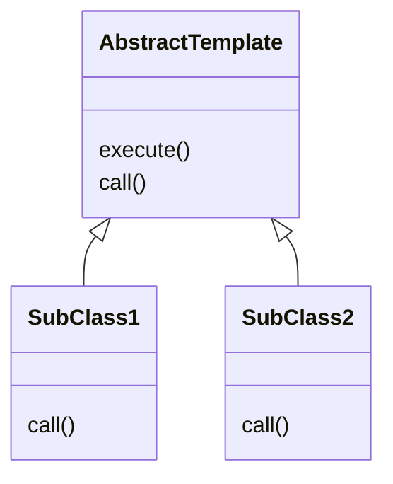
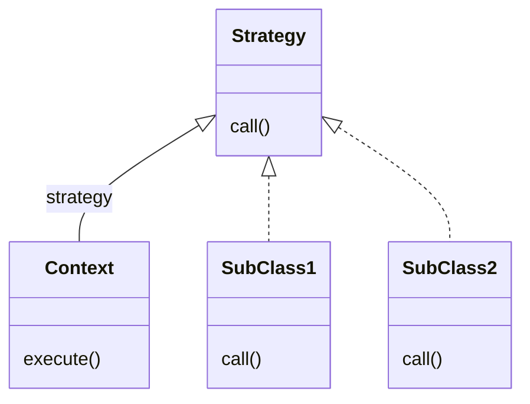

# 스프링 핵심 원리 - 고급편

## 목차

[TOC]

# 예제: 로그 추적기

## 요구사항

- 현재 운영중인 거대 프로젝트에서
- 모든 `public` 메서드의 호출과 응답 정보를 로그로 출력
- 애플리케이션의 흐름을 변경해선 안 됨(비즈니스 로직의 동작은 그대로)
- 메서드 호출에 걸린 시간
- 정상 흐름과 예외 흐름 구분
  - 예외 발생시 예외 정보가 남아야 함
- 메서드 호출의 깊이 표현
- HTTP 요청을 구분
  - HTTP 요청 단위로 ID를 남겨서 어떤 요청에서 시작된 것인지 구별 가능해야
  - 트랜잭션 ID: 여기서는 하나의 HTTP 요청이 발생하여 끝날 때 까지를 하나의 트랜잭션이라 함

- **번외**
  - 실제 상황이라면, 모니터링 툴을 사용하여 다수의 요구사항이 해결 가능
  - 로깅이라서 더 잘 기록되는 정보가 있기도 함


## 프로토타입 구현: V1

- `TraceId`

  ```java
  public class TraceId {
  
  	private String id;
  	private int level;
  
  	public TraceId() {
  		this.id = createId();
  		this.level = 0;
  	}
  
  	public TraceId(String id, int level) {
  		this.id = id;
  		this.level = level;
  	}
  
  	private String createId() {
  		return UUID.randomUUID().toString().substring(0, 8);
  	}
  
  	public TraceId createNextId() {
  		return new TraceId(id, level + 1);
  	}
  
  	public TraceId createPreviousId() {
  		return new TraceId(id, level - 1);
  	}
  
  	public boolean isFirstLevel() {
  		return this.level == 0;
  	}
  
  	... getter
  }
  ```

- `TraceStatus`

  ```java
  public class TraceStatus {
  
  	private TraceId traceId;
  	private Long startTimeMs;
  	private String message;
  
  	public TraceStatus(TraceId traceId, Long startTimeMs, String message) {
  		this.traceId = traceId;
  		this.startTimeMs = startTimeMs;
  		this.message = message;
  	}
      ...getter
  }
  ```

- `HelloTraceV1`

  ```java
  @Slf4j
  @Component
  public class HelloTraceV1 {
  
  	private static final String START_PREFIX = "-->";
  	private static final String COMPLETE_PREFIX = "<--";
  	private static final String EX_PREFIX = "<X-";
  
  	public TraceStatus begin(String message) {
  		TraceId traceId = new TraceId();
  		Long startTimeMs = System.currentTimeMillis();
  		log.info("[{}] {}{}", traceId.getId(), addSpace(START_PREFIX, traceId.getLevel()), message);
  		return new TraceStatus(traceId, startTimeMs, message);
  	}
  
  	public void end(TraceStatus status) {
  		complete(status, null);
  	}
  
  	public void exception(TraceStatus status, Exception e) {
  		complete(status, e);
  	}
  
  	private void complete(TraceStatus status, Exception e) {
  		Long stopTimeMs = System.currentTimeMillis();
  		long resultTimeMs = stopTimeMs - status.getStartTimeMs();
  		TraceId traceId = status.getTraceId();
  		if (e == null) {
  			log.info("[{}] {}{} time={}ms", traceId.getId(), addSpace(COMPLETE_PREFIX, traceId.getLevel()), status.getMessage(), resultTimeMs);
  		}
  		else {
  			log.info("[{}] {}{} time={}ms ex={}", traceId.getId(), addSpace(COMPLETE_PREFIX, traceId.getLevel()), status.getMessage(), resultTimeMs, e.toString());
  		}
  	}
  
  	private static String addSpace(String prefix, int level) {
  		StringBuilder sb = new StringBuilder();
  		for (int i = 0; i < level; i++) {
  			sb.append((i == level -1) ? "|" + prefix : "|	");
  		}
  		return sb.toString();
  	}
  }
  ```

  

### 적용

- 컨트롤러 적용

  ```java
  @RestController
  @RequiredArgsConstructor
  public class OrderControllerV1 {
  
  	private final OrderServiceV1 orderService;
  	private final HelloTraceV1 trace;
  
  	@GetMapping("/v1/request")
  	public String request(String itemId) {
  		TraceStatus status = null;
  		try {
  			status = trace.begin("OrderController.request()");
  			orderService.orderItem(itemId);
  			trace.end(status);
  			return "ok";
  		} catch(Exception e) {
  			trace.exception(status, e);
  			throw e;
  		}
  	}
  }
  ```


## V2: 파라미터로 동기화 개발

- `HelloTraceV2`

  ```java
  	public TraceStatus beginSync(TraceId beforeTraceId, String message) {
  		TraceId traceId = beforeTraceId.createNextId();
  		Long startTimeMs = System.currentTimeMillis();
  		log.info("[{}] {}{}", traceId.getId(), addSpace(START_PREFIX, traceId.getLevel()), message);
  		return new TraceStatus(traceId, startTimeMs, message);
  	}
  ```

  - `TraceId`를 넘겨주는 방식 추가


### 적용

- 컨트롤러 코드

  ```java
  	@GetMapping("/v2/request")
  	public String request(String itemId) {
  		TraceStatus status = null;
  		try {
  			status = trace.begin("OrderController.request()");
  			orderService.orderItem(status.getTraceId(), itemId);
  			trace.end(status);
  			return "ok";
  		} catch (Exception e) {
  			trace.exception(status, e);
  			throw e;
  		}
  	}
  ```

- 서비스 코드

  ```java
  	public void orderItem(TraceId traceId, String orderId) {
  		TraceStatus status = null;
  		try {
  			status = trace.beginSync(traceId, "OrderService.orderItem()");
  			orderRepository.save(status.getTraceId(), orderId);
  			trace.end(status);
  		} catch(Exception e) {
  			trace.exception(status, e);
  			throw e;
  		}
  	}
  ```

- `TraceId`를 메서드 호출 시 인자로 같이 넘겨주는 방식


## 정리: 남은 문제들

- 모든 메서드 인자에 `TraceId`를 넘겨줘야 함
  - 모든 파라미터, 경우에 따라 인터페이스까지 수정해야 함
- 로그를 처음 시작할 때는 `begin()`을, 아닐 때는 `beginSync()`를 호출해줘야 함
  - 컨트롤러가 아닌 곳에서 서비스 호출이 발생할 경우 파라미터로 넘길 `TraceId`가 없음


# 쓰레드 로컬 - Thread Local

## 필드 동기화

- 로그 추적기 구현 중에 `TraceId`를 동기화해야 했음

  - 파라미터로 넘기는 방식은
    일일히 파라미터를 넘겨야 하는 문제가 발생했음

- `FieldLogTrace`

  ```java
  @Slf4j
  public class FieldLogTrace implements LogTrace {
  
  	...
      
  	private TraceId traceIdHolder;    //traceId 동기화, 동시성 이슈 발생
  
      ...
          
  	private void syncTraceId() {
  		if (traceIdHolder == null) {
  			traceIdHolder = new TraceId();
  		} else {
  			traceIdHolder = traceIdHolder.createNextId();
  		}
  	}
  
      ...
          
  	private void releaseTraceId() {
  		if (traceIdHolder.isFirstLevel()) {
  			traceIdHolder = null;
  		} else {
  			traceIdHolder = traceIdHolder.createPreviousId();
  		}
  	}
  
      ...
  }
  ```


#### 동시성 문제

- `FieldLogTrace`는 싱글톤 스프링 빈
  - 해당 인스턴스의 동일 필드에 여러 쓰레드가 동시 접근하기에 문제 발생

- 예제 코드

  - SUT: `FieldService`

    ```java
    @Slf4j
    public class FieldService {
    
    	private String nameStore;
    
    	public String logic(String name) {
    		log.info("저장 name={} -> nameStore={}", name, nameStore);
    		nameStore = name;
    		sleep(1000);
    		log.info("조회 nameStore={}", nameStore);
    		return nameStore;
    	}
    
    	private void sleep(int millis) {
    		try {
    			Thread.sleep(millis);
    		} catch (InterruptedException e) {
    			e.printStackTrace();
    		}
    	}
    }
    ```

  - 테스트 코드

    ```java
    @Slf4j
    public class FieldServiceTest {
    
    	private FieldService fieldService = new FieldService();
    
    	@Test
    	void field() {
    		log.info("main Start");
    		Runnable userA = () -> {
    			fieldService.logic("userA");
    		};
    		Runnable userB = () -> {
    			fieldService.logic("userB");
    		};
    
    		Thread threadA = new Thread(userA);
    		threadA.setName("thread-A");
    		Thread threadB = new Thread(userB);
    		threadB.setName("thread-B");
    
    		threadA.start();
    		// sleep(2000);	//동시성 문제 발생하지 않음
    		sleep(100);	//동시성 문제 발생
    		threadB.start();
    
    		//threadB가 도는 중에 메인이 닫힐 수 있기에
    		sleep(3000);	//제대로 만들고 싶다면 countDownLatch 참고
    		log.info("main exit");
    	}
    
    	private void sleep(int millis) {
    		try {
    			Thread.sleep(millis);
    		} catch (InterruptedException e) {
    			e.printStackTrace();
    		}
    	}
    }
    ```

- 동시성 문제

  - 트래픽이 많아질수록 자주 발생
  - **스프링 빈처럼 싱글톤 객체의 필드를 변경하며 사용시에 특히 위험!**
  - `static` 영역, 인스턴스 필드에서 발생
  - 동시성 문제는 값을 읽기만 하면 발생하지 않음

- 싱글톤 객체의 필드를 사용하면서 동시성 문제를 해결하는 방법: **쓰레드 로컬**


## 쓰레드 로컬

- 쓰레드 로컬(ThreadLocal)
  - 해당 쓰레드만 접근 가능한 특별한 저장소
  - 같은 인스턴스의 쓰레드 로컬 필드에 접근해도 동시성 문제 없음
  - 자바에서 `java.lang.ThreadLocal`을 제공

- 기존의 `FieldService`에 적용해보기

  ```java
  @Slf4j
  public class ThreadLocalService {
  
  	private ThreadLocal<String> nameStore = new ThreadLocal<>();
  
  	public String logic(String name) {
  		log.info("저장 name={} -> nameStore={}", name, nameStore.get());
  		nameStore.set(name);
  		sleep(1000);
  		log.info("조회 nameStore={}", nameStore);
  		return nameStore.get();
  	}
  
  	private void sleep(int millis) {
  		try {
  			Thread.sleep(millis);
  		} catch (InterruptedException e) {
  			e.printStackTrace();
  		}
  	}
  }
  ```

- `ThreadLocal` 사용법

  - 값 저장: `ThreadLocal.set(xxx)`
  - 값 조회: `ThreadLocal.get()`
  - 값 제거: `ThreadLocal.remove()`

- **주의사항**
  - **해당 쓰레드가 쓰레드 로컬을 모두 사용하고 난 후 `remove()` 이용해서 꼭 제거해주자!**
- **`remove()` 하지 않을 경우 문제점**
  - WAS(톰캣)처럼 쓰레드 풀을 사용하는 경우 문제 발생 가능
  - 기존 사용자가 사용이 끝나고 쓰레드를 반납한 후에도 해당 쓰레드에 정보가 남아서,
    다른 사용자에게 해당 쓰레드를 할당될 때도 그 데이터가 남게 됨


# 템플릿 메서드 패턴과 콜백 패턴

## 템플릿 메서드 패턴

### 필요성

- 지금까지 만든 로그 추적기를 적용하면 코드가 다음과 같은 형태가 됨

  ```java
  	public void orderItem(TraceId traceId, String orderId) {
  		TraceStatus status = null;
  		try {
  			status = trace.beginSync(traceId, "OrderService.orderItem()");
  			orderRepository.save(status.getTraceId(), orderId);
  			trace.end(status);
  		} catch(Exception e) {
  			trace.exception(status, e);
  			throw e;
  		}
  	}
  ```

  - 핵심 비즈니스 로직 외에 로그 출력 부가 기능 코드가 섞이게 되는 문제 발생

- **핵심 기능 vs 부가 기능**

  - 핵심 기능은 해당 객체 고유의 기능
  - 부가 기능은 핵심 기능을 보조하기 위한 기능
  - 부가 기능을 분리해야 함
    - 핵심 기능을 오염시키지 않기 위해
    - 부가 기능은 보통 공통 적용 코드인데, 적용 지점마다 일일히 코드를 작성하는 것은
      - 생산성이 떨어지며
      - 관리가 힘들어지기 때문
    - **변하는 것(핵심 기능)과 변하지 않는 것(부가 기능)을 분리해야 한다!
      -> 템플릿 메서드 패턴을 이용하여 분리 가능**


### 구조 및 예제



- 예시

  - 아래와 같은 코드를

    ```java
    	void logic1() {
    		long startTime = System.currentTimeMillis();
    		//비즈니스 로직 실행
    		log.info("비즈니스 로직1 실행");
    		//비즈니스 로직 종료
    		long endTime = System.currentTimeMillis();
    		long resultTime = endTime - startTime;
    		log.info("resultTime={}", resultTime);
    	}
    
    	void logic2() {
    		long startTime = System.currentTimeMillis();
    		//비즈니스 로직 실행
    		log.info("비즈니스 로직2 실행");
    		//비즈니스 로직 종료
    		long endTime = System.currentTimeMillis();
    		long resultTime = endTime - startTime;
    		log.info("resultTime={}", resultTime);
    	}
    ```

  - 다음과 같이 템플릿 메서드 패턴 사용하여 관심사 분리가 가능

    ```java
    @Slf4j
    public abstract class AbstractTemplate {
    
    	private void execute() {
    		long startTime = System.currentTimeMillis();
    		//비즈니스 로직 실행
    		call();	//하위 클래스에서 재정의
    		//비즈니스 로직 종료
    		long endTime = System.currentTimeMillis();
    		long resultTime = endTime - startTime;
    		log.info("resultTime={}", resultTime);
    	}
    
    	protected abstract void call();
    }
    ```

    ```java
    @Slf4j
    public class SubClassLogic1 extends AbstractTemplate {
    	@Override
    	protected void call() {
    		log.info("비즈니스 로직1 실행");
    	}
    }
    ```


### 익명 내부 클래스 사용

- 템플릿 메서드 패턴 사용 시 하위 구현 클래스를 계속 만들어야 하는 번거로움이 있음
- 익명 내부 클래스를 사용하여 위 단점 보완


### 적용

- 템플릿 구현

  ```java
  @RequiredArgsConstructor
  public abstract class AbstractTemplate<T> {
  
  	private final LogTrace trace;
  
  	public T execute(String message) {
  		TraceStatus status = null;
  		try {
  			status = trace.begin(message);
  
  			//로직 호출
  			T result = call();
  
  			trace.end(status);
  			return result;
  		} catch (Exception e) {
  			trace.exception(status, e);
  			throw e;
  		}
  	}
  
  	protected abstract T call();
  }
  ```

- 컨트롤러 코드

  ```java
  @RestController
  @RequiredArgsConstructor
  public class OrderControllerV4 {
  
  	private final OrderServiceV4 orderService;
  	private final LogTrace trace;
  
  	@GetMapping("/v4/request")
  	public String request(String itemId) {
  
  		AbstractTemplate<String> template = new AbstractTemplate<>(trace) {
  			@Override
  			protected String call() {
  				orderService.orderItem(itemId);
  				return "ok";
  			}
  		};
  		return template.execute("OrderController.request()");
  	}
  }
  ```

- 서비스 코드

  ```java
  @Service
  @RequiredArgsConstructor
  public class OrderServiceV4 {
  
  	private final OrderRepositoryV4 orderRepository;
  	private final LogTrace trace;
  
  	public void orderItem(String orderId) {
  		AbstractTemplate<Void> template = new AbstractTemplate<>(trace) {
  			@Override
  			protected Void call() {
  				orderRepository.save(orderId);
  				return null;
  			}
  		};
  		template.execute("OrderService.orderItem()");
  	}
  }
  ```

  - 리턴 타입을 `Void`로 준 것에 유의하자!
    - 자바 언어의 한계로 오버라이드한 `call()`메서드는 `return null` 해야함

- 적용해보면, 정상 작동함을 볼 수 있음
- 핵심 로직과 부가 기능을 분리했음
- 좋은 설계의 요소를 갖춤
  - 변경점을 모아서 모듈화
  - 변경이 발생한다 해도 핵심 기능과 부가 기능의 변경이 서로를 침범하지 않음
  - SRP를 지킴
    - 변경이 발생했을 때 SRP를 잘 지켰는가가 드러나게 됨


### 정의

- GoF의 디자인 패턴에서 언급

> 템플릿 메서드 패턴의 목적은 다음과 같다.
>
> 작업에서 알고리즘의 골격을 정의하고, 일부 단계를 하위 클래스로 연기하여, 하위 클래스가 알고리즘의 구조를 변경하지 않고도 알고리즘의 특정 단계를 재정의할 수 있게끔 한다.

- **단점**
  - 상속을 사용하기에, 상속으로 인한 문제점을 고스란히 안고 감
  - 자식 클래스가 부모 클래스의 컴파일 시점에 강하게 결합하는 문제가 대표적
    - 자식 클래스가 부모 클래스에 강하게 의존한다는 것
    - 클래스 다이어그램의 화살표는 상속을 의미하기도 하지만, 동시에 의존을 드러내기도 함
  - 자식 클래스 입장에서, 부모 클래스의 기능을 전혀 사용하지 않음에도, 자식 클래스는 부모 클래스의 메서드를 모두 상속받고 있음
  - 별도의 클래스나 익명 내부 클래스를 만들어야 하는 복잡함
- 위와 같은 단점을 보완하기 위해서 전략 패턴을 고려해볼 수 있음


## 전략 패턴



- 상속(템플릿 메서드 패턴)이 아니라 위임으로 문제를 해결

  - 변하지 않는 부분은 `Context`에, 변하는 부분을 `Strategy` 인터페이스에 둠

- 전략 패턴의 의도(GoF)

  > 알고리즘 제품군을 정의하고 각각을 캡슐화하여 상호 교환 가능하게 만든다. 전략을 사용하면 알고리즘을 사용하는 클라이언트와 별개로 알고리즘을 변경할 수 있다.


### 전략을 필드에 주입하는 방식

#### 예시 코드

- `Strategy`

  ```java
  public interface Strategy {
  	void call();
  }
  ```

  ```java
  @Slf4j
  public class StrategyLogic1 implements Strategy{
  	@Override
  	public void call() {
  		log.info("비즈니스 로직1 실행");
  	}
  }
  ```

- `ContextV1`

  ```java
  @Slf4j
  public class ContextV1 {
  
  	private Strategy strategy;
  
  	public ContextV1(Strategy strategy) {
  		this.strategy = strategy;
  	}
  
  	public void execute() {
  		long startTime = System.currentTimeMillis();
  		//비즈니스 로직 실행
  		strategy.call();
  		//비즈니스 로직 종료
  		long endTime = System.currentTimeMillis();
  		long resultTime = startTime - endTime;
  		log.info("resultTime={}", resultTime);
  	}
  }
  ```

  - 전략을 의존성 주입 받음
  - `Context`는 `Strategy` 인터페이스를 보고 있기 때문에 구현체 변경이 유연함
    - 스프링 의존성 주입 방식


#### 익명 내부 클래스 사용

- 이 경우에는 람다로 대체하면 코드 길이를 줄이고 가독성을 높일 수 있음

- 선 조립, 후 실행

  ```java
  	@Test
  	void strategyV4() {
  		ContextV1 context1 = new ContextV1(() -> log.info("비즈니스 로직1 실행"));
  		context1.execute();
  		ContextV1 context2 = new ContextV1(() -> log.info("비즈니스 로직2 실행"));
  		context1.execute();
  	}
  
  ```

  - 실행 전에 한 번 조립해두면, 다음 부터는 그냥 실행만 하면 되기에 편리함
  - 스프링 애플리케이션 로딩 시점에 의존관계가 모두 맺어두고, 이후 요청 처리하는 것과 같은 원리
  - **한 번 조립한 이후에는 전략을 변경하기가 어렵다는 단점이 있음**
    **setter 사용한 변경 등을 시도할 수는 있으나, 싱글톤과 겹치면 동시성 이슈가 발생할 수 있음**
    - **전략을 실시간으로 변경하고 싶다면 그냥 `Context`를 새로 생성하고 그때마다 주입하는 것이 나을 수 있음**


### 전략을 파라미터로 전달하는 방식

- `ContextV2`

  ```java
  @Slf4j
  public class ContextV2 {
  
  	public void execute(Strategy strategy) {
  		long startTime = System.currentTimeMillis();
  		//비즈니스 로직 실행
  		strategy.call();
  		//비즈니스 로직 종료
  		long endTime = System.currentTimeMillis();
  		long resultTime = startTime - endTime;
  		log.info("resultTime={}", resultTime);
  	}
  }
  ```

- 선조립 후 실행이 아니라, 실행시마다 컨텍스트를 파라미터로 받음

- 전략을 유연하게 변경할 수 있다는 장점

- 실행 시마다 파라미터를 전달해줘야 한다는 점에서 V1에 비해서 불편함

- 상황에 따라 적절한 방식을 선택해야
  - 현재 개발중인 로그 추적기의 경우 실행 시에 유연하게 로직을 변형하는 것이 중요하기에 V2의 방식이 적합

- **번외: 디자인패턴**
  - 디자인 패턴의 구조도 중요하지만
  - 더 중요한 것은 디자인 패턴의 의도(indent)다!
  - 구조만 본다면 많은 디자인 패턴이 다를 바가 없음