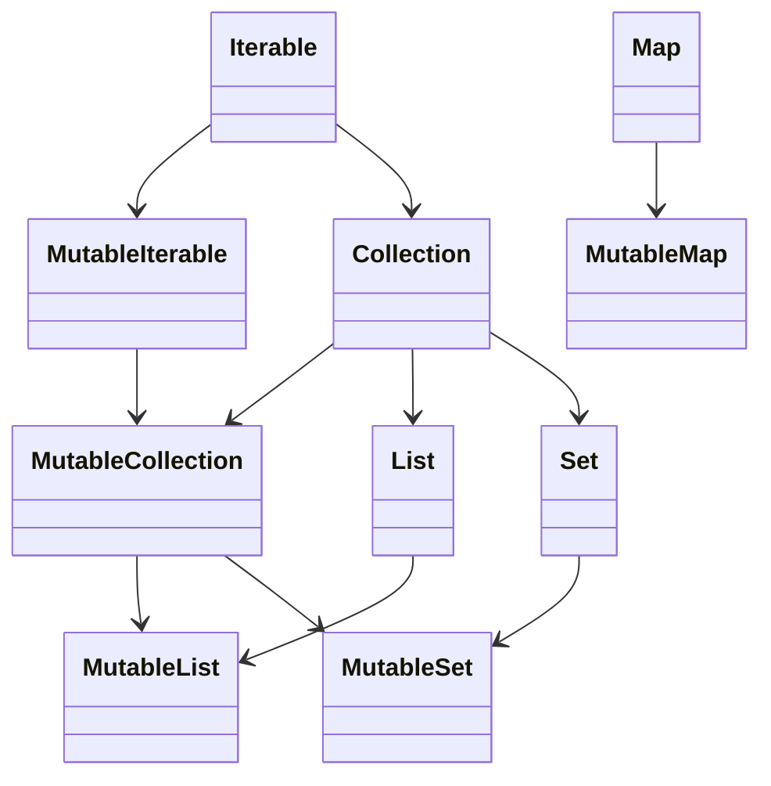

# 자바 개발자를 위한 코틀린 입문

[TOC]

- 코틀린
  - JetBrains에서 만든 언어
  - JVM에서 작동
  - 정적 타입 언어
  - OOP + FP
  - 아파치 2.0 라이센스: 소스코드 공개 의무 없음, 상업적 이용 가능
  - `;` 붙이지 않아도 됨
  - 기본 접근 제한자는 `public`
  - `val number : Int = 100` (타입스크립트와 유사한 변수 선언)
  - InteliJ의 Tools - Kotlin - Show Kotlin Bytecode 이용하여 자바 코드를 확인 가능


# 코틀린에서 변수와 타입, 연산자를 다루는 방법

## 1강. 코틀린에서 변수를 다루는 방법

### 1. 변수 선언 키워드 - `var`와 `val`의 차이점

- 가변과 불변
  - `var ` 가변
  - `val` 불변
- `var` 혹은 `val`을 반드시 명시해 줘야 함

- 타입을 작성해주지 않아도 되지만, 명시적 작성도 가능하다.

  ```kotlin
  var number1: Long = 10L
  val number2 = 10L
  ```

- 초기값을 할당하지 않는다면?

  - 타입 추론이 불가능하기에 타입을 명시해줘야 함
  - `val`의 경우 최초 한 번 할당 가능

- `val` 컬렉션에는 element 추가 가능(자바 컬렉션과 동일)

> 기본적으로는 `val`로 선언하고, 필요시 `var`로 변경


### 2. Kotlin에서의 Primitive Type

- 코틀린의 경우 `long`과 `Long`의 구별이 없음
  - 일부 타입들(숫자, 불리언, 문자)의 경우 연산시 내부적으로 `primitive type`으로 바꿔서 작동
  - 외적으로는 구별할 필요 없음


### 3. Kotlin에서의 nullable 변수

```kotlin
var notNullableNumber = 10L
var nullableNumber: Long? = 1_000L
```

- 해당 변수에 `null`이 들어갈 수 있는 경우 타입에 `?` 붙여야 함


### 4. Kotlin에서의 객체 인스턴스화

```kotlin
var person = Person("Sample")
```

- `new` 연산자 붙이지 않음


## 2강. 코틀린에서 `null`을 다루는 방법

### 1. Kotlin에서의 `null` 체크

- 자바 코드

  - null-safety를 갖추지 못한 코드

    ```java
    public boolean startsWithA(String str) {
        return str.startsWith("A");
    }
    ```

  - 보완 코드

    - 예외 발생시키는 방식

      ```java
      public boolean startsWithA(String str) {
          if (str == null) {
              throw new IllegalArgumentException("null이 들어왔습니다.")
          }
          return str.startsWith("A");
      }
      ```

    - `null` 반환하는 방식

      ```java
      public Boolean startsWithA(String str) {
          if (str == null) {
              return null;
          }
          return str.startsWith("A");
      }
      ```

    - `null`일 경우 기본값(`false`) 설정하는 방식

      ```java
      public boolean startsWithA(String str) {
          if (str == null) {
              return false;
          }
          return str.startsWith("A");
      }
      ```

- 코틀린으로 표현한 코드

  - 예외 발생시키는 방식

    ```kotlin
    fun startsWithA(str: String?): Boolean {
        if (str == null) {
            throw IllegalArgumentException("null이 들어왔습니다.")
        }
        return str.startsWith("A")
    }
    ```

    - 매개변수가 `null`일 수 있기에 `String?`로 표기함
    - 반환 타입이 `null`일 수 없기에 `?` 붙이지 않고 `Boolean`으로 표기함

  - `null` 반환하는 방식

    ```kotlin
    fun startsWith(str: String?): Boolean? {
        if (str == null) {
            return null
        }
        return str.startsWith("A")
    }
    ```

    - `null` 값이 가능하기에 반환 타입은 `Boolean?`

  - `null`일 경우 기본값 설정하는 방식

    ```kotlin
    fun startsWith(str: String?): Boolean {
        if (str == null) {
            return false
        }
        return str.startsWith("A")
    }
    ```

- **코틀린은 `null`이 가능한 타입을 완전히 다르게 취급한다!**


### 2. Safe Call과 Elvis 연산자

- 코틀린에서는 nullable한 타입만을 위한 기능이 있음

- **Safe Call**

  - `null`이 아니면 실행하고, `null`이면 실행하지 않는다(그대로 `null`)

  - 예시 코드

    ```kotlin
    val str: String? = "ABC"
    str.length 	//호출이 불가능하다!
    str?.length	//가능하다
    ```

    - `null`이 아닌 경우에만 호출이 발생, `null`일 경우 `null`을 그대로 반환

- **Elvis 연산자**

  - 예시 코드

    ```kotlin
    val str: String? = "ABC"
    str?.length ?: 0
    ```

    - 앞의 연산 결과가 `null`이면 뒤의 값을 사용

- 예시 코드의 수정

  - 예외 발생시키는 방식

    ```kotlin
    fun startsWithA(str: String?): Boolean {
        return str?.startsWith("A") 
        ?: throw IllegalArgumentException("null이 들어왔습니다.")
    }
    ```

  - `null`을 반환하는 방식

    ```kotlin
    fun startsWithA(str: String?): Boolean? {
        return str?.startsWith("A")
    }
    ```

  - `null`일 경우 기본값 설정하는 방식

    ```kotlin
    fun startsWithA(str: String?): Boolean {
        return str?.startsWith("A") ?: false
    }
    ```

- **Elvis 연산자와 early return**

  - 자바의 경우

    ```java
    public long calculate(Long number) {
        if (number == null) {
            return 0;
        }
        //로직
    }
    ```

  - 코틀린의 경우

    ```kotlin
    fun calculate(number: Long?): Long {
        number ?: return 0;
        //로직
    }
    ```

    - `if`문을 사용하지 않음


### 3. `null` 아님 단언

- nullable한 타입이지만 `null`이 될 수 없는 경우

  - 예시 코드

    ```kotlin
    fun startsWithA(str: String?): Boolean {
        return str!!.startsWith("A")
    }
    ```

    - `!!`을 이용하여 단언 가능
    - 사용하지 않을 경우 컴파일 에러 발생
    - ***단, 위의 경우 `null`이 들어올 경우에 NPE 발생! 확실한 경우에만 단언 사용할 것!***


### 4. 플랫폼 타입

- 코틀린에서 자바 코드를 가져다 쓸 경우 

- 예시

  - 자바 클래스

    ```java
    public class Person {
        private final String name;
        
        public Person(String name) {
            this.name = name;
        }
        
        @Nullable
        public String getName() {
            return name;
        }
    }
    ```

  - 코틀린이 위의 자바 코드를 사용할 경우

    - `@Nullable`이나 `@NotNull` 등의 자바 애노테이션을 코틀린이 이해함
    - 하지만 위와 같은 애노테이션 정보가 없을 경우 코틀린은 해당 자바 코드에서 정보를 받지 못함
      - `javax.annotation` 패키지
      - `android.support.annotation` 패키지
      - `org.jetbrains.annotation` 패키지

- **플랫폼 타입**

  - 코틀린이 `null` 관련 정보를 알 수 없는 타입
  - 런타임에 `Exception` 발생 가능!

- **코틀린에서 자바 코드를 사용할 경우 대응법**

  - 자바 코드에 `null` 관련 정보를 명시해준다.
  - 외부 라이브러리를 사용할 경우
    - 라이브러리 내부 코드에서 nullable을 확인하고 사용하자
    - 코틀린에서 자바 라이브러리를 최초로 사용한 지점을 wrapping을 통해 단일지점으로 변경, 이슈에 대응하기 용이하게 만들자


## 3강. 코틀린에서 Type을 다루는 방법

### 1. 기본 타입

- 코틀린에서는 선언된 기본값을 보고 타입을 추론한다.

  - 정수

    ```kotlin
    val number1 = 3		//Int
    val number2 = 3L	//Long
    ```

  - 소수

    ```kotlin
    val number1 = 3.0f	//Float
    val number2 = 3.0	//Double
    ```

- **기본 타입간의 변환: 자바와의 차이점**

  - 자바의 경우 기본 타입간의 변환은 **암시적으로 이뤄질 수 있다.**

    ```java
    int number1 = 4;
    long number2 = number1;
    ```

    - `int` 타입 값이 `long` 타입으로 암시적 변경(더 큰 타입으로는 암시적 변경)

  - 코틀린의 경우 기본 타입간의 변환이 **명시적으로 이루어져야 한다.**

    ```kotlin
    val number1 = 4
    val number2: Long = number1	//Type mismatch로 컴파일 에러
    ```

    - 대신 `to변환타입()`을 사용하여 명시적 변경이 필요

      ```kotlin
      val number1 = 4
      val number2: Long = number1.toLong()
      ```

    - 예시2: 나눗셈 값을 실수로 받고 싶을 때

      ```kotlin
      val number1 = 3
      val number2 = 5
      val result = number1 / number2.toDouble()
      ```

      - 자바의 경우 `(double)` 이용했지만, 코틀린의 경우 `toDouble()`이용

- nullable 변수의 경우 Safe Call과 Elvis 연산자 이용하여 처리해줘야 함

  ```kotlin
  val number1: Int? =  3
  val number2: Long = number.toLong()		//불가능
  val number2: Long = number?.toLong() ?: 0L
  ```


### 2. 형변환

- 기본 타입이 아닌 일반 타입의 경우에는?

- 자바의 경우

  ```java
  public static void printAgeIfPerson(Object obj) {
      if (obj instanceof Person) {
          Person person = (Person) obj;
          System.out.println(person.getAge();
      }
  }
  ```

  - `instanceof`로 타입 검사, `(Person)`으로 형변환

- 코틀린의 경우

  ```kotlin
  fun printAgeIfPerson(obj: Any) {
      if (obj is Person) {
          val person = obj as Person
          println(person.age)
      }
  }
  ```

  - `instanceof` 대신에 `is`

  - `(Person)` 대신에  `as Person`

  - 사실 `as Person`은 생략 가능함

    ```kotlin
    println(obj.age)
    ```

    - 위의 호출이 가능: **스마트 캐스트**

- `as?`

  ```kotlin
  fun printAgeIfPerson(obj: Any?) {
      val person = obj as? Person
      println(person?.age)
  }
  ```

  - `as?` 만약 `null`이거나 해당 타입이 아닌 경우 `null`이 된다.
  - `person` 변수가 nullable하기에 `person?.age`로 처리했다.

- 정리

  - `is`: 해당 타입인지에 따라 T/F 반환
    - `value !is Type` 형태로 부정도 가능
  - `as`: 해당 타입일 경우에는 타입 캐스팅, 아닐 경우 `ClassCastException` 발생
    - `as?`: value가 해당 타입인 경우에는 타입 캐스팅, `null`이거나 해당 타입이 아닌 경우 `null`


### 3. Kotlin의 특이 타입 3가지

- **Any**

  - 자바의 `Object` 역할(모든 객체의 최상위 타입)
    - 모든 기본 자료형의 최상위 타입이기도 함
  - `Any` 만으로는 `null`을 포함 불가, `null`을 포함하고 싶을 경우 `Any?`
  - `equals` / `hashCode` / `toString` 존재

- **Unit**

  - 자바의 `void`와 동일한 역할
  - `void`와 달리 `Unit`은 그 자체로 타입 인자로 사용 가능
    - 자바의 경우 제네릭 사용을 위한 `Void`가 따로 있었음
  - 함수형 프로그래밍에서 `Unit`은 단 하나의 인스턴스만 갖는 타입을 의미한다.
    - 코틀린의 `Unit`은 실제 존재하는 타입임을 강조하기 위해 사용한 네이밍

- **Nothing**

  - 함수가 정상적으로 끝나지 않았음을 표현하는 역할

  - 무조건 예외를 반환하는 함수 / 무한 루프 함수 등을 표현하는 데 사용함

    ```kotlin
    fun fail(message: String): Noting {
        throw IlleagalArgumentException(message)
    }
    ```


### 4. String interpolation / String indexing

- 예시 코드

  - 자바의 경우

    ```java
    Person person = new Person("이름", 50);
    String log = String.format("이름은 %s이고 나이는 %s세 입니다.", person.getName(), person.getAge());
    ```

    - 혹은 `StringBuilder` 이용하여 동적으로 `String` 생성

  - 코틀린의 경우

    ```kotlin
    val person = Person("이름", 50)
    val log = "이름은 ${person.name}이고 나이는 ${person.age}세 입니다."
    ```

    - `${변수}`를 사용하여 값을 넣을 수 있음

    ```kotlin
    val name = "이름"
    println("이름: $name")
    ```

    - 중괄호 생략도 가능하다. (객체 내 프로퍼티 접근이 아닌 변수 바로 접근인 경우 사용 가능)
    - 변수 이름만 사용하더라도 **중괄호 포함하여 `${변수}` 형태로 사용함이 낫다.**
      - 가독성
      - 일괄 변환
      - 정규식 활용의 측면에서 그렇다.

- `"""` 이용한 문자열 표현

  ```kotlin
  val str = """
  	ABC
  	DEF
  	${name}
  """.trimIndent()
  ```

- 문자열의 특정 문자 가져오기

  - 자바의 경우 `str.charAt()` 사용했음

  - 코틀린의 경우 대괄호 사용하여 접근 가능

    ```kotlin
    val str = "ABC"
    println(str[2])		//C 출력됨
    ```


## 4강. 코틀린에서 연산자를 다루는 방법

### 1. 단항 연산자 / 산술 연산자

- 단항 연산자: `++`, `--`

- 산술 연산자: `+`, `-`, `*`, `/`, `%`

- 산술 대입 연산자: `+=`, `-=`, `*=`, `/=`, `%=`
- **자바와 모두 동일하다!**


### 2. 비교 연산자와 동등성, 동일성

- 비교 연산자: `>`, `<`, `>=`, `<=`
  - **자바와 달리 객체를 비교할 때 비교 연산자를 사용하면
    자동으로 `compareTo()`를 호출한다!**
- 코틀린에서 동일성과 동등성
  - `===`: 동일성
  - `==`: 동등성, **간접적으로 equals() 호출**


### 3. 논리 연산자와 코틀린에 있는 특이한 연산자

- 논리 연산자: 자바와 완전히 동일(`&&`, `||`, `!`)

  - 자바처럼 Lazy evaluation 수행함

- `in` / `!in` 연산자

  - 컬렉션이나 범위에 포함되어 있는지 검사

    ```kotlin
    println(1 in numbers)
    ```

- `..` 연산자 (`a..b`)

  - `a`에서 `b`까지의 범위 객체를 생성한다.

- `a[i]`

  - `a`에서 특정 Index `i`로 값을 가져온다.

- `a[i] = b`

  - `a`의 특정 index `i`에 `b`를 넣는다.


### 4. 연산자 오버로딩

- 코틀린에서는 객체마다 연산자를 직접 정의할 수 있다.

- 예시 코드

  ```kotlin
  data class Money(
      val amount: Long
  ) {
      operator fun plus(other: Money): Money {
          return Money(this.amount + other.amount)
      }
  }
  ```

  ```kotlin
  fun main() {
      val money1 = Money(1_000L)
      val money2 = Money(2_000L)
      println(money1 + money2)
  }
  ```


# 코틀린에서 코드를 제어하는 방법

## 5강. 코틀린에서 조건문을 다루는 방법

### 1. if문

- 자바의 경우

  ```java
  private void validateScoreIsNotNegative(int score) {
      if (score < 0) {
          throw new IllegalArgumentException(String.format("%s는 0보다 작을 수 없습니다.", score));
      }
  }
  ```

- 코틀린의 경우

  ```kotlin
  fun validateScoreIsNotNegative(score: Int) {
      if (score < 0) {
          throw IllegalArgumentException("${score}는 0보다 작을 수 없습니다.")
      }
  }
  ```

  - `Unit`(`void`)이 생략됨
  - `if` 문 문법 자체는 동일

- `else`

  ```kotlin
  fun getPassOrFail(score: Int): String {
      if (score >= 50) {
          return "P"
      } else {
          return "F"
      }
  }
  ```

  - 코드 형태 자체는 동일하다.


### 2. Expression과 Statement

- **자바와 코틀린에서 `if-else` 차이점!**

  - **자바의 `if-else`는 Statement지만,
    코틀린에서는 Expression이다!**

  - Expression은 하나의 값으로 도출되는 Statement

  - 때문에 위의 코틀린 코드는 다음과 같이 바꿀 수 있다:

    ```kotlin
    fun getPassOrFail(score: Int): String {
        return if (score >= 50) {
            "P"
        } else {
            "F"
        }
    }
    ```

  - **코틀린에서는 `if-else`를 Expression으로 취급하기에 3항 연산자가 없다!**

- 값이 특정 범위에 포함되어 있는지 검사하는 코드도 다르다!

  - 자바의 경우

    ```java
    if (0 <= score && score <= 100)
    ```

  - 코틀린의 경우

    ```kotlin
    if (score in 0..100)
    ```


### 3. switch와 when

- 코틀린은 `switch` 삭제되었으며, 대신 `when` 사용

  ```kotlin
  fun getGrade(socre: Int): String {
      return when(score / 10) {
          9 -> "A"
          8 -> "B"
          7 -> "C"
          else -> "D"
      }
  }
  ```

  - `when`도 Expression으로 취급됨

  - 분기 표현도 더 편리하게 가능: 범위 및 조건 표현

    ```kotlin
    fun getGrade(socre: Int): String {
        return when(score / 10) {
            in 90..99 -> "A"
            in 80..89 -> "B"
            in 70..79 -> "C"
            else -> "D"
        }
    }
    ```

    - 조건부에는 어떠한 Expression도 들어갈 수 있음
      - ex) `is` 연산자를 이용한 타입 검사

  - 여러개의 조건을 검사할 수도 있음(`,` 이용)

    ```kotlin
    fun judgeNumber(number: Int) {
        when (number) {
            1, 0, -1 -> println("의도한 숫자입니다.")
            else -> println("의도한 숫자가 아닙니다.")
        }
    }
    ```

  - `when(value)`의 `value`가 없을 수도 있음

    ```kotlin
    fun judgeNumber(number: Int) {
        when {
            number == 0 -> println("주어진 숫자는 0입니다.")
            number % 2 == 0 -> println("주어진 숫자는 짝수입니다.")
            else -> println("주어진 숫자는 홀수입니다.")
        }
    }
    ```

  - `when`은 Enum Class 혹은 Sealed Class 와 함께 사용할 경우 더 유용


## 6강. 코틀린에서 반복문을 다루는 방법

### 1. for-each문(향상된 for문)

```kotlin
val numbers = listOf(1L, 2L, 3L)
for (number in numbers) {
    println(number)
}
```

- `:` 대신 `in` 사용한 것 외에는 거의 동일
- `Iterable`이 구현된 타입이라면 모두 사용 가능


### 2. 전통적인 for문

```kotlin
for (i in 1..3) {
    println(i)
}
```

- 1부터 3까지 모두 출력: 3까지 포함한다는 것을 혼동하지 말자

- 감산의 경우

  ```kotlin
  for (i in 3 downTo 1) {
      println(i)
  }
  ```

  - `downTo` 사용

- 1씩 변화하지 않는 경우

  ```kotlin
  for (i in 1..5 step 2) {
      println(i)
  }
  ```

  - `step` 사용


### 3. Progression과 Range

- `..` 연산자: 범위를 만들어 내는 연산자
- `IntRange` 클래스는 `IntProgression`(등차수열)을 상속받고 있다.
- `downTo`, `step `도 함수다!
  - 중위 호출 함수: 다른 함수 호출법


### 4. while문

- 자바와 동일(`do-while`도 동일)


## 7강. 코틀린에서 예외를 다루는 방법

### 1. try catch finally 구문

```kotlin
fun parseIntOrThrow(str: String): Int {
    try {
        return str.toInt()
    } catch (e: NumberFormatException) {
        throw IllegalArgumentException("주어진 ${str}는 숫자가 아닙니다.")
    }
}
```

- 문법 자체는 자바와 동일

- `null`을 반환하는 버전

  ```kotlin
  fun parseIntOrThrow(str: String): Int? {
      return try {
          str.toInt()
      } catch (e: NumberFormatException) {
          null
      }
  }
  ```

  - try catch문도 Expression으로 취급된다!


### 2. Checked Exception과 Unchecked Exception

```kotlin
fun readFile() {
    val currentFile = File(".")
    val file = File(currentFile.absolutePath + "/a.txt")
    val reader = BufferedReader(FileReader(file))
    println(reader.readLine())
    reader.close()
}
```

- 코틀린에서는 Checked / Unchecked Exception을 구별하지 않는다! -> 모두 Unchecked Exception이다.


### 3. try with resources

```kotlin
fun readFile(path: String) {
    BufferedReader(FileReader(path)).use { reader ->
        println(reader.readLine())
    }
}
```

- 코틀린에서는 try with resources 구문이 없다!
- `use`를 사용함(인라인 확장 함수)


## 8강. 코틀린에서 함수를 다루는 방법

### 1. 함수 선언 문법

```kotlin
fun max(a: Int, b: Int): Int =
    return if (a > b) {
        a
    } else {
        b
    }
```

- 리턴 타입 `Unit`은 생략 가능

- 함수가 하나의 결과값인 경우 코드 블록 대신 `=` 사용 가능

- 코드 줄 수를 줄일 수도 있음

  ```kotlin
  fun max(a: Int, b: Int): Int = if (a > b) a else b
  ```

  - `=`을 사용했기 때문에 반환 타입(`: Int`)도 생략 가능
  - 단, 중괄호 사용한 경우에는 반환 타입이 `Unit` 아닐 경우 반환 타입을 명시해 주어야 한다.

- 함수는 클래스 안에 있을수도, 파일 최상단에 있을 수도, 한 파일 안에 여럿이 있을 수도 있다.


### 2. default parameter

- 자바의 경우 오버로딩 등을 이용하여 메서드 기본 파라미터를 설정할 수 있지만, 코드 수가 쓸데 없이 길어진다는 문제

```kotlin
fun repeat(
    str: String, 
    num: Int = 3, 
    useNewLine: Boolean = true) {
    for (i in 1..num) {
        if (useNewLine) {
            println(str)
        } else {
            print(str)
        }
    }
}
```

- 코틀린의 경우 위와 같이 파라미터가 넘어오지 않았을 경우 기본값을 지정해줄 수 있다. (default parameter)


### 3. named argument

- 위의 경우 두 번째 파라미터인 `num`은 기본값을 넣어주지만 마지막 파라미터만 특정 값을 넣어 사용하고 싶을 수도 있다.
  - 이 경우 `num` 값 설정을 하지 않으면서 호출할 수 있는 방법을 제공한다.

```kotlin
repeat("Hello World", useNewLine = false)
```

- 매개변수 이름을 통해 직접 지정해줄 수 있다.
- 빌더를 만들지 않으면서 빌더의 강점을 가져올 수 있다.
- ***코틀린에서 자바 메서드를 가져와 사용할 경우 named argument는 사용 불가능하다!***
  - 자바 바이트 코드 상으로 매개변수 이름 정보가 남아 있지 않기 때문이다!


### 4. 가변인자

- 자바의 경우

  ```java
  public static void printAll(String... strings) {
      //로직
  }
  ```

- 코틀린의 경우

  ```kotlin
  fun printAll(vararg strings String) {
      //로직
  }
  ```

  - `...` 대신에 `vararg` 명시

- 사용 코드

  ```kotlin
  printAll("A", "B", "C")
  
  val array = arrayOf("A", "B", "C")
  printAll(*array)
  ```

  - 두 가지 모두 가능하다.
  - `*`: spread 연산자


# 코틀린에서의 OOP

## 9강. 코틀린에서 클래스를 다루는 방법

### 1. 클래스와 프로퍼티

```kotlin
class Person constructor(name: String, age: Int){
    
    val name: = name
    var age: = age
    
}
```

- 생성자는 맨 위에 작성해준다.

  - 생성자에 필드 타입이 명시되어 있는 경우 해당 필드의 타입은 생략해도 괜찮다.
  - `constructor` 지시어는 생략 가능하다.

- 코틀린에서는 필드만 만들면 `getter`, `setter`를 자동으로 만들어 준다.

- 코틀린에서는 생성자에서 프로퍼티를 선언해 줄 수 있다.

  ```kotlin
  class Person (
  	val name: String
      var age = Int
  )
  ```

  - custom getter 사용한다면 위와 같이 생성자에서 프로퍼티를 선언해선 안 된다.

- `getter` / `setter` 호출

  ```kotlin
  val person = Person("이름", 10)
  println(person.name)
  person.age = 10
  ```

  - `.프로퍼티` 형태로 호출 가능
  - 내부적으로는 `getter` / `setter` 호출하는 형태임
  - 자바 코드를 가져다 쓸 때도 위와 같은 형태로 호출 가능


### 2. 생성자와 `init`

```kotlin
class Person (
	val name: String
    var age = Int
) {
    init {
        if (age <= 0) {
            throw IllegalArgumentException("나이는 ${age}일 수 없습니다.")
        }
    }
}
```

- `init` 블록은 생성자가 호출될 때 호출된다.

  - 값 변경, 검증 로직 등의 용도로 사용된다.

- 생성자 오버로딩은 어떻게 할까?

  ```kotlin
  class Person (
  	val name: String
      var age = Int
  ) {
      constructor(name: String): this(name, 1)
  }
  ```

  - 아래쪽에 `constructor` 키워드 이용한다.

- 주생성자(primary constructor)

  - 가장 위에 있는 생성자
  - 반드시 존재해야 한다.
  - 만일 하나도 생성자가 없는 경우라면 기본 생성자를 만들어준다.

- 부생성자(secondary constructor)

  - 주생성자 외에 추가적으로 만든 생성자
  - **최종적으로 주생성자를 `this`로 호출해야 한다.**
    - 부생성자가 다른 부생성자를 호출하는 것도 가능하다. 생성자 체이닝의 최종에 주생성자가 호출되면 된다!
    - 실행 순서는 `init` body - 부생성자에게 호출된 부생성자, 가장 먼저 호출된 부생성자 순이 된다.
  - `body`를 가질 수 있음

- ***부생성자 보다는 default parameter를 권장한다!***

  - Converting 등의 경우에는 부생성자를 사용할 수 있지만,
    이 경우에도 정적 팩터리 메서드를 이용함이 낫다!


### 3. 커스텀 getter, setter

- 자바와 같이 메서드를 만들 수도 있지만
  아래와 같이 프로퍼티 처럼 표현할 수도 있다.

```kotlin
val isAdult: Boolean
	get() = this.age >= 20
```

```kotlin
val isAdult: Boolean
	get() {
        return this.age >= 20
    }
```

- 위의 두 방식은 바이트코드 상으로는 동일하게 구현된다!

- 추천 방식

  - 객체의 속성이라면 custom getter 사용하고
    그렇지 않은 경우 함수를 사용하자

- custom getter

  ```kotlin
  class Person {
      name: String  = "기본 이름"
      var age: Int = 1
  } {
      
      val name = name
      	get() = field.uppercase()
      
      ...
      
  }
  ```

  - `field`

    - `.name` 호출 시 `getter`를 호출하게 되는데, `getter` 호출 시 `getter`를 호출한다면 무한 루프 문제가 발생한다!

    - 이를 막기 위해 그 자신 필드를 가리키는 예약어 `field`가 존재 -> **backing field**

    - 하지만 `field` 사용하지 않고 다음과 같은 대안을 쓸 수도 있기 때문에 사용 빈도는 적다:

      ```kotlin
      fun getUppercaseName(): String = this.name.uppercase()
      ```

      ```kotlin
      val uppercaseName: String
      	get() = this.name.uppercase()
      ```

- custom setter

  ```kotlin
  var name: String = name
  	set(value) {
          field = value.uppercase()
      }
  ```

  - 하지만 setter 자체를 지양하기 때문에 custom setter도 잘 사용하지 않음


## 10강. 코틀린에서 상속을 다루는 방법

### 1. 추상 클래스

```kotlin
abstract class Animal(
	protected val species: String
    protected open val legCount: int
) {
    
    abstract fun move()

}
```

- `open`: `legCount`의 `getter`를 오버라이딩 하기 위함

```kotlin
class Cat(
    species: String
) : Animal(species, 4) {
    
    override fun move() {
        println("사뿐 사뿐")
    }
    
}
```

- 타입 명시와 상속 모두 `:` 사용한다.
  단 타입의 경우 띄어쓰지 않고 `변수: 타입`인 반면, 
  상속의 경우 띄어쓰고 `변수 : 타입`이다.
- 상속 타입에 바로 생성자 호출을 표시해 주면 된다.
- `override`를 필수적으로 붙여줘야 한다.

```kotlin
class Penguin (
    species: String
) : Animal(species, 2) {
    
    private val wingCount: Int = 2
    
    override fun move() {
        println("꽥꽥")
    }
    
    override val legCount: Int
    	get() = super.legCount + this.wingCount
    
}
```

- 프로퍼티에 대한 오버라이딩을 하고 싶다면 `open` 붙여야 한다.
- 자바와 동일하게 상위 클래스 접근 키워드는 `super`, 추상 클래스는 인스턴스화 불가


### 2. 인터페이스

```kotlin
interface Flyable {
    
    fun act() {
        println("파닥 파닥")
    }
    
    fun fly()

}
```

- `default` 키워드 생략해도 된다.
- 기본 구현이 없을 경우 추상 메서드가 된다. (자바와 동일)

```kotlin
class Penguin (
    species: String
) : Animal(species, 2), Swimable, Flyable {
    
    ...
    
    overide fun act() {
        super<Swimable>.act()
        super<Flyable>.act()
    }
}
```

- 추상 클래스의 상속과 동일하게 `:` 사용 

- `super<InterfaceType>.function()` 형태로 호출 가능

- 자바와 마찬가지로 인터페이스는 인스턴스화 불가

- **코틀린에서는 backing field가 없는 프로퍼티를 Interface에 만들 수 있다.**

  ```kotlin
  interface Swimmable {
      
      val swimAbility: Int
      
      fun act() {
          //로직
      }
      
  }
  ```

  - 위의 `swimAbility`의 경우 `Swimable` 안에 필드가 없다. 이는 구현 클래스에서 `getter` 구현을 요구하는 것이다.

    - 구현 클래스 예시

    ```kotlin
    	override val Swimablity: Int
    		get() = 3
    ```

  - 인터페이스 내에서 기본 구현도 가능하다.

    ```kotlin
    interface Swimmable {
        
        val swimAbility: Int
        	get() = 3
        
        fun act() {
            //로직
        }
        
    }
    ```

    - 이 경우에도 오버라이드 가능하다.


### 3. 클래스를 상속할 때 주의할 점

```kotlin
open class Base(
    open val number: Int 100
) {
    init {
        println("Base Class")
        println(number)
    }
}
```

```kotlin
class Derived(
	override val number: Int
) : Base(number) {
    
    init {
        println("Derived Class")
    }
    
}
```

- `Derived(100)`의 출력 결과:

  ```
  Base Class
  0
  Derived Class
  ```

- **상위 클래스 생성자가 실행되는 동안 하위 클래스에서의 프로퍼티 초기화가 이루어지지 않았기에 발생한 현상!**

- ***상위 클래스를 설계할 때 생성자 또는 초기화 블록에 사용되는 프로퍼티에는 `open`을 피해야 한다!***


### 4. 상속 관련 키워드 4가지 정리

- `final`
  - 코틀린의 경우 기본적으로 `final`이 붙어 있다. 기본 값이라 생략되어 있을 뿐이다.
- `open`
  - 오버라이드를 열어 준다.
- `abstract`
  - 반드시 오버라이드 해야함
- `override`
  - 상위 타입을 오버라이드 하고 있다.


## 11강. 코틀린에서 접근 제어를 다루는 방법

### 1. 자바와 코틀린의 가시성 제어

| 접근제어자(자바) | 설명                             | 접근제어자(코틀린) | 설명                               |
| ---------------- | -------------------------------- | ------------------ | ---------------------------------- |
| public           | 제한 없음                        | 동일               | 동일                               |
| protected        | **같은 패키지** 또는 하위 클래스 | 동일               | **선언된 클래스** 또는 하위 클래스 |
| default          | 같은 패키지                      | internal           | **같은 모듈에서만 접근 가능**      |
| private          | 선언된 클래스 내                 | 동일               | 동일                               |

- `protected`의 차이점
  - **코틀린의 패키지는 가시성 제어에 사용되지 않으며, 네임스페이스 관리용으로만 사용되기 때문**
- `internal`
  - 같은 모듈에 대한 접근 수준
  - 모듈: 한 번에 컴파일 되는 코틀린 코드
    - IDEA Module
    - Maven Project
    - Gradle Source Set
    - Ant Task<kotlinc>의 호출로 컴파일한 파일 집합
- 코틀린의 기본 접근 제어자는 `public`


### 2. 코틀린 파일의 접근 제어

- 코틀린은 `.kt` 파일에 변수, 함수, 클래스 여러 개를 바로 만들 수 있다.

  ```kotlin
  val a = 2
  
  fun add(a: Int, b: Int) Int {
      return a + b
  }
  
  class Cat()
  ```

- 파일에 대한 접근 제어자

| 접근 제어자 | 설명                         |
| ----------- | ---------------------------- |
| public      | 기본값, 접근 제한 없음       |
| protected   | 파일(최상단)에는 사용 불가   |
| internal    | 동일 모듈에서만 접근 가능    |
| private     | 같은 파일 내에서만 접근 가능 |


### 3. 다양한 구성요소의 접근 제어

- 클래스 내 멤버: 최초 설명과 동일

- 생성자: 기본적으로는 최초 설명과 동일

  - 단, 생성자에 접근 지시어를 붙이려면 `constructor`를 명시해야 함

  ```kotlin
  class Bus internal constructor(
      val price: int
  )
  ```

  - 인스턴스화 불가능한 클래스 만들기

    - 생성자 접근 제어로도 가능하지만, **파일에 유틸성 코드를 작성하는 방식을 추천**

    ```kotlin
    fun isDirectoryPath(path: String): Boolean {
        return path.endsWith("/")
    }
    ```

    - 바이트코드를 확인해보면 `final class` 내의 `static final` 메서드로 취급됨을 확인 가능 

- 프로퍼티

  - 기본적으로는 동일

  - 가시성 설정 방법

    - `val` / `var` 앞에 접근 지시자를 붙이기

      ```kotlin
      class Car(
          internal val name: String,
          price: int
      ) {
          ...
      }
      ```

      - `getter` / `setter` 모두 한 번에 접근 제어 가능

    - 별도의 가시성 설정하기

      ```kotlin
      class Car (
      	internal val name: String,
          _price: Int
      ) {
          
          var price = _price
          	private set
          
      }
      ```

      - 위의 경우 `setter`만 `private` 접근 제어자가 붙게 됨


### 4. 자바와 코틀린을 함께 사용할 때 주의할 점

- `internal`은 바이트 코드 상으로는 `public`이 된다.
  -> ***자바 코드에서는 코틀린 모듈의 `internal` 코드에 접근 가능하다!***
- 자바의 `protected`와 코틀린의 `protected`는 다르다.
  -> ***자바는 같은 패키지의 코틀린 `protected` 코드에 접근 가능하다!  (자바의 `protected` 처럼 접근 가능하다.)***


## 12강. 코틀린에서 object 키워드를 다루는 방법

### 1. `static` 함수와 변수

```kotlin
class Person private constructor(
    var name: String
    var age: Int
) {
    
    companion object {
        private const val MIN_AGE =1
        fun newBaby(name: String): Person {
            return Person(name, MIN_AGE)
        }
    }
    
}
```

- `companion object`

  - 코틀린에는 `static`이 없기 때문에 대신 사용

  -  `static` 필드 / 메서드처럼 클래스와 동행하는 유일한 오브젝트

  - 동반 객체도 하나의 객체로 간주됨

    ```kotlin
        companion object Factory : Log {
            private const val MIN_AGE =1
            fun newBaby(name: String): Person {
                return Person(name, MIN_AGE)
            }
            
            override fun log() {
                println("Person의 동행 객체임")
            }
        }
    ```

    - 이름을 붙일 수 있음
    - 인터페이스를 구현할 수 있음

  - 유틸성 함수를 넣을 수 있지만, 유틸성 함수는 최상단 파일에 넣는 것을 추천함

  - 자바에서의 호출

    ```java
    public static void main(String[] args) {
        Person.Companion.newBaby("ABC");
    }
    ```

    - 이름을 붙이지 않을 경우 기본 이름으로 `Companion`이 설정됨

    - `@JvmStatic`

      ```java
      public static void main(String[] args) {
          Person.newBaby("ABC");
      }
      ```

      - 이것을 붙여줄 경우 자바의 `static` 함수 / 필드에 접근하는 것처럼 사용 가능

- `const`

  - `val MIN_AGE`에 `const`를 붙여주지 않으면 컴파일 경고
  - 붙어 있지 않다면 런타임 시에 변수 할당
  - 붙이면 컴파일 시에 변수 할당
  - 진짜 상수에 붙이기 위함
  - 기본 타입, `String`에 붙일 수 있음


### 2. 싱글톤

```kotlin
object Singleton {
    var a: Int = 0
}
```

- 그냥 `object`를 붙여주면 된다.

- 사용: 싱글톤이기 때문에 인스턴스화는 불필요 바로 클래스 이름으로 접근 가능

  ```kotlin
  fun main() {
      
      println(Singleton.a)
      Singleton.a += 10
      println(Singleton.a)
      
  }
  ```


### 3. 익명 클래스

```kotlin
fun main() {
    moveSomething(object : Movable {
        override fun move() {
            println("움직움직")
        }
        
        override fun fly() {
            println("비행비행")
        }
    })
}

private fun moveSomething(movable : Movable) {
    movable.move()
    movable.fly()
}
```

- `object : 타입명` 방식으로 익명 클래스 생성


## 13강. 코틀린에게 중첩 클래스를 다루는 방법

### 1. 중첩 클래스의 종류

- `static`을 사용하는 중첩 클래스
  - 밖의 클래스를 직접 참조 불가
- `static`을 사용하지 않는 중첩 클래스
  - 내부 클래스(Inner Class)
  - 지역 클래스(Local Class)
    - 메서드 내부에 클래스 정의
  - 익명 클래스(Anonymous Class)
    - 일회성 클래스


### 2. 코틀린의 중첩 클래스와 내부 클래스

- `static` 중첩 클래스

  ```kotlin
  class House(
      private val address: String,
      private val livingRoom: LivingRoom
  ) {
      class LivingRoom(
          private val area: Double
      )
  }
  ```

  - 굳이 `static` 붙이지 않아도 됨

- 내부 클래스

  ```kotlin
  class House(
      private val address: String,
      private val livingRoom: LivingRoom
  ) {
      inner class LivingRoom(
          private val area: Double
      ) {
          val address: String
          	get() = this@House.address
      }
  }
  ```

  - `inner` 키워드를 명시적으로 작성해 줘야 함
  - 바깥클래스 참조를 위해 `this@외부 클래스` 형태 사용해야 함

-  정적 중첩 클래스가 기본이 되게 하였음(이펙티브 자바 참고)


## 14강. 코틀린에서 다양한 클래스를 다루는 방법

### 1. Data Class

```kotlin
data class PersonDTO(
    val name: String
    val age: Int
)
```

- 자동적으로 `equals` / `hashCode` / `toString` 만들어 준다.
- **named argument 활용하면 빌더 패턴의 강점도 누릴 수 있음!**


### 2. Enum Class

```kotlin
enum class Country(
    val code: String
) {
    
    KOREA("KO")
    AMERICA("US")
    
}
```

- `when`과의 조합

  - `if-else` 로직을 사용할 때의 장황함을 극복 가능

    ```kotlin
    fun handleCountry(country: Country) {
        when (country) {
            Country.KOREA -> //로직
            Country.AMERICA -> //로직
        }
    }
    
    enum class Country(
        val code: String
    ) {
        
        KOREA("KO")
        AMERICA("US")
        
    }
    ```

    - `enum`의 모든 경우를 체크했을 경우 `else` 처리하지 않아도 괜찮음
    - 실수로 빠트린 `enum` 값이 있을 경우 경고가 발생하여 문제 확인 가능


### 3. Sealed Class, Sealed Interface

```kotlin
sealed class HyundaiCar(
    val name: String,
    val price: Long
)

class Avante : HyundaiCar("아반떼", 1_000L)

class Sonata : HyundaiCar("소나타", 2_000L)

class Grandeur : HyundaiCar("그렌저", 3_000L)
```

- 상속을 위한 추상 클래스가 외부에서는 상속받지 않게 만들고 싶을 때 사용

- 하위 클래스는 같은 패키지에 있어야 함

- **컴파일 타임에 하위 클래스의 타입을 모두 기억, 런타임에 하위 클래스 타입이 추가 불가**

  - `enum`과 마찬가지로 `when`과의 조합이 유용

    ```kotlin
    fun main() {
        handleCar(Avante())
    }
    
    private fun handleCar(car: HyundaiCar) {
        when (car) {
            is Avante -> //로직
            is Grandeur -> //로직
            is Sonata -> //로직
        }
    }
    ```

  - 단 `enum`은 상속 불가, 싱글턴이라는 차이점 있음

  - 추상화가 필요한 엔티티 / DTO에서 사용할 수 있음

 

# 코틀린에서의 FP

## 15강. 코틀린에서 배열과 컬렉션을 다루는 방법

### 1. 배열

```kotlin
fun main() {
    
    val array = arrayOf(100, 200)
    
    for (i in array.indices) {		//인덱스 기반 접근
        println("${i} ${array[i]}")
    }
    
    for (i in array.withIndex()) {	//인덱스와 값 한번에 가져오기
        println("$idx $value")
    }
    
   array.plus(300)	//배열에 값 추가
    
}
```


### 2. 코틀린에서의 Collection



- **불변 / 가변 컬렉션**
  - 컬렉션을 만들 때 불변인지, 가변인지 설정해줘야 함
    - 컬렉션에 `element` 추가 가 / 부의 차이
  - ***불변 컬렉션이라도, 불변 컬렉션에 저장된 가변 객체는 수정 가능함***


#### List

```kotlin
val numbers = ListOf(100, 200)
val emptyList = emptyList<Int>()
```

- 빈 리스트의 경우 원소의 타입을 추론할 수 없기에 제네릭 타입을 명시적으로 작성해줘야 함

- 단 타입이 추론 가능할 경우 생략 가능

  ```kotlin
  fun main() {
      
      printNumbers(emptyList())
      
  }
  
  private fun printNumbers(numbers: List<Int>) {
      
  }
  ```

-  순회 코드

  ```kotlin
  fun main() {
      
      val numbers = ListOf(100, 200)
      
      println(numbers[0])
      
      for (number in numbers) {
          println(number)
      }
      
      for ((idx, value) in numbers.withIndex()) {
          println("$idx $value")
      }
      
  }
  ```

- **가변 리스트 생성**

  - `mutableListOf()` 사용
  - `add()`, `remove()` 등 메서드로 수정(자바 컬렉션과 동일)

- 기본 구현체는 `ArrayList`

- 기본적으로 불변 리스트로 만들고, 필요한 경우에만 가변 리스트로 변경하자.


#### Set

- `setOf()`, `mutableSetOf()`로 생성
- 기본적으로 리스트와 코드 문법 동일
- 기본 구현체는 `LinkedHashSet`


#### Map

```kotlin
fun main() {
    
    val oldMap = mutableMapOf<Int, String>()
    oldMap[1] = "MONDAY"
    oldMap[2] = "TUESDAY"
    
    mapOf(1 to "MONDAY", 2 to "TUESDAY")
    
}
```

- `맵[키] = 밸류` 형태로 `put`

  - 자바처럼 `put()` 사용 가능

- `mapOf`

  - `to` 중위 호출 이용하여 초기화

- 사용

  ```kotlin
  fun main() {
      
      //Map 초기화 작업...
      
      for (key in oldMap.keys) {
          println(key)
          println(oldMap[key])
      }
      
      for ((key, value) in oldMap.entries) {
          println(key)
          println(value)
      }
      
  }
  ```


### 3. 컬렉션의 `null` 가능성, 자바와 함께 사용하기

- `?` 연산자 위치에 따른 컬렉션의 `null` 가능성
  - `List<Int?>`: 리스트 원소는 nullable, 리스트 자체는 not null
  - `List<Int>?`: 리스트 원소는 not null, 리스트 자체는 nullable
  - `List<Int?>?`: 리스트 원소도 nullable, 리스트 자체도 nullable
- 자바와 병행 시 주의사항
  - 자바의 경우 읽기 전용 / 변경 가능 컬렉션을 구분하지 않음
  - 자바는 nullable 타입과 not null 타입을 구분하지 않음
  - ***코틀린 컬렉션이 자바에 호출되면 컬렉션 내용이 변할 수 있음을 주의해야 한다!***
    - 자바에서 호출된 이후에는 방어로직을 짤 수도 있지만
    - 코틀린 내부에서 `Collections.unmodifiableXXX()` 사용하여 사전에 가변이 되는 일 자체를 막는 것도 좋음
  - **코틀린에서 자바 컬렉션을 가져다 사용할 때는 플랫폼 타입을 신경써야 한다.**
    - 컬렉션 자체, 원소에 대한 nullable에 주의해야
    - 자바 코드를 살펴보며 맥락을 확인,
      자바 코드를 가져오는 지점을 wrapping 하여 영향 범위를 최소화해야 한다.


## 16강. 코틀린에서 다양한 함수를 다루는 방법

### 1. 확장함수

- 문제 상황
  - 코틀린은 자바와의 100% 호환성을 목표로 함
  - 자바 코드에 코틀린 코드를 추가로 덧붙이고 싶음
  - 클래스 내부 메서드처럼 호출 가능하지만 외부에 코드 작성 가능: **확장 함수**

```kotlin
fun String.lastChar(): Char {
    return this[this.length.-1]
}
```

- `String`(수신객체 타입) 클래스의 확장 함수
- **수신객체** `this`를 이용하여 실제 클래스 인스턴스에 접근

```kotlin
fun main() {
    val str = "ABC"
    println(str.lastChar())
}
```

- `String` 클래스 내 메서드처럼 사용 가능하다.

- **확장 함수는 클래스 내 `private`이나 `protected` 멤버를 가져올 수 없음(캡슐화 유지)**

- **멤버 함수와 확장 함수의 시그니처가 동일할 경우 확장 함수가 아니라 멤버 함수가 우선적으로 호출된다.**

  - 확장함수와 동일한 시그니처의 멤버 함수가 나중에 추가될 경우 의도치 않은 동작 가능

- **확장 함수를 오버라이드 할 경우, 해당 변수의 현재 타입(정적인 타입)에 의해 호출될 확장함수가 결정됨**

- 자바에서 코틀린 확장 함수 호출: 정적 메서드 호출처럼 사용 가능

- **확장 프로퍼티**

  ```kotlin
  val String.lastChar: Char
  	get() = this[this.length - 1]
  ```

  - 확장 함수 + custom getter와 동일 원리


### 2. infix 함수(중위 함수)

- **새로운 함수 호출 방식**
  - `downTo`, `step`등 있음
  - `변수 함수 이름 argument` 형태
    (기존: `변수.함수이름(argument)`)
  - 변수 및 argument가 1개씩만 있는 경우 사용 가능

```kotlin
infix fun Int.add2(other: Int): Int {
    return this + other
}
```

```kotlin
3 add 4		//중위 함수 호출
```

- `infix` 키워드 붙여서 사용 가능
  - 확장함수, 멤버함수 모두 붙일 수 있는 키워드


### 3. inline 함수

- 함수가 호출되는 대신, 함수가 호출 지점에 함수 본문을 그대로 복사

```kotlin
inline fun Int.add(other: Int): Int {
    return this + other
}
```

- 바이트 코드 변환시 함수 호출이 아닌, 로직 자체가 호출 지점에 복사되는 것을 확인 가능
- **함수를 파라미터로 전달할 때 발생하는 오버헤드를 줄일 수 있지만, 성능 측정을 통해 신중하게 도입해야**


### 4. 지역 함수

- 함수 안에 함수를 선언

```kotlin
fun createPerson(firstName: String, lastName: String): Person {
    fun validateName(name: String, fieldName: String) {
        if (name.isEmpty()) {
            throw IllegalArgumentException("${fieldName}은 비어있을 수 없습니다! 현재 값: ${name}")
        }
    }
    validateName(firstName, "성")
    validateName(lastName, "이름")
    
    return Person(firstName, lastName, 1)
}
```

- 코드 중복을 줄이기 위해 함수 추출이 필요한데, 해당 추출된 함수가 함수 내에서만 사용될 것 같은 경우 사용
- `depth`가 깊어지며, 코드 가독성이 좋지 않아서 사용을 권장하지는 않음


## 17강. 코틀린에서 람다를 다루는 방법

### 1. 자바에서 람다를 다루기 위한 노력

- 람다와 스트림을 이용해 익명 클래스 + 인터페이스 방식에 비해 코드를 간결하게 다룰 수 있음
- 메서드 자체를 직접 넘겨주는 것***처럼*** 사용 가능(사실은 인터페이스 전달)
  - **자바에서 함수는 변수에 할당되거나 파라미터로 전달 불가!**


### 2. 코틀린에서의 람다

- ***코틀린의 함수는 일급 객체다!***

  - 함수가 그 자체로 값이 될 수 있으며, 변수에 할당할 수도, 파라미터로 넘길 수도 있음

- 생성 방법

  - 방법1

    ```kotlin
    val isApple = fun(fruit: Fruit): Boolean {
        return fruit.name == "사과"
    }
    ```

    - 함수명 없이 바로 파라미터가 나옴(익명)

  - 방법2: **보다 간결**

    ````kotlin
    val isApple = { fruit: Fruit -> fruit.name == "사과" }
    ````

- 호출 방법

  ```kotlin
  isApple(fruits[0])
  isApple.invoke(fruits[0])
  ```

- **함수의 타입**

  - `(파라미터 타입...) -> 반환 타입`
  - 위의 예시에서는 `(Fruit) -> Boolean`

-  활용

  ```kotlin
  private fun filterFruits(
      fruits: List<Fruit>, filter: (Fruit) -> Boolean
  ): List<Fruit> {
      val results = mutableListOf<Fruit>()
      for(fruit in fruits) {
          if (filter(fruit)) {
              results.add(fruit)
          }
      }
      return results
  }
  ```

  - 사용: `filterFruits(fruits, isApple)`

  - 만약 함수가 마지막 파라미터일 경우 다음과 같은 호출이 가능하다:

    ```kotlin
    filterFruits(fruits) { fruit: Fruit -> fruit.name == "사과" }
    ```

    - 위의 경우 `Fruit` 타입도 추론 가능하기에 생략 가능

    - 파라미터가 한 개인 경우 `it` 사용 가능(**단 가독성에 대한 고민이 필요**)

    - 다음과 같은 축약 가능:

      ```kotlin
      filterFruits(fruits) { it.name == "사과" }
      ```

- 람다를 여러 줄 작성할 수 있으며, 마지막 줄의 결과가 람다의 반환값임


### 3. 클로저(Closure)

- 자바에서는 람다에서 쓸 수 있는 변수에 제약이 있음: `final` 혹은 실질적 `final`
  - 코틀린에서는 위와 같은 제약이 없음
  - 코틀린에서는 람다가 시작하는 시점의 변수들을 모두 포획하여 정보를 가지고 있기 때문임(람다가 1급 객체이기 위한 조건)
  - 위와 같은 데이터 구조를 클로저라고 부름


### 4. try with resources

- `use`

  ```kotlin
  public inline fun <T : Closable?, R> T.use(block: (T) -> R): R{
      ...
  }
  ```

  - `Closable` 구현체에 대한 확장 함수


## 18강. 코틀린에서 컬렉션을 함수형으로 다루는 방법

### 1. 필터와 맵

- 필터: 인덱스까지 필요한 경우 `filterIndexed`
- `.map` / `.mapIndexed`도 마찬가지
  - `mapNotNull`: `null` 관련 필터


### 2. 다양한 컬렉션 처리 기능

- `.all`: `filter` 조건을 **모두 만족**한다면 T, 아니면 F

  $컬렉션의\,원소\,x에\,대하여\,\forall xFx$

- `.none`: 조건을 **모두 불만족**한다면T, 아니면 F

  $컬렉션의\,원소\,x에\,대하여\,\forall x \neg Fx$

- `.any`: **조건을 만족하는 것이 하나라도 있다면** T, 아니면 F

  $컬렉션의\,원소\,x에\,대하여\,\exists x Fx$

- `.count`

- `.sortedBy`: 오름차순 정렬

  - `.sortedByDescending`: 내림차순 정렬

- `.distinctBy`: 변형된 값을 기준으로 중복을 제거

  ```kotlin
  val distinctFruitNames = fruits.distinctBy { fruit -> fruit.name }
  	.map{ fruit -> fruit.name }
  ```

- `.first`: 첫 분째 값을 가져온다(무조건 `null` 아니어야 함, 즉 빈 리스트이면 예외 발생)

  - `.firstOrNull`: 첫번째 값 혹은 `null`을 가져옴

- `.last`: 마지막 값(`null` 아니어야 함)

  - `.lastOrNull`


### 3. 리스트를 맵으로

```kotlin
val map: Map<String, List<Fruit>> = fruits.groupBy { fruit -> fruit.name }
```

- `groupBy`: `List`로 묶어서 정리

```kotlin
val map: Map<Long, Fruit> = fruits.associateBy { fruit -> fruit.id } 
```

- ``associateBy`: value로 `List`가 아닌 단일 값이 들어감, 중복되지 않는 키 사용 필요

```kotlin
val map: Map<String, List<Long>> = fruits
	.groupBy({ fruit -> fruit.name }, {fruit -> fruit.factoryPrice })
```

```kotlin
val map: Map<Long, Long> = fruits
	.associateBy({ fruit -> fruit.id }, { fruit -> fruit.factoryPrice })
```

- 여러 람다식 이용하여 key / value 처리 가능
- 함수형 파라미터를 두 개 받는 경우에는 소괄호에서 마지막 함수 파라미터를 빼지 않고, 같이 소괄호로 묶어주는 것이 컨벤션


### 4. 중첩된 컬렉션 처리

- 자바처럼 `flatMap`을 이용 가능
  - 확장 함수를 이용하여 하나의 람다를 사용하는 것처럼 처리 가능
- `.flatten`: 중첩 리스트를 평탄화하여 하나의 `List`로 만듦


# 추가적으로 알아두어야 할 코틀린 특성

## 19강. 코틀린의 이모저모

### 1. Type Alias와 as import

- **Type Alias**

  - 클래스 / 함수의 별칭 부여

  ```kotlin
  typealias Fruitfilter = (Fruit) -> Boolean
  fun filterFruits(fruits: List<Fruit>, filter: FruitFilter)
  ```

  ```kotlin
  data class VeryLongSomeNameOfClass(
      val name: String
  )
  
  typealias VLSNMap = Map<String, VeryLongSomeNameOfClass>
  ```

  - 너무 긴 이름의 축약 혹은 더 나은 이름을 위함

- **as import**

  - 다른 패키지의 동명 함수를 동시에 가져오고 싶을 때 사용
  - 어떤 클래스나 함수를 임포트할 때 이름을 바꾸는 기능

  ```kotlin
  import com.nbt.kotlinprj.a.printHelloWorld as printHelloWorldA
  import com.nbt.kotlinprj.b.printHelloWorld as printHelloWorldB
  
  fun main() {
      printHelloWorldA()
      printHelloWorldB()
  }
  ```


### 2. 구조분해와 componentN 함수

- **구조분해**

  ```kotlin
  data class Person(
      val name: String,
      val age: Int
  )
  
  fun main() {
      
      val person = Person("이름", 20)
      val (name, age) = person
      //val name = person.component1()
      //val name = person.component2()
      println("이름: ${name}, 나이: ${age}")
      
  }
  ```

  - 복합적인 값을 분해하여 여러 변수를 한 번에 초기화하는 것

  - data class는 각 필드에 대해서 `componentN` 함수를 자동으로 가짐

  - 구조분해는 `componentN` 함수 호출로 이루어짐

  - **프로퍼티 순서에 따라 가져온다는 점에 유의!**

  - data class가 아닌데 구조분해를 사용하고 싶은 경우 직접 `componentN` 함수 구현 가능

    ```kotlin
    class Person(
        val name: String
        val age: Int
    ) {
        operator fun component1(): String {
            return this.name
        }
        
        operator fun component2(): Int {
            return this.age
        }
    }
    ```

    - `componentN` 함수는 연산자의 속성을 가지고 있기에 연산자 오버로딩으로 간주되어야 함: `operator` 붙여주자

- 구조분해로 구현된 예시

  ```kotlin
  for ((key, value) in map.entries) {
      ...
  }
  ```

  - 위의 `(key, value)` 역시 구조분해로 구현되었음


### 3. Jump와 Label

- 코틀린의 코드 흐름 제어(자바와 동일)

  - `return`: 기본적으로 가장 가까운 enclosing function 또는 익명함수로 값이 반환됨
  - `break`: 가장 가까운 루프가 제거됨
  - `continue`: 가장 가까운 루프를 다음 step으로 보냄

- `forEach`문에서는 기본적으로 `break`이나 `continue`를 사용할 수 없음

  ```kotlin
  run {
      numbers.forEach { number ->
          if (number ==2) {
              return@run
          }
      }
  }
  ```

  - 위와 같은 방식으로 `break` 가능

  ```kotlin
  run {
      numbers.forEach { number ->
          if (number ==2) {
              return@forEach
          }
      }
  }
  ```

  - `continue` 사용법
  - `break`이나 `continue` 쓰고 싶다면 그냥 `for`문이나 `while`문 쓰자

- **Label**

  - 특정 expression에 `라벨이름@`을 붙여 하나의 라벨로 간주, `break`, `continue`, `return` 등 사용하는 기능

  ```kotlin
  loop@ for (i in 1..100) {
      for (j in 1..100) {
          if (j ==2) {
              break@loop
          }
          print("${i} ${j}")
      }
  }
  ```

  - 위의 경우 `break`문이 가장 가까운 반복문을 멈추는 것이 아니라, `loop@` 표기한 반복문을 멈추게 한다.
  - 유지보수가 어렵기에 사용하지 않는 것을 추천


### 4. TakeIf와 TakeUnless

- 코틀린은 메서드 체이닝을 위한 특수한 함수 제공

  ```kotlin
  fun getNumberOrNull(): Int? {
      return if (number <= 0) {
          null
      } else {
          number
      }
  }
  ```

  - 위를 다음과 같이 변경 가능

    ```kotlin
    fun getNumberOrNull(): Int? {
        return number.takeIf { it > 0 }
    }
    ```

  - `takeIf`: **주어진 조건을 만족하면** 그 값이, 그렇지 않으면 `null` 반환

  - `takeUnless`: **주어진 조건을 만족하지 않으면** 그 값이, 그렇지 않으면 `null` 반환


## 20강. 코틀린의 scope function

### 1. scope function이란

- 일시적인 영역을 형성하는 함수

- 에시

  - 기존 코드

    ```kotlin
    fun printPerson(person: Person?) {
        if (person != null) {
            println(person.name)
            println(person.age)
        }
    }
    ```

  - `let` 이용한 수정 버전

    ```kotlin
    fun printPerson(person: Person?) {
        person?.let {
            println(it.name)
            println(it.age)
        }
    }
    ```

    - 람다 내에서 `it`을 통해 `person`에 접근

- `let`

  ```kotlin
  inline fun <T, R> T.let(block: (T) -> R): R {
      return block(this)
  }
  ```

  - scope function의 일종
  - 람다를 받아 결과를 반환하는 확장 함수

- 람다를 사용하여 일시적 영역을 만들어서

  - 코드를 더 간결하게 만들거나
  - 메서드 체이닝에 이용


### 2. scope function의 분류

| 반환         | it 사용 | this 사용 |
| ------------ | ------- | --------- |
| 람다의 결과  | let     | run       |
| 객체 그 자체 | also    | apply     |
|              | with    |           |

- 확장 함수 여부: `with`만 확장 함수가 아님
- `this` / `it`
  - `this`: 생략이 가능한 대신, 다른 이름을 붙일 수 없음
  - `it`: 생략이 불가능한 대신, 다른 이름을 붙일 수 있음
  - 이유
    - `it`을 사용하는 함수의 경우 일반 함수를 파라미터로 받음(`(T) -> R)`
    - `this`를 사용하는 함수의 경우 확장 함수를 파라미터로 받음(`T.() -> R`)
      - 확장 함수의 특성으로 인해 `this` 호출, 생략 가능
  - `with(파라미터, 람다)`


### 3. 각 scope function을 사용해야 할 때

- `let`

  - 하나 이상의 함수를 call chain 결과로 호출할 때

    ```kotlin
    val strings = ListOf("APPLE", "CAR")
    strings.map { it.length }
    	.filter { it > 3}
    	.let(::println)
    ```

  - non-null인 값에 대해서만 코드 블록을 실행시킬 때

    ```kotlin
    val length = str?.let {
        println(it.uppercase())
        it.length
    }
    ```

  - 일회성으로 제약된 영역에 지역 변수를 만들 때

     ```kotlin
     val numbers = listOf("one", "two", "three", "four")
     val modifiedFirstItem = numbers.first()
     	.let { firstItem -> 
              if (firstItem.length >= 5) firstItem else "!$firstItem!"}.uppercase()
     println(modifiedFirstItem)
     ```

- `run`

  - 객체 초기화와 반환 값의 계산을 동시에 해야 할 때

    ```kotlin
    val person = Person("이름", 15).run(personRepository::save)
    ```

    - 객체 생성과 동시에 DB에 저장하고 해당 인스턴스를 활용하는 코드

    - 유사 활용 사례: 필드 초기화까지

      ```kotlin
      val person = Person("이름", 15).run {
          hobby = "독서"
          personRepository.save(this)
      }
      ```

    - 대안이 존재, 그리고 추천하지 않는 이유

      ```kotlin
      val person = personRepository.save(Person("이름", 15))
      ```

      - 반복되는 생성 후처리의 경우 생성자, 프로퍼티, `init block`으로 넣는 것이 나음
      - 단 생성자가 너무 길어지는 경우 코드 가독성에 도움이 많이 되기도

- `apply`

  - 객체 설정을 할 때 객체 수정 로직이 call chain 중간에 필요한 경우

    ```kotlin
    fun createPerson(
        name: String,
        age: Int,
        hobby: String
    ): Person {
        return Person(
            name = name
            age = age,
        ).apply {
            this.hobby = hobby
        }
    }
    ```

    - 테스트 픽스처의 예시
      - 생성자에서 초기값을 설정해줄 수 없는 필드 `hobby`를 함께 초기화
      - 회원가입 이후 추가 정보 입력을 받는 필드에 대한 픽스쳐 설정에서 유용

- `also`

  - 객체를 수정하는 로직이 call chain 중간에 필요할 때

    ```kotlin
    mutableListOf("one", "two", "three")
    	.also { println("four 추가 이전 현재 값: $it") }
    	.add("four")
    ```

- `with`

  - 특정 객체를 다른 객체로 변환해야 하는데,
    모듈 간 의존성에 의해 정적 팩터리 메서드 혹은 toClass 함수 등을 만들기 어려울 때

    ```kotlin
    return with(person) {
        PersonDto(
            name = name,
            age = age
        )
    }
    ```

    - `this` 생략 가능하여 필드가 많아도 코드가 간결해짐


### 4. scope function과 가독성

- 두 코드 비교해보기

  - 전통적인 `if-else`

    ```kotlin
    if (person != null && person.isAdult) {
        view.showPerson(person)
    } else {
        view.showError()
    }
    ```

  - scope function 활용한 코틀린다운 코드

    ```kotlin
    person?.takeIf { it.isAdult }
    	?.let(view::showPerson)
    	?: view.showError()
    ```

- 숙련된 코틀린 개발자만 알아볼 수 있는 코드가 좋은 코드일까?

  - 읽기 쉬운 코드가 디버깅이 쉬우며, 전통적 코드에 대한 디버깅을 IDE가 잘 지원함
  - 때문에 전통적 코드가 수정도 쉬움

- 또한 위의 경우 `view::showPerson`에서 `null` 반환 시에 `showPerson`과 `showError` 모두가 호출될 수 있음!

- scope function은 적절한 컨벤션 하에서 유용하게 사용될 수 있음

  - 팀 내 코틀린 숙련도
  - 개인의 코드 선호

